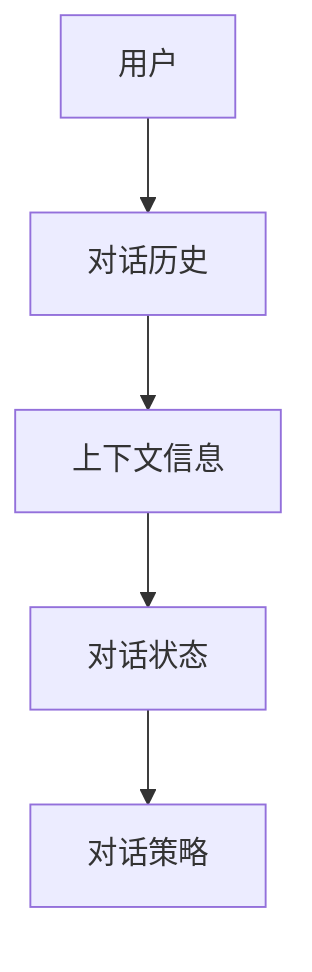
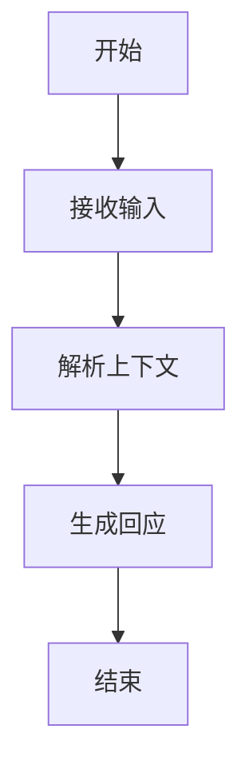
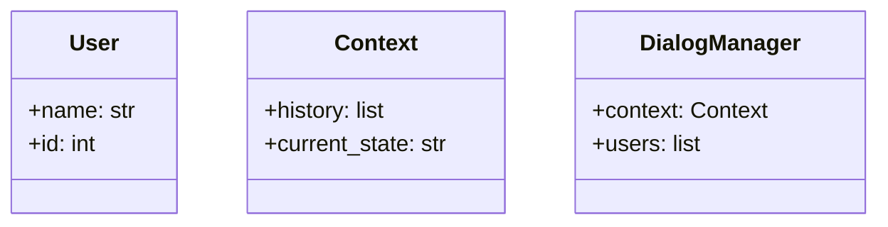
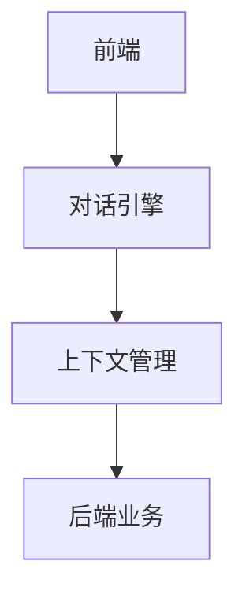
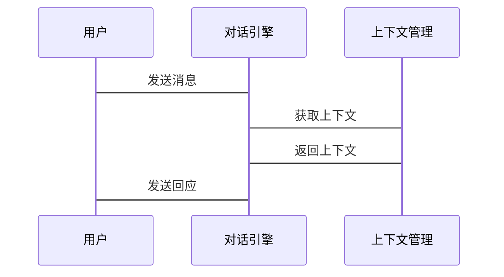

                 


# 构建企业级对话系统：上下文感知与多轮交互管理

## 关键词：企业级对话系统、上下文感知、多轮交互管理、NLP、深度学习

## 摘要：本文深入探讨了构建企业级对话系统的核心技术，重点分析了上下文感知和多轮交互管理的关键问题，从背景、概念、算法、系统架构到项目实战，详细阐述了实现方法，最后总结了最佳实践。

---

## 第一章: 背景介绍

### 1.1 问题背景

#### 1.1.1 传统对话系统的局限性
传统对话系统在处理复杂问题时表现不佳，缺乏上下文理解能力，难以应对多轮对话中的复杂情况。

#### 1.1.2 企业级对话系统的必要性
企业级对话系统需要处理复杂的业务逻辑，支持多轮交互，提供个性化的用户体验。

#### 1.1.3 上下文感知与多轮交互的重要性
上下文感知和多轮交互管理是提升对话系统智能性和用户体验的关键。

### 1.2 问题描述

#### 1.2.1 对话系统的定义与分类
对话系统是一种能够与用户进行自然语言交互的系统，分为规则驱动和数据驱动两类。

#### 1.2.2 企业级对话系统的应用场景
企业级对话系统广泛应用于客服、销售、技术支持等领域，提供高效的问题解决和用户支持。

#### 1.2.3 当前存在的主要问题
传统对话系统在处理复杂问题时表现不佳，缺乏上下文理解和多轮交互能力。

### 1.3 问题解决

#### 1.3.1 上下文感知的核心作用
上下文感知帮助系统理解对话的历史信息，提升对话的准确性和连贯性。

#### 1.3.2 多轮交互管理的关键技术
多轮交互管理通过维护对话状态和历史信息，确保对话的连贯性和逻辑性。

#### 1.3.3 企业级对话系统的整体解决方案
结合上下文感知和多轮交互管理，构建高效的对话系统，满足企业的复杂需求。

### 1.4 边界与外延

#### 1.4.1 企业级对话系统的边界
企业级对话系统的边界包括与前端界面、后端业务逻辑和外部API的接口。

#### 1.4.2 相关概念的外延
上下文感知和多轮交互管理涉及自然语言处理、机器学习等领域。

#### 1.4.3 系统与其他模块的接口关系
系统需要与前端、后端和外部API进行交互，确保数据的流通和处理。

### 1.5 核心要素组成

#### 1.5.1 对话引擎
对话引擎负责处理用户的输入，生成系统的回应。

#### 1.5.2 上下文管理模块
上下文管理模块维护对话的历史信息，提供上下文感知能力。

#### 1.5.3 交互逻辑引擎
交互逻辑引擎制定和执行对话策略，确保多轮交互的连贯性。

---

## 第二章: 核心概念与联系

### 2.1 上下文感知的原理

#### 2.1.1 上下文的定义与特征
上下文是对话中相关的历史信息，特征包括实时性、连续性和相关性。

#### 2.1.2 上下文的表示方法
上下文可以通过文本、向量或图结构进行表示，便于系统理解和处理。

#### 2.1.3 上下文的更新机制
上下文的更新机制包括增量更新和周期更新，确保信息的准确性和及时性。

### 2.2 多轮交互管理的原理

#### 2.2.1 对话状态的表示
对话状态可以通过状态机或向量表示，反映对话的当前情况。

#### 2.2.2 对话历史的存储与应用
对话历史存储在数据库中，用于后续对话的上下文理解。

#### 2.2.3 对话策略的制定与执行
对话策略基于对话状态和历史信息，制定下一步的对话策略。

### 2.3 核心概念对比表

| 概念       | 特性       | 描述                                   |
|------------|------------|----------------------------------------|
| 上下文感知 | 实时性      | 系统能够实时理解当前对话的上下文信息 |
| 多轮交互管理 | 连续性      | 系统能够管理连续多轮的对话流程       |

### 2.4 ER实体关系图



---

## 第三章: 算法原理讲解

### 3.1 上下文理解算法

#### 3.1.1 基于序列的上下文理解
基于序列的上下文理解利用序列模型，如LSTM，捕捉对话的序列信息。

#### 3.1.2 基于树状结构的上下文理解
基于树状结构的上下文理解利用树结构表示对话的层次关系。

### 3.2 算法流程图



### 3.3 Python代码实现

```python
def context_understanding(input_text, context_history):
    # 处理输入文本和上下文历史
    pass

def dialog_management(response, context):
    # 管理对话，生成回应
    pass
```

### 3.4 数学模型和公式

上下文表示的向量空间模型：
$$
\text{context vector} = \sum_{i=1}^{n} \alpha_i \cdot \text{word vector}_i
$$

对话策略的制定：
$$
\text{action} = \argmax_{a \in A} Q(s, a)
$$

---

## 第四章: 系统分析与架构设计

### 4.1 项目背景

企业级对话系统用于处理复杂的业务需求，提升用户体验。

### 4.2 系统功能设计

#### 4.2.1 领域模型类图



### 4.3 系统架构设计

#### 4.3.1 系统架构图



### 4.4 接口设计

#### 4.4.1 系统接口



---

## 第五章: 项目实战

### 5.1 环境安装

安装必要的Python库，如TensorFlow和Keras。

### 5.2 核心代码实现

```python
class ContextManager:
    def __init__(self):
        self.history = []
        self.current_state = None

    def update_context(self, input_text):
        self.history.append(input_text)
        # 更新当前状态
        pass
```

### 5.3 代码解读与分析

解释代码的功能和实现细节，分析其优缺点。

### 5.4 案例分析

通过实际案例分析，展示系统在实际中的应用。

### 5.5 项目小结

总结项目实现的关键点和经验教训。

---

## 第六章: 最佳实践

### 6.1 小结

总结全文的核心内容，强调上下文感知和多轮交互管理的重要性。

### 6.2 注意事项

在实际应用中，需要注意数据隐私、系统性能和用户体验等问题。

### 6.3 拓展阅读

推荐相关领域的书籍和论文，供读者进一步学习。

---

## 作者：AI天才研究院 & 禅与计算机程序设计艺术

---

通过本文的详细讲解，读者可以全面理解构建企业级对话系统的复杂性和关键点，掌握上下文感知和多轮交互管理的核心技术，并能够实际应用于项目中。

