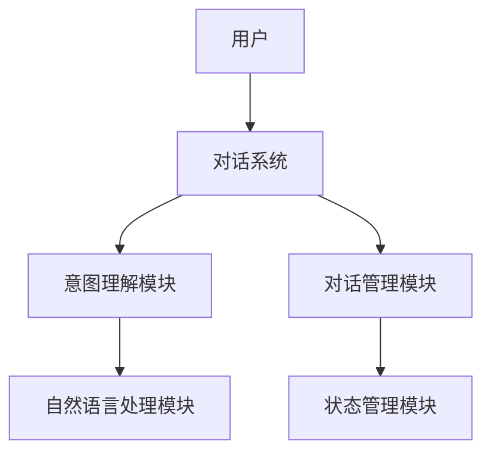
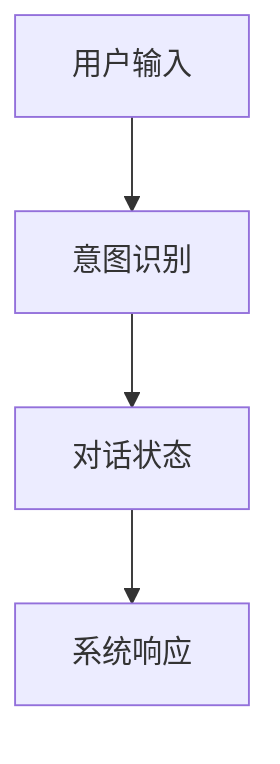
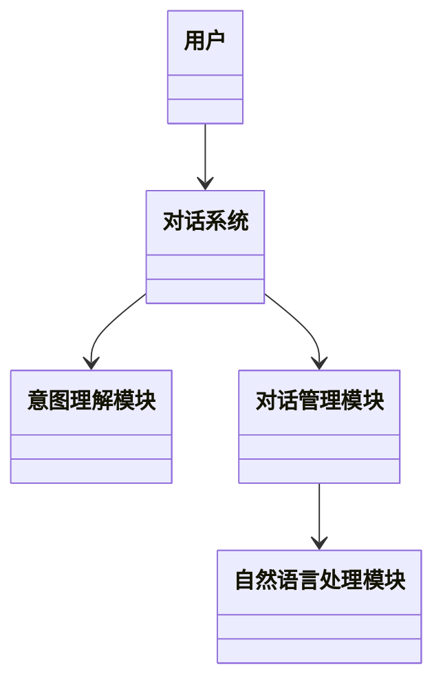
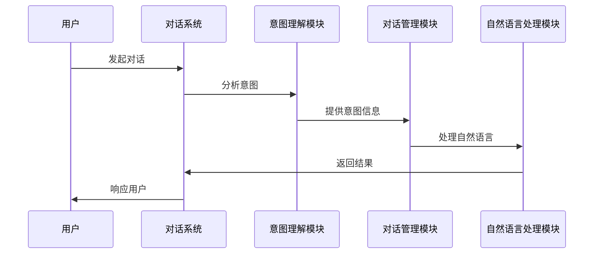

                 


# 《构建企业级对话系统：多轮对话管理与意图理解的深度整合》

## 关键词：企业级对话系统，多轮对话管理，意图理解，深度整合，自然语言处理，对话系统设计，人工智能

## 摘要：本文探讨了构建企业级对话系统的多轮对话管理和意图理解的深度整合，分析了其对企业级对话系统的影响。文章涵盖对话系统的发展背景、核心概念、算法原理、系统架构设计、项目实战以及最佳实践，为构建高效、智能的企业级对话系统提供了全面的指导。

---

# 第一部分: 企业级对话系统概述

## 第1章: 对话系统的发展与挑战

### 1.1 对话系统的发展历程

#### 1.1.1 从单轮对话到多轮对话的演进
- 单轮对话：简单的输入输出，无法处理复杂场景。
- 多轮对话：支持连续对话，理解上下文，提供更智能的服务。

#### 1.1.2 企业级对话系统的定义与特点
- **定义**：为企业提供高效、智能的对话服务，支持复杂的业务流程。
- **特点**：多轮交互、上下文理解、意图识别精准、可扩展性高。

#### 1.1.3 当前对话系统的主要应用场景
- 客户服务：解决用户问题，提供个性化服务。
- 电子商务：推荐产品，处理订单。
- 企业协作：内部沟通，任务分配。

### 1.2 多轮对话管理的重要性

#### 1.2.1 多轮对话的核心挑战
- 上下文理解：对话历史信息的有效利用。
- 状态管理：对话过程中的状态跟踪。
- 用户意图的动态变化：准确捕捉用户需求。

#### 1.2.2 对话历史的管理和上下文理解
- 对话历史记录：存储用户输入和系统响应。
- 上下文分析：基于历史信息推断当前意图。

#### 1.2.3 企业级对话系统的复杂性
- 多个模块协同工作：意图理解、对话管理、自然语言处理。
- 高可用性和稳定性：确保系统在高并发情况下的稳定运行。

### 1.3 意图理解的深度整合

#### 1.3.1 意图理解的基本概念
- 意图识别：通过自然语言处理技术，识别用户的意图。
- 意图分类：将用户输入分为不同的意图类别。

#### 1.3.2 深度整合意图理解的意义
- 提高对话系统的准确性：精准识别用户需求。
- 支持复杂场景：处理多意图混合的情况。

#### 1.3.3 意图理解与对话管理的协同关系
- 对话管理依赖意图理解的结果。
- 意图理解依赖对话管理的状态信息。

### 1.4 本章小结
本章介绍了对话系统的发展历程，分析了多轮对话管理的重要性，强调了意图理解的深度整合对构建企业级对话系统的关键作用。

---

## 第2章: 对话系统的核心概念

### 2.1 对话流程的结构化分析

#### 2.1.1 对话的生命周期
- 初始化：用户发起对话。
- 执行：系统处理用户请求。
- 结束：对话完成或用户退出。

#### 2.1.2 对话的上下文管理
- 上下文存储：记录对话历史、用户信息。
- 上下文分析：基于上下文信息理解当前意图。

#### 2.1.3 对话的多轮性与状态转移
- 状态定义：对话中的各个阶段。
- 状态转移：根据用户输入和系统响应，状态之间转移。

### 2.2 对话系统的实体关系分析

#### 2.2.1 实体关系图（ER图）


### 2.3 意图理解的特征分析

#### 2.3.1 意图的分类与特征
- 意图分类：用户请求的类型，如查询、预订、咨询。
- 意图特征：关键词、句式、语境。

#### 2.3.2 意图理解的准确性评估
- 准确率：识别正确的意图比例。
- 召回率：识别出所有相关意图的比例。

#### 2.3.3 意图与对话上下文的关系
- 上下文依赖：意图识别需要结合对话历史。
- 上下文独立：部分意图可以独立识别。

### 2.4 本章小结
本章详细讲解了对话流程的结构化分析，绘制了实体关系图，分析了意图理解的特征和与上下文的关系。

---

## 第3章: 多轮对话管理算法

### 3.1 对话管理的算法框架

#### 3.1.1 基于规则的对话管理
- 规则定义：根据预设规则处理用户输入。
- 优点：简单易懂，适用于简单场景。
- 缺点：难以处理复杂场景。

#### 3.1.2 基于统计的对话管理
- 统计模型：基于历史数据进行概率预测。
- 优点：适应性强。
- 缺点：需要大量数据支持。

#### 3.1.3 基于深度学习的对话管理
- 神经网络模型：如Transformer、LSTM。
- 优点：处理复杂场景能力强。
- 缺点：训练成本高。

### 3.2 对话状态转移的数学模型

#### 3.2.1 马尔可夫链模型
$$P(s_{t+1}|s_t) = \text{转移概率矩阵}$$

### 3.3 对话树的构建与优化

#### 3.3.1 对话树的构建过程
- 根据意图和对话历史构建对话树。
- 示例：用户询问天气，系统根据地点和时间构建对话树。

#### 3.3.2 对话树的优化策略
- 前置条件检查：确保对话的合法性。
- 意图优先级：处理高优先级意图优先。

#### 3.3.3 对话树的可视化表示


### 3.4 本章小结
本章介绍了多轮对话管理的算法框架，讲解了马尔可夫链模型，并通过对话树的构建与优化策略，展示了对话管理的具体实现。

---

## 第4章: 意图理解的算法原理

### 4.1 意图理解的算法框架

#### 4.1.1 基于关键词匹配的意图理解
- 关键词提取：通过关键词匹配意图。
- 优点：简单高效。
- 缺点：无法处理复杂语义。

#### 4.1.2 基于模式匹配的意图理解
- 正则表达式匹配：根据预设模式识别意图。
- 优点：准确率高。
- 缺点：难以应对多变的用户表达。

#### 4.1.3 基于深度学习的意图理解
- 神经网络模型：如BERT、GPT。
- 优点：语义理解能力强。
- 缺点：训练成本高。

### 4.2 意图分类的数学模型

#### 4.2.1 朴素贝叶斯分类器
$$P(y|x) = P(x|y)P(y)$$

### 4.3 意图理解的优化策略

#### 4.3.1 数据增强技术
- 同义词替换：扩展训练数据。
- 数据清洗：去除噪声数据。

#### 4.3.2 模型调优方法
- 参数调整：优化模型参数。
- 模型集成：结合多种模型结果。

#### 4.3.3 预训练模型的应用
- 使用预训练模型：如BERT、GPT。
- 微调模型：针对特定任务优化。

### 4.4 本章小结
本章详细讲解了意图理解的算法框架，介绍了朴素贝叶斯分类器的数学模型，并提出了优化策略，包括数据增强和模型调优。

---

## 第5章: 对话系统的架构设计

### 5.1 项目背景介绍
- 企业级对话系统的需求：高效、智能、稳定。
- 项目目标：构建支持多轮对话和意图理解的对话系统。

### 5.2 系统功能设计

#### 5.2.1 领域模型类图


### 5.3 系统架构设计

#### 5.3.1 系统架构图


#### 5.3.2 系统接口设计
- 用户接口：API接口，接收用户输入。
- 模块接口：模块之间交互的接口，如意图理解模块和对话管理模块。

#### 5.3.3 系统交互流程图


### 5.4 本章小结
本章分析了项目背景，设计了系统的功能模块和架构，展示了系统交互的流程图。

---

## 第6章: 项目实战

### 6.1 环境安装

#### 6.1.1 开发环境
- 操作系统：Linux/Windows/MacOS
- 开发工具：Python、Jupyter Notebook
- 依赖库：TensorFlow、Keras、NLTK

#### 6.1.2 安装步骤
```bash
pip install tensorflow nltk
```

### 6.2 系统核心实现源代码

#### 6.2.1 对话管理模块
```python
class DialogManager:
    def __init__(self):
        self.states = {}

    def process_input(self, user_input, state):
        # 处理用户输入，更新状态
        new_state = self.update_state(state, user_input)
        return new_state
```

#### 6.2.2 意图理解模块
```python
class IntentUnderstanding:
    def __init__(self):
        self.classifier = load_model('intent_model.h5')

    def predict_intent(self, text):
        # 预测意图
        intent = self.classifier.predict(text)
        return intent
```

### 6.3 代码解读与分析

#### 6.3.1 对话管理模块的代码解读
- 类`DialogManager`：管理对话状态。
- 方法`process_input`：根据用户输入和当前状态，更新对话状态。

#### 6.3.2 意图理解模块的代码解读
- 类`IntentUnderstanding`：负责意图识别。
- 方法`predict_intent`：使用训练好的模型预测意图。

### 6.4 实际案例分析

#### 6.4.1 案例一：天气查询
- 用户输入：“北京明天天气怎么样？”
- 系统响应：“北京明天天气晴朗，25℃至30℃。”

#### 6.4.2 案例二：酒店预订
- 用户输入：“预订北京酒店，价格在300-500元。”
- 系统响应：“为您推荐附近的经济型酒店。”

### 6.5 项目小结
本章通过实际案例，展示了对话系统的实现过程，包括环境安装、核心代码编写和案例分析。

---

## 第7章: 对话系统的最佳实践

### 7.1 性能优化

#### 7.1.1 算法优化
- 参数调整：优化模型参数，提高准确率。
- 模型压缩：减少模型体积，提高运行效率。

#### 7.1.2 并行计算
- 使用多线程或分布式计算，提高处理速度。

### 7.2 安全性

#### 7.2.1 用户数据保护
- 数据加密：保护用户隐私。
- 访问控制：限制数据访问权限。

#### 7.2.2 模型安全
- 防御攻击：防止模型被恶意攻击。

### 7.3 可扩展性

#### 7.3.1 模块化设计
- 模块独立：便于扩展和维护。
- 接口标准化：确保模块之间的兼容性。

#### 7.3.2 高可用性
- 负载均衡：分担请求压力。
- 容错设计：处理节点故障。

### 7.4 维护与监控

#### 7.4.1 日志记录
- 记录对话日志，便于问题排查。

#### 7.4.2 性能监控
- 监控系统运行状态，及时发现异常。

### 7.5 本章小结
本章提出了对话系统的最佳实践，包括性能优化、安全性、可扩展性和维护与监控方面的建议。

---

## 作者：AI天才研究院/AI Genius Institute & 禅与计算机程序设计艺术 /Zen And The Art of Computer Programming

---

以上是《构建企业级对话系统：多轮对话管理与意图理解的深度整合》的完整目录和部分正文内容。如果需要进一步扩展或调整，请随时告知！

