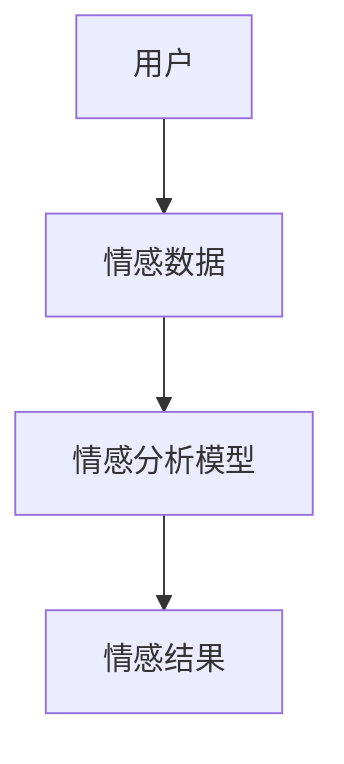
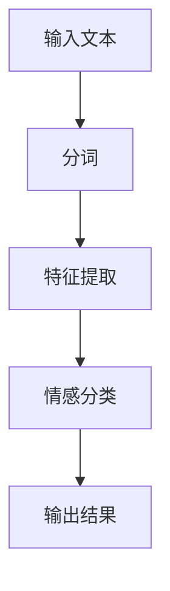
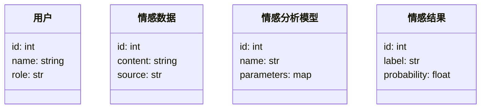
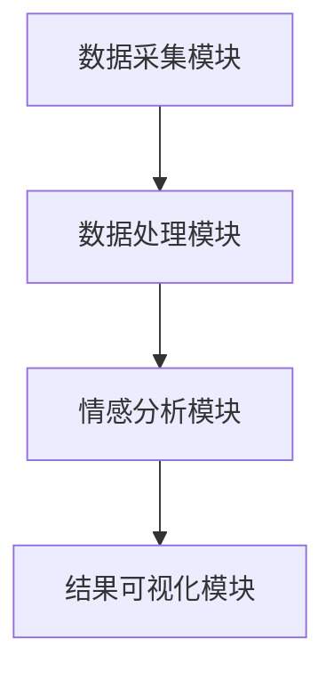
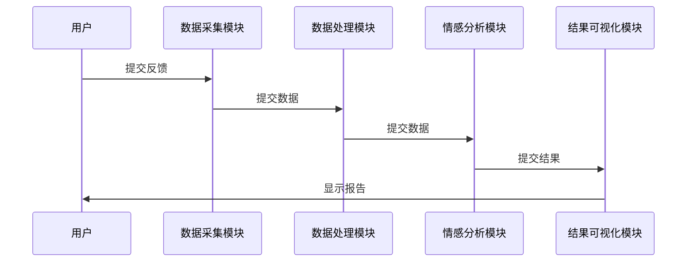

                 


# 构建企业级情感计算平台：员工幸福感与客户满意度分析

> 关键词：情感计算，员工幸福感，客户满意度，自然语言处理，机器学习，深度学习

> 摘要：本文详细探讨了如何通过情感计算技术来分析和提升企业员工幸福感与客户满意度。文章首先介绍了情感计算的核心概念与背景，接着深入分析了情感计算的算法原理，包括文本分析、特征提取、情感分类等关键步骤。随后，从系统架构设计的角度，详细阐述了如何构建一个企业级情感计算平台，包括数据采集、系统功能设计、架构实现等部分。最后，通过实际案例展示了情感计算在员工幸福感与客户满意度分析中的应用，并总结了最佳实践与未来发展方向。

---

# 第一部分: 企业级情感计算平台概述

## 第1章: 情感计算与企业应用背景

### 1.1 问题背景与描述

#### 1.1.1 企业中员工幸福感与客户满意度的重要性
员工幸福感和客户满意度是企业成功的关键因素。员工幸福感高的团队更有可能保持高效率和创造力，而客户满意度高的企业更容易获得长期客户和市场份额。然而，如何系统性地测量和提升这两者一直是企业管理中的难题。

#### 1.1.2 当前企业面临的痛点与挑战
- 数据分散：员工反馈和客户评价可能分布在不同的系统中，难以整合和分析。
- 数据量大：员工和客户的海量反馈需要高效处理。
- 分析复杂：情感分析需要结合自然语言处理和机器学习技术，对非结构化数据进行分析。

#### 1.1.3 情感计算技术的应用价值
情感计算通过分析文本、语音和图像中的情感信息，帮助企业量化员工幸福感和客户满意度，提供数据支持的决策依据。

### 1.2 问题解决与边界

#### 1.2.1 情感计算如何解决员工幸福感与客户满意度分析
- 数据采集：通过问卷、邮件、聊天记录等方式收集员工和客户的情感数据。
- 数据处理：对数据进行清洗、分词和特征提取。
- 情感分析：通过机器学习和深度学习模型对情感数据进行分类和预测。
- 可视化与反馈：生成可视化报告，提供改进建议。

#### 1.2.2 情感计算的边界与外延
- 边界：专注于情感信息的分析，不涉及其他类型的数据（如结构化数据）。
- 外延：情感计算可以应用于招聘、培训、客户服务等多个领域。

#### 1.2.3 核心概念与关键要素的结构化分析
- 核心概念：情感计算、自然语言处理、机器学习。
- 关键要素：数据源、分析模型、可视化工具。

### 1.3 本章小结
本章介绍了情感计算的核心概念、应用背景以及在员工幸福感和客户满意度分析中的作用。下一章将详细探讨情感计算的核心概念与原理。

---

## 第2章: 情感计算的核心概念与联系

### 2.1 情感计算的定义与原理

#### 2.1.1 情感计算的定义
情感计算（Affective Computing）是通过分析人类情感信息来构建系统的技术，旨在理解和模拟人类情感。

#### 2.1.2 情感计算的核心原理
- 文本分析：通过自然语言处理技术提取情感特征。
- 特征提取：将文本转化为数值特征，用于机器学习模型。
- 情感分类：基于特征的分类模型对情感进行预测。

#### 2.1.3 情感计算的关键特征对比表
| 特征 | 描述 |
|------|------|
| 数据源 | 文本、语音、图像 |
| 分析目标 | 情感类别（如正面、负面、中性） |
| 算法 | 机器学习、深度学习 |

### 2.2 情感计算的实体关系图

#### 2.2.1 ER实体关系图的 Mermaid 流程图


### 2.3 本章小结
本章详细介绍了情感计算的核心概念与原理，并通过实体关系图展示了情感计算的基本架构。下一章将探讨情感计算的算法原理。

---

## 第3章: 情感分析算法详解

### 3.1 情感分析的流程与方法

#### 3.1.1 情感分析的流程图


### 3.2 基于机器学习的情感分类算法

#### 3.2.1 朴素贝叶斯分类器
- 优点：简单高效，适合小规模数据。
- 缺点：对特征独立性假设敏感。

#### 3.2.2 支持向量机（SVM）
- 优点：适用于高维数据，分类能力强。
- 缺点：训练时间较长。

#### 3.2.3 随机森林分类器
- 优点：抗过拟合能力强，适合特征工程。
- 缺点：对特征的重要性解释性较弱。

### 3.3 深度学习模型的应用

#### 3.3.1 循环神经网络（RNN）
- 优点：适合处理序列数据。
- 缺点：长序列训练时容易梯度消失。

#### 3.3.2 Transformer 模型
- 优点：全局注意力机制，性能优越。
- 缺点：计算资源消耗较大。

#### 3.3.3 BERT 模型的微调
- 微调 BERT 模型用于情感分类，效果显著。

### 3.4 数学模型与公式

#### 3.4.1 余弦相似度公式
$$ \text{余弦相似度} = \frac{\vec{A} \cdot \vec{B}}{|\vec{A}| \cdot |\vec{B}|} $$

#### 3.4.2 情感分类的损失函数
$$ \text{损失函数} = -\sum_{i=1}^{n} y_i \log(p_i) + (1-y_i)\log(1-p_i) $$

### 3.5 本章小结
本章详细介绍了情感分析的流程与算法，包括机器学习和深度学习模型的优缺点及应用场景。下一章将从系统架构设计的角度，探讨如何构建企业级情感计算平台。

---

## 第4章: 企业级情感计算平台的系统架构

### 4.1 项目介绍与目标

#### 4.1.1 项目背景
构建一个能够分析员工幸福感和客户满意度的企业级情感计算平台。

#### 4.1.2 项目目标
- 数据采集：整合员工和客户的反馈数据。
- 数据处理：清洗、分词和特征提取。
- 情感分析：对情感数据进行分类和预测。
- 可视化：生成可视化报告，提供改进建议。

### 4.2 系统功能设计

#### 4.2.1 领域模型类图


#### 4.2.2 系统架构设计的 Mermaid 图


### 4.3 系统接口设计

#### 4.3.1 数据采集接口
- 输入：文本数据。
- 输出：清洗后的数据。

#### 4.3.2 情感分析接口
- 输入：清洗后的文本数据。
- 输出：情感标签和概率。

### 4.4 系统交互设计

#### 4.4.1 系统交互的 Mermaid 序列图


### 4.5 本章小结
本章从系统架构设计的角度，详细阐述了企业级情感计算平台的构建过程，包括功能设计、接口设计和交互设计。

---

## 第5章: 项目实战与案例分析

### 5.1 项目实战

#### 5.1.1 环境安装
- Python 3.8+
- 深度学习框架（如TensorFlow、PyTorch）
- 自然语言处理库（如spaCy、NLTK）

#### 5.1.2 系统核心实现源代码

```python
from sklearn.feature_extraction.text import TfidfVectorizer
from sklearn.naive_bayes import MultinomialNB

# 数据处理
def preprocess(text):
    return text.lower().split()

# 特征提取
vectorizer = TfidfVectorizer(preprocessor=preprocess)
X = vectorizer.fit_transform(texts)

# 情感分类
model = MultinomialNB()
model.fit(X, labels)

# 预测
test_text = ["I love this product!"]
test_X = vectorizer.transform([test_text])
print(model.predict(test_X))
```

#### 5.1.3 代码应用解读与分析
- 预处理：将文本转换为小写并分词。
- 特征提取：使用TF-IDF提取文本特征。
- 分类：使用朴素贝叶斯分类器进行情感分类。

### 5.2 案例分析

#### 5.2.1 员工幸福感分析案例
- 数据来源：员工满意度调查问卷。
- 分析结果：员工对管理层的满意度较低，建议改进沟通机制。

#### 5.2.2 客户满意度分析案例
- 数据来源：客户反馈评价。
- 分析结果：客户对产品功能的满意度较高，但对客服响应速度不满。

### 5.3 本章小结
本章通过实际案例展示了情感计算在员工幸福感和客户满意度分析中的应用，验证了平台的有效性和实用性。

---

## 第6章: 总结与展望

### 6.1 总结

#### 6.1.1 核心要点回顾
- 情感计算的核心概念与原理。
- 机器学习和深度学习在情感分类中的应用。
- 企业级情感计算平台的系统架构设计。

#### 6.1.2 最佳实践 tips
- 数据质量：确保数据的准确性和完整性。
- 模型调优：选择合适的算法并进行参数优化。
- 隐私保护：严格保护员工和客户的隐私信息。

### 6.2 未来发展方向

#### 6.2.1 情感计算的未来趋势
- 更加智能化：结合强化学习和自监督学习。
- 更加多元化：支持多语言、多模态情感分析。
- 更加场景化：针对不同行业定制化情感计算模型。

### 6.3 本章小结
本文总结了构建企业级情感计算平台的核心内容，并展望了情感计算的未来发展方向。

---

# 作者：AI天才研究院/AI Genius Institute & 禅与计算机程序设计艺术 /Zen And The Art of Computer Programming

