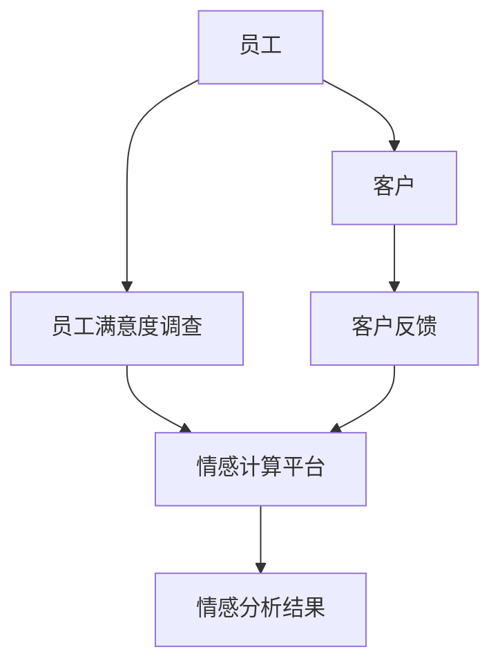
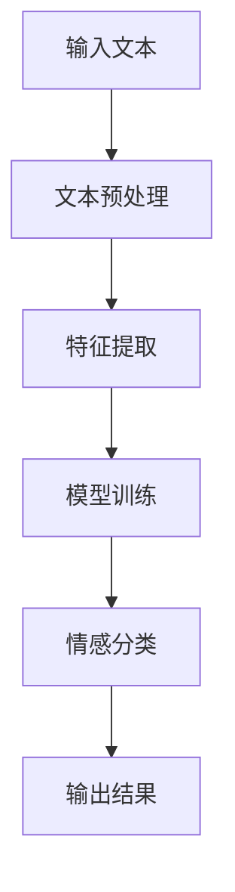
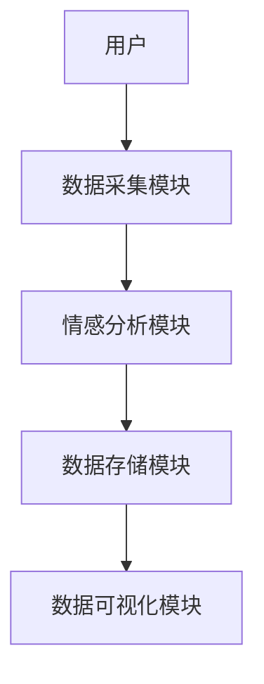
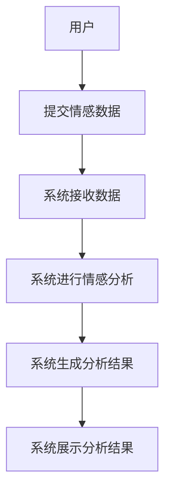

                 


# 构建企业级情感计算平台：员工满意度与客户情绪分析

> 关键词：情感计算, 员工满意度, 客户情绪分析, 自然语言处理, 深度学习, 企业绩效

> 摘要：情感计算是一种通过分析人类情感、情绪和主观体验来实现智能化决策的技术。本文将重点探讨如何构建一个企业级的情感计算平台，用于分析员工满意度和客户情绪。通过结合自然语言处理、深度学习和大数据分析等技术手段，本文详细阐述了情感计算的核心概念、算法原理、系统架构设计以及实际项目中的应用案例。文章内容涵盖从理论到实践的各个方面，旨在为企业管理者和技术开发者提供一份系统性、实用性的参考。

---

# 第1章: 情感计算平台概述

## 1.1 情感计算的背景与意义

### 1.1.1 企业级情感计算的背景
在当今快速变化的商业环境中，企业需要更加高效地管理和优化其内部资源。员工的满意度和客户的情绪状态直接影响企业的绩效和市场竞争力。传统的基于数据的分析方法难以捕捉和量化人类的情感信息，而情感计算技术可以通过分析文本、语音和面部表情等多模态数据，提取出深层次的情感信息。

### 1.1.2 情感计算在企业管理中的价值
1. 提高员工满意度：通过分析员工反馈，识别影响员工满意度的关键因素，优化企业内部管理。
2. 改善客户体验：通过实时监测客户情绪，优化客户服务流程，提升客户忠诚度。
3. 降低运营成本：通过自动化的情感分析，减少人工调查和分析的投入。

### 1.1.3 情感计算的技术发展趋势
情感计算正朝着多模态、实时化和智能化方向发展。未来，情感计算将与人工智能、大数据和物联网等技术深度融合，为企业提供更加精准和实时的情感分析能力。

### 1.1.4 情感计算的边界与外延
情感计算的边界主要集中在情感信息的采集、处理和分析，其外延则涉及自然语言处理、计算机视觉和机器学习等多个技术领域。

## 1.2 员工满意度与客户情绪分析的重要性

### 1.2.1 员工满意度对企业绩效的影响
员工满意度是企业绩效的重要指标。高满意度的员工通常具有更高的工作效率和创造力，能够为企业创造更多的价值。

### 1.2.2 客户情绪分析对业务决策的价值
客户情绪分析能够帮助企业及时发现客户 dissatisfaction，优化产品和服务，提升客户满意度和忠诚度。

### 1.2.3 情感计算在企业数字化转型中的作用
情感计算作为企业数字化转型的重要组成部分，能够帮助企业实现从数据驱动到情感驱动的转变，提升企业的智能化水平。

## 1.3 情感计算平台的核心目标与边界

### 1.3.1 核心目标
1. 提供员工满意度分析功能，帮助企业优化内部管理。
2. 提供客户情绪分析功能，帮助企业优化客户服务。
3. 提供情感数据可视化功能，便于企业进行数据驱动的决策。

### 1.3.2 边界与外延
情感计算平台的边界主要集中在情感信息的采集、处理和分析，其外延则涉及自然语言处理、计算机视觉和机器学习等多个技术领域。

## 1.4 情感计算平台的核心要素

### 1.4.1 数据来源
1. 员工反馈：包括员工满意度调查、员工离职率分析等。
2. 客户反馈：包括客户评价、客户投诉等。

### 1.4.2 情感分析模型
基于自然语言处理和深度学习的情感分析模型，能够从文本中提取出情感信息。

### 1.4.3 平台架构
情感计算平台的架构包括数据采集模块、情感分析模块、数据存储模块和数据可视化模块。

---

# 第2章: 情感计算的核心概念

## 2.1 情感计算的定义与属性

### 2.1.1 情感计算的定义
情感计算是一种通过分析人类情感、情绪和主观体验来实现智能化决策的技术。

### 2.1.2 情感计算的核心属性对比

| 属性 | 情感计算 | 传统数据分析 |
|------|----------|---------------|
| 数据来源 | 文本、语音、图像 | 结构化数据 |
| 分析目标 | 情感、情绪 | 数据统计 |
| 分析方法 | 深度学习、自然语言处理 | 数据挖掘、统计分析 |

### 2.1.3 情感计算的特征分析
1. 多模态：情感计算可以同时分析文本、语音和图像等多种模态数据。
2. 实时性：情感计算需要对实时数据进行分析和反馈。
3. 精准性：情感计算需要对情感信息进行高精度的识别和分类。

## 2.2 情感计算的实体关系图



## 2.3 情感计算的核心算法原理

### 2.3.1 情感分析算法概述
情感分析算法主要包括文本预处理、特征提取、模型训练和结果预测四个步骤。

### 2.3.2 基于深度学习的情感分析模型



### 2.3.3 情感计算的数学模型

#### 情感得分计算公式
$$ \text{情感得分} = \sum_{i=1}^{n} w_i \cdot f_i $$
其中，\( w_i \) 是第 \( i \) 个特征的权重，\( f_i \) 是第 \( i \) 个特征的值。

#### 情感分类的损失函数
$$ \text{损失函数} = \sum_{i=1}^{m} \text{标签预测误差} $$

---

# 第3章: 情感计算平台的系统分析与架构设计

## 3.1 系统功能需求分析

### 3.1.1 核心功能模块
1. 数据采集模块：负责采集员工和客户的情感数据。
2. 情感分析模块：负责对情感数据进行分析和分类。
3. 数据存储模块：负责存储情感分析结果。
4. 数据可视化模块：负责将情感分析结果以可视化的方式展示给用户。

### 3.1.2 功能模块的业务流程
1. 数据采集模块：通过问卷调查、客服聊天记录等方式采集情感数据。
2. 情感分析模块：使用自然语言处理和深度学习技术对情感数据进行分析和分类。
3. 数据存储模块：将情感分析结果存储到数据库中。
4. 数据可视化模块：将情感分析结果以图表的形式展示给用户。

## 3.2 系统架构设计

### 3.2.1 系统架构图



### 3.2.2 模块间的交互关系
1. 用户通过数据采集模块提交情感数据。
2. 数据采集模块将情感数据传递给情感分析模块。
3. 情感分析模块对情感数据进行分析和分类，生成情感分析结果。
4. 情感分析模块将情感分析结果传递给数据存储模块。
5. 数据存储模块将情感分析结果存储到数据库中。
6. 数据可视化模块从数据库中获取情感分析结果，并以图表的形式展示给用户。

## 3.3 系统接口设计

### 3.3.1 API接口定义
1. 提交情感数据的接口：`POST /submit_feedback`
2. 获取情感分析结果的接口：`GET /get_analysis_results`

### 3.3.2 接口调用流程
1. 用户通过调用 `POST /submit_feedback` 接口提交情感数据。
2. 系统调用 `GET /get_analysis_results` 接口获取情感分析结果。
3. 系统将情感分析结果以可视化的方式展示给用户。

## 3.4 系统交互流程设计

### 3.4.1 用户与系统交互流程



---

# 第4章: 情感计算平台的项目实战

## 4.1 环境安装与配置

### 4.1.1 Python环境的安装
安装 Python 3.8 或更高版本。

### 4.1.2 依赖库的安装
安装以下依赖库：
```bash
pip install numpy pandas scikit-learn tensorflow transformers
```

### 4.1.3 开发工具的配置
配置 Jupyter Notebook 或 PyCharm 等开发工具。

## 4.2 核心算法的实现

### 4.2.1 情感分析模型的训练
使用自然语言处理库 `transformers` 训练情感分析模型。

```python
from transformers import AutoTokenizer, AutoModelForSequenceClassification
import torch

tokenizer = AutoTokenizer.from_pretrained('bert-base-uncased')
model = AutoModelForSequenceClassification.from_pretrained('bert-base-uncased')
```

### 4.2.2 情感分类器的实现
定义情感分类器的模型结构。

```python
class SentimentClassifier(torch.nn.Module):
    def __init__(self, bert_model, num_classes):
        super().__init__()
        self.bert = bert_model
        self.dropout = torch.nn.Dropout(0.1)
        self.classifier = torch.nn.Linear(bert_model.config.hidden_size, num_classes)
    
    def forward(self, input_ids, attention_mask):
        outputs = self.bert(input_ids=input_ids, attention_mask=attention_mask)
        pooled_output = outputs.last_hidden_state[:, 0, :]
        pooled_output = self.dropout(pooled_output)
        logits = self.classifier(pooled_output)
        return logits
```

### 4.2.3 情感计算的实现
使用预训练的情感分析模型进行情感计算。

```python
from transformers import pipeline

sentiment_analyzer = pipeline("sentiment-analysis")
result = sentiment_analyzer("客户反馈：服务态度较差")
print(result)
```

## 4.3 案例分析

### 4.3.1 员工满意度分析案例
分析员工反馈，识别影响员工满意度的关键因素。

### 4.3.2 客户情绪分析案例
分析客户反馈，优化客户服务流程。

---

# 作者：AI天才研究院/AI Genius Institute & 禅与计算机程序设计艺术 /Zen And The Art of Computer Programming

