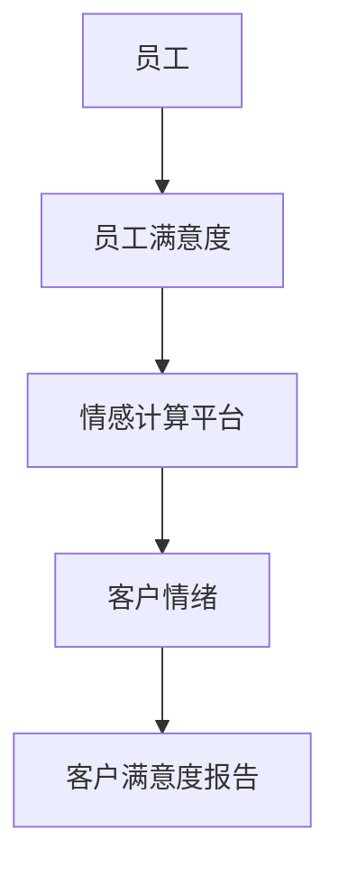
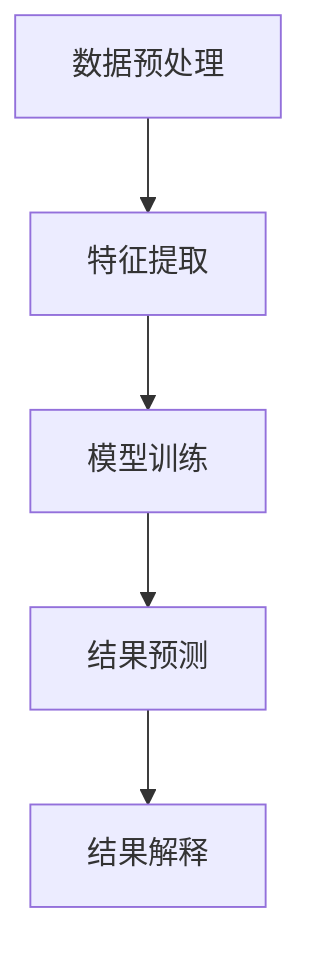
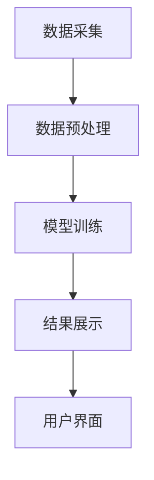

                 


# 构建企业级情感计算平台：员工满意度与客户情绪的综合分析

> **关键词**：情感计算、员工满意度、客户情绪分析、自然语言处理、机器学习、深度学习  
>
> **摘要**：本文详细探讨了构建企业级情感计算平台的技术与方法，从员工满意度分析到客户情绪管理，结合自然语言处理和机器学习的最新技术，提出了一套完整的解决方案。文章首先介绍了情感计算的核心概念与应用场景，然后深入分析了情感计算的算法原理与数学模型，最后通过系统架构设计与项目实战，展示了如何将情感计算技术应用于实际的企业管理中。

---

# 第一部分: 情感计算与企业级应用背景

## 第1章: 情感计算平台概述

### 1.1 情感计算的定义与核心概念

#### 1.1.1 情感计算的定义
情感计算（Affective Computing）是人工智能领域的一个重要分支，旨在通过计算机技术来识别、理解和模拟人类情感。情感计算的核心目标是将情感数据转化为可计算的信号，以便更好地服务于人类决策。

#### 1.1.2 员工满意度与客户情绪分析的背景
在企业环境中，员工满意度和客户情绪是两个关键指标，它们直接影响企业的绩效和声誉。员工满意度高的员工通常具有更高的工作效率和创造力，而客户情绪稳定的企业更容易赢得客户信任和市场竞争力。

#### 1.1.3 情感计算平台的目标与价值
情感计算平台的目标是通过自动化的方式，实时分析员工和客户的语言、行为和反馈，提取其中的情感信息，并生成相应的报告和建议。其价值在于帮助企业管理者做出更加数据驱动的决策，优化企业运营效率。

### 1.2 情感计算的核心要素

#### 1.2.1 数据来源与处理
情感计算的数据来源包括文本数据（如员工反馈、客户评论）、语音数据和图像数据。文本数据是最主要的来源，通常需要进行分词、去停用词、词干提取等预处理步骤。

#### 1.2.2 情感分析模型
情感分析模型是情感计算的核心，包括传统机器学习模型（如SVM、NB）和深度学习模型（如RNN、Transformer）。这些模型能够将文本数据映射到情感类别（如正面、负面、中性）或情感强度（如情感得分）。

#### 1.2.3 结果展示与反馈机制
情感计算平台需要将分析结果以可视化的方式呈现，例如生成情感趋势图、情感分布图等。同时，平台还需要提供反馈机制，例如根据情感分析结果生成改进建议。

---

## 第2章: 企业级情感计算的背景与挑战

### 2.1 企业级应用中的情感计算

#### 2.1.1 员工满意度分析的重要性
员工满意度分析是企业人力资源管理的重要组成部分。通过分析员工反馈，企业可以识别员工的不满情绪，及时采取措施改善员工体验，降低员工流失率。

#### 2.1.2 客户情绪分析的商业价值
客户情绪分析是企业市场营销和客户关系管理的关键工具。通过分析客户评论，企业可以识别客户满意度问题，优化产品设计和服务流程。

#### 2.1.3 情感计算在企业决策中的作用
情感计算可以帮助企业管理者从海量数据中提取情感信息，为决策提供数据支持。例如，通过分析客户评论，企业可以识别市场趋势，预测产品需求。

### 2.2 当前情感计算面临的挑战

#### 2.2.1 数据多样性与复杂性
情感计算需要处理不同类型和语言的数据，数据的多样性和复杂性增加了模型训练的难度。

#### 2.2.2 模型泛化能力的局限
情感计算模型在不同场景下的表现可能差异较大，例如在处理 sarcasm（讽刺）或隐喻时，模型可能难以准确捕捉情感信息。

#### 2.2.3 伦理与隐私问题
情感计算涉及对个人数据的处理，如何在保护用户隐私的同时进行情感分析，是一个重要的伦理问题。

---

## 第3章: 情感计算的核心概念与联系

### 3.1 情感计算的核心原理

#### 3.1.1 自然语言处理（NLP）在情感计算中的应用
自然语言处理技术是情感计算的核心工具。通过分词、句法分析和语义理解，NLP能够将文本数据转化为情感计算所需的特征。

#### 3.1.2 机器学习模型的训练与优化
机器学习模型是情感计算的核心工具。通过训练数据，模型可以学习情感特征，并在测试数据上进行预测。

#### 3.1.3 情感分析的分类与回归方法
情感分析可以采用分类（如二分类、多分类）或回归（如情感得分预测）的方法。分类方法适用于明确的情感类别（如正面、负面、中性），回归方法适用于情感强度的预测。

### 3.2 情感计算的核心要素对比

#### 3.2.1 数据特征对比表
| 数据特征 | 员工满意度分析 | 客户情绪分析 |
|----------|----------------|---------------|
| 数据来源 | 员工反馈表、离职率 | 客户评论、评分 |
| 数据类型 | 文本、结构化数据 | 文本、评分数据 |
| 数据量 | 中小规模 | 大规模 |

#### 3.2.2 情感分析模型的性能对比
| 模型类型 | 员工满意度分析 | 客户情绪分析 |
|----------|----------------|---------------|
| 朴素贝叶斯 | 适合中小规模数据 | 适合大规模数据 |
| Transformer | 适合复杂场景 | 适合复杂场景 |

#### 3.2.3 不同场景下的情感计算需求对比
| 场景 | 员工满意度分析 | 客户情绪分析 |
|------|----------------|---------------|
| 数据实时性 | 实时性要求低 | 实时性要求高 |
| 情感类别 | 二分类（满意/不满意） | 多分类（正面、负面、中性） |

### 3.3 情感计算的实体关系图


---

# 第二部分: 情感计算的算法原理与数学模型

## 第4章: 情感计算的算法原理

### 4.1 情感分析的分类算法

#### 4.1.1 朴素贝叶斯分类器
朴素贝叶斯分类器是一种基于概率论的分类算法，常用于情感分类任务。其核心思想是通过计算条件概率，将文本数据映射到情感类别。

#### 4.1.2 支持向量机（SVM）
支持向量机是一种基于几何的分类算法，通过构建超平面将数据点分成不同类别。在情感分类中，SVM通常需要进行文本特征提取。

#### 4.1.3 随机森林与集成学习
随机森林是一种基于决策树的集成学习算法，通过构建多个决策树并取其平均，可以有效提高分类准确率。

### 4.2 深度学习模型在情感计算中的应用

#### 4.2.1 循环神经网络（RNN）
循环神经网络是一种适用于序列数据的深度学习模型，通过处理文本序列，可以捕捉文本的情感信息。

#### 4.2.2 Transformer模型
Transformer模型是一种基于注意力机制的深度学习模型，通过全局上下文理解，可以更准确地捕捉文本情感。

#### 4.2.3 图神经网络（GNN）
图神经网络是一种适用于图结构数据的深度学习模型，可以用于情感计算中的关系建模。

### 4.3 情感计算的算法流程


---

## 第5章: 情感计算的数学模型与公式

### 5.1 情感分析的损失函数

#### 5.1.1 交叉熵损失函数
交叉熵损失函数是情感分类任务中常用的损失函数，其公式为：
$$
\text{Loss} = -\frac{1}{N}\sum_{i=1}^{N} [y_i \log p_i + (1 - y_i) \log (1 - p_i)]
$$
其中，$y_i$ 是真实标签，$p_i$ 是模型预测的概率。

#### 5.1.2 情感得分预测的损失函数
在情感得分预测任务中，通常使用均方误差（MSE）作为损失函数：
$$
\text{Loss} = \frac{1}{N}\sum_{i=1}^{N} (y_i - p_i)^2
$$

---

## 第6章: 情感计算的系统架构设计与实现

### 6.1 系统架构设计

#### 6.1.1 数据采集模块
数据采集模块负责从企业内部系统和外部数据源获取数据，包括员工反馈、客户评论等。

#### 6.1.2 数据预处理模块
数据预处理模块对采集到的数据进行清洗、分词和特征提取。

#### 6.1.3 模型训练模块
模型训练模块负责训练情感分析模型，并保存训练好的模型。

#### 6.1.4 结果展示模块
结果展示模块将模型的输出结果以可视化的方式呈现，供企业管理者查看。

### 6.2 系统架构图


---

## 第7章: 项目实战

### 7.1 环境搭建

#### 7.1.1 安装Python环境
```bash
python --version
pip install numpy
pip install scikit-learn
pip install transformers
```

#### 7.1.2 安装NLP库
```bash
pip install jieba
pip install spacy
pip install torch
```

### 7.2 系统核心实现

#### 7.2.1 数据预处理
```python
import jieba
from sklearn.feature_extraction.text import TfidfVectorizer

def preprocess(text):
    words = jieba.lcut(text)
    return ' '.join(words)
```

#### 7.2.2 模型训练
```python
from sklearn.model_selection import train_test_split
from sklearn.naive_bayes import MultinomialNB

X_train, X_test, y_train, y_test = train_test_split(X, y, test_size=0.2)
model = MultinomialNB().fit(X_train, y_train)
```

#### 7.2.3 模型预测
```python
from sklearn.metrics import accuracy_score

y_pred = model.predict(X_test)
print(accuracy_score(y_test, y_pred))
```

---

## 第8章: 总结与展望

### 8.1 最佳实践
- 数据预处理是情感计算的关键，需要仔细清洗和特征提取。
- 模型选择需要根据具体任务和数据量进行调整。
- 结果解释和反馈机制是情感计算平台的重要组成部分。

### 8.2 小结
本文详细介绍了情感计算的核心概念、算法原理和系统架构设计，并通过项目实战展示了如何构建企业级情感计算平台。情感计算技术在企业管理中的应用前景广阔，未来需要进一步研究如何提高模型的泛化能力和保护用户隐私。

### 8.3 注意事项
- 情感计算模型的泛化能力有限，需要结合具体场景进行优化。
- 数据隐私和伦理问题需要企业在实施过程中高度重视。

### 8.4 拓展阅读
- 《Deep Learning for NLP》
- 《Affective Computing: A Computational Perpective》

---

**作者：AI天才研究院/AI Genius Institute & 禅与计算机程序设计艺术 /Zen And The Art of Computer Programming**

---

这篇文章涵盖了情感计算的理论与实践，从核心概念到系统设计，再到项目实现，为读者提供了全面的知识体系。希望对您构建企业级情感计算平台有所帮助！

