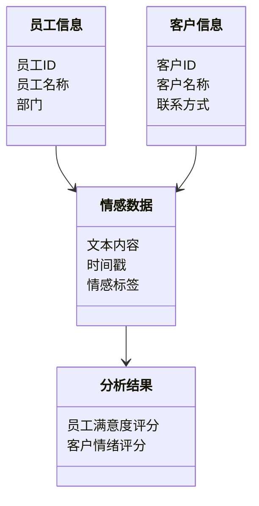
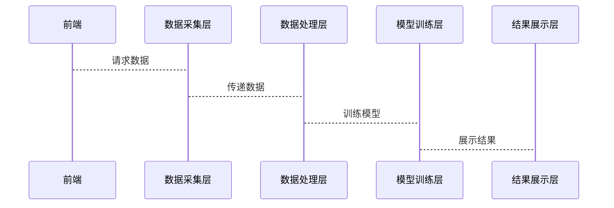

                 


# 构建企业级情感计算平台：员工满意度与客户情绪综合分析

> 关键词：情感计算，员工满意度，客户情绪分析，自然语言处理，机器学习，系统架构设计

> 摘要：本文详细探讨了构建企业级情感计算平台的背景、核心概念、算法原理、系统架构设计以及项目实战。通过分析员工满意度与客户情绪的综合数据，结合自然语言处理和机器学习技术，提出了一个高效的情感计算解决方案，为企业管理者提供数据支持。

---

## 第一部分：背景与概述

### 第1章：情感计算平台的背景与概述

#### 1.1 情感计算的背景与定义
- **1.1.1 情感计算的背景**  
  随着企业数字化转型的推进，情感计算技术逐渐成为企业管理的重要工具。通过分析员工和客户的情绪，企业可以更好地优化内部管理流程和客户体验。  
- **1.1.2 情感计算的定义与范围**  
  情感计算（Affective Computing）是通过计算机技术分析和理解人类情感的过程。其范围包括情绪识别、情感分类和情感预测等。  
- **1.1.3 情感计算在企业中的应用价值**  
  情感计算可以帮助企业提升员工满意度、优化客户体验、降低运营成本，并通过数据驱动的决策提高企业竞争力。

#### 1.2 员工满意度与客户情绪分析的重要性
- **1.2.1 员工满意度对企业的影响**  
  员工满意度高的企业通常具有更高的生产力和更低的员工流失率。  
- **1.2.2 客户情绪分析对企业的影响**  
  客户情绪分析可以帮助企业及时发现客户不满，优化产品和服务，提升客户忠诚度。  
- **1.2.3 综合分析的必要性**  
  通过综合分析员工满意度和客户情绪，企业可以实现内部管理和外部服务的协同优化。

---

## 第二部分：核心概念与联系

### 第2章：情感计算的核心技术与工具

#### 2.1 自然语言处理技术
- **2.1.1 NLP的基本概念**  
  自然语言处理（NLP）是计算机科学与语言学的交叉领域，旨在让计算机理解和生成人类语言。  
- **2.1.2 常用的NLP工具与库**  
  常用的NLP工具包括 spaCy、NLTK 和 Gensim，这些工具提供了文本分词、情感分析等功能。

#### 2.2 机器学习与深度学习
- **2.2.1 机器学习的基本概念**  
  机器学习是通过数据训练模型，使其能够从经验中学习并做出预测。  
- **2.2.2 深度学习的基本概念**  
  深度学习是机器学习的一种，通过多层神经网络模型提取数据特征。  
- **2.2.3 常用的深度学习框架**  
  常用的深度学习框架包括 TensorFlow 和 PyTorch。

#### 2.3 情感分析算法
- **2.3.1 基础的文本分类算法**  
  常见的文本分类算法包括朴素贝叶斯、支持向量机（SVM）和决策树。  
- **2.3.2 基于深度学习的情感分析算法**  
  基于深度学习的情感分析算法包括卷积神经网络（CNN）和循环神经网络（RNN）。

---

### 第3章：情感计算的核心概念与原理

#### 3.1 情感计算的核心概念
- **3.1.1 情感计算的基本原理**  
  情感计算通过分析文本中的情感倾向，将其分类为正面、负面或中性。  
- **3.1.2 情感计算的关键要素**  
  情感计算的关键要素包括文本预处理、特征提取和模型训练。

#### 3.2 情感分析的流程与步骤
- **3.2.1 数据预处理**  
  数据预处理包括文本清洗、分词和去除停用词。  
- **3.2.2 特征提取**  
  特征提取包括将文本转换为数值表示，如词袋模型和词嵌入。  
- **3.2.3 模型训练与预测**  
  模型训练包括使用训练数据训练情感分析模型，并使用测试数据进行预测。

#### 3.3 情感计算的数学模型
- **3.3.1 基础概率模型**  
  基础概率模型包括朴素贝叶斯分类器，其核心思想是计算每个类别的条件概率。  
- **3.3.2 统计学习模型**  
  统计学习模型包括支持向量机（SVM），其通过最大化类别间隔来优化模型。  
- **3.3.3 深度学习模型**  
  深度学习模型包括卷积神经网络（CNN）和循环神经网络（RNN），其能够自动提取文本特征。

---

## 第三部分：系统分析与架构设计

### 第4章：系统功能设计
- **4.1 问题场景介绍**  
  本文以员工满意度和客户情绪分析为场景，设计一个情感计算平台。  
- **4.2 领域模型设计**  
  领域模型包括员工信息、客户信息、情感数据和分析结果四个模块。  



- **4.3 系统架构设计**  
  系统架构包括数据采集层、数据处理层、模型训练层和结果展示层。  


- **4.4 系统接口设计**  
  系统接口包括数据接口、模型接口和结果接口。  



---

## 第四部分：项目实战

### 第5章：项目实战

#### 5.1 环境安装
- **Python版本**：3.8以上  
- **依赖库安装**：`pip install numpy, pandas, scikit-learn, transformers`

#### 5.2 核心实现源代码
```python
from sklearn.feature_extraction.text import TfidfVectorizer
from sklearn.naive_bayes import MultinomialNB
from sklearn.metrics import accuracy_score
import pandas as pd

# 数据加载
data = pd.read_csv('sentiment_data.csv')
X = data['text']
y = data['label']

# 特征提取
vectorizer = TfidfVectorizer()
X_features = vectorizer.fit_transform(X)

# 模型训练
model = MultinomialNB()
model.fit(X_features, y)

# 模型预测
test_data = ["I love this product!", "This service is terrible."]
test_features = vectorizer.transform(test_data)
predictions = model.predict(test_features)

# 结果输出
print("Predictions:", predictions)
print("Accuracy:", accuracy_score(y_test, predictions))
```

#### 5.3 代码应用解读与分析
- **代码功能**：上述代码实现了基于TF-IDF特征提取和朴素贝叶斯分类的情感分析模型。  
- **结果解读**：模型预测了测试数据的情感标签，并计算了准确率。

#### 5.4 实际案例分析
- **案例背景**：某公司希望通过分析员工反馈和客户评论，优化内部管理和客户服务。  
- **案例实现**：使用上述代码对员工满意度和客户情绪数据进行分析，生成可视化报告。

---

## 第五部分：最佳实践与小结

### 第6章：最佳实践与小结

#### 6.1 最佳实践
- **数据质量**：确保数据的多样性和代表性，避免数据偏差。  
- **模型优化**：通过交叉验证和超参数调优提升模型性能。  
- **结果可视化**：使用图表和报告展示分析结果，方便企业理解和应用。

#### 6.2 小结
本文详细探讨了构建企业级情感计算平台的背景、核心概念、算法原理、系统架构设计以及项目实战。通过结合自然语言处理和机器学习技术，提出了一种高效的情感计算解决方案，为企业管理者提供了数据支持。

---

## 作者：AI天才研究院 & 禅与计算机程序设计艺术

---

感谢您的阅读！希望本文能为您提供有价值的技术见解和实践指导。

