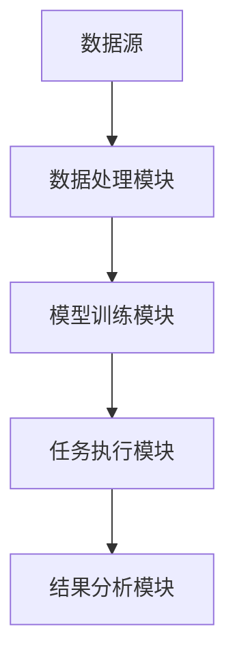

                 


# 构建企业级自然语言处理平台：多语言、多领域、多任务集成

## 关键词：企业级NLP，多语言，多领域，多任务，深度学习，自然语言处理，系统架构

## 摘要：  
本文将详细介绍如何构建一个企业级的自然语言处理平台，涵盖多语言、多领域和多任务的集成。文章从背景、核心概念、算法原理到系统架构和项目实战，全面解析企业级NLP的构建过程。通过具体案例分析和系统设计，探讨如何在企业环境中高效利用NLP技术解决实际问题。

---

# 第一部分: 企业级自然语言处理平台概述

## 第1章: 企业级自然语言处理的背景与挑战

### 1.1 问题背景
#### 1.1.1 自然语言处理的定义与目标
自然语言处理（NLP）是计算机科学领域中的一个重要分支，旨在让计算机能够理解和生成人类语言。NLP的目标包括文本理解、信息提取、机器翻译、文本生成等任务。

#### 1.1.2 企业级NLP的核心需求
企业级NLP需要满足以下核心需求：
- **多语言支持**：支持多种语言的文本处理。
- **多领域适应**：适用于不同业务领域的NLP任务。
- **多任务集成**：能够同时处理多种NLP任务（如文本分类、命名实体识别、机器翻译等）。

#### 1.1.3 多语言、多领域、多任务的复杂性
- **多语言**：不同语言的语法、词汇差异大，模型需要具备跨语言的泛化能力。
- **多领域**：不同领域（如医疗、金融、法律）的文本特征和语义差异显著。
- **多任务**：多个NLP任务之间需要协同优化，避免资源浪费和性能瓶颈。

### 1.2 技术发展趋势
#### 1.2.1 预训练模型的崛起
预训练模型（如BERT、GPT）通过大规模无监督学习，显著提升了NLP任务的性能。

#### 1.2.2 多模态NLP的发展
多模态NLP结合文本、图像、语音等多种数据源，提升了模型的表达能力。

#### 1.2.3 企业级应用的特殊要求
企业级NLP需要高可用性、可扩展性和安全性，以满足复杂业务场景的需求。

### 1.3 当前挑战与解决方案
#### 1.3.1 数据多样性与模型泛化能力
- 数据多样性：不同语言、领域的数据分布差异大，模型需要具备良好的泛化能力。
- 解决方案：通过数据增强、跨语言预训练等方法提升模型的泛化能力。

#### 1.3.2 跨语言处理的难点
- 语法差异：不同语言的语法结构差异大，影响模型的跨语言迁移能力。
- 解决方案：采用跨语言预训练模型（如Marian、XLM）进行模型初始化。

#### 1.3.3 多任务协同的优化策略
- 任务间依赖：不同任务之间可能存在相互影响，需要协同优化。
- 解决方案：使用多任务学习框架，通过共享底层表示来提升多任务性能。

---

## 第2章: 多语言、多领域、多任务NLP的核心概念

### 2.1 多语言NLP的原理
#### 2.1.1 跨语言处理的基本概念
- 跨语言处理：在不同语言之间进行文本处理，如机器翻译、跨语言信息检索。
- 跨语言模型：通过共享参数或跨语言预训练，构建能够处理多种语言的模型。

#### 2.1.2 跨语言模型的构建方法
- 跨语言预训练：在多种语言数据上进行预训练，构建跨语言表示。
- 跨语言迁移：将一种语言的模型迁移到另一种语言，通过微调提升性能。

#### 2.1.3 跨语言任务的挑战与解决方案
- 数据稀缺性：小语种数据不足，影响模型性能。
- 解决方案：采用数据增强、小样本学习等技术。

### 2.2 多领域NLP的实现
#### 2.2.1 领域适应的基本原理
- 领域适应：将模型从一个领域迁移到另一个领域，通过调整模型参数或特征来适应新领域。

#### 2.2.2 领域迁移的策略
- 域内数据增强：通过生成新数据提升领域模型的泛化能力。
- 跨领域预训练：在多个领域数据上进行预训练，构建领域通用模型。

#### 2.2.3 领域模型的构建与优化
- 领域模型构建：基于特定领域数据进行微调，提升任务性能。
- 领域优化：通过领域特征提取、领域对抗训练等方法优化模型。

### 2.3 多任务NLP的机制
#### 2.3.1 多任务学习的基本概念
- 多任务学习：同时训练多个任务，共享模型参数，提升任务间的协同性能。

#### 2.3.2 多任务模型的设计原则
- 任务相关性：任务之间应具有一定的相关性，避免资源浪费。
- 参数共享：通过共享参数实现任务间的协同优化。

#### 2.3.3 多任务协同优化的算法选择
- 基于梯度的多任务优化：通过调整任务权重，实现多任务协同。
- 参数分离与共享：部分参数共享，部分参数独立，灵活控制任务间的协同。

---

## 第3章: 企业级NLP平台的系统架构

### 3.1 系统设计原则
#### 3.1.1 模块化设计
- 模块化设计：将系统划分为多个功能模块，每个模块独立开发和维护。
- 模块间解耦：通过接口定义模块之间的交互，提升系统的可扩展性和可维护性。

#### 3.1.2 高可用性与可扩展性
- 高可用性：通过冗余设计、负载均衡等技术保证系统的稳定运行。
- 可扩展性：通过模块化设计和分布式架构，支持系统的横向扩展。

#### 3.1.3 安全性与隐私保护
- 数据安全：通过加密、访问控制等技术保护数据安全。
- 隐私保护：遵循数据隐私法规，确保用户数据不被滥用。

### 3.2 系统模块设计
#### 3.2.1 数据处理模块
- 数据预处理：清洗、归一化、分词等预处理步骤。
- 数据增强：通过数据增强技术提升模型的泛化能力。

#### 3.2.2 模型训练模块
- 模型选择：选择适合任务的NLP模型（如BERT、GPT）。
- 模型训练：通过分布式训练、混合精度训练等技术提升训练效率。

#### 3.2.3 任务执行模块
- 任务调度：通过任务队列和调度算法优化任务执行效率。
- 任务执行：根据任务类型选择合适的推理引擎。

#### 3.2.4 结果分析模块
- 结果解析：将模型输出的结果解析为人类可读的形式。
- 性能分析：通过性能指标（如准确率、召回率）评估模型性能。

### 3.3 系统架构图


### 3.4 系统接口设计
#### 3.4.1 数据接口
- 数据输入接口：接收原始数据，如文本、标记数据。
- 数据输出接口：输出处理后的数据，如分词结果、标注结果。

#### 3.4.2 模型接口
- 模型加载接口：加载预训练模型或微调模型。
- 模型推理接口：接收输入文本，返回模型推理结果。

#### 3.4.3 任务接口
- 任务定义接口：定义具体任务类型（如文本分类、命名实体识别）。
- 任务执行接口：接收任务请求，启动任务执行。

### 3.5 系统交互流程
#### 3.5.1 用户输入
- 用户提交任务请求，包括任务类型和输入数据。

#### 3.5.2 系统处理
- 数据处理模块对输入数据进行预处理。
- 模型训练模块加载或训练模型。
- 任务执行模块根据任务类型选择合适的推理引擎。

#### 3.5.3 结果输出
- 结果分析模块解析模型输出，生成人类可读的结果。
- 系统将结果返回给用户。

---

## 第4章: 系统接口与交互设计

### 4.1 系统接口设计
#### 4.1.1 数据接口
- 数据输入接口：接收原始数据，如文本、标记数据。
- 数据输出接口：输出处理后的数据，如分词结果、标注结果。

#### 4.1.2 模型接口
- 模型加载接口：加载预训练模型或微调模型。
- 模型推理接口：接收输入文本，返回模型推理结果。

#### 4.1.3 任务接口
- 任务定义接口：定义具体任务类型（如文本分类、命名实体识别）。
- 任务执行接口：接收任务请求，启动任务执行。

### 4.2 系统交互流程
#### 4.2.1 用户输入
- 用户提交任务请求，包括任务类型和输入数据。

#### 4.2.2 系统处理
- 数据处理模块对输入数据进行预处理。
- 模型训练模块加载或训练模型。
- 任务执行模块根据任务类型选择合适的推理引擎。

#### 4.2.3 结果输出
- 结果分析模块解析模型输出，生成人类可读的结果。
- 系统将结果返回给用户。

---

## 第5章: 企业级NLP平台的项目实战

### 5.1 环境搭建
#### 5.1.1 安装必要的软件和库
- 安装Python、Jupyter Notebook、TensorFlow、PyTorch等工具。

#### 5.1.2 配置开发环境
- 配置虚拟环境，安装项目依赖库。

### 5.2 系统核心实现
#### 5.2.1 数据处理实现
- 使用spaCy或jieba进行中文分词。
- 使用 Moses进行机器翻译的分词处理。

#### 5.2.2 模型训练实现
- 使用预训练模型（如BERT）进行微调。
- 通过分布式训练提升训练效率。

#### 5.2.3 任务执行实现
- 根据任务类型选择合适的推理引擎。
- 使用Flask或Django构建API接口。

### 5.3 代码实现与解读
#### 5.3.1 数据处理代码
```python
import spacy

nlp = spacy.load("zh_core_web_sm")
text = "这是一个测试句子。"
doc = nlp(text)
for token in doc:
    print(token.text, token.pos_, token.lemma_)
```

#### 5.3.2 模型训练代码
```python
from transformers import BertForTokenClassification, BertTokenizer

model = BertForTokenClassification.from_pretrained('bert-base-chinese')
tokenizer = BertTokenizer.from_pretrained('bert-base-chinese')
```

### 5.4 案例分析与详细讲解
#### 5.4.1 实际案例分析
- 案例1：跨语言文本分类（中英文情感分析）。
- 案例2：多领域命名实体识别（金融、医疗领域）。

#### 5.4.2 详细讲解
- 案例1：跨语言情感分析，使用XLM模型进行训练和推理。
- 案例2：多领域命名实体识别，通过领域对抗训练提升模型的领域适应能力。

### 5.5 项目小结
#### 5.5.1 项目总结
- 项目实现了多语言、多领域、多任务的NLP平台。
- 通过模块化设计和分布式架构，提升了系统的可扩展性和可维护性。

#### 5.5.2 项目优化
- 通过模型压缩和量化技术优化模型的推理速度。
- 通过持续集成和监控提升系统的稳定性和性能。

---

## 第6章: 总结与展望

### 6.1 项目总结
- 本项目构建了一个企业级的自然语言处理平台，支持多语言、多领域和多任务的集成。

### 6.2 未来展望
- 探索更多NLP前沿技术，如多模态NLP、生成式AI。
- 持续优化系统的性能和用户体验，提升模型的泛化能力和推理效率。

### 6.3 注意事项
- 数据隐私和安全问题需要重点关注。
- 模型的可解释性和透明度是未来发展的关键。

---

## 作者：AI天才研究院/AI Genius Institute & 禅与计算机程序设计艺术 /Zen And The Art of Computer Programming

---

**说明：以上是完整的文章大纲，后续可以根据实际需求进一步扩展每个部分的具体内容，添加数学公式、mermaid流程图、代码实现等详细信息，以完成一篇高质量的技术博客文章。**

