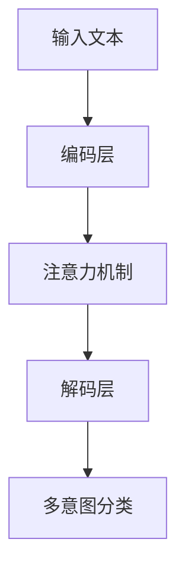
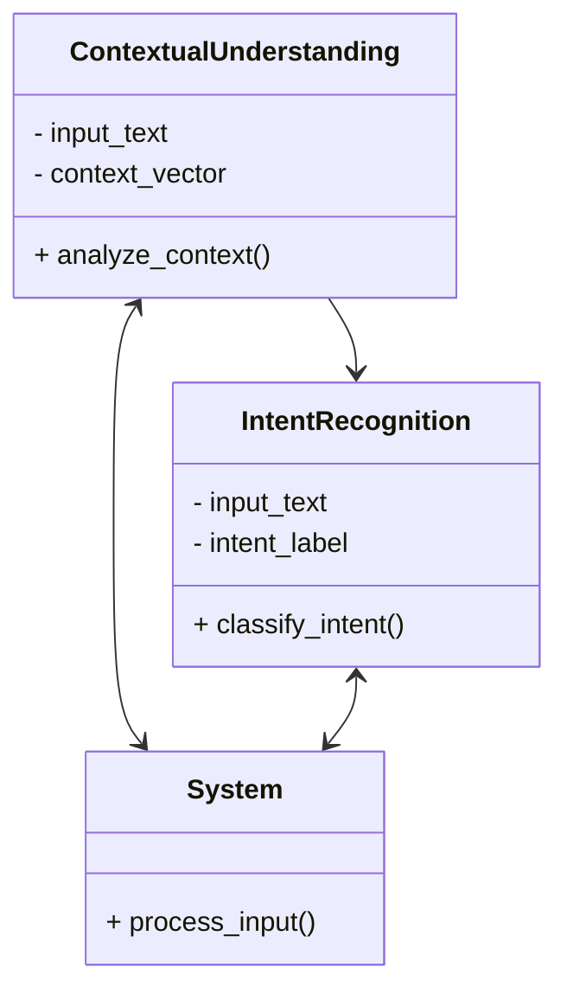
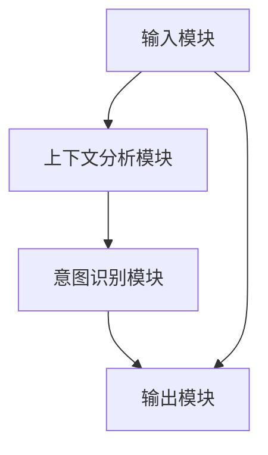
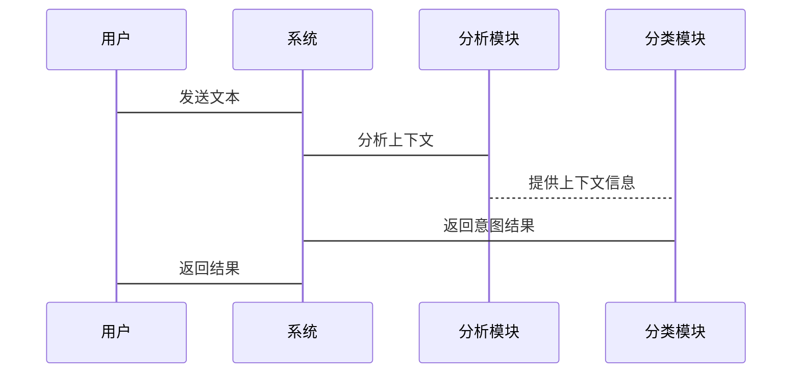

                 


# 《构建企业级自然语言理解系统：上下文感知与多意图识别的融合》

---

## 关键词：
- 自然语言处理（NLP）
- 上下文感知
- 多意图识别
- 企业级系统
- 模型融合

---

## 摘要：
本文详细探讨了构建企业级自然语言理解系统的核心技术，重点分析了上下文感知与多意图识别的融合方法。通过背景介绍、核心概念解析、算法原理、系统架构设计、项目实战等多维度的深入分析，结合实际案例和代码实现，为读者提供了一套系统化的解决方案。文章最后总结了最佳实践和未来研究方向，为构建高效、准确的自然语言理解系统提供了理论和实践指导。

---

## 目录大纲

### 第一部分：背景介绍与核心概念

#### 第1章：问题背景与描述

- **1.1 问题背景**
  - 当前自然语言处理的挑战
  - 企业级NLP系统的必要性
  - 上下文感知与多意图识别的融合需求

- **1.2 问题描述**
  - 自然语言理解的定义与目标
  - 上下文感知的核心问题
  - 多意图识别的复杂性

- **1.3 问题解决与边界**
  - 上下文感知与多意图识别的解决方案
  - 系统的边界与外延
  - 核心要素与组成结构

- **1.4 本章小结**

---

### 第二部分：核心概念与联系

#### 第2章：上下文感知与多意图识别的核心概念

- **2.1 核心概念原理**
  - 上下文感知的原理与机制
  - 多意图识别的原理与机制
  - 两者的融合原理

- **2.2 核心概念对比分析**
  - 上下文感知与多意图识别的特征对比
  - 对比特征表格

| 特征       | 上下文感知                 | 多意图识别                 |
|------------|--------------------------|--------------------------|
| 目标       | 理解语境                   | 识别多个意图               |
| 方法       | 基于上下文分析             | 基于意图分类               |
| 应用场景   | 语境理解                   | 智能对话、信息抽取         |
| 挑战       | 上下文信息的准确捕捉       | 多意图的准确识别          |

- **2.3 实体关系图**
  - 使用 Mermaid 绘制 ER 图，展示上下文感知和多意图识别之间的关系。

---

### 第三部分：算法原理

#### 第3章：上下文感知与多意图识别的算法原理

- **3.1 算法原理概述**
  - 基于 Transformer 的上下文感知模型
  - 多意图识别的分类算法

- **3.2 模型结构**
  - 使用 Mermaid 绘制模型结构图，展示上下文感知与多意图识别的融合过程。



- **3.3 关键算法解析**
  - 上下文感知算法：基于BERT的上下文表示方法
  - 多意图识别算法：基于多任务学习的意图分类

- **3.4 数学公式**
  - 注意力机制公式：
    $$ \text{Attention}(Q, K, V) = \text{softmax}\left(\frac{QK^T}{\sqrt{d_k}}\right)V $$
  - 多任务学习损失函数：
    $$ L = \alpha L_{\text{context}} + (1-\alpha) L_{\text{intent}} $$

- **3.5 Python 代码示例**
  ```python
  import torch
  import torch.nn as nn

  class ContextualModel(nn.Module):
      def __init__(self):
          super(ContextualModel, self).__init__()
          self.bert = BertModel.from_pretrained('bert-base')
          self.intent_classifier = nn.Linear(768, num_intents)

      def forward(self, input_ids, attention_mask):
          outputs = self.bert(input_ids, attention_mask=attention_mask)
          context = outputs.last_hidden_state[:, 0, :]
          intent = self.intent_classifier(context)
          return intent
  ```

---

### 第四部分：系统分析与架构设计

#### 第4章：系统分析与架构设计

- **4.1 项目背景**
  - 企业级NLP系统的应用场景
  - 上下文感知与多意图识别的业务需求

- **4.2 系统功能设计**
  - 使用 Mermaid 绘制领域模型类图，展示系统功能模块。



- **4.3 系统架构设计**
  - 使用 Mermaid 绘制系统架构图，展示模块之间的交互。



- **4.4 接口设计与交互流程**
  - 使用 Mermaid 绘制序列图，展示系统交互流程。



---

### 第五部分：项目实战

#### 第5章：项目实战与代码实现

- **5.1 环境安装**
  - 安装 Python、PyTorch、Hugging Face Transformers 等依赖库。

- **5.2 核心代码实现**
  - 实现上下文感知与多意图识别的融合模型。

  ```python
  from transformers import BertTokenizer, BertModel
  import torch

  tokenizer = BertTokenizer.from_pretrained('bert-base')
  model = BertModel.from_pretrained('bert-base')

  def process_input(text):
      inputs = tokenizer(text, return_tensors='pt')
      outputs = model(**inputs)
      return outputs.last_hidden_state[:, 0, :]

  def predict_intent(context_vector):
      # 假设 intent_classifier 是一个训练好的模型
      intent_logits = intent_classifier(context_vector)
      return intent_logits.argmax(dim=1).item()
  ```

- **5.3 代码解读与分析**
  - 解释代码的功能和实现细节。

- **5.4 实际案例分析**
  - 使用实际案例展示模型的输入、处理和输出结果。

- **5.5 项目总结**
  - 总结项目实现的关键点和经验教训。

---

### 第六部分：最佳实践与总结

#### 第6章：最佳实践与总结

- **6.1 最佳实践**
  - 数据预处理的关键点
  - 模型调优的技巧
  - 系统部署的注意事项

- **6.2 小结**
  - 回顾文章的核心内容
  - 强调上下文感知与多意图识别融合的重要性

- **6.3 注意事项**
  - 模型泛化的挑战
  - 数据隐私与安全问题
  - 系统性能优化建议

- **6.4 拓展阅读**
  - 推荐相关领域的书籍和论文
  - 提供进一步学习的方向

---

## 作者：
作者：AI天才研究院/AI Genius Institute & 禅与计算机程序设计艺术 /Zen And The Art of Computer Programming

