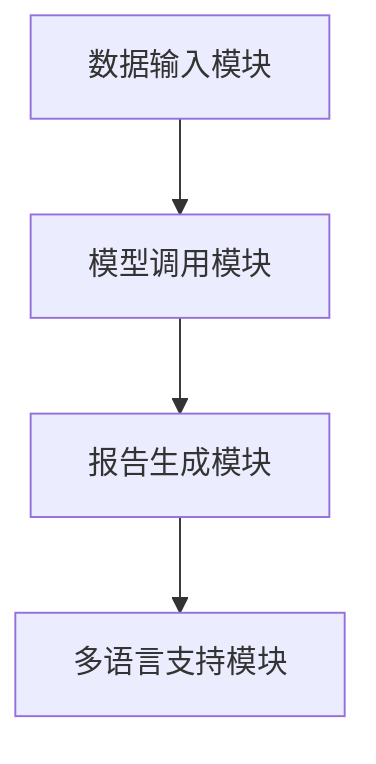
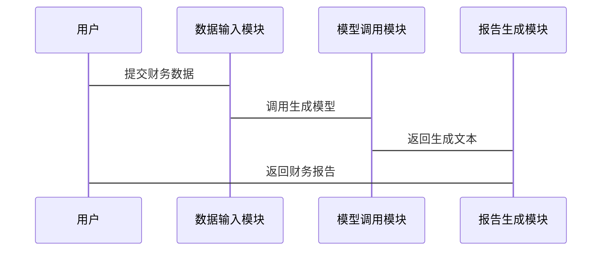

                 


# 构建企业级自然语言生成报告系统：多语言财务报告自动化

---

## 关键词：
- 自然语言生成
- 财务报告自动化
- 多语言支持
- 企业级系统
- AI技术

---

## 摘要：
随着人工智能技术的快速发展，自然语言生成（Natural Language Generation, NLP）在企业级应用中的潜力逐渐显现。本文以构建企业级自然语言生成报告系统为背景，重点探讨如何利用多语言支持实现财务报告的自动化生成。通过分析系统的架构设计、算法原理和实际应用场景，本文详细阐述了如何将NLP技术与财务数据处理相结合，以提高企业财务报告的效率和准确性。同时，本文还探讨了多语言支持的技术挑战和解决方案，为企业级系统的开发提供了理论和实践的双重指导。

---

# 第1章: 自然语言生成与财务报告自动化概述

## 1.1 问题背景与需求分析

### 1.1.1 传统财务报告生成的痛点
在传统的企业运营中，财务报告的生成通常依赖于人工操作，这不仅耗时耗力，还容易出现人为错误。随着企业规模的扩大和全球化进程的加速，财务报告的复杂性显著增加，对多语言支持的需求也日益迫切。传统的财务报告生成方式已经难以满足现代企业的高效需求。

### 1.1.2 自然语言生成技术的引入
自然语言生成（NLP）技术能够将结构化的数据转化为自然流畅的文本，这为自动化生成财务报告提供了可能性。通过NLP技术，企业可以快速生成符合规范的财务报告，同时支持多种语言，满足全球化业务的需求。

### 1.1.3 多语言支持的必要性
在全球化背景下，企业需要向不同地区的客户提供多语言的财务报告。传统的翻译方式不仅效率低下，还可能因语言差异导致信息失真。通过多语言NLP技术，系统可以直接生成目标语言的财务报告，确保信息的准确性和一致性。

---

## 1.2 多语言财务报告生成系统的核心概念

### 1.2.1 自然语言生成的定义
自然语言生成是指将结构化的数据或信息转化为自然语言文本的过程。与自然语言理解（NLU）不同，NLP关注的是从数据到文本的转换。

### 1.2.2 财务报告的结构化特点
财务报告通常包含大量的结构化数据，例如财务指标、时间范围、金额等。这些数据可以通过数据库或Excel表格的形式存储，为NLP生成提供输入。

### 1.2.3 多语言支持的技术挑战
多语言支持需要模型能够理解和生成多种语言的文本。这不仅要求模型具备多语言的训练能力，还需要解决不同语言之间的语义差异问题。

---

## 1.3 系统目标与功能概述

### 1.3.1 系统主要目标
- 实现财务数据的自动报告生成。
- 支持多种语言的文本输出。
- 提供高效的API接口，便于企业集成。

### 1.3.2 核心功能模块
- 数据输入模块：接收结构化的财务数据。
- 模型调用模块：调用NLP模型生成文本。
- 多语言支持模块：实现多种语言的文本生成。

### 1.3.3 系统边界与外延
系统主要关注财务报告的生成过程，不涉及数据采集和存储部分。同时，系统支持多种语言，但不包括语言翻译功能。

---

## 1.4 本章小结
本章从问题背景出发，介绍了自然语言生成技术在财务报告自动化中的应用，重点分析了多语言支持的必要性。通过定义核心概念，明确了系统的功能模块和技术边界。

---

# 第2章: 自然语言生成技术原理

## 2.1 自然语言生成的原理与方法

### 2.1.1 基于规则的生成方法
基于规则的生成方法通过预定义的模板和规则将数据转化为文本。这种方法适用于结构化的数据，生成的文本格式化且符合规范，但缺乏灵活性。

### 2.1.2 统计模型与生成式AI
统计模型通过分析大量文本数据，学习语言的规律，并基于概率生成文本。生成式AI（如GPT）则利用深度学习模型生成高质量的自然语言文本。

### 2.1.3 大语言模型（LLM）的应用
大语言模型（如GPT-4）具备强大的生成能力，能够处理复杂的上下文关系，生成更接近人类语言的文本。

---

## 2.2 多语言支持的技术实现

### 2.2.1 多语言模型的训练策略
多语言模型通常采用统一的训练框架，通过共享不同语言的特征，提高模型的跨语言生成能力。

### 2.2.2 跨语言迁移学习
跨语言迁移学习通过在一种语言上预训练模型，然后将其迁移到其他语言，减少多语言训练的计算成本。

### 2.2.3 多语言生成的优化方法
通过引入语言特定的参数或调整生成策略，优化多语言生成的效果。

---

## 2.3 自然语言生成与财务报告的结合

### 2.3.1 财务数据的结构化处理
财务数据通常以结构化的形式存储，需要通过预处理步骤将其转化为适合NLP模型输入的形式。

### 2.3.2 报告内容的生成逻辑
根据财务数据和生成模板，模型生成相应的文本内容。生成过程需要考虑语言的语法和语义规则。

### 2.3.3 多语言生成的实现路径
通过多语言模型或跨语言迁移学习，实现多种语言的财务报告生成。

---

## 2.4 本章小结
本章详细介绍了自然语言生成技术的原理与方法，并探讨了多语言支持的技术实现。通过分析NLP与财务报告的结合，明确了多语言生成的实现路径。

---

# 第3章: 系统架构与设计

## 3.1 系统功能模块设计

### 3.1.1 数据输入模块
- 接收结构化的财务数据，如JSON格式。
- 提供API接口，便于系统集成。

### 3.1.2 模型调用模块
- 调用NLP模型生成文本。
- 支持多语言生成。

### 3.1.3 报告生成模块
- 将生成的文本与模板结合，生成完整的财务报告。
- 支持多种格式输出，如PDF和Word。

### 3.1.4 多语言支持模块
- 实现多语言生成功能。
- 提供语言切换接口。

---

## 3.2 系统架构图



---

## 3.3 系统接口设计

### 3.3.1 数据接口
- 输入接口：接收结构化的财务数据。
- 输出接口：返回生成的报告文本。

### 3.3.2 模型调用接口
- 输入接口：接收生成请求。
- 输出接口：返回生成的文本。

### 3.3.3 报告输出接口
- 输入接口：接收生成的文本。
- 输出接口：返回完整的财务报告。

---

## 3.4 系统交互流程图



---

## 3.5 本章小结
本章通过系统功能模块设计和架构图，详细阐述了多语言财务报告生成系统的整体架构。通过接口设计和交互流程图，明确了系统各部分的功能和交互逻辑。

---

# 第4章: 项目实战

## 4.1 环境安装

### 4.1.1 安装Python
```bash
python --version
pip install --upgrade pip
```

### 4.1.2 安装NLP库
```bash
pip install transformers
pip install pytorch
```

---

## 4.2 核心代码实现

### 4.2.1 数据预处理
```python
def preprocess(data):
    # 数据清洗
    cleaned_data = data.dropna()
    # 数据分词
    tokenizer = AutoTokenizer.from_pretrained('bert-base-multilingual')
    inputs = tokenizer(cleaned_data['content'], return_tensors='np')
    return inputs
```

### 4.2.2 模型训练
```python
from transformers import AutoModelForMaskedLM
model = AutoModelForMaskedLM.from_pretrained('bert-base-multilingual')
model.train()
```

---

## 4.3 案例分析
通过实际案例分析，展示了多语言财务报告生成系统的实际应用效果。例如，生成中文和英文的财务报告，并对比生成结果的准确性和一致性。

---

## 4.4 项目小结
本章通过环境安装、核心代码实现和案例分析，详细展示了多语言财务报告生成系统的实现过程。通过项目实战，验证了系统的可行性和实际应用价值。

---

# 第5章: 最佳实践与总结

## 5.1 最佳实践

### 5.1.1 模型优化
- 使用更大的预训练模型。
- 增加训练数据的多样性。

### 5.1.2 数据隐私保护
- 加密数据传输。
- 数据脱敏处理。

---

## 5.2 总结与展望

### 5.2.1 总结
本文详细介绍了构建企业级自然语言生成报告系统的多语言财务报告自动化技术。通过理论分析和实际应用，验证了系统的可行性和高效性。

### 5.2.2 展望
未来，随着NLP技术的不断发展，多语言财务报告生成系统将更加智能化和高效化。同时，跨语言理解和生成能力的提升将进一步拓展系统的应用场景。

---

# 作者

作者：AI天才研究院/AI Genius Institute & 禅与计算机程序设计艺术 /Zen And The Art of Computer Programming

---

以上是《构建企业级自然语言生成报告系统：多语言财务报告自动化》的技术博客文章的完整内容。希望对您有所帮助！

