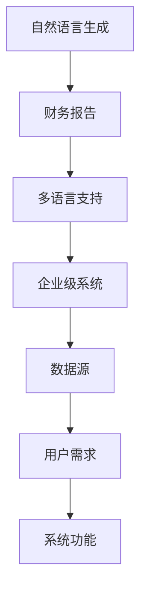
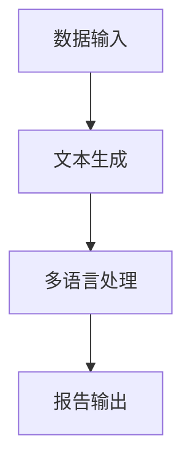

                 


# 《构建企业级自然语言生成报告系统：多语言财务报告自动化》

## 关键词：
- 自然语言生成（NLG）
- 多语言处理
- 企业级系统
- 财务报告自动化
- AI驱动
- 技术实现

## 摘要：
本文详细探讨了构建企业级自然语言生成报告系统的多语言财务报告自动化的技术实现。从问题背景到核心概念，从算法原理到系统架构，从项目实战到最佳实践，全面解析了如何利用AI技术实现多语言财务报告的自动化生成。通过详细的技术分析和案例解读，为读者提供了从理论到实践的完整解决方案。

---

# 第一部分: 背景与核心概念

## 第1章: 问题背景与需求分析

### 1.1 问题背景
#### 1.1.1 企业财务报告的痛点
- 财务报告的手动生成效率低
- 数据量大、语言多样性需求
- 不同地区的财务报告格式和术语差异
- 企业全球化发展的多语言需求

#### 1.1.2 传统财务报告生成方式的局限性
- 人工成本高
- 易出错，一致性难以保证
- 难以满足多语言需求
- 数据孤岛问题

#### 1.1.3 引入AI技术的必要性
- 提高效率
- 降低错误率
- 实现多语言支持
- 促进数据的统一管理和共享

### 1.2 问题描述
#### 1.2.1 财务报告生成的复杂性
- 数据结构复杂
- 语言表达的多样性
- 不同行业的术语差异

#### 1.2.2 多语言支持的挑战
- 多语言模型的选择
- 跨语言数据处理的复杂性
- 语言间的语义差异

#### 1.2.3 企业级系统的需求与目标
- 高可用性
- 高扩展性
- 高安全性
- 高度定制化

## 第2章: 核心概念与联系

### 2.1 自然语言生成（NLG）的核心原理
#### 2.1.1 NLG的基本概念与工作流程
- 输入：结构化数据或半结构化数据
- 输出：自然语言文本
- 关键技术：文本规划、生成、优化

#### 2.1.2 基于AI的NLG技术特点
- 基于深度学习的模型
- 预训练语言模型的应用
- 多模态数据处理能力

#### 2.1.3 NLG在财务报告中的应用
- 财务分析报告生成
- 财务数据可视化描述
- 财务预测报告生成

### 2.2 多语言处理的关键技术
#### 2.2.1 多语言模型的基本原理
- 多语言模型的训练策略
- 跨语言迁移学习
- 多语言tokenizer设计

#### 2.2.2 多语言支持的实现方式
- 多任务学习
- 跨语言预训练
- 多语言模型的微调

#### 2.2.3 多语言模型的优缺点对比
- 优点：通用性强，节省资源
- 缺点：某些语言的支持效果有限

### 2.3 企业级系统的特点
#### 2.3.1 企业级系统的定义与特征
- 高可用性
- 高扩展性
- 高安全性
- 高度定制化

#### 2.3.2 企业级系统的架构特点
- 分层架构
- 模块化设计
- 高度集成

#### 2.3.3 企业级系统与传统系统的区别
- 技术架构
- 可扩展性
- 安全性

## 第3章: 核心概念关系图

### 3.1 核心概念属性对比表
| 概念       | 属性               | 描述                                       |
|------------|--------------------|------------------------------------------|
| NLG        | 输入               | 结构化数据或半结构化数据                 |
|            | 输出               | 自然语言文本                               |
|            | 模型类型           | 基于Transformer的预训练模型               |
| 多语言处理 | 支持语言数          | 多语言支持                                 |
|            | 跨语言迁移能力      | 能够在不同语言间迁移学习                 |
| 企业级系统 | 可扩展性           | 支持大规模数据处理和高并发请求           |
|            | 系统稳定性         | 高可用性和容错能力                       |

### 3.2 ER实体关系图


---

# 第二部分: 算法原理

## 第4章: 算法原理详解

### 4.1 模型选择与优化
#### 4.1.1 模型选择
- 选择适合的预训练模型（如GPT、Bert）
- 模型的适应性评估

#### 4.1.2 模型优化策略
- 参数调整
- 数据增强
- 优化算法选择

### 4.2 训练策略
#### 4.2.1 预训练与微调
- 预训练目标
- 微调策略

#### 4.2.2 跨语言训练
- 跨语言数据处理
- 跨语言迁移学习

### 4.3 调优技巧
#### 4.3.1 参数调整
- 学习率
- batch size
- 衰退策略

#### 4.3.2 模型评估
- 准确率
- 召回率
- F1分数

### 4.4 模型评估
#### 4.4.1 评估指标
- BLEU
- ROUGE
- METEOR

#### 4.4.2 评估结果分析
- 真实案例分析
- 模型优化方向

---

# 第三部分: 系统架构设计

## 第5章: 系统架构设计

### 5.1 系统功能设计
#### 5.1.1 系统功能模块
- 数据输入模块
- 文本生成模块
- 多语言处理模块
- 报告输出模块

#### 5.1.2 功能流程图


### 5.2 系统架构设计
#### 5.2.1 分层架构设计
- 表现层
- 业务逻辑层
- 数据访问层

#### 5.2.2 微服务架构
- 服务划分
- 服务交互

### 5.3 接口设计
#### 5.3.1 API接口定义
- 输入接口
- 输出接口

#### 5.3.2 接口交互流程
- 请求处理流程
- 响应返回流程

### 5.4 交互流程
#### 5.4.1 用户操作流程
- 登录
- 数据上传
- 生成报告
- 下载报告

#### 5.4.2 系统处理流程
- 数据解析
- 文本生成
- 报告格式化
- 报告输出

---

# 第四部分: 项目实战

## 第6章: 项目实战

### 6.1 环境配置
#### 6.1.1 安装Python
- 安装步骤
- 环境配置

#### 6.1.2 安装依赖库
- 安装TensorFlow
- 安装Keras
- 安装NLTK

### 6.2 核心代码实现
#### 6.2.1 数据预处理
```python
import pandas as pd
data = pd.read_csv('financial_report.csv')
```

#### 6.2.2 模型训练
```python
model = build_model()
model.compile(optimizer='adam', loss='sparse_categorical_crossentropy', metrics=['accuracy'])
model.fit(data, epochs=10, batch_size=32)
```

#### 6.2.3 文本生成
```python
def generate_report(data):
    report = model.predict(data)
    return report
```

### 6.3 实际案例分析
#### 6.3.1 案例背景
- 某跨国企业的财务数据
- 多语言生成需求

#### 6.3.2 数据处理
- 数据清洗
- 数据转换

#### 6.3.3 模型训练
- 训练过程
- 模型优化

### 6.4 总结
- 项目成果
- 经验分享
- 改进建议

---

# 第五部分: 最佳实践

## 第7章: 最佳实践

### 7.1 小结
- 项目总结
- 技术总结

### 7.2 注意事项
- 模型选择
- 数据处理
- 系统优化

### 7.3 扩展阅读
- 推荐书籍
- 推荐文章
- 推荐课程

---

# 作者：AI天才研究院/AI Genius Institute & 禅与计算机程序设计艺术 /Zen And The Art of Computer Programming

---

以上是一个详细的大纲，涵盖了构建企业级自然语言生成报告系统的各个方面。接下来，我可以根据这个大纲撰写完整的文章。

