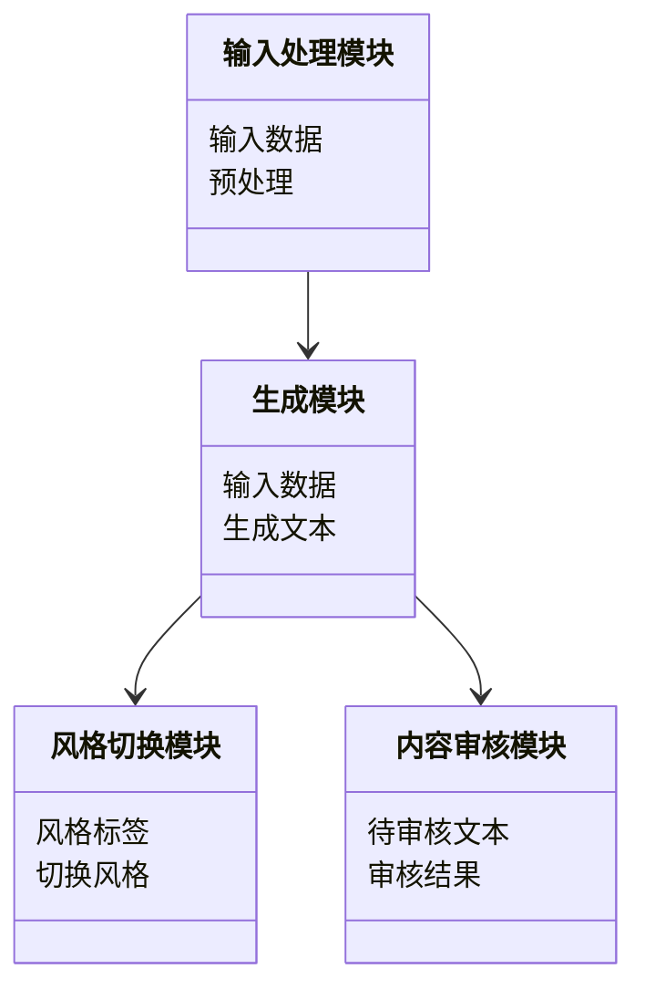
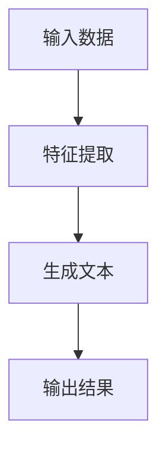

                 


---

# 《构建企业级自然语言生成系统：多语种、多风格报告自动化》

> 关键词：自然语言生成，多语种，多风格，企业级系统，报告自动化

> 摘要：本文详细探讨了构建企业级自然语言生成系统的各个方面，从基础概念到算法原理，再到系统架构设计和项目实战，全面解析了如何实现多语种、多风格的自然语言生成。文章通过实际案例分析和详细代码实现，帮助读者掌握自然语言生成的核心技术，并能够应用于企业级系统的构建。

---

# 第一部分: 自然语言生成系统背景与基础

## 第1章: 自然语言生成系统概述

### 1.1 问题背景与需求分析

#### 1.1.1 从传统文本生成到自然语言生成的演进

传统文本生成主要依赖于模板和规则引擎，生成的内容缺乏灵活性和多样性。随着自然语言处理技术的发展，自然语言生成（Natural Language Generation, NLG）逐渐成为企业级应用的重要组成部分，能够自动生成高质量、多风格的文本内容。

#### 1.1.2 企业级应用中的自然语言生成需求

企业级应用对自然语言生成的需求主要体现在以下几个方面：
- **多语种支持**：企业通常需要在不同语言市场中提供一致的内容，生成系统需支持多种语言。
- **多风格切换**：根据目标受众的不同，生成内容需要切换不同的风格（如正式、非正式、技术性等）。
- **高可用性与稳定性**：企业级系统需要7×24小时稳定运行，支持高并发请求。
- **内容审核与安全合规**：生成的内容需符合企业内部的审核标准和相关法律法规。

#### 1.1.3 多语种与多风格生成的必要性

在跨国企业中，多语种生成是实现全球化战略的关键技术。不同地区的用户可能偏好不同的语言风格，因此生成系统需要具备灵活性，能够快速切换生成风格并支持多种语言。

### 1.2 核心概念与技术挑战

#### 1.2.1 自然语言生成的定义与核心要素

自然语言生成（NLG）是将结构化数据转换为自然语言文本的过程。核心要素包括：
- **输入数据**：结构化数据（如数据库中的表格）或半结构化数据（如JSON）。
- **生成模型**：基于统计模型、规则引擎或深度学习模型。
- **语言风格**：生成文本的语气、用词和句式。

#### 1.2.2 多语种生成的技术难点

多语种生成需要解决以下问题：
- **跨语言一致性**：不同语言的生成风格可能存在差异，需统一生成逻辑。
- **语言资源**：多语种生成需要大量多语言语料库支持。
- **模型适配**：不同语言的语法和词汇差异需要模型具备跨语言处理能力。

#### 1.2.3 多风格生成的实现挑战

多风格生成的难点在于如何在不改变输入数据的前提下，快速切换生成风格。实现方法包括：
- **风格标签**：在生成过程中引入风格标签，指导模型生成对应风格的内容。
- **风格迁移**：通过预训练模型实现风格迁移。
- **多任务学习**：在生成过程中同时学习多种风格特征。

---

# 第二部分: 自然语言生成算法原理

## 第4章: 预训练语言模型与解码器架构

### 4.1 预训练语言模型的原理

预训练语言模型（如BERT、GPT）通过在大规模通用语料库上进行无监督学习，掌握了语言的基本规律和语义信息。其核心思想是利用自监督学习任务（如遮蔽词任务、预测下一个词任务）来训练模型。

### 4.2 解码器架构的实现细节

解码器是自然语言生成的核心部分，负责将输入的结构化数据或隐层表示转换为自然语言文本。常用的解码器架构包括：
- **循环解码器**：基于RNN/LSTM的解码器，适用于长文本生成。
- **Transformer解码器**：基于Transformer的解码器，具有并行计算能力强、生成速度快的特点。

### 4.3 模型调优与优化策略

模型调优是提升生成效果的关键步骤，包括：
- **超参数优化**：调整学习率、批次大小等参数。
- **数据增强**：通过数据增强技术（如同义词替换、句式改写）提升模型的鲁棒性。
- **对抗训练**：通过对抗网络进一步优化生成质量。

---

# 第三部分: 系统架构设计与实现

## 第7章: 企业级自然语言生成系统架构设计

### 7.1 系统需求分析

企业级自然语言生成系统需要满足以下需求：
- **多语言支持**：支持多种语言的文本生成。
- **多风格切换**：支持多种语言风格的生成。
- **高可用性**：支持高并发请求，具备容错和恢复能力。
- **内容审核**：具备内容过滤和审核功能，确保生成内容的安全性和合规性。

### 7.2 系统功能设计（领域模型）

系统功能设计可以采用领域模型方法，从用户、系统、数据等角度描述系统的功能需求。以下是系统的主要功能模块：
- **输入处理模块**：接收输入数据并进行预处理。
- **生成模块**：根据输入数据生成自然语言文本。
- **风格切换模块**：支持多种风格的文本生成。
- **内容审核模块**：对生成的内容进行安全性和合规性检查。

### 7.3 系统架构设计（架构图）

以下是系统架构设计的类图：



---

# 第四部分: 项目实战与案例分析

## 第10章: 项目实战：多语种报告生成系统

### 10.1 项目需求分析

项目需求包括：
- **多语种支持**：支持中、英、日三种语言。
- **多风格切换**：支持正式、非正式、技术性三种风格。
- **高可用性**：支持每天1000次以上的生成请求。
- **内容审核**：对生成的内容进行安全性和合规性检查。

### 10.2 环境安装与配置

项目需要以下环境：
- **Python 3.8+**
- **TensorFlow/PyTorch**
- **Transformers库**
- **Flask（可选，用于构建API）**

### 10.3 核心代码实现

以下是生成模块的核心代码：

```python
def generate_text(input_data, language, style):
    # 加载预训练模型
    model = AutoModelForSeq2Seq.from_pretrained("facebook/m2m-100")
    tokenizer = AutoTokenizer.from_pretrained("facebook/m2m-100")
    
    # 处理输入数据
    inputs = tokenizer(input_data, return_tensors="np")
    
    # 解码生成文本
    outputs = model.generate(**inputs, forced_bos_token_id=tokenizer.get_special_tokens_mask(1))
    
    # 解码输出
    generated_text = tokenizer.decode(outputs[0], skip_special_tokens=True)
    
    return generated_text
```

### 10.4 案例分析与详细讲解

以下是一个生成中英文报告的案例：

输入数据：
- 语言：中文
- 风格：正式
- 内容：公司季度报告

生成输出：
```
尊敬的各位股东：

本季度，公司在技术研发方面取得了显著进展，成功推出了新产品，市场反应热烈，销售额同比增长20%。我们相信，在公司全体员工的共同努力下，公司将继续保持增长态势，为股东创造更大的价值。

此致
敬礼

（公司名称）
```

---

# 第五部分: 高级主题

## 第13章: 模型调优与优化策略

### 13.1 模型调优的数学公式

模型调优可以通过以下公式实现：

$$
\text{Loss} = \sum_{i=1}^{N} \text{cross\_entropy}(y_i, y_{\text{pred}})
$$

其中，$N$ 是样本数量，$y_i$ 是真实标签，$y_{\text{pred}}$ 是预测标签。

### 13.2 多模态生成模型的实现

多模态生成模型可以通过以下流程实现：



---

# 第六部分: 总结与展望

## 第16章: 全书总结

本文详细探讨了企业级自然语言生成系统的各个方面，从基础概念到算法原理，再到系统架构设计和项目实战，全面解析了如何实现多语种、多风格的自然语言生成。通过实际案例分析和详细代码实现，帮助读者掌握自然语言生成的核心技术，并能够应用于企业级系统的构建。

## 第17章: 未来展望

未来，自然语言生成技术将朝着以下几个方向发展：
- **多模态生成**：结合图像、语音等多种模态信息，生成更加丰富的文本内容。
- **更强大的预训练模型**：随着计算能力的提升，更大规模的预训练模型将被开发出来。
- **更加智能化的风格切换**：通过引入更先进的风格分析和迁移技术，实现更加智能的风格切换。

---

作者：AI天才研究院/AI Genius Institute & 禅与计算机程序设计艺术 /Zen And The Art of Computer Programming

