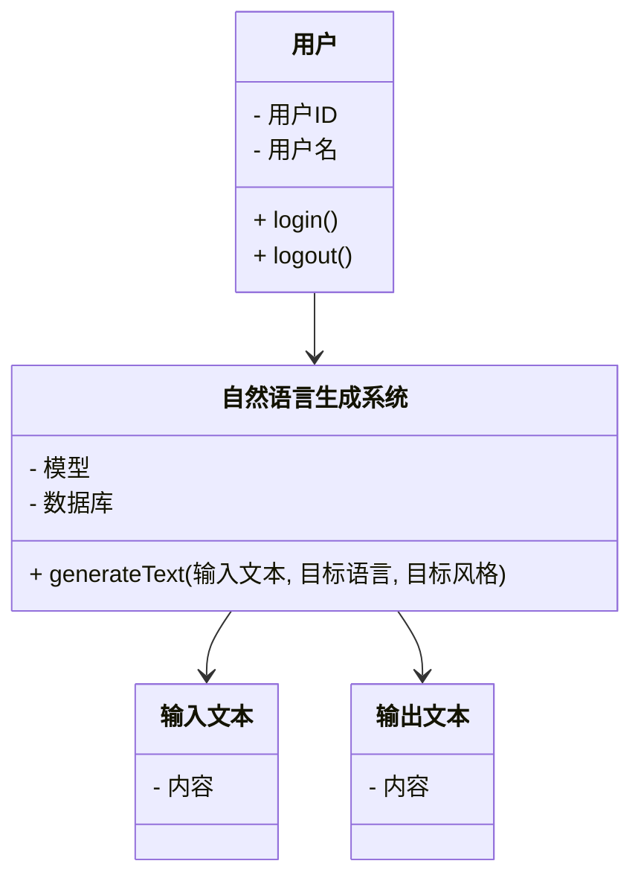
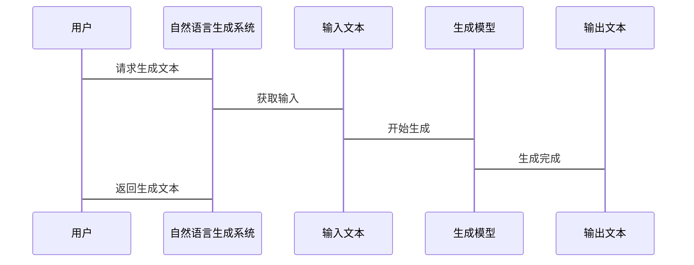

                 


# 构建企业级自然语言生成系统：多语种、多风格报告自动化

## 关键词：自然语言生成，企业级系统，多语种，多风格，自动化报告，NLP，深度学习

## 摘要：本文将详细探讨如何构建一个企业级的自然语言生成系统，该系统能够支持多语种和多风格的报告自动生成。文章将从技术原理、系统架构、算法实现等多个维度进行深入分析，并结合实际案例，为企业级系统的构建提供全面的指导和建议。

---

## 第一部分：自然语言生成系统概述

### 第1章：自然语言生成系统背景与概念

#### 1.1 问题背景

##### 1.1.1 自然语言生成的定义与重要性
自然语言生成（Natural Language Generation, NLG）是人工智能领域的重要分支，旨在让计算机能够自动生成符合人类语言习惯的文本。随着企业对自动化报告的需求增加，NLG技术在企业级应用中的重要性日益凸显。

##### 1.1.2 企业级应用中的自然语言生成需求
企业级系统需要处理大量数据，并将其转化为易于理解的文本报告。传统的手动报告生成方式效率低，成本高，难以满足现代企业的快速响应需求。

##### 1.1.3 多语种与多风格生成的挑战
在全球化背景下，企业需要支持多种语言和多种风格的报告生成。多语种生成需要处理不同语言的语法和语义差异，而多风格生成则要求系统能够适应不同的文本风格，如正式、口语化、简洁等。

#### 1.2 自然语言生成系统的定义与特点

##### 1.2.1 自然语言生成的核心概念
自然语言生成系统通过算法和模型，将结构化数据转化为自然语言文本。其核心在于理解数据内容，并选择合适的语言表达方式。

##### 1.2.2 多语种生成的特点
多语种生成需要支持多种语言，并确保生成的文本在语法和语义上准确无误。这要求系统具备跨语言的处理能力。

##### 1.2.3 多风格生成的实现方式
多风格生成通过调整模型的参数或引入风格切换机制，实现不同风格文本的生成。例如，可以通过预训练模型的微调或引入风格标签来实现。

#### 1.3 自然语言生成技术的演进

##### 1.3.1 传统NLP技术的发展
从基于规则的生成到统计模型，传统NLP技术为自然语言生成奠定了基础。

##### 1.3.2 深度学习时代的生成模型
深度学习的兴起推动了生成模型的快速发展，如循环神经网络（RNN）和变换器（Transformer）模型的广泛应用。

##### 1.3.3 大模型在自然语言生成中的应用
大模型如GPT系列通过海量数据的预训练，具备强大的生成能力，成为现代自然语言生成的核心技术。

#### 1.4 自然语言生成系统的应用价值

##### 1.4.1 企业级报告生成的效率提升
自动化报告生成能够显著提高企业的报告效率，减少人工成本。

##### 1.4.2 多语种支持对企业全球化的帮助
多语种生成能力是企业全球化战略的重要支撑，能够帮助企业在不同市场中快速生成本地化的报告。

##### 1.4.3 多风格生成对内容多样性的促进
多风格生成能够满足不同场景下的文本需求，提升内容的多样性和适用性。

#### 1.5 本章小结
本章介绍了自然语言生成的背景、定义、特点和技术演进，强调了其在企业级应用中的重要性。

---

## 第二部分：自然语言生成系统的核心概念与原理

### 第2章：自然语言生成的核心概念

#### 2.1 自然语言生成的关键任务

##### 2.1.1 文本生成的基本任务类型
文本生成任务包括文本摘要、机器翻译、对话生成和文本扩展等。

##### 2.1.2 多语种生成的实现方式
多语种生成可以通过多语言模型或分语言模型来实现，具体选择取决于任务需求和资源限制。

##### 2.1.3 多风格生成的分类与实现
多风格生成可以根据风格类型分为正式、口语化、简洁等多种风格，实现方式包括基于标签的风格切换和基于条件的风格生成。

#### 2.2 自然语言生成的模型结构

##### 2.2.1 生成式模型的结构特点
生成式模型通常采用生成对抗网络（GAN）或变换器（Transformer）结构，具备强大的生成能力。

##### 2.2.2 多模态生成模型的优势
多模态生成模型能够同时利用文本、图像等多种信息，生成更丰富的文本内容。

##### 2.2.3 大模型在生成式任务中的应用
大模型通过预训练和微调，能够适应多种生成任务，提升生成质量。

#### 2.3 自然语言生成的评价指标

##### 2.3.1 常见的生成质量评价指标
常用的评价指标包括BLEU、ROUGE、METEOR和TER等。

##### 2.3.2 多语种生成的评价挑战
多语种生成的评价需要考虑不同语言的评价指标和文化差异。

##### 2.3.3 多风格生成的评价维度
多风格生成的评价需要考虑生成文本的风格一致性、内容相关性和语言流畅性。

#### 2.4 自然语言生成系统的实体关系图


#### 2.5 本章小结
本章详细讲解了自然语言生成的核心概念，包括生成任务类型、模型结构和评价指标，并通过实体关系图展示了系统的组成。

---

## 第三部分：自然语言生成系统的算法原理

### 第3章：基于大模型的自然语言生成算法

#### 3.1 大模型在自然语言生成中的应用

##### 3.1.1 大模型的结构特点
大模型通常采用变换器结构，包含编码器和解码器两部分，能够处理长文本序列。

##### 3.1.2 大模型的训练过程
大模型的训练包括预训练和微调两个阶段，预训练目标是学习语言的通用特征，微调则是针对具体任务进行优化。

##### 3.1.3 大模型的生成机制
生成过程通常采用贪心搜索或采样方法，生成高质量的文本。

#### 3.2 基于Transformer的生成模型


##### 3.2.1 编码器-解码器结构
编码器将输入文本转化为上下文向量，解码器根据上下文生成输出文本。

##### 3.2.2 自注意力机制
自注意力机制帮助模型捕捉文本中的长距离依赖关系，提升生成质量。

##### 3.2.3 前向网络结构
前向网络结构通过多层感知机实现特征提取和生成。

#### 3.3 多语种生成的算法实现

##### 3.3.1 多语种模型的训练策略
多语种模型可以通过共享语言特征或使用语言标签进行训练。

##### 3.3.2 多语种生成的解码过程
解码过程中，模型需要根据目标语言的特征生成相应文本。

##### 3.3.3 多语种模型的适应性调整
针对不同语言的特点，对模型进行微调或参数调整，提升生成质量。

#### 3.4 多风格生成的算法实现

##### 3.4.1 风格切换的实现方式
通过引入风格标签或调整模型参数，实现风格切换。

##### 3.4.2 风格分类与生成的结合
先对风格进行分类，再根据分类结果生成相应风格的文本。

##### 3.4.3 风格一致性评估
通过预定义的风格指标，评估生成文本的风格一致性。

#### 3.5 本章小结
本章详细讲解了大模型在自然语言生成中的应用，包括模型结构、训练过程和多语种、多风格生成的实现方法。

---

## 第四部分：自然语言生成系统的系统架构与设计

### 第4章：企业级自然语言生成系统的架构设计

#### 4.1 项目背景介绍

##### 4.1.1 项目目标
构建一个支持多语种和多风格的自然语言生成系统，实现企业级报告的自动化生成。

##### 4.1.2 项目需求
系统需要支持多种语言和多种风格的生成，并具备良好的扩展性和稳定性。

#### 4.2 系统功能设计

##### 4.2.1 领域模型类图



##### 4.2.2 系统架构图


##### 4.2.3 系统接口设计
系统提供API接口，供其他系统调用生成文本功能。

##### 4.2.4 系统交互序列图



#### 4.3 本章小结
本章通过类图、架构图和交互图，详细讲解了企业级自然语言生成系统的架构设计。

---

## 第五部分：自然语言生成系统的项目实战

### 第5章：构建多语种、多风格自然语言生成系统

#### 5.1 环境安装与配置

##### 5.1.1 安装Python环境
安装Python 3.8及以上版本，推荐使用虚拟环境。

##### 5.1.2 安装依赖库
安装必要的依赖库，如TensorFlow、Keras和PyTorch。

##### 5.1.3 下载预训练模型
下载开源的大模型权重文件，如GPT-2或BERT。

#### 5.2 系统核心实现

##### 5.2.1 预训练模型加载

```python
import tensorflow as tf
from tensorflow.keras.models import Model
from tensorflow.keras.layers import Input, Dense

# 加载预训练模型
model = tf.keras.models.load_model('pretrained_model.h5')
```

##### 5.2.2 多语种生成实现

```python
def generate_text(model, input_text, target_language):
    # 处理输入文本
    input_vec = process_input(input_text)
    # 生成输出
    output_vec = model.predict(input_vec)
    # 解码输出
    generated_text = decode_output(output_vec, target_language)
    return generated_text
```

##### 5.2.3 多风格生成实现

```python
def generate_style(model, input_text, target_style):
    # 处理输入文本
    input_vec = process_input(input_text)
    # 添加风格标签
    style_vec = get_style_vector(target_style)
    # 合并输入
    input_vec_with_style = concatenate(input_vec, style_vec)
    # 生成输出
    output_vec = model.predict(input_vec_with_style)
    # 解码输出
    generated_text = decode_output(output_vec)
    return generated_text
```

#### 5.3 实际案例分析

##### 5.3.1 案例背景
假设我们需要生成一份英文的市场分析报告，并要求报告的语言为中文，风格为正式。

##### 5.3.2 代码实现

```python
input_text = "市场分析报告"
target_language = "中文"
target_style = "正式"

generated_text = generate_text(model, input_text, target_language, target_style)
print(generated_text)
```

##### 5.3.3 生成结果
输出文本为正式的中文市场分析报告。

#### 5.4 本章小结
本章通过实际案例，详细讲解了如何构建一个多语种、多风格的自然语言生成系统，并展示了具体的代码实现。

---

## 第六部分：总结与展望

### 第6章：总结与最佳实践

#### 6.1 总结
本文详细讲解了如何构建一个企业级的自然语言生成系统，包括技术原理、系统架构和项目实战。

#### 6.2 最佳实践

##### 6.2.1 系统设计中的注意事项
在系统设计中，需要充分考虑多语种和多风格生成的实现方式，确保系统的可扩展性和稳定性。

##### 6.2.2 算法实现中的技巧
在算法实现中，建议使用开源的大模型，并通过微调和优化提升生成质量。

##### 6.2.3 系统部署中的建议
系统部署时，建议采用容器化技术，确保系统的高效运行和快速扩展。

#### 6.3 未来展望
随着人工智能技术的不断发展，自然语言生成系统将更加智能化和多样化，为企业级应用提供更强大的支持。

---

## 作者：AI天才研究院/AI Genius Institute & 禅与计算机程序设计艺术 /Zen And The Art of Computer Programming

---

以上是文章的完整目录和内容概要，您可以根据实际需要进一步扩展每个部分的内容，添加更多的技术细节和实际案例。

