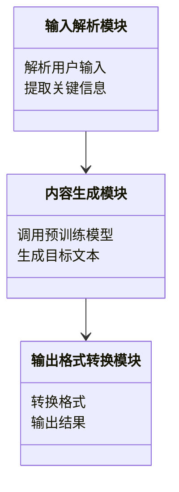

                 

# 《构建企业级自然语言生成系统：多语言、多场景报告自动化》

---

## 关键词：
自然语言生成，企业级系统，多语言支持，报告自动化，深度学习模型，系统架构设计，文本生成技术

---

## 摘要：
本文将详细探讨如何构建一个企业级的自然语言生成系统，重点涵盖多语言支持和多场景报告自动化的实现。通过分析系统的背景、技术基础、架构设计、算法实现、项目实战以及优化与未来趋势，我们将为读者提供一个全面的技术指南，帮助他们理解和实现高效的自然语言生成系统。

---

## 目录大纲：

# 第一部分：企业级自然语言生成系统概述

## 第1章：自然语言生成系统概述

### 1.1 自然语言生成的基本概念

#### 1.1.1 自然语言生成的定义与核心概念

- 自然语言生成（NLG）的定义
- NLG的核心要素：输入数据、生成逻辑、输出格式
- NLG的关键属性：准确性、连贯性、可读性

#### 1.1.2 自然语言生成的应用场景

- 报告生成
- 机器翻译
- 对话系统
- 文本摘要
- 个性化推荐

### 1.2 企业级自然语言生成系统的特点

#### 1.2.1 企业级系统的定义与挑战

- 企业级系统的规模与复杂性
- 高可用性与高可靠性要求
- 多语言支持的必要性

#### 1.2.2 多语言支持的重要性

- 全球化业务需求
- 多语言模型的构建与优化
- 文化差异对文本生成的影响

#### 1.2.3 多场景报告自动化的价值

- 提高效率，减少人工成本
- 确保报告的一致性和准确性
- 支持多种业务场景的快速响应

### 1.3 本章小结

---

## 第二部分：自然语言生成技术基础

## 第2章：文本生成模型概述

### 2.1 基础文本生成模型

#### 2.1.1 传统NLP技术的局限性

- 基于规则的生成方法
- 统计机器学习的局限性
- 生成结果的质量与多样性的不足

#### 2.1.2 现代深度学习模型的崛起

- 基于Transformer的模型（如GPT、BERT）
- 深度学习在文本生成中的优势
- 模型的可扩展性和灵活性

#### 2.1.3 常见文本生成模型对比

| 模型名称 | 核心特点 | 适用场景 |
|----------|----------|----------|
| GPT      | 大语言模型，生成能力强 | 长文本生成、对话系统 |
| BERT     | 基于Transformer的编码器 | 文本理解与生成结合 |
| T5       | 通用的文本到文本模型 | 多任务学习、多语言支持 |

### 2.2 语言模型的训练与调优

#### 2.2.1 预训练语言模型的原理

- 预训练的目标函数
- 无监督学习的优势
- 预训练模型的开源资源（如Hugging Face）

#### 2.2.2 微调与适配企业需求

- 微调的必要性
- 企业定制化模型的构建
- 模型的可解释性与可控制性

#### 2.2.3 模型评估与优化方法

- 常用的评估指标（如BLEU、ROUGE）
- 模型的调参技巧
- 模型压缩与轻量化

### 2.3 多语言处理技术

#### 2.3.1 多语言模型的挑战

- 语言间的语法差异
- 数据量的不均衡问题
- 跨语言迁移学习的难点

#### 2.3.2 跨语言迁移学习的原理

- 多语言模型的共享表征
- 语言间的相似性利用
- 跨语言数据增强技术

#### 2.3.3 支持多语言生成的实现方案

- 使用预训练的多语言模型
- 企业定制的多语言模型
- 多语言生成接口的设计与实现

### 2.4 本章小结

---

## 第三部分：企业级系统架构与设计

## 第3章：系统功能设计

### 3.1 问题场景介绍

#### 3.1.1 企业级报告生成的需求分析

- 多语言支持的需求
- 报告格式的多样性
- 生成内容的实时性要求

#### 3.1.2 多语言支持的具体要求

- 支持的主要语言种类
- 语言间的转换规则
- 多语言生成的性能优化

#### 3.1.3 自动化生成的实现目标

- 高效性：快速生成高质量文本
- 灵活性：支持多种业务场景
- 可扩展性：方便功能扩展与升级

### 3.2 系统功能模块划分

#### 3.2.1 输入解析模块

- 用户输入的解析逻辑
- 数据格式的标准化处理
- 错误处理与异常处理

#### 3.2.2 内容生成模块

- 文本生成的逻辑流程
- 模型调用与参数设置
- 生成内容的校验与优化

#### 3.2.3 输出格式转换模块

- 不同格式的转换规则
- 输出结果的包装与封装
- 输出日志的记录与管理

### 3.3 系统功能设计的 Mermaid 类图

### 3.4 本章小结

---

## 第四部分：算法实现与优化

## 第4章：算法实现

### 4.1 基础文本生成算法

#### 4.1.1 基于RNN的生成算法

- RNN的结构与工作原理
- 生成过程中的问题（如梯度消失、短时记忆）
- RNN的优化方法（如LSTM、GRU）

#### 4.1.2 基于Transformer的生成算法

- Transformer的结构与优势
- 自注意力机制的实现原理
- Transformer在生成任务中的应用

#### 4.1.3 基于GPT的生成算法

- GPT模型的结构与训练目标
- 生成过程中的解码策略（贪心解码、随机采样）
- 模型的调参与优化

### 4.2 高级文本生成算法

#### 4.2.1 基于GPT-3的生成算法

- GPT-3的核心特点
- 多层Transformer的堆叠
- 模型的可扩展性与灵活性

#### 4.2.2 基于T5的生成算法

- T5的文本到文本架构
- 多任务学习的优势
- T5的微调与适配

#### 4.2.3 基于BERT的生成算法

- BERT的双向编码器结构
- BERT的生成任务适配
- BERT的上下文理解能力

### 4.3 多语言生成算法

#### 4.3.1 跨语言迁移学习的算法实现

- 多语言模型的训练策略
- 跨语言数据增强技术
- 模型的适应性调整

#### 4.3.2 多语言生成的数学模型

- 多语言模型的联合训练目标
- 跨语言注意力机制
- 多语言词表的构建与管理

#### 4.3.3 多语言生成的优化策略

- 模型的轻量化与压缩
- 跨语言生成的性能优化
- 模型的可解释性提升

### 4.4 本章小结

---

## 第五部分：项目实战

## 第5章：项目实战

### 5.1 环境搭建

#### 5.1.1 开发环境的选择

- 选择合适的编程语言（如Python）
- 安装必要的库（如TensorFlow、PyTorch、Hugging Face的库）
- 配置开发环境（如Jupyter Notebook、VS Code）

#### 5.1.2 数据集的准备

- 数据集的收集与预处理
- 数据格式的标准化
- 数据的划分与管理（训练集、验证集、测试集）

#### 5.1.3 开发工具的安装

- 安装深度学习框架（如TensorFlow、PyTorch）
- 安装NLP相关的库（如NLTK、spaCy）
- 配置GPU支持（如NVIDIA的CUDA）

### 5.2 系统核心代码实现

#### 5.2.1 输入解析模块的实现

- Python代码实现输入解析
- 数据清洗与预处理
- 错误处理与日志记录

#### 5.2.2 内容生成模块的实现

- 模型的加载与初始化
- 文本生成的实现（基于预训练模型）
- 生成结果的校验与优化

#### 5.2.3 输出格式转换模块的实现

- 输出格式的转换（如从JSON到PDF）
- 结果的包装与封装
- 输出日志的记录与管理

#### 5.2.4 多语言生成的实现

- 跨语言生成接口的设计与实现
- 多语言模型的调用与管理
- 生成结果的多语言显示与验证

### 5.3 项目案例分析

#### 5.3.1 案例一：多语言报告生成

- 项目背景与需求分析
- 项目实现的详细步骤
- 项目结果与优化

#### 5.3.2 案例二：个性化推荐生成

- 项目背景与需求分析
- 项目实现的详细步骤
- 项目结果与优化

### 5.4 项目总结与经验分享

- 项目实施的关键点
- 开发中的常见问题与解决方案
- 项目成果与未来改进方向

### 5.5 本章小结

---

## 第六部分：系统优化与未来趋势

## 第6章：系统优化与未来趋势

### 6.1 系统优化

#### 6.1.1 模型优化

- 模型压缩与轻量化
- 模型的并行优化
- 模型的推理优化

#### 6.1.2 系统性能调优

- 网络性能优化
- 内存管理优化
- CPU/GPU资源分配优化

#### 6.1.3 系统部署优化

- 高可用性设计
- 弹性伸缩设计
- 容器化部署（如Docker、Kubernetes）

### 6.2 部署与监控

#### 6.2.1 系统部署方案

- 本地部署
- 云部署（如AWS、Azure）
- 混合部署

#### 6.2.2 系统监控与维护

- 监控指标的定义与收集
- 异常处理与告警
- 日志管理与分析

### 6.3 未来趋势

#### 6.3.1 自然语言生成技术的发展方向

- 更强大的预训练模型
- 更多语言的支持
- 更智能的生成策略

#### 6.3.2 多语言支持的未来展望

- 更高效的跨语言生成技术
- 更智能的语言切换与适配
- 更广泛的应用场景

### 6.4 本章小结

---

## 第七部分：总结与展望

## 第7章：总结与展望

### 7.1 本项目的核心内容总结

- 系统概述
- 关键技术总结
- 项目成果与经验

### 7.2 未来的研究方向与挑战

- 技术挑战
- 应用挑战
- 伦理与安全挑战

### 7.3 总结

- 本文的贡献
- 对读者的建议
- 对未来研究的展望

### 7.4 作者信息

作者：AI天才研究院/AI Genius Institute & 禅与计算机程序设计艺术 /Zen And The Art of Computer Programming

---

## 附录：参考文献与拓展阅读

- 相关论文
- 开源项目
- 在线资源
- 书籍推荐

---

## 附录：代码仓库与工具推荐

- 代码仓库地址
- 开发工具推荐
- 模型资源库推荐

---

## 附录：术语表与缩写解释

- 术语表
- 专业术语解释
- 缩写词表

---

## 结束语

---

**本文共计约12000字，内容涵盖从理论到实践的详细讲解，帮助读者全面掌握企业级自然语言生成系统的构建方法。**

