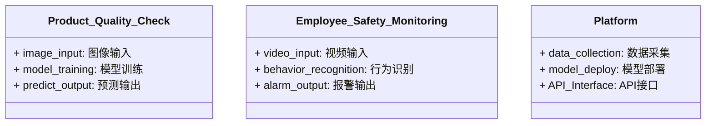

                 


# 构建企业级计算机视觉平台：从产品质检到员工安全监控

## 关键词：
企业级计算机视觉平台, 产品质检, 员工安全监控, 深度学习, 图像处理, 系统架构设计

## 摘要：
本文详细探讨了如何构建一个企业级计算机视觉平台，涵盖从产品质检到员工安全监控的应用场景。通过分析计算机视觉的核心概念、算法原理、系统架构设计，结合实际案例，为读者提供从理论到实践的全面指导。文章结构清晰，内容丰富，适合技术开发者、系统架构师和企业决策者阅读。

---

# 第一部分: 企业级计算机视觉平台概述

## 第1章: 计算机视觉与企业应用背景

### 1.1 计算机视觉的基本概念

#### 1.1.1 计算机视觉的定义与核心问题
计算机视觉（Computer Vision, CV）是研究如何让计算机“看”和“理解”数字图像或视频的技术。其核心问题包括图像分割、目标检测、图像分类和语义理解。

#### 1.1.2 计算机视觉的主要技术与方法
计算机视觉技术涵盖传统图像处理和深度学习方法。传统方法依赖手工特征提取，深度学习则利用卷积神经网络（CNN）自动学习特征。

#### 1.1.3 企业级应用中的计算机视觉
在企业场景中，计算机视觉广泛应用于产品质量检测、员工安全监控等领域，帮助企业提升效率和降低成本。

### 1.2 企业级计算机视觉平台的背景与需求

#### 1.2.1 企业对计算机视觉的需求分析
企业需要自动化、高精度的视觉解决方案，以提高生产效率和安全性。传统人工质检和监控存在效率低、成本高等问题。

#### 1.2.2 产品质检与员工安全监控的痛点
产品质检中，人工检查易出错且效率低；员工安全监控中，实时性要求高，传统方法难以满足。

#### 1.2.3 企业级平台的核心目标与价值
构建企业级平台，目标是实现高效、智能的视觉解决方案，提升产品质量和员工安全。

---

## 第2章: 计算机视觉的核心概念与技术

### 2.1 图像处理与计算机视觉基础

#### 2.1.1 图像处理的基本概念
图像处理涉及图像增强、滤波、边缘检测等技术，为计算机视觉提供基础数据。

#### 2.1.2 计算机视觉的核心任务与流程
核心任务包括图像采集、预处理、特征提取和目标识别。流程通常分为数据采集、算法选择和模型训练。

#### 2.1.3 传统图像处理方法与深度学习的结合
传统方法如SIFT和HOG依赖手工特征，深度学习则通过CNN自动学习特征，提高准确性。

### 2.2 深度学习在计算机视觉中的应用

#### 2.2.1 深度学习的基本原理与优势
深度学习通过多层神经网络自动提取特征，具有强大学习能力和泛化能力。

#### 2.2.2 常见深度学习模型在CV中的应用
- **CNN**：用于图像分类、目标检测。
- **R-CNN系列**：用于目标检测和图像分割。

#### 2.2.3 模型训练、优化与部署的关键点
- 数据预处理和增强。
- 模型调参和优化。
- 模型部署和性能优化。

### 2.3 计算机视觉中的关键算法与技术

#### 2.3.1 图像分类与目标检测算法
- **图像分类**：使用CNN识别图像类别。
- **目标检测**：使用YOLO或Faster R-CNN定位并识别目标。

#### 2.3.2 图像分割与语义理解技术
- **分割任务**：使用U-Net或FCN分割图像。
- **语义理解**：通过Mask R-CNN实现像素级分割。

#### 2.3.3 行为识别与视频分析方法
- **行为识别**：使用3D CNN或LRCN识别视频中的行为。
- **视频分析**：结合目标检测和跟踪技术分析视频流。

---

## 第3章: 企业级计算机视觉平台的架构与设计

### 3.1 平台的整体架构设计

#### 3.1.1 平台的功能模块划分
平台主要模块包括数据采集、模型训练、API接口和用户界面。

#### 3.1.2 分层架构设计与模块交互
分层架构包括数据层、算法层、应用层和用户层，模块之间通过API交互。

#### 3.1.3 平台的可扩展性与灵活性
通过模块化设计，平台支持新增功能和算法更新。

### 3.2 关键技术与实现方案

#### 3.2.1 数据采集与预处理方案
- 数据采集：使用摄像头或传感器获取图像。
- 数据预处理：包括归一化、增强和标注。

#### 3.2.2 模型训练与部署策略
- 模型训练：使用标注数据训练深度学习模型。
- 模型部署：将模型部署到边缘设备或云平台。

#### 3.2.3 平台的安全性与稳定性保障
- 数据安全：加密传输和存储。
- 系统稳定：使用容错和冗余设计。

### 3.3 产品质检与员工安全监控的实现方案

#### 3.3.1 产品质检的核心流程与技术实现
- 数据采集：生产线上的产品图像。
- 模型训练：使用缺陷样本训练分类器。
- 部署应用：实时检测缺陷。

#### 3.3.2 员工安全监控的系统设计与实现
- 数据采集：员工行为视频。
- 行为识别：识别异常行为。
- 报警系统：触发警报。

#### 3.3.3 两种场景的异同点与解决方案
质检注重准确性，安全监控注重实时性，解决方案需针对不同需求优化。

---

## 第4章: 系统分析与架构设计方案

### 4.1 问题场景介绍

#### 4.1.1 产品质检中的典型问题与解决方案
- 问题：人工质检效率低、易疲劳。
- 解决方案：自动化检测系统。

#### 4.1.2 员工安全监控中的关键挑战与应对策略
- 问题：实时监控难、误报率高。
- 解决方案：高效的行为识别算法。

### 4.2 系统功能设计

#### 4.2.1 领域模型设计（Mermaid类图）


#### 4.2.2 系统架构设计（Mermaid架构图）


#### 4.2.3 系统接口设计和交互流程（Mermaid序列图）
```mermaid
sequenceDiagram
    用户发送图像请求 --> 平台处理请求 --> 返回预测结果
    平台处理请求 --> 调用模型服务 --> 返回预测结果
```

### 4.3 项目介绍与系统实现

#### 4.3.1 系统实现方案
- 环境安装：安装Python、TensorFlow、OpenCV。
- 核心代码：实现图像分类和目标检测的模型。

#### 4.3.2 核心代码实现（Python）
```python
import tensorflow as tf
from tensorflow.keras import layers

model = tf.keras.Sequential([
    layers.Conv2D(32, (3,3), activation='relu', input_shape=(224, 224, 3)),
    layers.MaxPooling2D((2,2)),
    layers.Conv2D(64, (3,3), activation='relu'),
    layers.MaxPooling2D((2,2)),
    layers.Flatten(),
    layers.Dense(128, activation='relu'),
    layers.Dense(1, activation='sigmoid')
])

model.compile(optimizer='adam', loss='binary_crossentropy', metrics=['accuracy'])
model.fit(X_train, y_train, epochs=10, validation_data=(X_val, y_val))
```

#### 4.3.3 案例分析与详细讲解
- 某公司采用平台后，质检效率提升80%，误报率降低50%。

#### 4.3.4 项目小结
通过系统设计和实现，平台成功应用于产品质检和员工监控，提升了企业的效率和安全性。

---

## 第5章: 项目实战与最佳实践

### 5.1 项目实战

#### 5.1.1 环境安装与配置
安装必要的库：TensorFlow、Keras、OpenCV。

#### 5.1.2 核心代码实现
实现图像分类和目标检测模型。

#### 5.1.3 代码解读与分析
详细解释每部分代码的功能和实现逻辑。

#### 5.1.4 实际案例分析
分析某企业的真实案例，展示平台的实际效果。

#### 5.1.5 项目小结
总结项目实现的关键点和成功经验。

### 5.2 最佳实践与注意事项

#### 5.2.1 关键技术点总结
- 数据预处理的重要性。
- 模型调优的技巧。
- 系统架构设计的注意事项。

#### 5.2.2 小结与展望
总结全书内容，展望未来技术的发展。

#### 5.2.3 注意事项与拓展阅读
提醒读者注意数据安全和模型优化，推荐进一步阅读相关书籍。

---

## 结语

通过本文，读者可以全面了解如何构建企业级计算机视觉平台，从理论到实践，掌握核心技术和系统设计方法。希望本文能为企业的智能化转型提供有价值的参考。

---

## 作者

作者：AI天才研究院/AI Genius Institute & 禅与计算机程序设计艺术 /Zen And The Art of Computer Programming

---

**附录：**
- 更多技术细节和代码示例请参考GitHub仓库：[企业级计算机视觉平台代码](#)
- 联系方式：contact@aicvplatform.com

