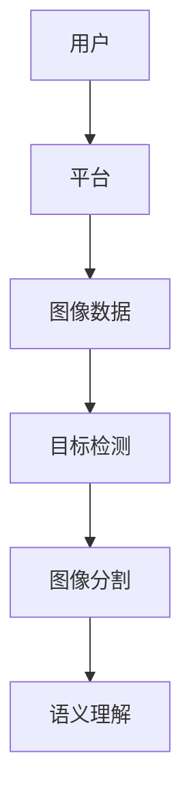
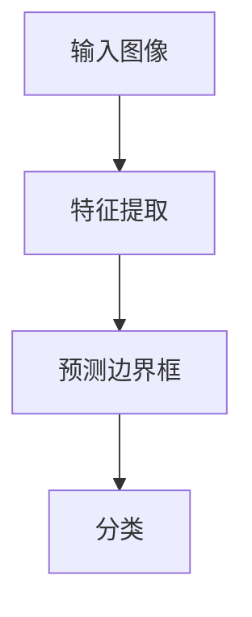
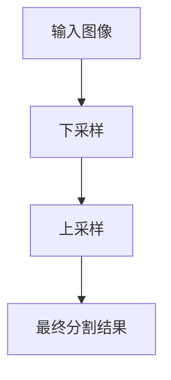
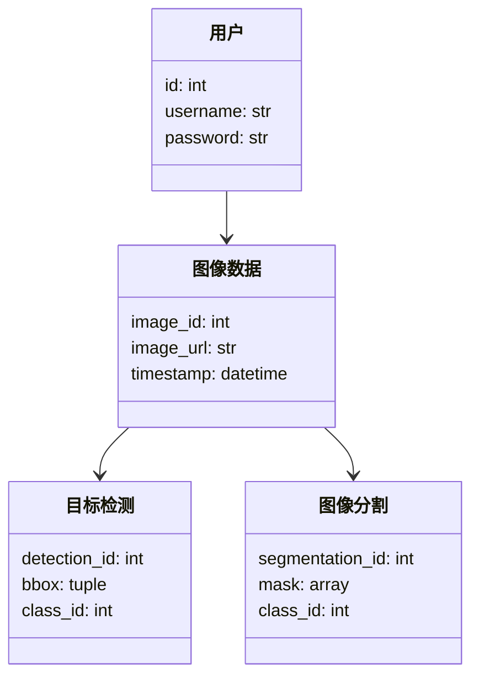
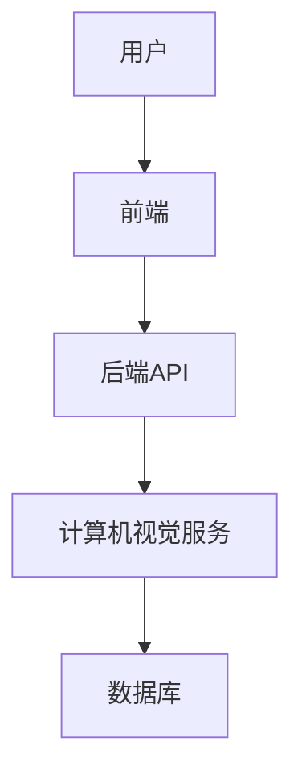
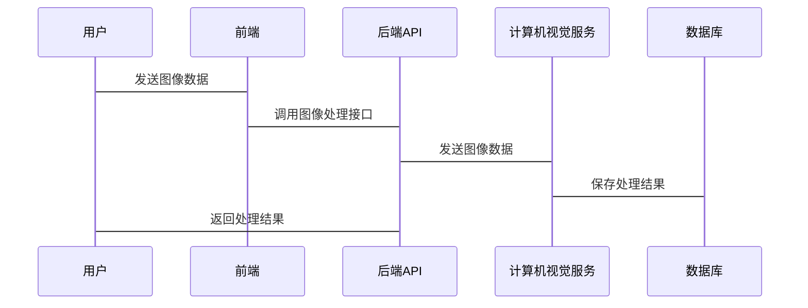

                 


# 构建企业级计算机视觉平台：从质检到安防的全面应用

> 关键词：企业级计算机视觉，目标检测，图像分割，深度学习，系统架构，项目实战

> 摘要：本文将详细探讨企业级计算机视觉平台的构建过程，涵盖从基础概念到核心算法，再到系统设计与项目实战的各个方面。通过分析计算机视觉的核心技术，如目标检测和图像分割，结合深度学习算法，构建企业级平台的应用场景。本文旨在为企业技术负责人和开发人员提供全面的技术指导和实践参考。

---

# 第一部分: 企业级计算机视觉平台的背景与基础

## 第1章: 计算机视觉概述

### 1.1 计算机视觉的定义与核心概念
- **1.1.1 计算机视觉的定义**  
  计算机视觉（Computer Vision）是人工智能领域的一个重要分支，旨在通过计算机模拟人类的视觉系统，对图像或视频进行分析、理解和处理，以获取有用的信息。其核心目标是让计算机“看懂”图像或视频内容。

- **1.1.2 计算机视觉的核心技术**  
  计算机视觉的核心技术包括图像处理、目标检测、图像分割、目标跟踪、光学字符识别（OCR）等。这些技术共同构成了计算机视觉的能力体系。

- **1.1.3 计算机视觉的应用场景**  
  计算机视觉在多个领域有广泛应用，包括但不限于图像识别、视频监控、医学影像分析、自动驾驶、机器人视觉等。

### 1.2 企业级计算机视觉平台的背景
- **1.2.1 企业级应用的需求分析**  
  在企业级应用中，计算机视觉的需求主要集中在工业质检、安防监控、智能物流等领域。这些场景需要高效、准确的视觉处理能力，以提升生产效率和安全性。

- **1.2.2 计算机视觉在企业中的应用现状**  
  当前，许多企业已经在工业质检、安防监控等领域引入了计算机视觉技术。然而，这些应用往往局限于单点功能，缺乏统一的平台化架构，难以满足企业级应用的复杂需求。

- **1.2.3 企业级计算机视觉平台的意义**  
  构建企业级计算机视觉平台，能够整合多种计算机视觉技术，实现统一的系统架构和功能模块化设计，为企业提供高效的解决方案。

---

## 第2章: 计算机视觉的核心技术基础

### 2.1 图像处理基础
- **2.1.1 图像的基本概念**  
  图像是计算机视觉的基本处理对象，通常以矩阵形式表示。常见的图像格式包括RGB和灰度图。

- **2.1.2 常见图像处理算法**  
  常见的图像处理算法包括图像增强、边缘检测、图像分割等。这些算法为后续的目标检测和图像理解提供了基础。

### 2.2 目标检测与识别
- **2.2.1 目标检测的定义**  
  目标检测是计算机视觉中的一个核心任务，旨在在图像中定位和识别目标物体的位置和类别。

- **2.2.2 常见目标检测算法**  
  常见的目标检测算法包括YOLO、Faster R-CNN等。这些算法在企业级应用中具有广泛的应用。

### 2.3 图像分割与语义理解
- **2.3.1 图像分割的定义**  
  图像分割是将图像划分为多个区域，每个区域具有相似的语义属性。

- **2.3.2 常见图像分割算法**  
  常见的图像分割算法包括U-Net、FCN等。这些算法在医学影像分析、自动驾驶等领域有广泛应用。

### 2.4 深度学习在计算机视觉中的应用
- **2.4.1 深度学习的基本概念**  
  深度学习是一种基于人工神经网络的机器学习方法，通过多层非线性变换提取数据的高层次特征。

- **2.4.2 深度学习在计算机视觉中的应用**  
  深度学习在目标检测、图像分割等领域表现出色，已经成为现代计算机视觉的核心技术。

---

# 第二部分: 企业级计算机视觉平台的核心概念与联系

## 第3章: 计算机视觉的核心概念原理

### 3.1 目标检测算法原理
- **3.1.1 YOLO算法原理**  
  YOLO是一种单阶段目标检测算法，通过将目标检测问题转化为回归问题，实现了高效的实时检测。

- **3.1.2 Faster R-CNN算法原理**  
  Faster R-CNN是一种两阶段目标检测算法，通过RPN网络生成候选框，再通过RoI Pooling提取特征进行分类和回归。

### 3.2 图像分割算法原理
- **3.2.1 U-Net算法原理**  
  U-Net是一种经典的图像分割算法，通过跳跃连接实现特征的多尺度融合，广泛应用于医学影像分割。

- **3.2.2 Mask R-CNN算法原理**  
  Mask R-CNN在Faster R-CNN的基础上增加了用于实例分割的分支，能够同时输出目标的边界框、类别和分割掩膜。

## 第4章: 核心概念与联系

### 4.1 计算机视觉核心概念对比
- **4.1.1 目标检测与图像分割的对比**  
  | 对比维度 | 目标检测 | 图像分割 |
  |----------|----------|----------|
  | 任务目标 | 定位目标物体 | 划分图像区域 |
  | 输出形式 | 边界框和类别 | 分割掩膜 |

### 4.2 ER实体关系图架构


---

# 第三部分: 算法原理讲解

## 第5章: 常见算法的原理与实现

### 5.1 YOLO目标检测算法


- **YOLO算法流程图**  
  YOLO通过将图像输入到一个深度神经网络中，提取特征后预测目标的边界框和类别。

- **YOLO的数学模型**  
  YOLO的损失函数包括分类损失、定位损失和置信度损失：
  $$
  \text{损失} = \lambda_{\text{cls}} \cdot \text{cls\_loss} + \lambda_{\text{loc}} \cdot \text{loc\_loss} + \lambda_{\text{conf}} \cdot \text{conf\_loss}
  $$

### 5.2 U-Net图像分割算法


- **U-Net算法流程图**  
  U-Net通过跳跃连接实现特征的多尺度融合，能够有效捕捉图像细节。

- **U-Net的数学模型**  
  U-Net的编码器部分通过卷积操作提取特征，解码器部分通过反卷积操作恢复图像分辨率。

---

## 第6章: 算法实现与优化

### 6.1 算法实现
- **YOLO实现**  
  ```python
  import torch
  import torch.nn as nn

  class YOLO(nn.Module):
      def __init__(self):
          super(YOLO, self).__init__()
          # 定义网络结构
          self.backbone = ...
          self.head = ...
      def forward(self, x):
          features = self.backbone(x)
          outputs = self.head(features)
          return outputs
  ```

- **U-Net实现**  
  ```python
  class UNet(nn.Module):
      def __init__(self, in_channels=3, out_channels=1):
          super(UNet, self).__init__()
          self.encoder = ...
          self.decoder = ...
      def forward(self, x):
          features = self.encoder(x)
          outputs = self.decoder(features)
          return outputs
  ```

### 6.2 算法优化
- **模型优化**  
  使用模型剪枝、知识蒸馏等技术优化模型的计算效率。

- **训练优化**  
  使用学习率衰减、批量归一化等技术提升训练效率和模型性能。

---

# 第四部分: 系统分析与架构设计方案

## 第7章: 系统分析与架构设计

### 7.1 问题场景介绍
- **工业质检场景**  
  在工业生产中，计算机视觉可以用于自动检测产品的缺陷，提升质检效率和准确性。

- **安防监控场景**  
  在安防监控中，计算机视觉可以用于实时监控视频流，实现人脸识别、行为分析等功能。

### 7.2 系统功能设计


### 7.3 系统架构设计


### 7.4 系统接口设计
- **API接口**  
  ```
  POST /api/v1/image/process
  Body: {
      "image": "base64字符串",
      "task_type": "detection" | "segmentation"
  }
  ```

### 7.5 系统交互设计


---

# 第五部分: 项目实战

## 第8章: 项目实战

### 8.1 环境搭建
- **安装依赖**  
  ```
  pip install torch torchvision numpy matplotlib
  ```

### 8.2 核心代码实现
- **YOLO实现**  
  ```python
  import torch
  import torch.nn as nn
  import torch.nn.functional as F

  class YOLO(nn.Module):
      def __init__(self):
          super(YOLO, self).__init__()
          self.conv1 = nn.Conv2d(3, 16, kernel_size=3, stride=1, padding=1)
          self.pool1 = nn.MaxPool2d(kernel_size=2, stride=2)
          self.conv2 = nn.Conv2d(16, 32, kernel_size=3, stride=1, padding=1)
          self.pool2 = nn.MaxPool2d(kernel_size=2, stride=2)
          self.conv3 = nn.Conv2d(32, 64, kernel_size=3, stride=1, padding=1)
          self.pool3 = nn.MaxPool2d(kernel_size=2, stride=2)
          self.fc = nn.Linear(64 * 4 * 4, 120)
          self.classifier = nn.Linear(120, 10)

      def forward(self, x):
          x = F.relu(self.conv1(x))
          x = self.pool1(x)
          x = F.relu(self.conv2(x))
          x = self.pool2(x)
          x = F.relu(self.conv3(x))
          x = self.pool3(x)
          x = x.view(-1, 64 * 4 * 4)
          x = F.relu(self.fc(x))
          x = self.classifier(x)
          return x
  ```

### 8.3 案例分析
- **工业质检案例**  
  在工业质检中，利用YOLO算法可以实现对产品的缺陷检测，提升质检效率和准确性。

---

# 第六部分: 总结与展望

## 第9章: 总结与展望

### 9.1 总结
- 本文详细探讨了企业级计算机视觉平台的构建过程，涵盖从核心算法到系统设计的各个方面。
- 通过实际案例分析，展示了计算机视觉技术在工业质检和安防监控中的广泛应用。

### 9.2 展望
- 未来，随着深度学习技术的不断发展，企业级计算机视觉平台将更加智能化和高效化。
- 在实际应用中，需要进一步优化算法性能，提升系统的可扩展性和易用性。

---

# 作者信息

作者：AI天才研究院/AI Genius Institute & 禅与计算机程序设计艺术 /Zen And The Art of Computer Programming

