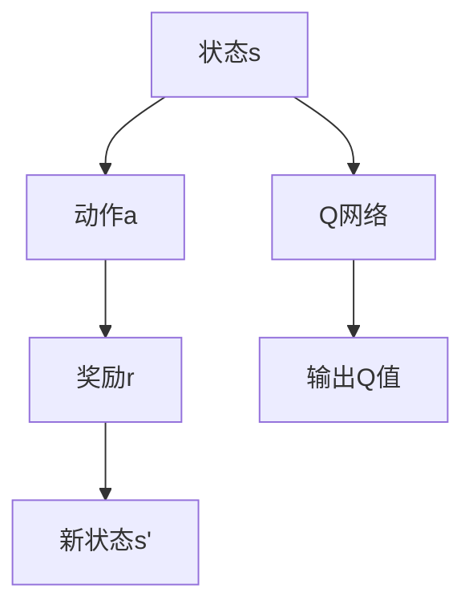
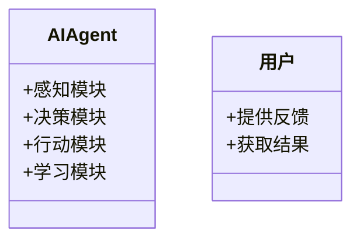
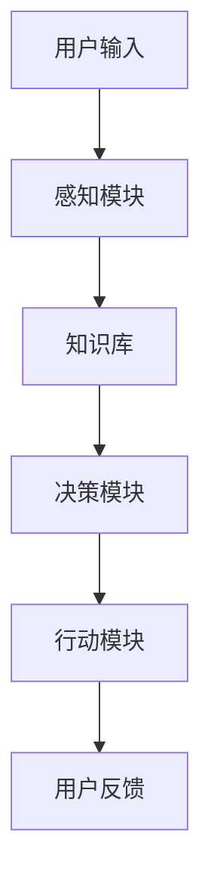

                 


# 《构建具有人机协作学习能力的AI Agent系统》

> 关键词：人机协作学习，AI Agent，强化学习，协作学习算法，系统设计，项目实战

> 摘要：本文将详细介绍如何构建一个具有人机协作学习能力的AI Agent系统。从人机协作学习的定义和核心概念出发，逐步深入探讨协作学习的算法原理、系统架构设计、项目实现与优化等关键环节。通过具体案例分析，帮助读者掌握构建此类系统的方法和技巧，为实际应用提供理论支持和实践指导。

---

## 第1章: 人机协作学习与AI Agent系统背景

### 1.1 人机协作学习的定义与特点

人机协作学习是一种结合了人工智能与人类智慧的学习模式，旨在通过人与机器的协同合作，实现知识的共同构建和优化。其核心在于利用人类的主观能动性和机器的高效处理能力，形成一种互补的学习机制。

#### 1.1.1 人机协作学习的定义

人机协作学习是指人与机器共同参与学习过程，通过交互、反馈和优化，实现知识的共同进步。与传统的机器学习或人类学习不同，人机协作学习强调两者的协同作用，形成一种动态的知识构建过程。

#### 1.1.2 人机协作学习的核心特点

- **动态性**：人机协作学习是一个动态的过程，人类和机器在交互中不断调整学习策略。
- **互补性**：人类的主观判断和机器的高效计算能力相互补充，形成更强大的学习能力。
- **实时性**：学习过程可以实时进行反馈和优化，适应环境的变化。

#### 1.1.3 人机协作学习的边界与外延

人机协作学习的边界在于人与机器的交互深度和学习目标的复杂度。外延则包括从简单的知识问答到复杂的决策支持系统。

### 1.2 AI Agent系统的定义与组成

AI Agent（智能体）是一种能够感知环境、做出决策并执行动作的实体。它通过与环境的交互，实现特定的目标。

#### 1.2.1 AI Agent的基本定义

AI Agent是一种具有感知、决策和行动能力的智能实体，能够独立或协作完成特定任务。

#### 1.2.2 AI Agent的核心要素组成

- **感知模块**：获取环境中的信息。
- **决策模块**：基于感知信息做出决策。
- **行动模块**：执行决策动作。
- **学习模块**：通过学习优化自身能力。

#### 1.2.3 AI Agent与传统AI的区别

AI Agent强调自主性和动态性，能够根据环境变化实时调整行为，而传统AI更多关注特定任务的解决。

### 1.3 人机协作学习在AI Agent中的作用

人机协作学习通过结合人类的主观判断和机器的高效计算，提升AI Agent的学习能力，使其能够更好地适应复杂环境。

#### 1.3.1 人机协作学习的背景与问题背景

传统AI Agent的学习能力有限，难以处理复杂的人类协作任务，而人机协作学习为解决这一问题提供了新的思路。

#### 1.3.2 人机协作学习的目标与问题描述

目标是构建一种能够与人类协同学习的AI Agent，使其在复杂任务中表现出更强的能力。

#### 1.3.3 人机协作学习的实现与问题解决

通过设计协作学习算法，AI Agent能够在与人类的交互中不断优化自身的知识库和决策能力。

### 1.4 本章小结

本章介绍了人机协作学习的定义、特点，以及AI Agent的核心组成和作用，为后续章节的深入探讨奠定了基础。

---

## 第2章: 人机协作学习的核心概念与联系

### 2.1 协作学习的机制与原理

协作学习是一种通过多方协作来优化学习效果的机制，其核心在于信息的共享与知识的共同构建。

#### 2.1.1 协作学习的基本原理

协作学习通过多方的信息共享和知识整合，实现更高效的学习效果。

#### 2.1.2 协作学习的数学模型与公式

协作学习的数学模型可以通过信息融合的方式表示，例如：

$$ I_{total} = \sum_{i=1}^{n} w_i I_i $$

其中，$I_i$表示第i个学习主体的信息量，$w_i$是其权重。

#### 2.1.3 协作学习的实现算法

常用的协作学习算法包括基于权重的信息融合算法和基于投票的决策算法。

### 2.2 人机协作学习与AI Agent的关联

人机协作学习通过与AI Agent的结合，实现更高效的知识构建和任务执行。

#### 2.2.1 协作学习在AI Agent中的应用

AI Agent可以通过与人类的协作学习，优化自身的知识库和决策策略。

#### 2.2.2 协作学习与AI Agent系统的结合

协作学习为AI Agent提供了更强大的学习能力，使其能够更好地适应复杂环境。

### 2.3 核心概念属性特征对比表

以下是协作学习与传统学习的核心属性对比：

| 属性 | 协作学习 | 传统学习 |
|------|---------|----------|
| 主体 | 人与机器 | 人或机器 |
| 目标 | 共同优化 | 单一优化 |
| 方法 | 协同合作 | 独立完成 |

### 2.4 ER实体关系图

以下是协作学习的ER实体关系图：

```mermaid
erDiagram
    actor(AI Agent) {
        role 用户
        role 机器
    }
    knowledge_base<---has-->AI Agent
    knowledge_base<---has-->user
```

### 2.5 本章小结

本章通过对比和分析，明确了协作学习的核心概念及其在AI Agent中的应用，为后续算法设计奠定了基础。

---

## 第3章: 人机协作学习算法原理

### 3.1 强化学习算法

强化学习是一种通过奖励机制优化决策策略的学习方法。

#### 3.1.1 Q-learning算法

Q-learning是一种经典的强化学习算法，通过状态-动作价值函数优化决策策略。

公式表示为：

$$ Q(s,a) = Q(s,a) + \alpha [r + \gamma \max Q(s',a') - Q(s,a)] $$

#### 3.1.2 Deep Q-Network算法

Deep Q-Network通过深度神经网络近似Q函数，提升算法的表达能力。

流程图如下：



### 3.2 监督学习算法

监督学习通过标签数据训练模型，实现分类或回归任务。

#### 3.2.1 回归算法

回归算法通过最小化预测值与真实值的差值，优化模型参数。

公式表示为：

$$ y = \beta x + \epsilon $$

#### 3.2.2 分类算法

分类算法通过训练分类器，实现对数据的分类任务。

### 3.3 协作学习算法的实现

协作学习算法通过多主体的协同优化，实现更高效的决策。

#### 3.3.1 算法的实现步骤

1. 初始化知识库。
2. 人机交互获取信息。
3. 更新知识库。
4. 优化决策策略。

#### 3.3.2 算法的代码实现

以下是协作学习算法的Python代码示例：

```python
def collaborative_learning(agent, user):
    while True:
        # 人类提供反馈
        feedback = user.get_feedback()
        # 机器更新知识库
        agent.update_knowledge_base(feedback)
        # 机器优化决策
        agent.optimize_policy()
```

### 3.4 本章小结

本章详细介绍了强化学习和监督学习的算法原理，并展示了协作学习算法的实现步骤和代码示例。

---

## 第4章: 人机协作学习的系统分析与架构设计

### 4.1 系统功能设计

#### 4.1.1 领域模型设计

领域模型描述了系统的核心功能模块和交互流程。

领域模型图如下：



#### 4.1.2 功能模块划分

系统功能模块包括：

1. 感知模块：获取环境信息。
2. 决策模块：基于知识库做出决策。
3. 行动模块：执行决策动作。
4. 学习模块：优化知识库。

#### 4.1.3 系统功能流程图

系统功能流程图如下：



### 4.2 系统架构设计

#### 4.2.1 系统架构的定义

系统架构描述了系统各模块之间的交互关系。

#### 4.2.2 系统架构的实现

系统架构图如下：


#### 4.2.3 系统架构的优缺点分析

优点：模块化设计便于维护和扩展。缺点：模块之间的交互可能导致通信开销。

### 4.3 本章小结

本章通过系统功能设计和架构设计，明确了AI Agent系统的实现方案。

---

## 第5章: 人机协作学习的项目实战

### 5.1 项目介绍

本项目旨在构建一个具有人机协作学习能力的教育辅助AI Agent。

### 5.2 环境安装

需要安装以下工具和库：

- Python 3.8+
- NumPy
- TensorFlow
- matplotlib

### 5.3 系统核心实现源代码

以下是AI Agent的核心实现代码：

```python
class AI_Agent:
    def __init__(self):
        self.knowledge_base = {}  # 知识库
        self.learning_rate = 0.1  # 学习率

    def perceive(self, input_data):
        # 感知模块
        return input_data

    def decide(self, input_data):
        # 决策模块
        return self.knowledge_base.get(input_data, None)

    def act(self, action):
        # 行动模块
        pass

    def learn(self, feedback):
        # 学习模块
        pass
```

### 5.4 代码应用解读与分析

代码解读：

1. `perceive`方法：处理输入数据，返回感知结果。
2. `decide`方法：基于知识库做出决策。
3. `learn`方法：根据反馈更新知识库。

### 5.5 实际案例分析和详细讲解剖析

通过具体案例分析，展示AI Agent在教育辅助中的应用。

### 5.6 项目小结

本章通过项目实战，详细展示了AI Agent系统的实现过程和应用案例。

---

## 第6章: 总结与展望

### 6.1 总结

本文详细介绍了人机协作学习的理论基础、算法实现和系统设计，为构建具有人机协作学习能力的AI Agent系统提供了理论支持和实践指导。

### 6.2 展望

未来，随着人工智能技术的不断发展，人机协作学习将在更多领域得到广泛应用。

### 6.3 最佳实践 tips

- 确保系统的可扩展性和可维护性。
- 定期更新知识库，保持系统的先进性。
- 优化算法，提升系统的效率。

### 6.4 注意事项

- 避免过度依赖机器，保持人类的主观判断能力。
- 注意数据隐私和安全问题。

### 6.5 拓展阅读

推荐阅读相关领域的最新研究成果，如多智能体协作学习和强化学习的前沿技术。

---

## 作者：AI天才研究院 & 禅与计算机程序设计艺术

---

通过本文的系统介绍，读者可以全面掌握人机协作学习的理论和实践，为构建更智能的AI Agent系统奠定坚实基础。

