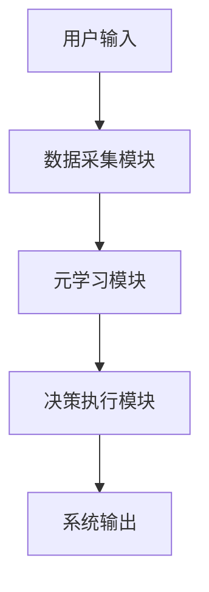

                 


# 构建具有元学习能力的AI Agent

> 关键词：元学习、AI Agent、人工智能、机器学习、算法原理、系统架构、项目实战

> 摘要：本文系统地介绍如何构建具有元学习能力的AI Agent，涵盖元学习的基本概念、AI Agent的核心功能、元学习算法的数学模型、系统架构设计以及项目实战。通过详细讲解和实例分析，帮助读者掌握元学习AI Agent的设计与实现。

---

# 第一部分: 元学习与AI Agent基础

## 第1章: 元学习与AI Agent概述

### 1.1 元学习的基本概念
- **1.1.1 元学习的定义与背景**
  - 元学习（Meta-Learning）的定义
  - 元学习的背景与研究意义
- **1.1.2 元学习的核心特点**
  - 快速适应新任务
  - 少样本学习能力
  - 跨任务迁移能力
- **1.1.3 元学习与传统机器学习的对比**
  - 数据需求的差异
  - 算法复杂度的对比
  - 适应性的差异

### 1.2 AI Agent的基本概念
- **1.2.1 AI Agent的定义与分类**
  - AI Agent的定义
  - 基于智能水平的分类
  - 基于应用场景的分类
- **1.2.2 AI Agent的核心功能**
  - 感知环境
  - 制定策略
  - 执行操作
- **1.2.3 AI Agent的应用场景**
  - 智能助手
  - 自动驾驶
  - 智能推荐系统

### 1.3 元学习在AI Agent中的作用
- **1.3.1 元学习如何提升AI Agent的智能**
  - 快速适应新环境
  - 跨任务学习能力
  - 提高决策的灵活性
- **1.3.2 元学习AI Agent的优势**
  - 降低对大量标注数据的依赖
  - 提高学习效率
  - 增强泛化能力
- **1.3.3 元学习AI Agent的未来发展趋势**
  - 更强的遷移学习能力
  - 更高的智能化水平
  - 更广泛的应用场景

## 1.4 本章小结

---

# 第二部分: 元学习的核心概念与联系

## 第2章: 元学习的核心原理

### 2.1 元学习的数学模型与优化方法
- **2.1.1 元学习的数学模型**
  - 元学习的总体架构
  - 元学习的参数优化目标
- **2.1.2 元学习的优化方法**
  - 基于梯度的优化
  - 基于动量的优化
  - 自适应学习率优化

### 2.2 元学习与传统机器学习的对比
- **2.2.1 传统机器学习的特点**
  - 数据需求高
  - 适应性差
  - 算法复杂度低
- **2.2.2 元学习的特点**
  - 数据需求低
  - 适应性强
  - 算法复杂度高

### 2.3 元学习的核心概念属性对比表格
| 概念 | 传统机器学习 | 元学习 |
|------|--------------|--------|
| 数据需求 | 需要大量标注数据 | 适用于小样本数据 |
| 适应性 | 适应特定任务 | 具备跨任务适应性 |
| 算法复杂度 | 算法简单 | 算法复杂，需多层优化 |

### 2.4 元学习的ER实体关系图
```mermaid
er
actor: 元学习系统
role: 元学习算法
```

## 2.5 本章小结

---

# 第三部分: 元学习AI Agent的算法原理

## 第3章: 元学习算法原理

### 3.1 元学习算法的核心流程
- **3.1.1 元学习算法的基本流程**
  - 元训练阶段
  - 任务适应阶段
- **3.1.2 元学习算法的数学模型**
  - 基于梯度的元学习算法
  - 基于模型的元学习算法

### 3.2 元学习算法的实现细节
- **3.2.1 基于梯度的元学习算法**
  - 梯度计算方法
  - 梯度更新策略
- **3.2.2 基于模型的元学习算法**
  - 模型构建方法
  - 模型更新策略

### 3.3 元学习算法的数学公式与实现
- **3.3.1 元学习算法的数学公式**
  - 梯度下降法
  - 动量优化法
  - 自适应学习率优化
- **3.3.2 元学习算法的Python实现示例**
  ```python
  import torch

  def meta_learning_algorithm():
      # 元学习的参数初始化
      meta_params = torch.randn(100, 100)
      # 元学习的优化目标
      meta_objective = ...
      # 梯度计算
      meta_grads = torch.autograd.grad(meta_objective, meta_params)
      # 参数更新
      with torch.no_grad():
          meta_params = meta_params - learning_rate * meta_grads
      return meta_params

  if __name__ == "__main__":
      meta_learning_algorithm()
  ```

## 3.4 本章小结

---

# 第四部分: 元学习AI Agent的系统架构设计

## 第4章: 元学习AI Agent的系统架构

### 4.1 元学习AI Agent的应用场景
- **4.1.1 智能助手**
  - 任务描述
  - 系统功能
- **4.1.2 自动驾驶**
  - 任务描述
  - 系统功能
- **4.1.3 智能推荐系统**
  - 任务描述
  - 系统功能

### 4.2 元学习AI Agent的系统功能设计
- **4.2.1 系统功能模块**
  - 数据采集模块
  - 元学习模块
  - 决策执行模块
- **4.2.2 系统功能流程**
  - 数据采集与预处理
  - 元学习模型训练
  - 任务适应与决策执行

### 4.3 元学习AI Agent的系统架构图


## 4.4 本章小结

---

# 第五部分: 元学习AI Agent的项目实战

## 第5章: 元学习AI Agent的实现与案例分析

### 5.1 项目环境安装与配置
- **5.1.1 安装必要的库**
  - Python
  - PyTorch
  - numpy
  - matplotlib
- **5.1.2 配置开发环境**
  - 安装虚拟环境
  - 配置IDE

### 5.2 系统核心功能的实现
- **5.2.1 数据采集模块的实现**
  ```python
  import numpy as np

  def collect_data():
      # 数据采集逻辑
      data = np.random.randn(100, 100)
      return data

  collect_data()
  ```
- **5.2.2 元学习模块的实现**
  ```python
  import torch

  def meta_learning_module(data):
      # 元学习模型训练逻辑
      model = torch.nn.Linear(100, 100)
      criterion = torch.nn.MSELoss()
      optimizer = torch.optim.Adam(model.parameters(), lr=0.001)
      optimizer.zero_grad()
      outputs = model(data)
      loss = criterion(outputs, data)
      loss.backward()
      optimizer.step()
      return model

  meta_learning_module(data)
  ```

### 5.3 项目案例分析与解读
- **5.3.1 案例分析**
  - 数据分析
  - 算法选择
  - 实验结果
- **5.3.2 代码解读与分析**
  - 关键代码的功能
  - 算法实现的细节
  - 实验结果的解读

## 5.4 本章小结

---

# 第六部分: 总结与展望

## 第6章: 元学习AI Agent的总结与展望

### 6.1 本章内容总结
- 元学习的基本概念
- 元学习AI Agent的核心功能
- 元学习算法的实现细节
- 元学习AI Agent的系统架构设计
- 元学习AI Agent的项目实战

### 6.2 元学习AI Agent的未来展望
- 更强大的遷移学习能力
- 更高的智能化水平
- 更广泛的应用场景

### 6.3 最佳实践 tips
- 确保数据质量
- 合理选择算法
- 定期更新模型
- 注重系统优化

### 6.4 注意事项
- 数据隐私保护
- 算法的可解释性
- 系统的稳定性

### 6.5 拓展阅读
- 推荐书籍：《深度学习》
- 推荐论文：《Meta-Learning via Thompson Sampling for Bayesian Neural Networks》

## 6.6 本章小结

---

# 作者：AI天才研究院/AI Genius Institute & 禅与计算机程序设计艺术 /Zen And The Art of Computer Programming

