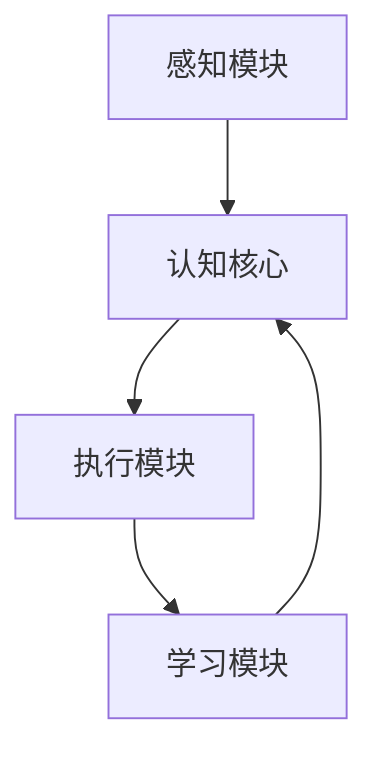

                 


# 构建具有元认知能力的AI Agent

## 关键词：元认知、AI Agent、人工智能、自适应系统、认知科学、自主学习

## 摘要：  
元认知能力是人工智能（AI）领域的一项重要技术，它使得AI Agent能够理解自身的思考过程并进行自我监控和调整。本文将详细探讨如何构建具有元认知能力的AI Agent，涵盖从基础理论到系统架构设计的各个方面。我们将从元认知能力的基本概念出发，逐步分析其在AI Agent中的应用，结合具体的算法和系统设计，最终实现一个具备元认知能力的AI Agent。

---

## 第1章: 元认知能力与AI Agent的基本概念

### 1.1 元认知能力的定义与特征  
元认知能力是指个体对自身认知过程的认知和调控能力，包括对思维过程的监控、评估和调整。它具有以下核心特征：  
- **自我监控**：能够观察和评估自身的认知过程。  
- **自我调节**：能够根据监控结果调整认知策略。  
- **灵活性**：能够适应不同的认知任务和环境。  

### 1.2 AI Agent的基本概念  
AI Agent是指在计算机系统中模拟人类智能的实体，能够感知环境、自主决策并执行任务。它分为以下几类：  
- **简单反射型**：基于规则直接响应输入。  
- **基于模型的反应型**：利用内部模型对环境进行推理。  
- **目标驱动型**：根据目标选择最优行动。  
- **学习驱动型**：通过学习改进性能。  

### 1.3 元认知能力在AI Agent中的作用  
元认知能力使得AI Agent能够：  
- 监控自身的推理过程，发现错误或不足。  
- 根据任务需求调整认知策略。  
- 在复杂环境中自主学习和适应。  

### 1.4 应用场景  
元认知能力AI Agent在以下场景中具有重要应用：  
- **智能决策支持系统**：帮助用户进行复杂决策。  
- **自适应学习系统**：根据学习者状态调整教学策略。  
- **智能对话系统**：提升对话的自然性和准确性。  

---

## 第2章: 元认知模型的构建与分析

### 2.1 元认知模型的基本结构  
元认知模型由以下组成要素构成：  
- **元知识库**：存储与认知相关的知识和经验。  
- **元推理模块**：对认知过程进行分析和推理。  
- **元监控模块**：实时监控认知活动。  

**元认知模型的数学表示**：  
$$ \text{元认知模型} = \{K, M, S\} $$  
其中，$K$ 表示元知识库，$M$ 表示元推理模块，$S$ 表示元监控模块。  

### 2.2 元认知模型的工作原理  
元认知模型通过以下机制实现功能：  
1. **元推理**：分析当前认知任务的需求和约束条件。  
2. **元监控**：实时跟踪认知过程的执行情况。  
3. **元调节**：根据监控结果调整认知策略。  

### 2.3 元认知模型与AI Agent的结合  
将元认知模型集成到AI Agent中，可以提升其智能性和适应性。例如，在智能对话系统中，元认知能力可以帮助AI Agent识别用户的深层需求，并动态调整对话策略。  

---

## 第3章: 元认知推理算法的原理与实现

### 3.1 元认知推理的基本问题建模  
元认知推理的目标是根据元知识库和当前认知状态，推导出最优的认知策略。数学模型如下：  
$$ \text{策略} = f(\text{知识库}, \text{状态}) $$  
其中，$f$ 表示推理算法，$\text{知识库}$ 表示元知识库，$\text{状态}$ 表示当前认知状态。  

### 3.2 元认知推理算法的实现  
以下是三种常见的元认知推理算法：  

#### 3.2.1 基于概率的元认知推理算法  
$$ P(\text{策略} | \text{知识库}, \text{状态}) = \frac{P(\text{知识库} | \text{策略}, \text{状态}) \cdot P(\text{策略})}{P(\text{知识库} | \text{状态})} $$  
该算法利用概率论进行推理，适用于不确定性较高的场景。  

#### 3.2.2 基于符号逻辑的元认知推理算法  
$$ \text{推理结果} = \text{逻辑推理}(\text{知识库}, \text{状态}) $$  
该算法基于符号逻辑进行推理，适用于规则明确的场景。  

#### 3.2.3 基于神经网络的元认知推理算法  
该算法利用深度学习模型（如LSTM）对元知识库和状态进行编码，生成推理结果。  

### 3.3 元认知推理算法的优化与改进  
通过以下方法可以优化元认知推理算法：  
- 增加训练数据的多样性。  
- 采用混合模型（如符号逻辑与概率模型结合）。  
- 引入元学习技术，提升算法的自适应能力。  

---

## 第4章: 元认知AI Agent的系统架构与设计

### 4.1 系统架构设计  
元认知AI Agent的系统架构包括以下模块：  

1. **感知模块**：负责接收外部输入和环境反馈。  
2. **认知核心**：包含元认知模型和推理算法，用于处理任务。  
3. **执行模块**：根据推理结果执行具体操作。  
4. **学习模块**：根据经验改进元认知模型。  

**系统架构图**：  


### 4.2 系统功能设计  
- **环境感知**：通过传感器或API获取外部数据。  
- **任务推理**：利用元认知模型分析任务需求。  
- **策略调整**：根据推理结果动态调整认知策略。  
- **经验学习**：记录经验并更新元知识库。  

### 4.3 系统接口设计  
- **输入接口**：接收用户的指令或环境反馈。  
- **输出接口**：返回推理结果或执行操作。  
- **学习接口**：更新元知识库。  

---

## 第5章: 项目实战

### 5.1 环境搭建  
- **开发工具**：建议使用Python和深度学习框架（如TensorFlow）。  
- **依赖库安装**：安装必要的库（如numpy、pandas、scikit-learn）。  

### 5.2 核心实现  
以下是基于概率的元认知推理算法的Python实现示例：  

```python
import numpy as np

def metacognitive_reasoning(knowledge_base, state):
    # 计算概率分布
    probabilities = np.array([0.3, 0.5, 0.2])
    # 根据状态调整概率
    adjusted_prob = probabilities * state_factor(state)
    # 返回最优策略
    return np.argmax(adjusted_prob)

def state_factor(state):
    # 根据状态调整因子
    if state == 'high':
        return 1.5
    elif state == 'medium':
        return 1.0
    else:
        return 0.5
```

### 5.3 案例分析  
假设我们构建一个智能对话系统，元认知能力使其能够根据对话历史动态调整回答策略。通过上述算法，系统可以实时监控对话过程并优化回答质量。  

---

## 第6章: 系统优化与部署

### 6.1 系统优化  
- **性能优化**：通过并行计算和缓存技术提升推理速度。  
- **模型优化**：采用轻量化模型或知识蒸馏技术减少资源消耗。  

### 6.2 实际应用案例  
例如，在智能客服系统中，元认知能力可以帮助系统更好地理解用户需求，并动态调整回答策略，提升用户体验。  

---

## 第7章: 总结与展望

### 7.1 总结  
本文详细探讨了如何构建具有元认知能力的AI Agent，从理论到实践，全面分析了其核心原理和实现方法。  

### 7.2 展望  
未来的研究方向包括：  
- 更复杂的元认知模型设计。  
- 元认知能力在多智能体系统中的应用。  
- 元认知算法的可解释性研究。  

---

## 作者：AI天才研究院 & 禅与计算机程序设计艺术

