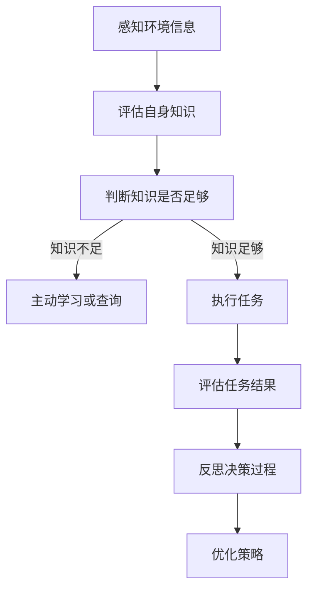
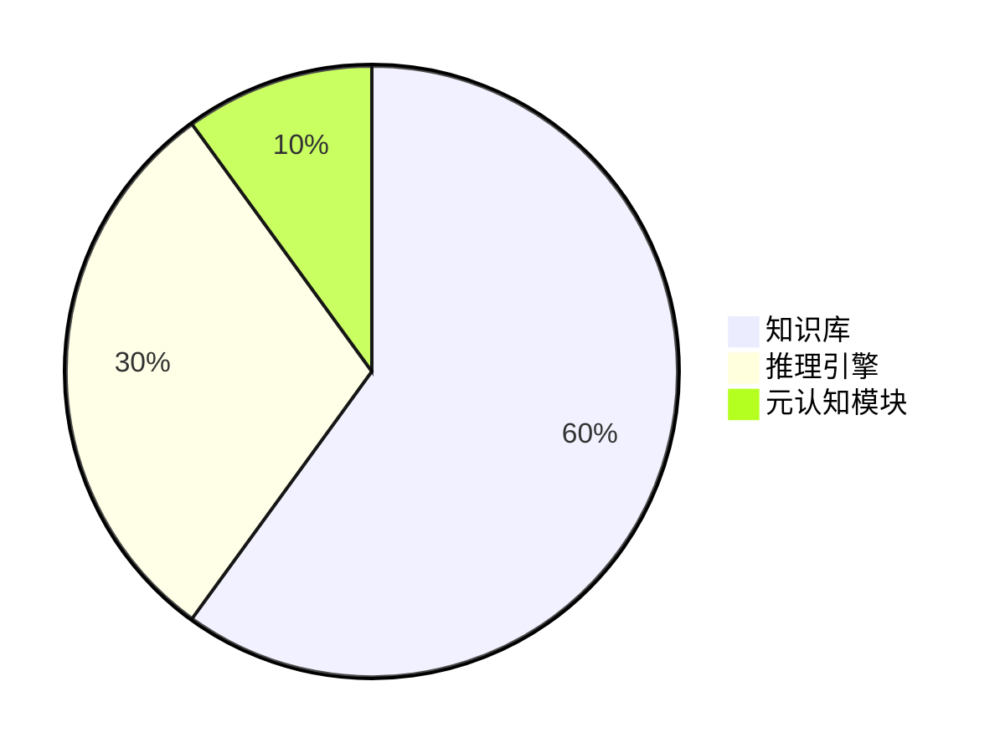
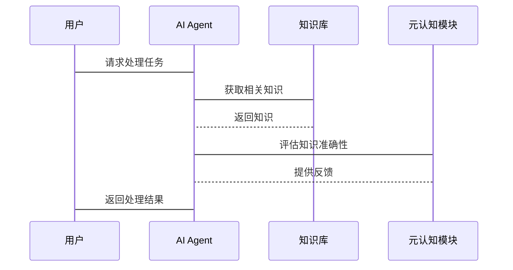

                 


# 构建具有元认知能力的AI Agent

## 关键词：元认知能力，AI Agent，认知模型，算法实现，系统架构

## 摘要：  
本文详细探讨了构建具有元认知能力的AI Agent的关键技术与实现方法。从元认知能力的定义到AI Agent的核心架构，从算法原理到系统设计，从数学模型到项目实战，全面解析了如何赋予AI Agent自我认知与适应能力，使其在复杂场景中实现智能决策。

---

## 第一部分: 元认知与AI Agent的背景介绍

### 第1章: 元认知与AI Agent的核心概念

#### 1.1 元认知能力的定义与特征

##### 1.1.1 元认知能力的定义  
元认知能力是指AI Agent对自身的知识、能力、状态以及外部环境的认知和评估能力。它允许AI Agent在运行过程中反思自己的决策、调整策略并优化行为。

##### 1.1.2 元认知能力的特征  
- **自我评估性**：能够评估自身的知识和能力边界。  
- **适应性**：能够根据环境变化动态调整行为策略。  
- **反思性**：能够分析过去的决策并总结经验教训。  
- **元学习能力**：能够通过元认知能力改进自身的学习算法。

##### 1.1.3 元认知能力与传统AI的区别  
| 特性          | 传统AI             | 具备元认知能力的AI Agent           |
|---------------|--------------------|-------------------------------------|
| 知识更新      | 预先训练的知识库   | 可动态优化知识库                   |
| 行为调整      | 固定的规则或策略   | 可根据反馈调整行为策略             |
| 决策依据      | 硬编码逻辑         | 可根据元认知结果动态调整决策依据   |

---

#### 1.2 AI Agent的基本概念

##### 1.2.1 AI Agent的定义  
AI Agent是一种能够感知环境、自主决策并采取行动的智能实体。它通过传感器获取信息，利用计算模型进行推理，并通过执行器与环境交互。

##### 1.2.2 AI Agent的核心功能  
- **感知**：通过传感器或数据接口获取环境信息。  
- **推理**：基于知识库和推理算法得出可能的解决方案。  
- **决策**：根据推理结果选择最优行动方案。  
- **执行**：通过执行器将决策转化为实际行动。  

##### 1.2.3 AI Agent的分类  
- **简单反射型AI Agent**：基于预设规则直接执行动作。  
- **基于模型的AI Agent**：利用内部模型推理环境状态。  
- **目标驱动型AI Agent**：根据目标选择最优行动。  
- **效用驱动型AI Agent**：基于效用函数优化决策。  

---

#### 1.3 元认知能力在AI Agent中的作用

##### 1.3.1 元认知能力对AI Agent的影响  
元认知能力赋予AI Agent以下能力：  
- 知识管理能力：动态优化知识库的结构和内容。  
- 行为自适应能力：根据环境变化调整行为策略。  
- 任务分解能力：将复杂任务分解为子任务并评估优先级。  

##### 1.3.2 元认知能力在AI Agent中的应用场景  
- **医疗诊断助手**：评估自身诊断的准确性并提出改进建议。  
- **自动驾驶系统**：在极端情况下调整驾驶策略。  
- **智能客服系统**：根据用户反馈优化服务流程。  

##### 1.3.3 元认知能力与AI Agent的结合方式  
- **嵌入式元认知**：将元认知能力直接融入AI Agent的核心算法中。  
- **模块化元认知**：将元认知能力作为独立模块与AI Agent协同工作。  

---

## 第二部分: 元认知能力的算法原理

### 第2章: 元认知能力的算法实现

#### 2.1 元认知能力的算法流程图  


#### 2.2 元认知能力的数学模型  
元认知能力可以通过以下公式表示：  
$$ \text{元认知能力} = f(\text{知识库状态}, \text{环境反馈}, \text{任务目标}) $$  
其中，$f$ 是一个综合评估函数，具体实现依赖于具体的元认知算法。

---

## 第三部分: 元认知能力与AI Agent的系统架构

### 第3章: 系统分析与架构设计

#### 3.1 系统架构图  


#### 3.2 系统功能设计  
- **知识库模块**：存储和管理AI Agent的知识和经验。  
- **推理引擎**：基于知识库和当前输入进行推理。  
- **元认知模块**：评估推理结果并优化后续决策。  

#### 3.3 系统交互设计  


---

## 第四部分: 项目实战

### 第4章: 项目实战

#### 4.1 环境安装  
- 安装Python 3.8+  
- 安装必要的库：numpy、scikit-learn、mermaid  

#### 4.2 核心代码实现  

##### 4.2.1 元认知模块代码  
```python
class MetaCognition:
    def __init__(self):
        self.knowledge_base = {}  # 知识库
        self.performance = {}     # 性能记录

    def assess_knowledge(self, task):
        # 评估知识库是否足以完成任务
        return len(self.knowledge_base.get(task, [])) > 0

    def update_performance(self, task, success):
        # 更新任务执行的性能记录
        self.performance[task] = success

    def optimize_strategy(self):
        # 根据性能记录优化策略
        pass
```

##### 4.2.2 AI Agent代码  
```python
class AI_Agent:
    def __init__(self, meta_cognition):
        self.meta_cognition = meta_cognition
        self.current_task = None

    def process_task(self, task):
        self.current_task = task
        if self.meta_cognition.assess_knowledge(task):
            self.execute_task(task)
        else:
            self.meta_cognition.update_performance(task, False)

    def execute_task(self, task):
        # 具体任务执行逻辑
        pass
```

#### 4.3 案例分析  
假设我们构建一个智能客服AI Agent，当用户提出复杂问题时，AI Agent会通过元认知能力评估自身知识库是否足以解决问题。如果不足，会主动查询外部知识库或请求人类专家协助。

---

## 第五部分: 总结与展望

### 第5章: 总结与展望

#### 5.1 总结  
本文详细探讨了构建具有元认知能力的AI Agent的关键技术，包括元认知能力的定义、算法实现、系统架构以及项目实战。通过实际案例展示了元认知能力在提升AI Agent智能水平中的重要作用。

#### 5.2 展望  
未来的研究方向包括：  
1. 更加复杂的元认知模型。  
2. 元认知能力与多智能体系统的结合。  
3. 元认知能力的可解释性研究。  

---

## 作者：AI天才研究院/AI Genius Institute & 禅与计算机程序设计艺术 /Zen And The Art of Computer Programming

