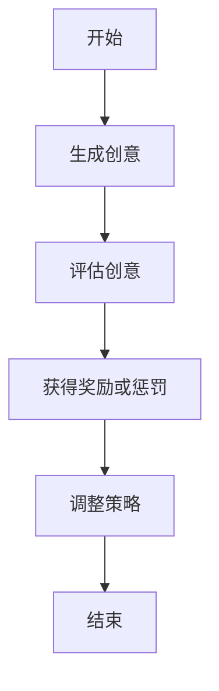
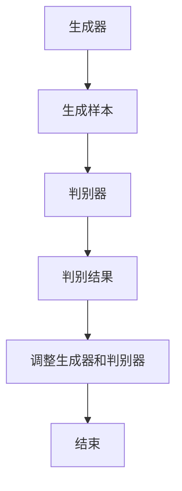
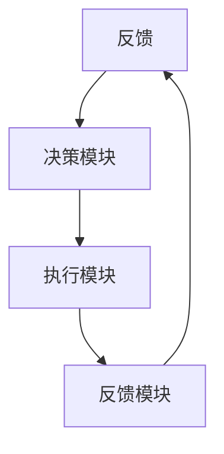
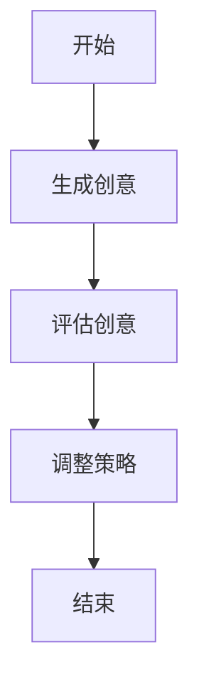

                 


```markdown
# 构建具有创造力的AI Agent

> 关键词：AI Agent，创造力，算法，系统架构，项目实战

> 摘要：本文详细探讨了如何构建具有创造力的AI Agent，从基本概念、创造力的计算模型、系统架构设计到实际项目实现，全面解析了AI Agent的创造力机制和实现方法。

---

# 第一部分: AI Agent的基本概念与背景

## 第1章: AI Agent的基本概念

### 1.1 什么是AI Agent
AI Agent（人工智能代理）是指能够感知环境、自主决策并执行任务的智能实体。AI Agent可以是软件程序、机器人或其他智能系统，其核心目标是通过智能算法和策略来完成特定任务。

### 1.2 AI Agent的特点
AI Agent具有以下特点：
- **自主性**：能够自主决策，无需外部干预。
- **反应性**：能够实时感知环境并做出响应。
- **目标导向**：以目标为导向，优化决策过程。
- **学习能力**：能够通过学习和经验提升性能。

### 1.3 创造力在AI Agent中的重要性
创造力是AI Agent实现复杂任务的核心能力。具备创造力的AI Agent能够生成新的想法、解决方案和创新策略，从而在复杂环境中表现出更强的适应性和智能性。

---

## 第2章: 创造力的定义与计算模型

### 2.1 创造力的定义
创造力是指生成新颖且有价值的想法、解决方案或作品的能力。在AI领域，创造力通常通过算法模拟人类的创造性思维过程。

### 2.2 创造力的计算模型
创造力的计算模型包括以下几种：
- **生成模型**：通过生成新内容（如文本、图像）来体现创造力。
- **强化学习模型**：通过奖励机制优化创造性决策。
- **组合创新模型**：通过组合现有元素生成新的创意。

### 2.3 创造力的评估标准
创造力的评估标准包括：
- **新颖性**：生成的内容是否独特。
- **有用性**：生成的内容是否具有实际价值。
- **多样性**：生成内容的多样性程度。

---

# 第二部分: 创造力的计算模型与算法

## 第3章: 创造力的计算模型

### 3.1 基于强化学习的创造力模型
强化学习是一种通过试错机制优化决策的算法。在创造力模型中，强化学习可以通过奖励机制鼓励生成新颖且有用的内容。



### 3.2 基于生成对抗网络的创造力模型
生成对抗网络（GAN）由生成器和判别器组成，通过对抗训练生成逼真且多样化的内容。



---

## 第4章: 创造力的算法实现

### 4.1 强化学习算法
强化学习算法通过试错机制优化创造性决策。以下是一个简单的强化学习代码示例：

```python
import numpy as np
import gym

env = gym.make('CartPole-v0')
env.seed(42)

policy = np.array([0.5, 0.5])  # 策略参数

for episode in range(1000):
    state = env.reset()
    total_reward = 0
    done = False
    while not done:
        action = np.random.choice([0, 1], p=policy)
        next_state, reward, done, _ = env.step(action)
        total_reward += reward
        # 根据反馈调整策略
        if done:
            policy *= (1 - 0.1) + 0.1
            policy[action] += 0.1
            policy = policy / np.sum(policy)
    print(f'Episode {episode}, Total Reward: {total_reward}')
```

### 4.2 生成对抗网络
生成对抗网络通过生成器和判别器的对抗训练生成多样化的内容。以下是一个简单的GAN代码示例：

```python
import torch
import torch.nn as nn
import torch.optim as optim

# 定义判别器
class Discriminator(nn.Module):
    def __init__(self):
        super().__init__()
        self.model = nn.Sequential(
            nn.Linear(2, 1),
            nn.Sigmoid()
        )
    
    def forward(self, x):
        return self.model(x)

# 定义生成器
class Generator(nn.Module):
    def __init__(self):
        super().__init__()
        self.model = nn.Sequential(
            nn.Linear(1, 2),
            nn.Sigmoid()
        )
    
    def forward(self, x):
        return self.model(x)

discriminator = Discriminator()
generator = Generator()

# 定义损失函数和优化器
criterion = nn.BCELoss()
d_optimizer = optim.SGD(discriminator.parameters(), lr=0.1)
g_optimizer = optim.SGD(generator.parameters(), lr=0.1)

# 训练过程
for epoch in range(100):
    for _ in range(100):
        # 判别器训练
        real_data = torch.randn(100, 1)
        real_label = torch.ones(100, 1)
        
        generated_data = generator(real_data)
        generated_label = torch.zeros(100, 1)
        
        d_loss = criterion(discriminator(real_data), real_label) + \
                 criterion(discriminator(generated_data), generated_label)
        d_optimizer.zero_grad()
        d_loss.backward()
        d_optimizer.step()
        
        # 生成器训练
        generated_data = generator(real_data)
        g_loss = criterion(discriminator(generated_data), real_label)
        g_optimizer.zero_grad()
        g_loss.backward()
        g_optimizer.step()
```

---

# 第三部分: AI Agent的系统架构与设计

## 第5章: AI Agent的系统架构

### 5.1 系统架构设计
AI Agent的系统架构通常包括以下模块：
- **感知模块**：负责感知环境信息。
- **决策模块**：负责生成创意和决策。
- **执行模块**：负责执行任务。

### 5.2 功能模块设计
以下是一个简单的系统架构图：



### 5.3 交互流程
AI Agent的交互流程如下：

1. **感知环境**：通过传感器或数据接口获取环境信息。
2. **生成创意**：基于感知信息生成创意或解决方案。
3. **执行任务**：根据生成的创意执行任务。
4. **反馈调整**：根据执行结果调整策略。

---

## 第6章: 项目实战

### 6.1 环境安装
安装所需的库：
```bash
pip install gym torch
```

### 6.2 核心代码实现
以下是一个简单的AI Agent代码示例：

```python
import gym
import torch
import torch.nn as nn
import torch.optim as optim

# 定义AI Agent模型
class AI-Agent(nn.Module):
    def __init__(self):
        super().__init__()
        self.fc1 = nn.Linear(4, 128)
        self.fc2 = nn.Linear(128, 2)
    
    def forward(self, x):
        x = torch.relu(self.fc1(x))
        x = torch.sigmoid(self.fc2(x))
        return x

# 初始化环境和模型
env = gym.make('CartPole-v0')
model = AI-Agent()
optimizer = optim.Adam(model.parameters(), lr=0.001)
criterion = nn.MSELoss()

# 训练过程
for episode in range(1000):
    state = env.reset()
    total_reward = 0
    done = False
    while not done:
        action_probs = model(torch.FloatTensor(state))
        action = torch.multinomial(action_probs, num_samples=1).item()
        next_state, reward, done, _ = env.step(action)
        total_reward += reward
        # 计算损失并反向传播
        target = torch.tensor([action])
        loss = criterion(action_probs, target)
        optimizer.zero_grad()
        loss.backward()
        optimizer.step()
    print(f'Episode {episode}, Total Reward: {total_reward}')
```

### 6.3 实际案例分析
以下是一个实际案例分析：



---

## 第7章: 最佳实践与小结

### 7.1 小结
本文详细探讨了如何构建具有创造力的AI Agent，从基本概念到算法实现，再到系统设计和项目实战，全面解析了创造力在AI Agent中的应用。

### 7.2 注意事项
- 确保创造力算法的训练数据多样化。
- 定期评估和优化创造力模型。
- 注意创造力模型的计算成本。

### 7.3 拓展阅读
- 《生成对抗网络：从入门到精通》
- 《强化学习：算法与应用》
- 《AI Agent：理论与实践》

---

# 作者：AI天才研究院 & 禅与计算机程序设计艺术

感谢您的阅读！如果对本文有任何疑问或建议，请随时与我们联系。
```

