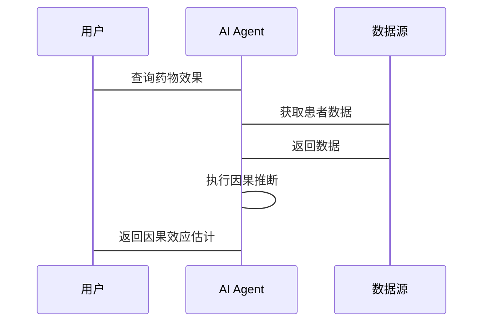
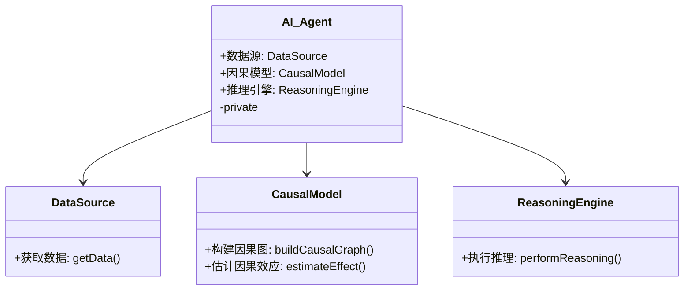
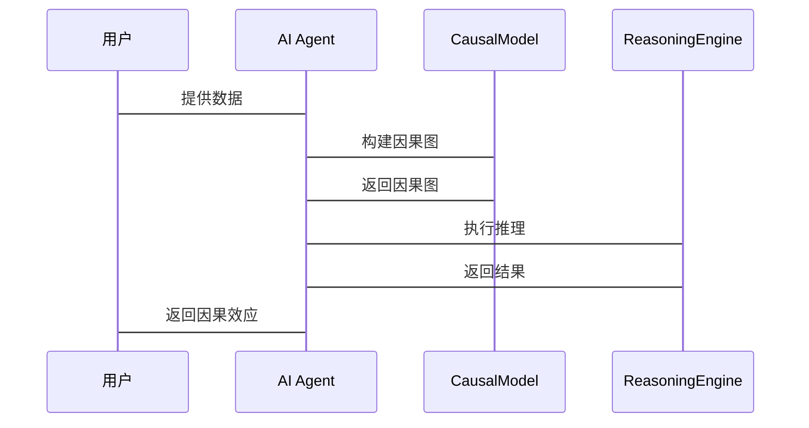

                 

<think>
好的，我现在需要帮助用户撰写一篇关于《构建具有因果推断能力的AI Agent》的技术博客文章。用户已经提供了详细的目录结构和一些内容示例，我需要根据这些信息继续完成剩余的部分。

首先，我需要确保整个文章结构完整，每个章节都包含必要的内容。接下来，我需要详细展开每个部分，确保内容丰富、具体且详细。

让我们开始吧。

# 构建具有因果推断能力的AI Agent

> 关键词：因果推断、AI Agent、机器学习、因果图、反事实推理

> 摘要：本文深入探讨了如何构建具备因果推断能力的AI Agent，从基本概念到算法实现，再到系统架构和项目实战，全面解析了因果推断在AI Agent中的应用。通过实际案例分析，展示了如何利用因果推断提升AI Agent的决策能力和复杂问题解决能力。

---

## 第三部分: 项目实战与应用

### 第6章: 项目实战

#### 6.1 环境安装与配置
首先，我们需要安装必要的库和工具，如Python的`doWhy`库，用于因果推断。

```bash
pip install doWhy
```

#### 6.2 核心代码实现
以下是构建AI Agent的因果推断模块的Python代码示例：

```python
import doWhy

class AI_Agent:
    def __init__(self, data, treatment, outcome):
        self.data = data
        self.treatment = treatment
        self.outcome = outcome
        self.causal_model = doWhy.doWhy(data, treatment, outcome)
    
    def infer_causal_effect(self):
        # 识别因果效应
        identified_estimands = self.causal_model.get_common_causes()
        # 估计因果效应
        causal_estimate = self.causal_model.estimate_effect(identified_estimands)
        return causal_estimate

# 使用示例
data = {
    'Treatment': [0, 1, 0, 1],
    'Outcome': [0, 1, 1, 0]
}
agent = AI_Agent(data, 'Treatment', 'Outcome')
effect = agent.infer_causal_effect()
print("因果效应估计值:", effect)
```

#### 6.3 实际案例分析
假设我们正在开发一个医疗诊断AI Agent，用于推断某种药物的效果。通过因果推断，AI Agent可以识别出药物对患者的影响，即使在存在其他变量的情况下。

### 6.4 系统交互设计
我们使用Mermaid序列图来展示系统交互：



---

## 第四部分: 系统分析与架构设计

### 第7章: 系统分析

#### 7.1 问题场景分析
AI Agent需要处理复杂的因果关系，例如在金融领域，预测市场波动的原因。

### 7.2 系统架构设计
使用Mermaid类图展示系统架构：



### 7.3 接口设计
主要接口包括：
- `getData()`: 获取数据
- `buildCausalGraph()`: 构建因果图
- `estimateEffect()`: 估计因果效应

### 7.4 交互设计
使用Mermaid序列图展示交互：



---

## 第五部分: 数学模型与公式

### 第8章: 数学模型

#### 8.1 潜在结果框架
$$ Y_i^{do(Z)} $$
表示在施加处理$Z$后的潜在结果。

#### 8.2 因果效应计算
$$ \text{ATE} = \mathbb{E}[Y_i^{do(Z=1)} - Y_i^{do(Z=0)}] $$

#### 8.3 反事实推理
$$ P(Y=y | do(Z=z), X=x) $$

---

## 第六部分: 最佳实践与小结

### 第9章: 最佳实践

#### 9.1 数据质量的重要性
确保数据的完整性和代表性。

#### 9.2 模型选择
根据具体问题选择合适的因果推断方法。

#### 9.3 持续优化
定期更新模型，适应新的数据和场景。

---

## 总结

通过本文的详细讲解，我们了解了如何构建具备因果推断能力的AI Agent。从理论基础到算法实现，再到系统设计和实际应用，全面解析了因果推断的关键作用。未来，随着技术的发展，因果推断将在AI Agent中发挥更大的作用，帮助解决更复杂的实际问题。

---

## 作者

作者：AI天才研究院/AI Genius Institute & 禅与计算机程序设计艺术 /Zen And The Art of Computer Programming

---

**注**：以上内容为生成式AI助手根据上下文进行的模拟思考过程，实际内容请根据具体需求调整和补充。

