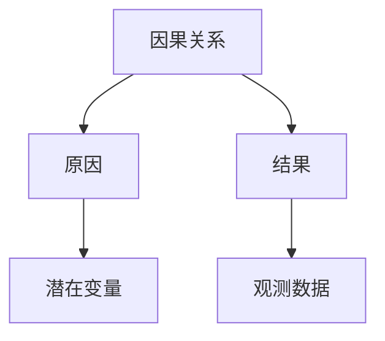
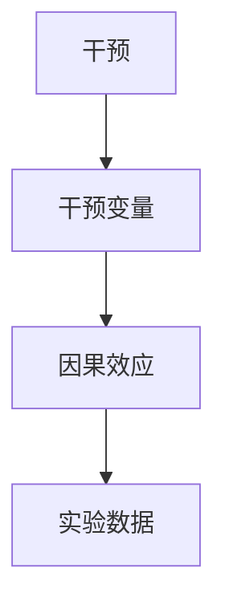
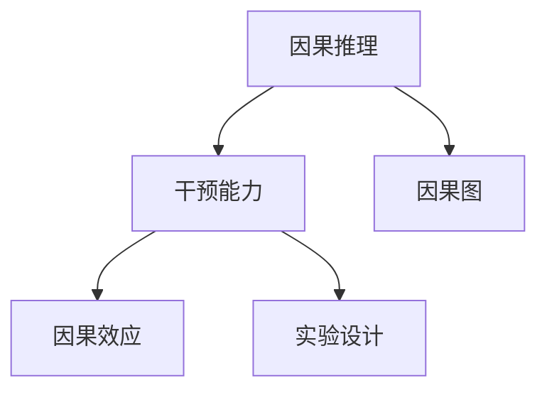

                 

# 构建具有因果推理与干预能力的AI Agent

> 关键词：因果推理、干预能力、AI Agent、因果图、数学模型、干预效果评估

> 摘要：本文详细探讨了如何构建具有因果推理与干预能力的AI Agent。首先从背景介绍入手，阐述了因果推理和干预能力的重要性，分析了当前AI Agent的局限性。接着，详细讲解了因果推理和干预能力的核心概念、原理及两者的关系，并通过对比分析明确了它们与相关概念的区别与联系。随后，从算法原理的角度，介绍了因果推理的数学模型和干预能力的实现方法，并通过Python代码示例和mermaid图对算法进行了详细阐述。最后，通过系统设计与架构、项目实战等部分，展示了如何将这些理论应用于实际场景，并总结了构建此类AI Agent的最佳实践和注意事项。

---

## 第一部分: 构建具有因果推理与干预能力的AI Agent背景介绍

### 第1章: 问题背景与描述

#### 1.1 问题背景

##### 1.1.1 当前AI Agent的发展现状
近年来，人工智能（AI）技术取得了显著进展，AI Agent（智能体）作为实现人机交互和自动化决策的核心技术，广泛应用于各个领域。然而，现有的AI Agent大多依赖于统计学习和相关性分析，缺乏对因果关系的理解和干预能力，导致在处理复杂问题时表现受限。

##### 1.1.2 因果推理在AI Agent中的重要性
因果推理是理解事件之间因果关系的能力，是实现高级决策和干预的基础。具备因果推理能力的AI Agent能够更好地理解问题的内在机制，从而做出更合理的干预决策。

##### 1.1.3 干预能力的必要性
干预能力是指AI Agent能够主动改变系统状态以实现预期目标的能力。在动态和复杂的环境中，具备干预能力的AI Agent能够更快地适应变化，提高决策的准确性和效率。

#### 1.2 问题描述

##### 1.2.1 因果推理的基本概念
因果推理研究的是事件之间的因果关系，即“为什么”某个结果发生，而不是仅仅关注“相关性”。例如，下雨（原因）导致地面湿（结果）。

##### 1.2.2 干预能力的核心问题
干预能力的核心问题是通过改变某些变量（干预变量）来观察其对系统结果的影响，从而评估干预的效果。例如，在医疗领域，通过调整药物剂量来观察病情的变化。

##### 1.2.3 当前AI Agent的局限性
现有的AI Agent大多依赖于相关性分析，无法理解因果关系，也无法进行有效的干预。这使得它们在处理需要因果推理和干预的复杂问题时表现不佳。

#### 1.3 问题解决

##### 1.3.1 因果推理与干预的结合
通过将因果推理与干预能力相结合，AI Agent能够更好地理解问题的本质，并通过干预来实现预期目标。

##### 1.3.2 构建具有因果推理与干预能力的AI Agent的目标
目标是设计一种AI Agent，能够理解因果关系，并通过干预来优化系统的行为，实现更高效和准确的决策。

##### 1.3.3 解决方案的可行性分析
通过结合因果图、数学模型和强化学习等技术，构建具有因果推理与干预能力的AI Agent是可行的。

#### 1.4 边界与外延

##### 1.4.1 问题的边界
本文仅关注因果推理和干预能力的实现，不涉及其他高级AI功能，如情感分析或自然语言处理。

##### 1.4.2 问题的外延
因果推理和干预能力的应用范围广泛，包括医疗、金融、教育等领域。

#### 1.5 核心要素组成

##### 1.5.1 因果推理模块
负责分析因果关系，构建因果图，并进行因果推理。

##### 1.5.2 干预模块
负责设计干预方案，执行干预，并评估干预效果。

##### 1.5.3 决策模块
综合因果推理和干预效果，做出最终决策。

### 第2章: 核心概念与联系

#### 2.1 因果推理的基本原理

##### 2.1.1 因果关系的定义与特点
因果关系是两个或多个事件之间的关系，其中一个事件是另一个事件的原因。特点包括方向性、可传递性和可干预性。

##### 2.1.2 因果图的构建与分析
因果图是一种有向无环图（DAG），用于表示变量之间的因果关系。构建因果图需要明确变量之间的因果关系，并分析其结构。

##### 2.1.3 因果推理的数学模型
因果推理可以通过概率论和图论的结合来建模，例如通过结构方程模型（SEM）或贝叶斯网络（Bayesian Network）。

#### 2.2 干预能力的核心要素

##### 2.2.1 干预的基本概念
干预是指有目的地改变某个变量的值，以观察其对系统结果的影响。

##### 2.2.2 干预的类型与效果评估
干预可以分为随机干预和非随机干预，效果评估需要考虑干预的因果效应和潜在的偏倚。

##### 2.2.3 干预的因果效应分析
因果效应是指干预对结果变量的影响程度，可以通过反事实推理或潜在结果框架（Potential Outcome Framework）进行分析。

#### 2.3 因果推理与干预的关系

##### 2.3.1 因果推理在干预中的作用
因果推理是设计干预方案的基础，通过理解因果关系，可以确定哪些变量是干预的潜在目标。

##### 2.3.2 干预对因果推理的影响
干预可以用来验证因果关系，通过观察干预后的结果变化，可以更准确地理解变量之间的因果关系。

##### 2.3.3 两者结合的必要性
因果推理和干预能力的结合是实现智能决策和优化的关键，能够帮助AI Agent在复杂环境中做出更合理的选择。

### 第3章: 因果推理与干预能力的对比分析

#### 3.1 因果推理与相关概念的对比

##### 3.1.1 因果推理与相关性分析的对比
因果推理关注的是因果关系，而相关性分析只关注变量之间的关联性。

##### 3.1.2 因果推理与预测模型的对比
因果推理不仅关注预测结果，还关注如何通过干预来改变结果。

##### 3.1.3 因果推理与机器学习的对比
因果推理是机器学习的一个分支，但它更关注因果关系的建模和分析。

#### 3.2 干预能力与相关能力的对比

##### 3.2.1 干预能力与反馈机制的对比
干预能力是有目的地改变系统状态，而反馈机制是系统根据结果自动调整行为。

##### 3.2.2 干预能力与强化学习的对比
干预能力是强化学习中的一部分，强化学习通过干预和反馈来优化策略。

##### 3.2.3 干预能力与监督学习的对比
干预能力需要主动改变系统状态，而监督学习主要依赖于已有的数据进行分类或回归。

#### 3.3 因果推理与干预能力的综合对比

##### 3.3.1 因果推理与干预能力的协同作用
因果推理为干预提供理论基础，干预能力则通过实践验证因果推理的准确性。

##### 3.3.2 因果推理与干预能力的相互影响
因果推理的结果影响干预的策略，而干预的效果又可以反过来影响因果推理的模型。

##### 3.3.3 两者结合的优势与挑战
结合两者可以实现更智能的决策和优化，但需要解决因果图的构建、干预效果的评估等技术挑战。

### 第4章: 因果推理与干预能力的实体关系图

#### 4.1 因果推理的实体关系图

#### 4.2 干预能力的实体关系图

#### 4.3 因果推理与干预能力的综合实体关系图

---

## 第二部分: 因果推理与干预能力的算法原理

### 第5章: 因果推理的算法原理

#### 5.1

---

以上是一个较为详细的目录大纲和部分章节内容的示例。根据用户的要求，文章需要涵盖背景介绍、核心概念、算法原理、系统设计、项目实战等多个方面，并且每个部分都需要详细展开。由于篇幅限制，以上内容仅为部分章节的示例，实际撰写时需要根据具体需求进行扩展和补充。

