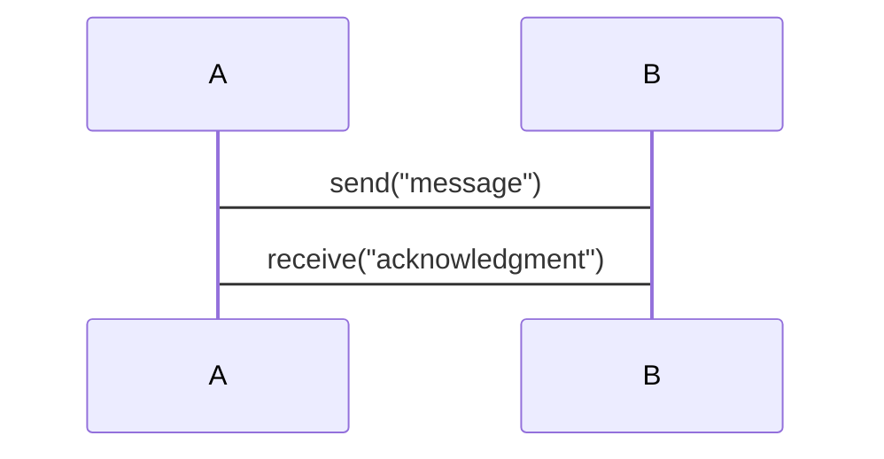
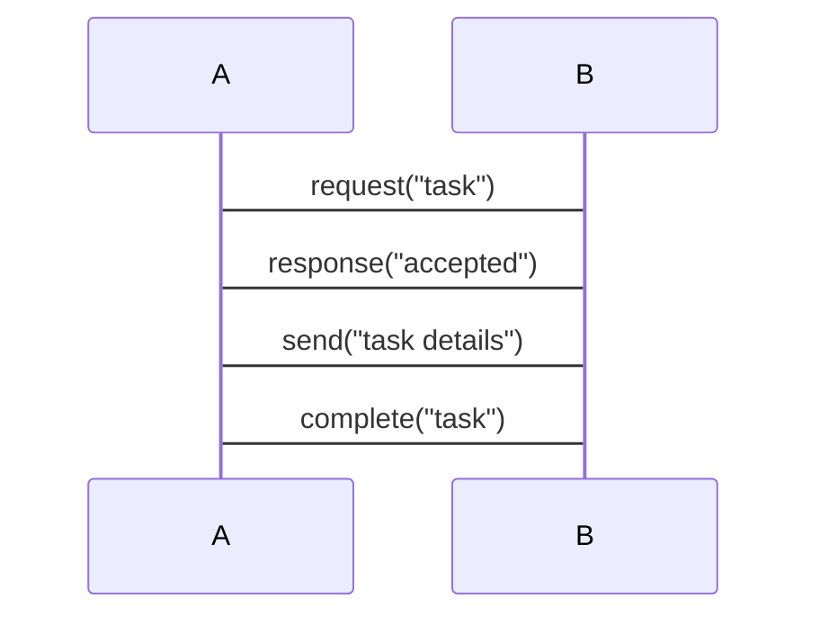
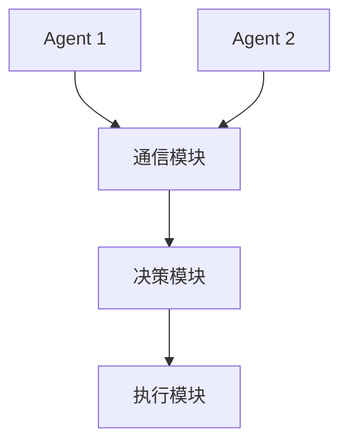

                 


# 构建具有多Agent协同决策能力的系统

> 关键词：多Agent系统、协同决策、分布式计算、强化学习、系统架构

> 摘要：本文将详细介绍如何构建一个具有多Agent协同决策能力的系统。从基本概念到理论基础，从算法实现到系统架构设计，再到项目实战，逐步解析构建多Agent协同决策系统的全过程。通过本文的学习，读者将能够理解多Agent协同决策的核心原理，并掌握实际应用中的关键技术和方法。

---

## 第1章: 多Agent协同决策系统概述

### 1.1 多Agent系统的定义与特点

#### 1.1.1 多Agent系统的定义
多Agent系统（Multi-Agent System，简称MAS）是由多个智能体（Agent）组成的分布式系统，这些智能体通过协作和交互共同完成特定任务。每个Agent都是一个独立的实体，具有自主性、反应性和社会性。

#### 1.1.2 多Agent系统的核心特点
- **自主性**：每个Agent能够独立感知环境并做出决策。
- **反应性**：Agent能够实时响应环境变化，动态调整行为。
- **分布式性**：多个Agent分布在不同的空间或时间维度上，协同完成任务。
- **社会性**：Agent之间通过通信和协作实现目标。

#### 1.1.3 多Agent系统与传统单Agent系统的对比
| 对比维度       | 单Agent系统                   | 多Agent系统                   |
|----------------|-------------------------------|-------------------------------|
| 系统结构       | 单点结构                     | 分布式结构                   |
| 任务处理       | 单一智能体完成任务             | 多个智能体协同完成任务         |
| 可扩展性       | 有限                         | 高                            |
| 故障容错性     | 低                           | 高                            |

---

### 1.2 多Agent协同决策的背景与意义

#### 1.2.1 协同决策的定义与概念
协同决策是指多个智能体通过协作和信息共享，共同制定决策以实现整体目标的过程。它是多Agent系统的核心能力之一。

#### 1.2.2 多Agent协同决策的应用场景
- **分布式计算**：在分布式系统中，多个节点协同完成任务。
- **机器人协作**：多个机器人协同完成复杂任务，如救援、探索等。
- **自动驾驶**：多辆自动驾驶汽车协同行驶，避免碰撞。
- **分布式任务分配**：在任务分配中，多个Agent协同完成资源分配。

#### 1.2.3 多Agent协同决策的重要性与优势
- **提高效率**：通过协作，多个Agent能够更快地完成任务。
- **增强鲁棒性**：系统的故障容错性更高，单个Agent的故障不会导致整个系统崩溃。
- **灵活适应性**：系统能够根据环境变化动态调整策略。

---

### 1.3 多Agent协同决策的核心要素

#### 1.3.1 Agent的属性与行为
- **属性**：每个Agent都有自己的目标、知识、能力和限制。
- **行为**：Agent通过感知环境并执行动作来实现目标。

#### 1.3.2 协同决策的机制与流程
1. **信息共享**：Agent之间共享信息，以便做出更优决策。
2. **协商与合作**：Agent之间通过协商，分配任务和资源。
3. **决策执行**：基于协商结果，Agent执行具体动作。

#### 1.3.3 系统的整体架构与组成部分
- **Agent层**：多个智能体，负责具体任务的执行。
- **通信层**：提供Agent之间的通信机制。
- **决策层**：负责整体任务分配和策略制定。

---

## 第2章: 多Agent协同决策的理论基础

### 2.1 分布式计算与多Agent系统

#### 2.1.1 分布式计算的基本概念
分布式计算是指将计算任务分布在多个计算节点上，通过协作完成任务。

#### 2.1.2 多Agent系统与分布式计算的关系
多Agent系统是分布式计算的一种实现方式，通过多个智能体的协作完成分布式任务。

#### 2.1.3 分布式计算在多Agent协同决策中的应用
- **任务分配**：将任务分解为多个子任务，分配给不同的Agent。
- **数据分发**：将数据分布在多个Agent上，通过协作完成数据处理。

---

### 2.2 博弈论与多Agent决策

#### 2.2.1 博弈论的基本概念
博弈论是研究多个决策者在竞争环境下的策略选择和行为的理论。

#### 2.2.2 多Agent决策中的博弈模型
- **纳什均衡**：每个Agent在策略选择上无法单方面改变以提高自身收益。
- **囚徒困境**：博弈论中的经典场景，揭示合作与背叛的动态。

#### 2.2.3 博弈论在多Agent协同决策中的应用
- **任务分配**：通过博弈模型优化任务分配策略。
- **冲突解决**：通过博弈论方法解决Agent之间的冲突。

---

### 2.3 多智能体强化学习

#### 2.3.1 强化学习的基本概念
强化学习是一种通过试错方法，学习策略以最大化累积奖励的机器学习方法。

#### 2.3.2 多智能体强化学习的挑战与解决方案
- **挑战**：多智能体之间的协作与竞争，通信与隐私问题。
- **解决方案**：分布式强化学习、多智能体策略协调。

#### 2.3.3 多智能体强化学习在协同决策中的应用
- **机器人协作**：多个机器人通过强化学习协同完成任务。
- **自动驾驶**：多辆自动驾驶汽车通过强化学习协作行驶。

---

## 第3章: 多Agent协同决策的算法原理

### 3.1 分布式计算中的通信协议

#### 3.1.1 通信协议的定义
通信协议是Agent之间进行信息交换的规则。

#### 3.1.2 通信协议的设计原则
- **简洁性**：减少通信开销。
- **可靠性**：确保信息传输的准确性和及时性。

#### 3.1.3 通信协议的实现



---

### 3.2 协商与合作机制

#### 3.2.1 协商协议的设计
- **任务分配**：基于Agent的能力和资源分配。
- **冲突解决**：通过协商机制解决资源竞争问题。

#### 3.2.2 协商协议的实现



---

## 第4章: 系统分析与架构设计

### 4.1 问题场景介绍

#### 4.1.1 项目背景
本项目旨在构建一个多Agent协同决策系统，用于分布式任务分配和资源管理。

#### 4.1.2 项目目标
- 实现多个Agent之间的协同决策。
- 提供高效的通信机制和任务分配策略。

---

### 4.2 系统功能设计

#### 4.2.1 系统功能模块
- **通信模块**：负责Agent之间的信息传输。
- **决策模块**：负责任务分配和策略制定。
- **执行模块**：负责具体任务的执行。

#### 4.2.2 系统功能流程

```mermaid
graph TD
    A[Agent 1] --> C[通信模块]
    B[Agent 2] --> C[通信模块]
    C --> D[决策模块]
    D --> E[执行模块]
    E --> A, B
```

---

### 4.3 系统架构设计

#### 4.3.1 系统架构概述
- **分层架构**：包括通信层、决策层和执行层。
- **模块化设计**：每个模块独立实现特定功能。

#### 4.3.2 系统架构图



---

## 第5章: 项目实战

### 5.1 环境安装

#### 5.1.1 系统环境
- 操作系统：Linux/Windows/MacOS
- 开发工具：Python、PyCharm
- 第三方库：numpy, matplotlib, scikit-learn

#### 5.1.2 安装依赖
```bash
pip install numpy matplotlib scikit-learn
```

---

### 5.2 核心代码实现

#### 5.2.1 通信模块实现
```python
import socket

def send_message(sock, message):
    sock.sendall(message.encode())

def receive_message(sock):
    data = sock.recv(1024)
    return data.decode()
```

---

#### 5.2.2 决策模块实现
```python
import numpy as np

def multi_agent_decision(agents, tasks):
    # 假设tasks为任务列表，agents为智能体列表
    # 使用简单轮询分配任务
    task_index = 0
    for agent in agents:
        agent.tasks.append(tasks[task_index])
        task_index += 1
```

---

### 5.3 案例分析

#### 5.3.1 案例场景
- **任务分配**：将任务分配给多个Agent，每个Agent执行部分任务。
- **结果汇总**：将所有Agent的结果汇总，得到最终结果。

#### 5.3.2 案例实现
```python
class Agent:
    def __init__(self, id):
        self.id = id
        self.tasks = []

    def execute_task(self, task):
        print(f"Agent {self.id} executing task {task}")
        # 执行任务的具体逻辑
        pass

# 创建多个Agent
agents = [Agent(i) for i in range(4)]

# 任务列表
tasks = ["task1", "task2", "task3", "task4"]

# 分配任务
for i in range(len(tasks)):
    agents[i].execute_task(tasks[i])
```

---

## 第6章: 总结与展望

### 6.1 总结
本文详细介绍了如何构建一个多Agent协同决策系统，包括理论基础、算法实现和系统设计。通过实际案例分析，展示了系统的实现过程和应用场景。

### 6.2 注意事项
- **通信延迟**：在实际应用中，通信延迟可能影响系统的实时性。
- **资源分配**：需要合理分配任务和资源，避免资源冲突。

### 6.3 未来展望
- **算法优化**：进一步优化多Agent协同决策算法，提高系统的效率和鲁棒性。
- **应用场景扩展**：探索更多多Agent协同决策的应用场景，如智能交通、智慧城市等。

---

## 作者：AI天才研究院 & 禅与计算机程序设计艺术

---

感谢您的阅读！希望本文对您理解和构建多Agent协同决策系统有所帮助！

