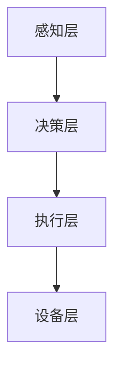
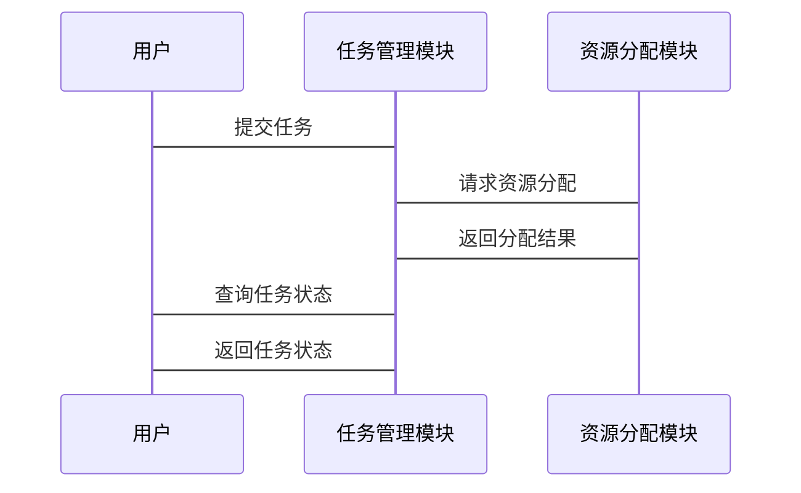

                 


# 构建具有多任务处理能力的AI Agent

> 关键词：AI Agent, 多任务处理, 人工智能, 系统架构, 算法实现

> 摘要：本文将详细介绍如何构建一个具有多任务处理能力的AI Agent。从背景介绍、核心概念、算法原理到系统设计和项目实战，逐步解析实现多任务AI Agent的关键技术。文章内容涵盖任务分解、优先级排序、任务协调算法，以及系统架构设计，最终通过实际案例展示如何实现一个高效的多任务AI Agent。

---

## 第一章: AI Agent概述

### 1.1 AI Agent的基本概念

#### 1.1.1 什么是AI Agent
AI Agent（人工智能代理）是指能够感知环境、自主决策并执行任务的智能实体。它能够通过传感器获取信息，利用算法进行分析和决策，并通过执行器与环境交互。AI Agent可以是软件程序、机器人或其他智能设备。

#### 1.1.2 AI Agent的核心特征
- **自主性**：AI Agent能够在没有外部干预的情况下自主运行。
- **反应性**：能够感知环境并实时调整行为。
- **目标导向**：具备明确的目标，并采取行动以实现目标。
- **社交能力**：能够与其他AI Agent或人类进行交互和协作。

#### 1.1.3 AI Agent与传统AI的区别
AI Agent不仅能够进行数据分析和推理，还能够与环境交互，具有更强的自主性和适应性。传统AI更多关注于数据处理和模式识别，而AI Agent强调与环境的动态交互。

---

### 1.2 多任务处理能力的定义

#### 1.2.1 多任务处理的定义
多任务处理是指AI Agent能够同时处理多个任务，并根据任务优先级和资源分配动态调整执行顺序。

#### 1.2.2 多任务处理的关键点
- **任务分解**：将复杂任务分解为多个子任务。
- **优先级排序**：根据任务的重要性和紧急性进行排序。
- **资源分配**：合理分配计算资源以确保任务顺利执行。

#### 1.2.3 多任务处理的边界与外延
多任务处理的边界在于任务之间的独立性和依赖性。外延则包括任务协调、资源管理、异常处理等。

---

### 1.3 AI Agent在多任务处理中的作用

#### 1.3.1 多任务处理在AI Agent中的作用
AI Agent作为多任务处理的核心，负责任务的分解、优先级排序和协调执行。

#### 1.3.2 AI Agent如何实现多任务处理
通过任务管理模块，AI Agent能够动态调整任务执行顺序，确保多个任务协同完成。

#### 1.3.3 多任务处理对AI Agent性能的影响
多任务处理能力直接影响AI Agent的效率和响应速度。高效的多任务处理能够提高系统的整体性能。

---

## 第二章: 多任务处理的核心原理

### 2.1 多任务处理的基本原理

#### 2.1.1 多任务处理的实现机制
多任务处理通过任务分解、优先级排序和资源分配实现多个任务的协同执行。

#### 2.1.2 多任务处理的数学模型
多任务处理的数学模型包括任务优先级计算、任务分配优化和任务协调模型。

#### 2.1.3 多任务处理的优缺点对比
| 优点             | 缺点             |
|------------------|------------------|
| 提高系统效率       | 资源竞争         |
| 增强适应性         | 任务冲突         |
| 支持复杂场景处理   | 复杂性增加         |

---

### 2.2 多任务处理与AI Agent的关系

#### 2.2.1 多任务处理在AI Agent中的作用
多任务处理是AI Agent实现复杂任务的核心能力，使其能够同时处理多个任务并动态调整执行策略。

#### 2.2.2 AI Agent如何实现多任务处理
通过任务管理模块，AI Agent能够分解任务、排序优先级并协调任务执行。

#### 2.2.3 多任务处理对AI Agent性能的影响
多任务处理能力直接影响AI Agent的效率和响应速度，高效的多任务处理能够提高系统的整体性能。

---

### 2.3 本章小结

---

## 第三章: 多任务处理AI Agent的算法原理

### 3.1 多任务处理算法概述

#### 3.1.1 任务分解算法
任务分解算法将复杂任务分解为多个子任务，以便并行处理。例如，使用树状结构进行任务分解。

#### 3.1.2 任务优先级排序算法
任务优先级排序算法根据任务的重要性和紧急性进行排序，常用的方法包括贪心算法和动态规划。

#### 3.1.3 任务协调算法
任务协调算法确保多个任务之间的资源协调和冲突解决，常用的方法包括协商机制和仲裁机制。

---

### 3.2 多任务处理的数学模型

#### 3.2.1 任务优先级计算公式
$$ \text{优先级} = \alpha \times \text{重要性} + \beta \times \text{紧急性} $$

其中，$\alpha$ 和 $\beta$ 是权重系数。

#### 3.2.2 任务分配的优化模型
任务分配的优化模型可以表示为：
$$ \min_{x} \sum_{i=1}^{n} c_i x_i $$
$$ \text{s.t.} \quad \sum_{i=1}^{n} x_i = 1 $$

其中，$x_i$ 是任务i的分配变量，$c_i$ 是任务i的成本。

#### 3.2.3 任务协调的数学表达
任务协调可以通过以下公式表示：
$$ \text{协调度} = \frac{\sum_{i=1}^{n} \text{资源分配}_i}{\sum_{i=1}^{n} \text{资源需求}_i} $$

---

### 3.3 算法实现的Python代码示例

#### 3.3.1 任务优先级排序代码
```python
def task_priority(tasks):
    priority = {}
    for task in tasks:
        importance = task['importance']
        urgency = task['urgency']
        priority[task['name']] = alpha * importance + beta * urgency
    return sorted(priority.items(), key=lambda x: -x[1])
```

#### 3.3.2 任务分配代码
```python
def task_assignment(tasks):
    n = len(tasks)
    cost = [task['cost'] for task in tasks]
    assignment = [0] * n
    min_cost = min(cost)
    for i in range(n):
        if cost[i] == min_cost:
            assignment[i] = 1
            break
    return assignment
```

#### 3.3.3 任务协调代码
```python
def task_coordination(tasks):
    resource_used = sum([task['used_resource'] for task in tasks])
    resource_available = sum([task['available_resource'] for task in tasks])
    coordination = resource_used / resource_available
    return coordination
```

---

### 3.4 本章小结

---

## 第四章: 多任务处理AI Agent的系统架构设计

### 4.1 系统分析与设计

#### 4.1.1 问题场景介绍
以智能家居为例，AI Agent需要同时处理多个任务，如环境监测、设备控制和用户交互。

#### 4.1.2 系统功能设计
系统功能模块包括任务管理、资源分配、任务协调和状态监控。

#### 4.1.3 系统架构设计
系统架构采用分层设计，包括感知层、决策层和执行层。

---

### 4.2 系统架构图



---

### 4.3 系统接口设计

#### 4.3.1 接口设计
系统接口包括任务提交接口、资源分配接口和任务状态查询接口。

#### 4.3.2 接口交互流程图


---

### 4.4 本章小结

---

## 第五章: 多任务处理AI Agent的项目实战

### 5.1 环境安装

#### 5.1.1 系统环境
建议使用Python 3.8及以上版本，安装必要的库如numpy、pandas和scikit-learn。

#### 5.1.2 安装依赖
```bash
pip install numpy pandas scikit-learn
```

---

### 5.2 核心代码实现

#### 5.2.1 任务管理模块
```python
class TaskManager:
    def __init__(self):
        self.tasks = []
    
    def add_task(self, task):
        self.tasks.append(task)
    
    def sort_priority(self):
        return sorted(self.tasks, key=lambda x: -x['priority'])
```

#### 5.2.2 资源分配模块
```python
class ResourceAllocator:
    def __init__(self, resources):
        self.resources = resources
    
    def allocate(self, tasks):
        for task in tasks:
            if task['priority'] == max([t['priority'] for t in tasks]):
                if self.resources >= task['required_resources']:
                    return task
        return None
```

---

### 5.3 代码解读与分析

#### 5.3.1 任务管理模块解读
任务管理模块负责任务的添加和优先级排序，确保任务能够按照优先级顺序执行。

#### 5.3.2 资源分配模块解读
资源分配模块根据任务优先级和资源需求，动态分配资源，确保任务高效执行。

---

### 5.4 实际案例分析

#### 5.4.1 案例背景
以智能家居为例，AI Agent需要同时处理环境监测、设备控制和用户交互三个任务。

#### 5.4.2 任务分解
将环境监测任务分解为温度检测、湿度检测和空气质量检测三个子任务。

#### 5.4.3 任务协调
通过任务优先级排序和资源分配，确保任务之间的协调与配合。

---

### 5.5 项目小结

---

## 第六章: 多任务处理AI Agent的高级主题

### 6.1 模型的可解释性

#### 6.1.1 可解释性的重要性
可解释性是确保AI Agent决策透明的关键，有助于诊断和优化系统。

#### 6.1.2 提高可解释性的方法
包括使用可解释性模型、记录决策日志和可视化决策过程。

---

### 6.2 模型的安全性

#### 6.2.1 安全性的重要性
确保AI Agent在多任务处理中不会受到恶意攻击和干扰。

#### 6.2.2 提高安全性的方法
包括身份验证、访问控制和加密通信。

---

### 6.3 模型的扩展性

#### 6.3.1 扩展性的重要性
确保AI Agent能够适应任务数量和复杂度的增加。

#### 6.3.2 提高扩展性的方法
包括模块化设计、分布式计算和负载均衡。

---

### 6.4 伦理问题

#### 6.4.1 伦理问题的重要性
确保AI Agent的多任务处理不会对人类社会造成负面影响。

#### 6.4.2 解决伦理问题的方法
包括制定伦理准则、建立监管机制和进行伦理审查。

---

## 第七章: 总结与展望

### 7.1 本章总结
本文详细介绍了构建具有多任务处理能力的AI Agent的关键技术，包括算法原理、系统架构和项目实战。

### 7.2 未来展望
未来的研究方向包括提高可解释性、增强安全性和扩展性，以及探索新的多任务处理算法。

---

## 作者：AI天才研究院/AI Genius Institute & 禅与计算机程序设计艺术 /Zen And The Art of Computer Programming

