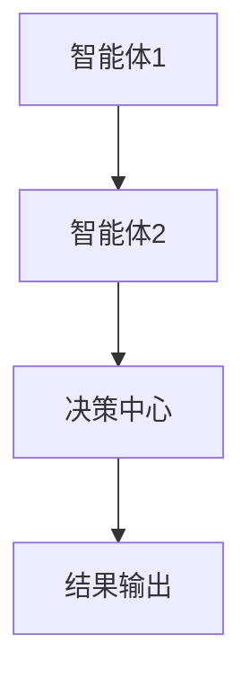
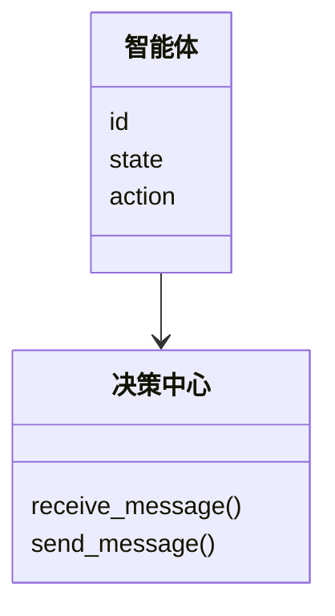
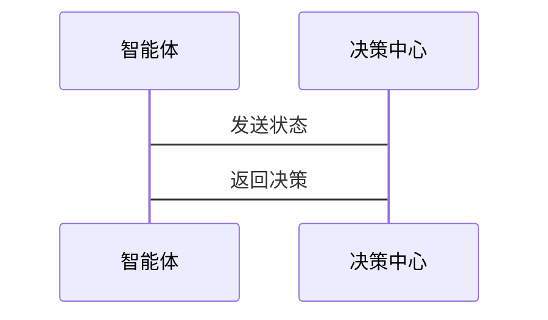

                 


# 构建具有多智能体协同决策能力的系统

## 关键词：
多智能体系统、协同决策、分布式计算、强化学习、系统架构、算法原理

## 摘要：
多智能体协同决策系统是一种复杂的分布式系统，涉及多个智能体之间的协作与信息共享。本文将深入探讨多智能体协同决策的核心概念、算法原理、系统架构以及实际应用，通过丰富的案例分析和详细的代码实现，帮助读者理解如何构建高效的多智能体协同决策系统。

---

# 第1章: 多智能体协同决策的背景与问题

## 1.1 多智能体协同决策的背景
### 1.1.1 从单智能体到多智能体的演进
- 单智能体系统的局限性
- 多智能体系统的兴起与应用场景
- 协同决策的重要性

### 1.1.2 协同决策在现代系统中的重要性
- 分布式计算的挑战
- 协同决策在实时系统中的优势
- 多智能体协同决策的应用领域

### 1.1.3 多智能体系统的核心特点
- 分布式性
- 协作性
- 动态性
- 多目标优化

## 1.2 问题背景与描述
### 1.2.1 多智能体协同决策的核心问题
- 智能体之间的信息共享与同步
- 协同决策的效率与准确性
- 动态环境下的决策调整

### 1.2.2 问题的边界与外延
- 边界条件：智能体的数量、类型、决策范围
- 外延：与分布式系统、人工智能的关联

### 1.2.3 多智能体系统中的核心要素组成
- 智能体：定义、属性、行为
- 通信机制：消息传递、协议
- 决策模型：规则、算法、优化目标

## 1.3 本章小结
- 总结多智能体协同决策的背景与核心问题
- 强调协同决策的重要性与挑战

---

# 第2章: 多智能体协同决策的核心概念与联系

## 2.1 多智能体系统的基本概念
### 2.1.1 智能体的定义与分类
- 智能体的定义
- 分类：简单智能体、复杂智能体、自适应智能体

### 2.1.2 多智能体系统的特征
- 分布式性
- 独立性与协作性
- 动态性与适应性

### 2.1.3 协同决策的定义与实现方式
- 协同决策的定义
- 实现方式：基于规则、基于模型、基于学习

## 2.2 协同决策的机制与原理
### 2.2.1 协同决策的核心机制
- 信息共享
- 协调与同步
- 决策优化

### 2.2.2 多智能体之间的通信与协作
- 通信协议
- 协作策略
- 冲突解决

### 2.2.3 协同决策的数学模型
- 协同决策的数学表达式
- 智能体之间的关系模型
- 决策优化的目标函数

## 2.3 核心概念对比与ER图分析
### 2.3.1 多智能体与单智能体的对比
- 表格对比：核心特点、优缺点
- 图形化展示：简单对比图

### 2.3.2 协同决策与分布式决策的对比
- 对比分析：目标、实现方式、应用场景
- ER图展示：实体关系分析

### 2.3.3 ER实体关系图分析
- 使用Mermaid绘制ER图
```mermaid
erDiagram
    customer[客户] {
        id : integer
        name : string
    }
    order[订单] {
        id : integer
        date : date
    }
    customer --> order : 下单
```

## 2.4 本章小结
- 总结多智能体协同决策的核心概念
- 强调概念之间的联系与区别

---

# 第3章: 多智能体协同决策的算法原理

## 3.1 协同决策算法概述
### 3.1.1 基于博弈论的决策算法
- 博弈论基础
- Nash均衡
- 协同决策中的博弈模型

### 3.1.2 基于分布式计算的决策算法
- 分布式计算原理
- MapReduce
- 分布式决策算法

### 3.1.3 基于强化学习的决策算法
- 强化学习基础
- Q-learning
- 多智能体强化学习

## 3.2 协同决策算法的数学模型
### 3.2.1 协同决策的数学表达式
- 使用公式表示智能体之间的通信与决策
$$ Q_i = \sum_{j=1}^{n} \alpha_{ij} Q_j $$

### 3.2.2 智能体之间的通信模型
- 通信协议的数学描述
- 消息传递的数学模型
$$ message_{ij} = f(Q_i, Q_j) $$

### 3.2.3 协同决策的优化目标
- 优化目标的数学表达
$$ \max \sum_{i=1}^{m} Q_i $$

## 3.3 算法实现与代码示例
### 3.3.1 算法流程图（Mermaid）


### 3.3.2 Python代码实现
```python
import numpy as np

def decision_algorithm(state):
    alpha = 0.5
    Q = np.zeros(len(state))
    for i in range(len(state)):
        for j in range(len(state)):
            Q[i] += alpha * state[j]
    return Q
```

## 3.4 本章小结
- 总结多智能体协同决策算法的原理
- 强调算法实现的关键点

---

# 第4章: 多智能体协同决策系统的架构设计

## 4.1 问题场景介绍
### 4.1.1 系统需求分析
- 功能需求
- 性能需求
- 可扩展性

### 4.1.2 系统功能设计
- 使用Mermaid绘制领域模型图


### 4.1.3 系统架构设计
- 使用Mermaid绘制系统架构图


## 4.2 系统接口设计
### 4.2.1 接口定义
- API接口设计
- 接口文档

### 4.2.2 接口交互流程
- 使用Mermaid绘制序列图


## 4.3 本章小结
- 总结系统架构设计的关键点
- 强调接口设计的重要性

---

# 第5章: 项目实战与案例分析

## 5.1 项目环境安装
### 5.1.1 系统环境要求
- 操作系统
- 软件依赖

### 5.1.2 开发工具安装
- Python、框架安装
- 数据库安装

## 5.2 系统核心代码实现
### 5.2.1 核心代码实现
```python
class Agent:
    def __init__(self, id):
        self.id = id
        self.state = 0
    def receive_message(self, message):
        self.state = message
    def send_message(self):
        return self.state
```

### 5.2.2 代码解读与分析
- 代码结构分析
- 功能模块解读

## 5.3 案例分析
### 5.3.1 案例背景介绍
- 案例应用场景
- 案例目标

### 5.3.2 实际案例分析
- 案例实现过程
- 案例结果分析

## 5.4 本章小结
- 总结项目实战的经验与教训
- 强调实际应用中的注意事项

---

# 第6章: 最佳实践与拓展阅读

## 6.1 最佳实践
### 6.1.1 系统设计中的注意事项
- 系统扩展性
- 系统安全性
- 系统性能优化

### 6.1.2 开发过程中的建议
- 开发规范
- 测试方法
- 文档管理

## 6.2 小结
- 回顾全文的核心内容
- 强调多智能体协同决策的重要性

## 6.3 注意事项
- 系统设计中的常见问题
- 开发中的潜在风险

## 6.4 拓展阅读
- 推荐相关书籍与论文
- 指定学习资源

---

# 作者

作者：AI天才研究院/AI Genius Institute & 禅与计算机程序设计艺术 /Zen And The Art of Computer Programming

