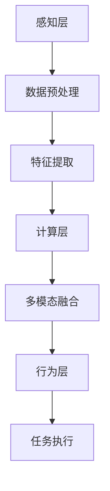
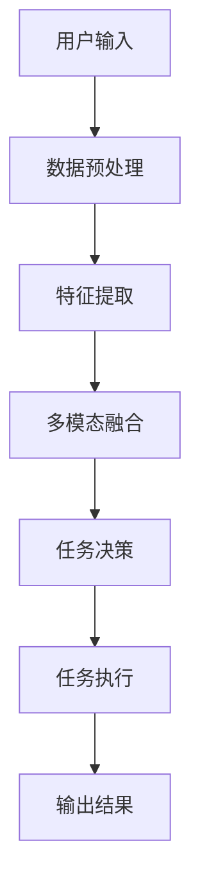
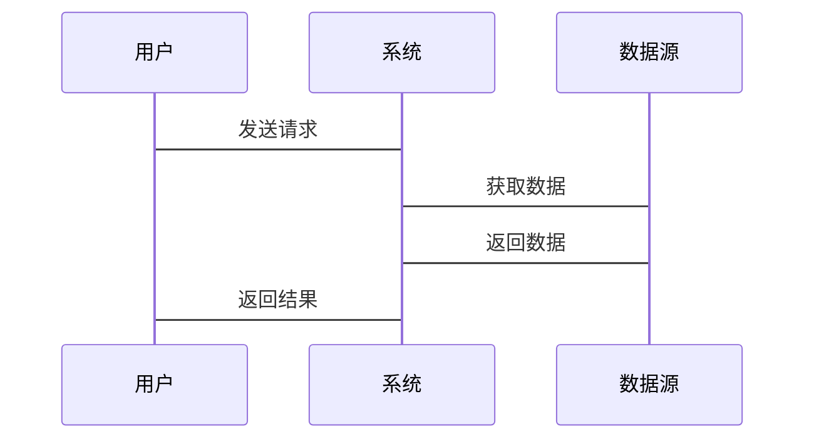

                 


# 构建具有多模态学习能力的AI Agent

> 关键词：多模态学习，AI Agent，机器学习，深度学习，系统架构

> 摘要：  
本文详细探讨了构建具有多模态学习能力的AI Agent的方法，从理论基础到实际应用，结合具体案例，分析了多模态学习的核心算法、系统架构设计以及项目实现的全过程。通过本文，读者可以全面理解多模态学习在AI Agent中的重要性，并掌握构建此类系统的关键技术和实践方法。

---

## 第1章 多模态学习与AI Agent的背景与概念

### 1.1 问题背景
多模态学习是指AI系统能够处理和融合多种类型的数据（如文本、图像、语音、视频等）来完成特定任务的能力。传统的AI系统通常依赖单一模态的数据进行处理，但在现实场景中，单一模态的数据往往不足以提供完整的上下文信息，导致系统难以应对复杂的实际问题。因此，构建具有多模态学习能力的AI Agent成为当前研究的热点。

### 1.2 问题描述
AI Agent需要能够从多种数据源中获取信息，并通过多模态数据的融合来提升其理解和决策能力。例如，在智能客服系统中，AI Agent需要同时理解用户的文本输入和情绪语音，以提供更精准的服务。

### 1.3 解决方法
通过多模态学习，AI Agent可以结合多种数据类型的信息，从而更好地理解用户意图、环境状态和任务需求。本文将从算法、系统架构和实际应用三个层面展开，详细探讨如何构建具有多模态学习能力的AI Agent。

### 1.4 概念结构与核心要素
多模态学习的核心要素包括：
- **数据输入**：多种类型的数据源。
- **数据融合**：将不同模态的数据进行整合。
- **模型训练**：基于多模态数据的深度学习模型。
- **任务执行**：根据融合后的信息完成特定任务。

---

## 第2章 多模态学习的核心算法与数学模型

### 2.1 多模态数据融合的算法原理
多模态数据融合可以通过以下步骤实现：
1. **数据预处理**：对不同模态的数据进行标准化处理。
2. **特征提取**：分别提取每种模态的特征。
3. **特征融合**：将不同模态的特征进行融合，形成统一的表示。
4. **模型训练**：基于融合后的特征进行模型训练。

#### 2.1.1 基于深度学习的多模态融合
深度学习模型（如Transformer）可以有效地处理多模态数据。例如，我们可以将文本和图像的特征向量进行拼接，形成一个多维特征向量，然后输入到模型中进行训练。

#### 2.1.2 多模态融合的数学模型
假设我们有文本特征向量 $T \in \mathbb{R}^{d_t}$ 和图像特征向量 $I \in \mathbb{R}^{d_i}$，则融合后的特征向量可以表示为：
$$
F = \text{Concat}(T, I)
$$
其中，$\text{Concat}$ 表示向量拼接操作。

### 2.2 多模态学习的数学模型
多模态学习的核心是将多种数据模态映射到一个共同的潜在空间中。常用的数学模型包括：
- **对比学习**：通过最大化不同模态之间的相似性来实现数据对齐。
- **联合学习**：在统一的模型中同时训练多种模态的数据。

#### 2.2.1 对比学习的数学公式
对比学习的目标是最小化不同模态之间的特征差异。假设我们有文本样本 $x$ 和图像样本 $y$，其对应的特征分别为 $f(x)$ 和 $f(y)$，则对比损失函数可以表示为：
$$
L = -\log\left(\frac{\exp(f(x) \cdot f(y))}{\exp(f(x) \cdot f(y)) + \sum_{k \neq y} \exp(f(x) \cdot f(k))}\right)
$$

### 2.3 算法实现与代码示例
以下是一个基于PyTorch的多模态融合的简单代码示例：

```python
import torch
import torch.nn as nn

class MultiModalFusion(nn.Module):
    def __init__(self, text_dim, image_dim):
        super().__init__()
        self.text_proj = nn.Linear(text_dim, 128)
        self.image_proj = nn.Linear(image_dim, 128)
        self融合层 = nn.Linear(256, 1)  # 融合后的维度

    def forward(self, text_features, image_features):
        text_proj = self.text_proj(text_features)
        image_proj = self.image_proj(image_features)
        fused = torch.cat((text_proj, image_proj), dim=-1)
        output = self.融合层(fused)
        return output

# 示例输入
text_features = torch.randn(1, 100)
image_features = torch.randn(1, 512)

model = MultiModalFusion(100, 512)
output = model(text_features, image_features)
print(output)
```

---

## 第3章 AI Agent的系统架构与设计

### 3.1 系统架构设计
AI Agent的系统架构通常包括以下几个模块：
1. **感知层**：负责从多种数据源获取数据。
2. **计算层**：对获取的数据进行处理和融合。
3. **行为层**：根据处理后的信息执行具体任务。

#### 3.1.1 系统架构图
以下是AI Agent的系统架构图（使用Mermaid）：



### 3.2 系统功能设计
AI Agent的核心功能包括：
- 数据采集与预处理
- 多模态数据融合
- 任务决策与执行

#### 3.2.1 系统功能流程
以下是系统的功能流程图（使用Mermaid）：



### 3.3 接口设计与交互流程
AI Agent需要与多种数据源和外部系统进行交互。以下是交互流程图（使用Mermaid）：



---

## 第4章 多模态学习在AI Agent中的应用

### 4.1 应用场景分析
多模态学习在AI Agent中的应用场景包括：
- 智能客服
- 智能音箱
- 虚拟助手

### 4.2 项目实现与案例分析
以下是一个基于文本和语音的多模态AI Agent实现案例：

#### 4.2.1 环境安装
```bash
pip install torch torchvision
```

#### 4.2.2 核心代码实现
```python
import torch
import torch.nn as nn

class MultiModalAgent(nn.Module):
    def __init__(self, text_dim, audio_dim):
        super().__init__()
        self.text_encoder = nn.LSTM(text_dim, 64)
        self.audio_encoder = nn.LSTM(audio_dim, 64)
        self融合层 = nn.Linear(128, 1)

    def forward(self, text_features, audio_features):
        text_output, _ = self.text_encoder(text_features)
        audio_output, _ = self.audio_encoder(audio_features)
        fused = torch.cat((text_output, audio_output), dim=-1)
        output = self.融合层(fused)
        return output

# 示例输入
text_features = torch.randn(1, 10, 100)  # 序列长度为10
audio_features = torch.randn(1, 10, 512)
model = MultiModalAgent(100, 512)
output = model(text_features, audio_features)
print(output)
```

### 4.3 案例分析与总结
通过上述案例，我们可以看到，多模态学习能够显著提升AI Agent的性能和用户体验。例如，在智能客服系统中，AI Agent可以通过融合文本和语音信息，更准确地理解用户的需求。

---

## 第5章 最佳实践与注意事项

### 5.1 小结
- 多模态学习是构建AI Agent的核心技术之一。
- 通过融合多种数据模态，AI Agent能够更好地理解复杂场景。
- 在实际应用中，需要根据具体需求选择合适的算法和系统架构。

### 5.2 注意事项
- 数据预处理是关键，需要确保不同模态的数据能够有效对齐。
- 多模态融合需要考虑数据的分布差异，避免信息丢失。
- 系统架构设计需要充分考虑扩展性和可维护性。

### 5.3 拓展阅读
- "多模态学习的最新研究进展"
- "深度学习在AI Agent中的应用"

---

## 作者信息

作者：AI天才研究院（AI Genius Institute） & 禅与计算机程序设计艺术（Zen And The Art of Computer Programming）

---

通过本文的详细讲解，读者可以全面了解构建具有多模态学习能力的AI Agent的方法和实现细节。希望本文能够为相关领域的研究和实践提供有价值的参考。

