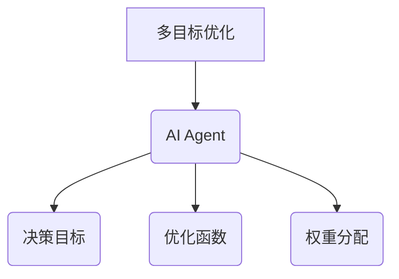
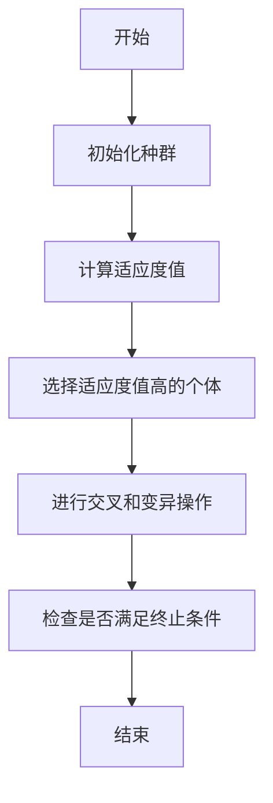
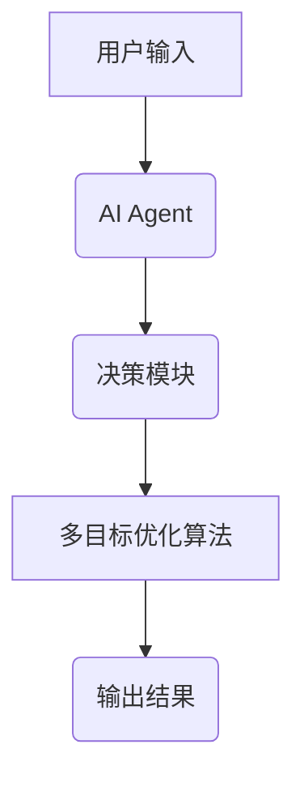
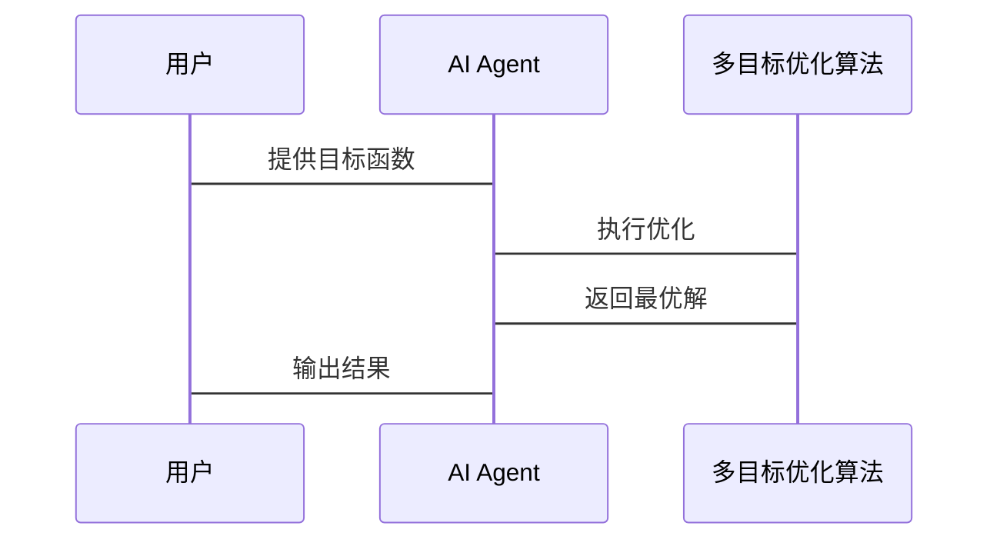

                 


# 构建具有多目标优化决策能力的AI Agent

> 关键词：多目标优化，AI Agent，决策优化，算法实现，系统架构，案例分析

> 摘要：本文详细探讨了如何构建具有多目标优化决策能力的AI Agent。首先介绍了多目标优化的基本概念和AI Agent的核心原理，然后分析了多目标优化在AI Agent中的具体应用和算法实现。接着通过系统架构设计和项目实战，展示了如何在实际场景中构建和优化多目标决策AI Agent。最后，总结了多目标优化决策AI Agent的优势和未来的发展方向。

---

# 第一部分：多目标优化决策AI Agent的背景与概念

## 第1章：多目标优化决策的背景

### 1.1 问题背景

在实际应用场景中，AI Agent需要在多个目标之间进行权衡，例如在资源分配问题中，既要考虑成本最低，又要考虑时间最短。传统的单目标优化无法满足这种复杂场景的需求。

### 1.2 多目标优化的定义

多目标优化是指在多个目标之间寻找最优解的过程，通常会涉及到目标之间的冲突和权衡。例如，在投资决策中，既要追求高收益，又要控制风险。

### 1.3 多目标优化与AI Agent的结合

AI Agent需要在复杂环境中做出决策，而多目标优化能够帮助AI Agent在多个目标之间找到最佳平衡点。

---

## 第2章：AI Agent的基本概念

### 2.1 AI Agent的定义

AI Agent是一种能够感知环境并采取行动以实现目标的智能实体。

### 2.2 多目标优化AI Agent的特点

- 具备多目标决策能力。
- 可以在多个目标之间进行权衡。
- 能够适应动态变化的环境。

---

## 第3章：多目标优化与AI Agent的结合

### 3.1 多目标优化在AI Agent中的作用

通过多目标优化，AI Agent可以在复杂环境中做出更合理的决策。

### 3.2 多目标优化与单目标优化的对比

单目标优化只关注一个目标，而多目标优化需要在多个目标之间寻找平衡。

### 3.3 多目标优化AI Agent的优势

- 更符合实际应用场景的需求。
- 能够应对复杂的决策问题。
- 提高决策的灵活性和适应性。

---

# 第二部分：多目标优化决策AI Agent的核心概念

## 第4章：多目标优化的核心原理

### 4.1 多目标优化的基本原理

多目标优化需要同时优化多个目标函数，通常会使用 Pareto 优化的概念。

### 4.2 多目标优化的数学模型

$$ \text{minimize } f(x) = (f_1(x), f_2(x), ..., f_n(x)) $$

### 4.3 多目标优化的求解方法

常用的多目标优化算法包括遗传算法、粒子群优化等。

---

## 第5章：AI Agent的决策机制

### 5.1 基于多目标优化的决策过程

AI Agent通过多目标优化算法找到 Pareto 最优解。

### 5.2 决策模型的设计

AI Agent的决策模型需要考虑多个目标的权重和优先级。

### 5.3 多目标优化在决策中的权重分配

通过权重分配，AI Agent可以在多个目标之间找到最佳平衡点。

---

## 第6章：多目标优化与AI Agent的实体关系图



---

# 第三部分：多目标优化决策AI Agent的算法原理

## 第7章：基础算法概述

### 7.1 常见多目标优化算法

- 遗传算法（GA）
- 粒子群优化（PSO）
- 多目标粒子群优化（MOPSO）

### 7.2 基于遗传算法的多目标优化

遗传算法通过模拟自然选择和遗传机制来优化多个目标函数。

### 7.3 基于粒子群优化的多目标优化

粒子群优化算法通过模拟鸟群觅食行为来寻找 Pareto 最优解。

---

## 第8章：多目标优化算法的流程图



---

## 第9章：基于Python的多目标优化算法实现

### 9.1 算法实现代码

```python
def multi_objective_optimization():
    # 初始化种群
    population = initialize_population()
    while not termination_condition():
        # 计算适应度值
        fitness = calculate_fitness(population)
        # 选择适应度值高的个体
        selected = selection(fitness)
        # 进行交叉和变异操作
        population = mutation(selected)
    return optimal_solution()
```

### 9.2 数学模型与公式

$$ f(x) = (f_1(x), f_2(x), ..., f_n(x)) $$

---

# 第四部分：系统分析与架构设计方案

## 第10章：问题场景介绍

### 10.1 问题背景

在复杂的环境中，AI Agent需要同时优化多个目标。

### 10.2 系统功能设计

- 多目标优化算法实现
- AI Agent的决策模块
- 系统交互接口设计

---

## 第11章：系统架构设计



---

## 第12章：系统接口设计

- 输入接口：接收多个目标函数和约束条件。
- 输出接口：返回 Pareto 最优解。

---

## 第13章：系统交互序列图



---

# 第五部分：项目实战

## 第14章：环境安装与配置

### 14.1 安装Python环境

```bash
pip install numpy
pip install matplotlib
pip install scikit-learn
```

### 14.2 安装多目标优化库

```bash
pip install pymo
```

---

## 第15章：核心实现代码

### 15.1 多目标优化算法实现

```python
import numpy as np

def calculate_fitness(population):
    # 计算每个个体的适应度值
    pass

def selection(fitness):
    # 选择适应度值高的个体
    pass

def mutation(selected):
    # 进行变异操作
    pass
```

---

## 第16章：功能解读与分析

### 16.1 多目标优化算法的实现细节

- 初始化种群：生成随机的初始种群。
- 计算适应度值：评估每个个体的目标函数值。
- 选择操作：选择适应度值高的个体。
- 变异操作：通过交叉和变异生成新的个体。

---

## 第17章：实际案例分析

### 17.1 案例背景

在资源分配问题中，AI Agent需要在成本和时间之间找到最优解。

### 17.2 案例实现

```python
population = initialize_population()
while not termination_condition():
    fitness = calculate_fitness(population)
    selected = selection(fitness)
    population = mutation(selected)
return optimal_solution()
```

---

## 第18章：项目小结

### 18.1 项目总结

通过本项目，我们成功实现了多目标优化决策AI Agent，并验证了其在实际场景中的有效性。

### 18.2 项目优势

- 提供了多目标优化的实现方案。
- 提供了实际案例分析和代码实现。

---

# 第六部分：总结与展望

## 第19章：最佳实践与注意事项

### 19.1 权重分配的重要性

在实际应用中，权重分配直接影响最终的决策结果。

### 19.2 算法选择的建议

根据具体问题选择合适的多目标优化算法。

### 19.3 系统设计的注意事项

确保系统的可扩展性和可维护性。

---

## 第20章：小结

### 20.1 多目标优化AI Agent的优势

- 更符合实际需求。
- 提高决策的灵活性和适应性。

### 20.2 未来发展方向

- 更复杂的多目标优化算法。
- 更广泛的应用场景。

---

# 结语

通过本文的详细讲解，读者可以全面了解如何构建具有多目标优化决策能力的AI Agent。从基础概念到算法实现，再到实际应用，我们提供了完整的解决方案和实现方案。

---

# 作者：AI天才研究院 & 禅与计算机程序设计艺术

