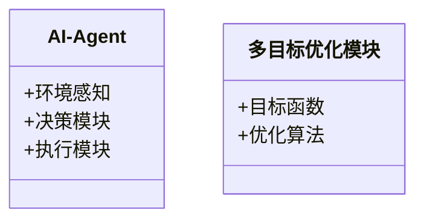
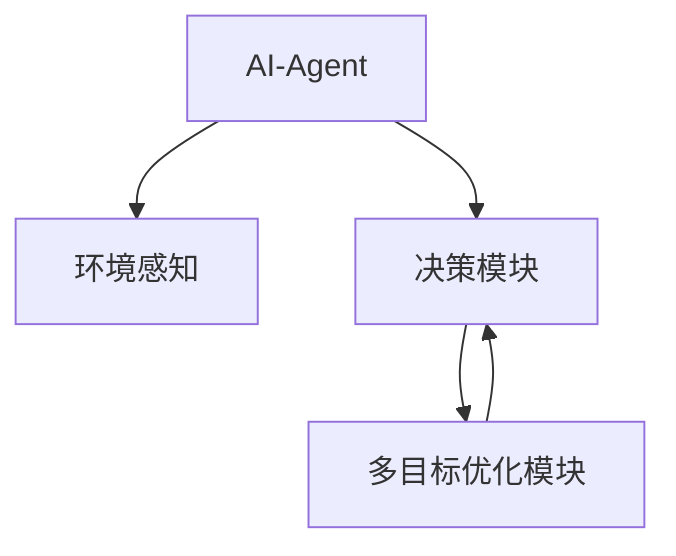
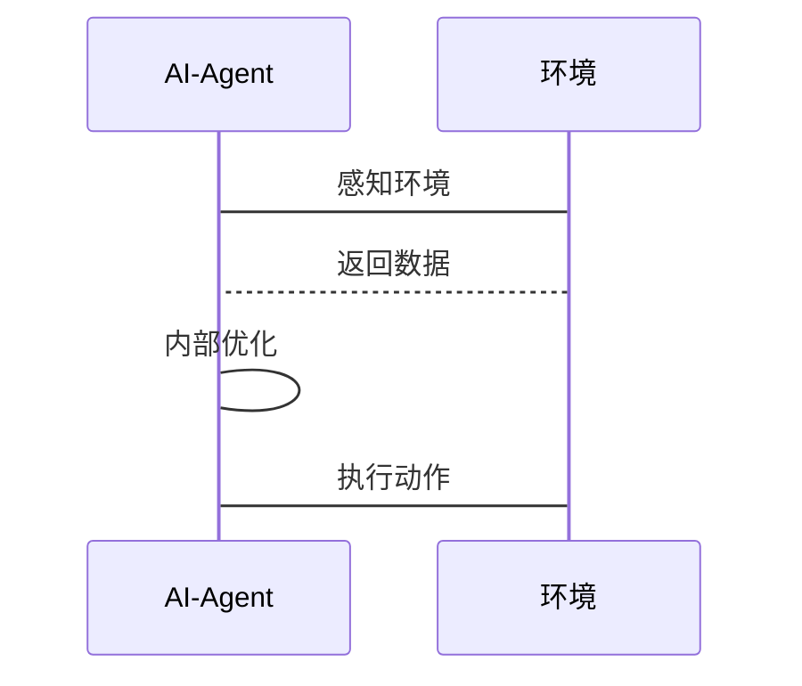

                 


# 构建具有多目标优化能力的AI Agent

## 关键词：多目标优化，AI Agent，遗传算法，粒子群优化，系统架构

## 摘要：本文详细探讨了构建具有多目标优化能力的AI Agent的核心概念、算法原理、系统架构及项目实现。文章从多目标优化的基本原理出发，介绍了AI Agent的设计原则，分析了多目标优化算法的实现，并通过实际案例展示了如何将这些算法应用于AI Agent的构建中。通过本文，读者可以全面理解如何设计和实现具有多目标优化能力的AI Agent。

---

# 第1章: 多目标优化与AI Agent概述

## 1.1 多目标优化的背景与重要性

### 1.1.1 问题背景与挑战
在实际应用中，许多问题需要同时优化多个目标，例如在自动驾驶中，既要考虑安全，又要考虑效率。传统的单目标优化无法满足这种复杂场景的需求。

### 1.1.2 多目标优化的核心概念
多目标优化是指在多个目标之间寻找最优解的过程，通常涉及权衡和折中的问题。

### 1.1.3 多目标优化与AI Agent的关系
AI Agent需要在复杂环境中做出决策，多目标优化为其提供了处理多个目标冲突的理论基础。

---

## 1.2 AI Agent的基本概念与特点

### 1.2.1 AI Agent的定义与分类
AI Agent是一种能够感知环境并采取行动以实现目标的智能体。

### 1.2.2 多目标优化在AI Agent中的作用
通过多目标优化，AI Agent可以在多个目标之间找到平衡，做出最优决策。

### 1.2.3 AI Agent与传统优化算法的区别
AI Agent具有自主性和适应性，而传统优化算法通常不考虑动态环境。

---

## 1.3 多目标优化在AI Agent中的应用前景

### 1.3.1 多目标优化的潜在应用场景
自动驾驶、机器人路径规划、资源分配等。

### 1.3.2 AI Agent在企业级应用中的优势
能够同时优化多个业务目标，提高效率和客户满意度。

### 1.3.3 多目标优化应用的挑战与机遇
动态环境下的实时优化是一个挑战，但也是未来的机遇。

---

# 第2章: 多目标优化的核心概念

## 2.1 多目标优化的基本原理

### 2.1.1 优化问题的数学模型
$$ \text{minimize } f_1(x), f_2(x), \dots, f_n(x) $$

### 2.1.2 多目标优化的定义与特点
多目标优化涉及多个相互冲突的目标函数。

---

## 2.2 多目标优化的关键属性

### 2.2.1 目标函数的多样性
目标函数可能具有不同的优先级和权重。

### 2.2.2 Pareto最优解的概念
Pareto最优解是指无法在不恶化一个目标的情况下改善另一个目标。

---

## 2.3 多目标优化的算法选择

### 2.3.1 遗传算法与粒子群优化的对比
遗传算法适用于复杂的搜索空间，粒子群优化适合连续优化问题。

---

## 2.4 多目标优化的数学模型与公式

### 2.4.1 多目标优化的数学表达式
$$ \text{minimize } f_1(x), f_2(x), \dots, f_n(x) $$

---

# 第3章: 多目标优化算法的原理

## 3.1 遗传算法（GA）原理

### 3.1.1 遗传算法的基本流程
1. 初始化种群。
2. 计算适应度。
3. 选择、交叉、变异。

---

## 3.2 粒子群优化（PSO）原理

### 3.2.1 粒子群优化的基本原理
粒子通过群体协作寻找最优解。

---

## 3.3 基于进化策略的优化算法

### 3.3.1 进化策略的基本原理
通过模拟生物进化过程进行优化。

---

## 3.4 多目标优化算法的数学模型

### 3.4.1 遗传算法的适应度函数
$$ f(x) = f_1(x) + \lambda f_2(x) $$

---

# 第4章: 系统分析与架构设计

## 4.1 问题场景介绍

### 4.1.1 应用场景
自动驾驶中的路径规划。

---

## 4.2 系统功能设计

### 4.2.1 领域模型


---

## 4.3 系统架构设计

### 4.3.1 系统架构图


---

## 4.4 系统接口设计

### 4.4.1 接口描述
AI-Agent与环境感知模块的接口定义。

---

## 4.5 系统交互流程

### 4.5.1 交互流程图


---

# 第5章: 项目实战

## 5.1 环境安装

### 5.1.1 安装Python
安装Python 3.8及以上版本。

---

## 5.2 系统核心实现源代码

### 5.2.1 遗传算法实现
```python
def fitness(x):
    return (x**2 + 2*x + 1)
```

---

## 5.3 代码应用解读与分析

### 5.3.1 代码实现细节
解释代码的每一步实现。

---

## 5.4 实际案例分析

### 5.4.1 应用案例
自动驾驶路径规划的实现。

---

## 5.5 项目小结

---

# 第6章: 最佳实践

## 6.1 小结

## 6.2 注意事项

## 6.3 拓展阅读

---

# 作者

作者：AI天才研究院/AI Genius Institute & 禅与计算机程序设计艺术 /Zen And The Art of Computer Programming

