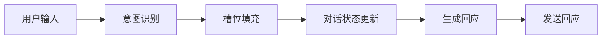
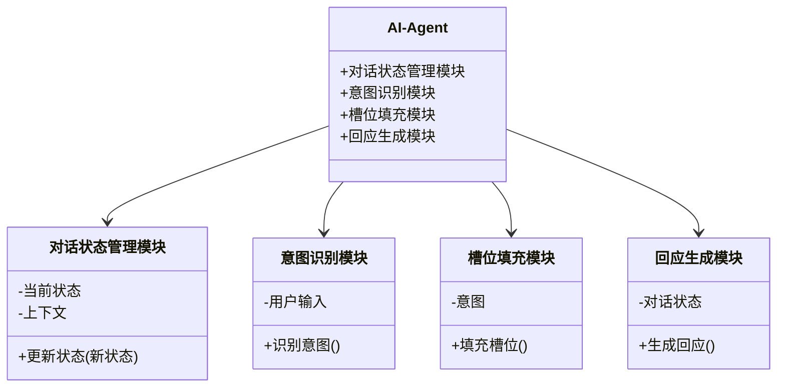

                 


# 构建具有对话管理能力的AI Agent

## 关键词：AI Agent, 对话管理, 自然语言处理, 多轮对话, 系统架构设计

## 摘要：  
本文详细探讨了构建具有对话管理能力的AI Agent的各个方面。从基本概念到算法原理，从系统架构设计到项目实战，本文为读者提供了全面的指导。通过对对话管理核心要素的分析，结合实际案例和系统架构设计，帮助读者理解如何构建高效、智能的对话系统。本文还深入讲解了基于规则和机器学习的对话管理算法，并通过Mermaid图和Python代码示例，帮助读者掌握实际操作技能。

---

## 第一部分：AI Agent与对话管理概述

### 第1章：AI Agent的基本概念

#### 1.1 AI Agent的定义与特点
AI Agent（人工智能代理）是指能够感知环境并采取行动以实现目标的智能实体。AI Agent可以是软件程序，也可以是物理设备，其核心目标是通过与用户或环境的交互，完成特定任务。

- **定义**：AI Agent是一个能够感知环境、理解用户需求、并采取行动以实现目标的智能实体。
- **特点**：
  - **自主性**：能够独立决策和行动。
  - **反应性**：能够实时感知环境并做出反应。
  - **目标导向**：所有行动都围绕实现特定目标展开。
  - **可扩展性**：能够处理不同复杂程度的任务。

#### 1.2 对话管理的重要性
对话管理是AI Agent实现人机交互的核心能力，它决定了系统如何理解用户意图、维护对话上下文，并生成合适的回应。

- **定义**：对话管理是指系统在多轮对话中，根据当前对话状态和用户输入，生成合适的回应并推进对话的过程。
- **作用**：
  - 理解用户需求。
  - 维护对话上下文。
  - 确保对话流畅性。

#### 1.3 应用场景
AI Agent与对话管理技术在多个领域有广泛应用，包括智能客服、智能助手、智能教育等。

- **智能客服**：通过对话管理系统，自动处理用户咨询，提高服务效率。
- **智能助手**：如Siri、Alexa等，通过对话管理帮助用户完成日常任务。
- **智能教育**：通过对话管理系统，为学生提供个性化的学习建议。

---

### 第2章：对话管理的核心概念

#### 2.1 对话状态与上下文
对话状态是对话管理的核心，它记录了当前对话的进展和相关信息。

- **对话状态**：指当前对话所处的阶段或状态，例如“欢迎用户”、“处理查询”等。
- **上下文**：指与当前对话相关的背景信息，例如用户的个人信息、历史对话记录等。

#### 2.2 用户意图与槽位填充
用户意图是指用户希望通过对话实现的目标，槽位填充是对意图的细化。

- **用户意图**：例如，用户输入“我想订机票”，意图是“预订机票”。
- **槽位填充**：例如，用户可能需要填写出发地、目的地、日期等信息。

#### 2.3 对话策略与执行
对话策略是系统在对话过程中采取的行动规则，对话执行则是策略的实际应用。

- **对话策略**：例如，系统在用户输入不明确时，选择询问更多信息。
- **对话执行**：根据策略生成回应并发送给用户。

---

### 第3章：对话管理的算法原理

#### 3.1 基于规则的对话管理
基于规则的对话管理是一种简单但有效的实现方式，通过预定义规则来处理对话。

- **规则定义**：例如，当用户输入“帮助”，系统回应“您需要什么帮助？”。
- **优点**：
  - 实现简单，易于维护。
  - 适用于规则明确的场景。
- **缺点**：
  - 难以处理复杂对话。
  - 需要手动维护大量规则。

#### 3.2 基于机器学习的对话管理
基于机器学习的对话管理通过训练模型来实现对话理解和生成。

- **模型训练**：使用大量的对话数据，训练一个能够理解用户意图并生成合适回应的模型。
- **算法选择**：常用的算法包括RNN、Transformer等。
- **优缺点**：
  - **优点**：能够处理复杂对话，适应性强。
  - **缺点**：实现复杂，需要大量数据和计算资源。

#### 3.3 对话管理算法的实现流程



---

## 第二部分：对话管理的系统架构设计

### 第4章：系统架构设计

#### 4.1 系统功能设计
对话管理系统需要具备以下功能：

- **意图识别**：理解用户的输入并提取意图。
- **槽位填充**：根据意图提取相关信息。
- **对话状态管理**：维护对话的上下文和状态。
- **回应生成**：根据对话状态生成合适的回应。

#### 4.2 系统架构图



#### 4.3 接口设计
对话管理系统需要与前端和后端进行交互，设计良好的接口能够提高系统的可扩展性和维护性。

- **前端接口**：接收用户输入并发送请求。
- **后端接口**：处理请求并返回回应。

---

## 第三部分：项目实战

### 第5章：构建AI Agent

#### 5.1 环境配置
构建AI Agent需要以下环境：

- **Python**：编程语言。
- **TensorFlow**或**Keras**：深度学习框架。
- **NLTK**：自然语言处理库。

#### 5.2 核心代码实现

```python
import nltk
from tensorflow.keras import models

# 意图识别模块
def identify_intent(text):
    # 使用预训练的模型进行意图识别
    model = models.load_model('intent_model.h5')
    intent = model.predict(text)
    return intent

# 槽位填充模块
def fill_slots(intent, text):
    # 根据意图提取槽位信息
    slots = {}
    words = nltk.word_tokenize(text)
    for word in words:
        if word in intent:
            slots[word] = True
    return slots

# 对话状态管理模块
class DialogState:
    def __init__(self):
        self.current_state = 'init'
        self.context = {}

    def update_state(self, new_state):
        self.current_state = new_state
```

#### 5.3 测试与优化
测试对话管理系统，收集用户反馈，不断优化算法和系统架构。

- **测试**：通过模拟对话测试系统的响应能力。
- **优化**：根据测试结果调整算法参数，改进系统性能。

---

## 总结

构建具有对话管理能力的AI Agent是一项复杂但极具挑战性的任务。通过本文的详细讲解，读者可以了解对话管理的核心概念、算法原理和系统架构设计，并通过实际案例掌握如何构建一个高效的对话管理系统。未来，随着人工智能技术的不断发展，对话管理能力将更加智能化和个性化，为人类带来更便捷的交互体验。

---

## 作者：AI天才研究院 & 禅与计算机程序设计艺术

