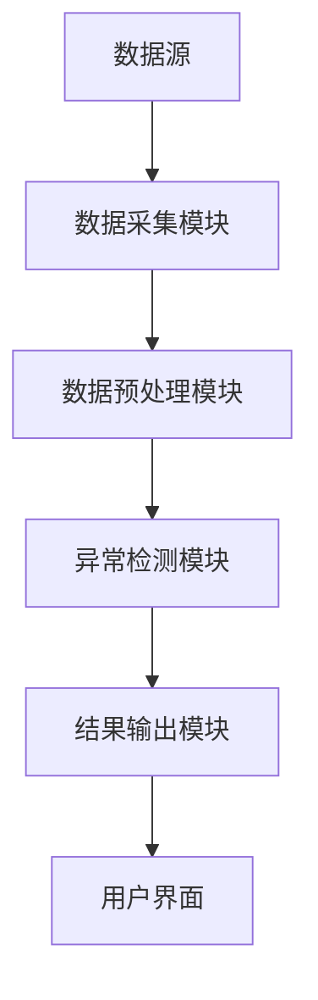

                 


# 构建具有异常检测能力的AI Agent

> **关键词：** 异常检测，AI Agent，机器学习，深度学习，系统架构

> **摘要：**  
本文将详细介绍如何构建一个具有异常检测能力的AI Agent。首先，我们从异常检测的核心概念和AI Agent的基本原理入手，逐步探讨异常检测的算法原理、系统架构设计、项目实战及最佳实践。通过本文，读者将能够全面理解并掌握构建具备异常检测能力的AI Agent的方法与技巧。

---

## 第1章：异常检测与AI Agent的背景介绍

### 1.1 异常检测的定义与核心概念

#### 1.1.1 什么是异常检测
异常检测（Outlier Detection）是数据分析中的一个重要任务，旨在识别数据集中与大多数数据点不符合的异常值。这些异常值可能是由于测量误差、数据录入错误或潜在的模式变化引起的。在AI Agent中，异常检测用于实时监控系统的运行状态，帮助识别潜在的问题或机会。

#### 1.1.2 异常检测的核心要素
- **数据特征：** 数据的特征分布、关联性等。
- **异常定义：** 异常的标准是什么？是基于统计学、机器学习还是领域知识？
- **检测方法：** 统计方法、机器学习方法、深度学习方法等。
- **应用场景：** 安全监控、金融 fraud detection、设备故障预测等。

#### 1.1.3 异常检测的边界与外延
异常检测不仅关注“异常”的数据点，还需要考虑“正常”的数据模式。其外延包括：异常检测的实时性、可解释性、可扩展性等。

### 1.2 AI Agent的基本概念

#### 1.2.1 AI Agent的定义
AI Agent（人工智能代理）是一种能够感知环境、执行任务并做出决策的智能实体。它可以是一个软件程序、机器人或其他智能系统，能够自主或半自主地完成特定目标。

#### 1.2.2 AI Agent的核心功能
- **感知环境：** 通过传感器或其他数据源获取信息。
- **分析数据：** 使用机器学习、自然语言处理等技术对数据进行分析。
- **做出决策：** 根据分析结果制定行动计划。
- **执行任务：** 执行决策并返回结果。

#### 1.2.3 异常检测在AI Agent中的作用
在AI Agent中，异常检测用于实时监控系统的运行状态，识别潜在的问题或机会。例如，在自动驾驶中，异常检测可以用于识别传感器故障或道路状况的异常变化。

---

## 第2章：异常检测的核心概念与联系

### 2.1 异常检测的原理与方法

#### 2.1.1 统计方法
统计方法是基于数据的统计特性（如均值、方差）来检测异常点。常见的统计方法包括：
- **Z-score方法：** 根据数据点与均值的距离标准化后判断是否异常。
- **箱线图法：** 基于四分位数判断数据点是否为异常。

#### 2.1.2 机器学习方法
机器学习方法通过训练模型来识别数据中的异常模式。常见的机器学习方法包括：
- **聚类方法：** 将数据点聚类，孤立点即为异常。
- **基于树的模型：** 如随机森林，可以检测异常点。

#### 2.1.3 深度学习方法
深度学习方法通过神经网络模型（如变自编码器、生成对抗网络）来学习数据的分布，从而识别异常点。

### 2.2 异常检测的核心要素对比

#### 2.2.1 数据特征对比
| 数据特征 | 统计方法 | 机器学习方法 | 深度学习方法 |
|----------|----------|--------------|--------------|
| 数据量   | 小       | 中等         | 大           |
| 数据类型 | 结构化   | 结构化/非结构化 | 结构化/非结构化 |
| 可解释性 | 高       | 中等         | 低           |

#### 2.2.2 算法性能对比
| 算法 | 训练时间 | 可扩展性 | 模型复杂度 |
|------|----------|----------|------------|
| 统计方法 | 快速 | 低 | 低 |
| 机器学习方法 | 中等 | 中等 | 中等 |
| 深度学习方法 | 较长 | 高 | 高 |

#### 2.2.3 场景适用性对比
| 场景 | 统计方法 | 机器学习方法 | 深度学习方法 |
|------|----------|--------------|--------------|
| 实时检测 | 适用 | 适用         | 需优化       |
| 大规模数据 | 不适用 | 适用         | 适用         |
| 高维数据 | 不适用 | 适用         | 适用         |

---

## 第3章：异常检测的算法原理

### 3.1 统计方法

#### 3.1.1 基于Z-score的异常检测
Z-score方法基于标准差标准化数据，公式如下：
$$ z = \frac{x - \mu}{\sigma} $$
其中，$\mu$ 是均值，$\sigma$ 是标准差。通常，$|z| > 3$ 的数据点被认为是异常点。

#### 3.1.2 基于箱线图的异常检测
箱线图基于四分位数（Q1, Q3）计算异常点的范围：
$$ \text{异常点} = \text{数据点} < Q1 - 1.5 \times IQR \text{ 或 } \text{数据点} > Q3 + 1.5 \times IQR $$
其中，$IQR = Q3 - Q1$ 是四分位距。

### 3.2 机器学习方法

#### 3.2.1 基于聚类的异常检测
聚类方法通过将数据点聚类，孤立点即为异常点。例如，使用DBSCAN算法：
$$ \text{密度} = \sum_{d \leq \epsilon} \text{点的数量} $$
密度低于阈值的区域中的点被认为是异常点。

### 3.3 深度学习方法

#### 3.3.1 基于变自编码器的异常检测
变自编码器（VAE）通过重构数据来学习正常数据的分布。异常点是那些重构误差较大的数据点。

$$ \mathcal{L}(\theta) = \mathbb{E}_{x}[ \log p_\theta(x|\mu, \sigma^2) ] + \text{KL}(q(z|x)||p(z)) $$
其中，$\theta$ 是模型参数，$\mu$ 和 $\sigma^2$ 是编码器输出的均值和方差，$p(z)$ 是先验分布。

---

## 第4章：系统架构设计

### 4.1 异常检测AI Agent的功能模块

#### 4.1.1 数据采集模块
数据采集模块负责从各种数据源（如传感器、数据库）获取数据，并将其传递给数据预处理模块。

#### 4.1.2 数据预处理模块
数据预处理模块对数据进行清洗、标准化或特征提取，以适应后续的异常检测算法。

#### 4.1.3 异常检测模块
异常检测模块使用训练好的模型对预处理后的数据进行检测，并输出异常结果。

#### 4.1.4 结果输出模块
结果输出模块将异常检测结果传递给上层系统或用户界面。

### 4.2 系统架构设计图（Mermaid）



---

## 第5章：项目实战

### 5.1 环境安装与配置

#### 5.1.1 安装Python和必要的库
```bash
pip install numpy pandas scikit-learn tensorflow
```

### 5.2 核心代码实现

#### 5.2.1 异常检测模块实现（基于变自编码器）

```python
import numpy as np
import tensorflow as tf

# 数据预处理
x_train = ...  # 训练数据
input_dim = x_train.shape[1]

# 构建变自编码器模型
class VAE(tf.keras.Model):
    def __init__(self, input_dim, latent_dim=2):
        super(VAE, self).__init__()
        self.latent_dim = latent_dim
        self.encoder = tf.keras.Sequential([
            tf.keras.layers.Dense(128, activation='relu'),
            tf.keras.layers.Dense(64, activation='relu'),
            tf.keras.layers.Dense(2 * latent_dim)
        ])
        self.decoder = tf.keras.Sequential([
            tf.keras.layers.Dense(64, activation='relu'),
            tf.keras.layers.Dense(128, activation='relu'),
            tf.keras.layers.Dense(input_dim)
        ])
    
    def call(self, x):
        z_mean, z_log_var = tf.split(self.encoder(x), 2, axis=-1)
        z = tf.random.normal(shape=tf.shape(z_mean), mean=0, stddev=1) * tf.exp(0.5 * z_log_var)
        return self.decoder(z)

# 编译模型
vae = VAE(input_dim)
vae.compile(optimizer='adam', loss=lambda x, x_decoded: tf.reduce_mean(tf.square(x_decoded - x)))

# 训练模型
vae.fit(x_train, x_train, epochs=100, batch_size=32)
```

#### 5.2.2 异常检测结果输出
```python
# 使用训练好的模型进行异常检测
x_test = ...  # 测试数据
reconstructed = vae(x_test)
reconstruction_error = tf.reduce_mean(tf.square(x_test - reconstructed))
threshold = 0.5  # 根据训练数据确定的阈值
is_outlier = reconstruction_error > threshold
```

### 5.3 项目小结
通过本章的实战，我们了解了如何将异常检测算法集成到AI Agent中，并展示了如何使用深度学习方法（如变自编码器）进行异常检测。

---

## 第6章：总结与展望

### 6.1 最佳实践 tips
- **数据预处理：** 异常检测依赖于数据的质量，确保数据清洗和标准化。
- **模型选择：** 根据数据特征和应用场景选择合适的异常检测方法。
- **实时性优化：** 使用轻量级模型或分布式架构提高实时性。

### 6.2 未来发展趋势
- **自适应异常检测：** 随着数据分布的变化，模型需要动态调整。
- **多模态异常检测：** 综合文本、图像等多种数据源进行异常检测。

### 6.3 小结
通过本文的学习，读者可以掌握构建具有异常检测能力的AI Agent的方法，并能够将其应用于实际场景中。

---

**作者：AI天才研究院/AI Genius Institute & 禅与计算机程序设计艺术 /Zen And The Art of Computer Programming**

