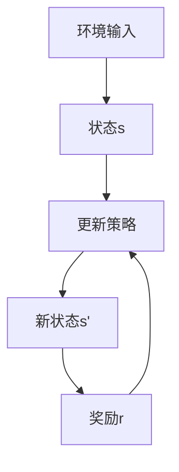
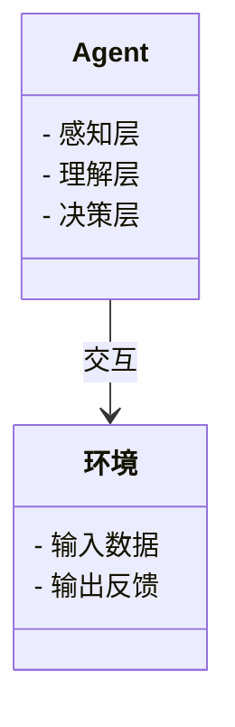
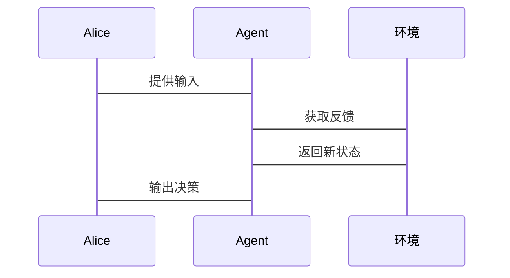

                 


# 《构建具有情境感知能力的AI Agent》

---

## 关键词：
- AI Agent, 情境感知, 人工智能, 算法原理, 系统架构, 项目实战

---

## 摘要：
本文将详细介绍如何构建具有情境感知能力的AI Agent。首先，从背景和核心概念出发，分析问题背景、解决方法和边界条件。接着，深入探讨情境感知AI Agent的核心概念与算法原理，包括注意力机制和强化学习的实现。然后，从系统架构的角度，设计AI Agent的组件、接口和交互流程。最后，通过项目实战，展示如何在实际场景中应用这些技术，并总结最佳实践和未来发展方向。

---

# 第一部分: 情境感知AI Agent的背景与核心概念

## 第1章: 情境感知AI Agent的背景介绍

### 1.1 问题背景与问题描述
在当前AI Agent的发展中，我们面临以下问题：
- **问题背景**：传统AI Agent往往缺乏对上下文的理解，无法根据环境动态调整行为。
- **问题描述**：情境感知能力是AI Agent在复杂场景中实现智能决策的关键，但现有技术在动态环境和多模态数据处理方面存在不足。
- **解决方法**：通过引入注意力机制和强化学习，提升AI Agent的情境感知能力，使其能够理解并适应复杂环境。

### 1.2 情境感知AI Agent的核心概念
- **情境感知的定义**：AI Agent能够理解和利用环境中的上下文信息，做出更智能的决策。
- **核心概念的结构**：包括感知层、理解层和决策层，三者协同工作，实现情境感知。

## 第2章: 情境感知AI Agent的核心概念与联系

### 2.1 核心概念的原理分析
- **感知层**：通过传感器或数据源获取环境信息。
- **理解层**：利用自然语言处理和知识图谱，理解信息的语义和关联。
- **决策层**：基于理解结果，结合强化学习制定最优策略。

### 2.2 概念属性特征对比表
| 比较维度         | 情境感知AI Agent                     | 传统AI Agent                       |
|------------------|--------------------------------------|------------------------------------|
| 处理方式         | 基于上下文动态调整行为               | 静态规则或预定义行为               |
| 决策能力         | 具备动态决策能力                     | 决策能力有限                       |
| 适应性           | 高度适应环境变化                     | 适应性较低                       |

### 2.3 ER实体关系图架构
```mermaid
er
actor(Agent, 感知环境, 决策系统, 交互界面)
relationship(属于, 涉及, 包含)
```

---

# 第二部分: 情境感知AI Agent的算法原理

## 第3章: 情境感知AI Agent的算法原理

### 3.1 注意力机制的原理
- **注意力机制**：通过权重分配，聚焦于重要的信息片段。
- **数学模型**：
  - 查询（q）、键（k）、值（v）的计算：
    $$ q = W_q h_i $$
    $$ k = W_k h_i $$
    $$ v = W_v h_i $$
  - 注意力权重计算：
    $$ a_{ij} = \text{softmax}(\frac{q \cdot k_j}{\sqrt{d}}) $$
  - 最终输出：
    $$ h_i' = \sum_{j} a_{ij} v_j $$

### 3.2 强化学习的实现
- **强化学习框架**：通过奖励机制，优化决策策略。
- **算法流程图**：


### 3.3 代码实现与案例分析
```python
def attention(q, k, v):
    dk = len(k[0])
    scores = q @ k.T / (dk ** 0.5)
    attention_weights = softmax(scores)
    return attention_weights @ v

# 示例
q = [[0.1, 0.2], [0.3, 0.4]]
k = [[0.5, 0.1], [0.6, 0.2]]
v = [[0.7, 0.1], [0.8, 0.3]]

result = attention(q, k, v)
print(result)
```

---

# 第三部分: 情境感知AI Agent的系统架构设计

## 第4章: 系统分析与架构设计方案

### 4.1 系统功能设计
- **领域模型**：


### 4.2 系统架构设计


### 4.3 系统接口设计
- **API接口**：
  - 输入接口：接收环境数据。
  - 输出接口：返回决策结果。

### 4.4 交互流程图


---

# 第四部分: 情境感知AI Agent的项目实战

## 第5章: 项目实战

### 5.1 环境安装与配置
- **工具安装**：安装Python、TensorFlow、Keras等框架。
- **依赖管理**：使用pip安装必要的库。

### 5.2 核心代码实现
```python
class AI_Agent:
    def __init__(self):
        self.attention = AttentionLayer()
        self.decision = DecisionLayer()

    def process(self, input_data):
        context = self.attention(input_data)
        decision = self.decision(context)
        return decision

# 示例调用
agent = AI_Agent()
input_data = [1, 2, 3]
output = agent.process(input_data)
print(output)
```

### 5.3 代码解读与分析
- **类定义**：AI_Agent类包含注意力层和决策层。
- **process方法**：将输入数据传递给注意力层，提取上下文，然后传递给决策层，得到最终决策。

### 5.4 案例分析
- **应用场景**：在智能家居中，AI Agent可以根据用户的行为模式调整设备状态。

---

# 第五部分: 总结与展望

## 第6章: 总结与展望

### 6.1 本章总结
- **核心知识点**：情境感知AI Agent的构建涉及感知、理解、决策三个层次，结合注意力机制和强化学习，实现动态适应能力。
- **学习要点**：理解算法原理，掌握系统架构设计，能够通过代码实现核心功能。

### 6.2 最佳实践Tips
- **数据质量**：确保输入数据的准确性和完整性。
- **模型调优**：通过实验优化注意力机制和强化学习的参数。
- **系统扩展**：结合领域知识，扩展AI Agent的功能。

### 6.3 小结
通过本文的学习，读者可以掌握情境感知AI Agent的核心技术，并在实际项目中应用这些方法。

---

## 作者：
AI天才研究院/AI Genius Institute & 禅与计算机程序设计艺术/Zen And The Art of Computer Programming

