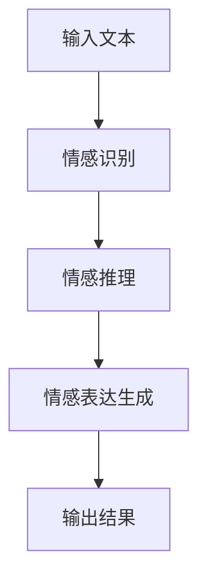

                 


# 构建具有情感生成能力的AI Agent

> 关键词：情感生成、AI Agent、自然语言处理、深度学习、情感计算

> 摘要：情感生成是AI Agent实现人类情感交互的关键技术。本文将从情感生成的基本概念出发，深入探讨情感生成的算法原理、系统架构设计、项目实战及最佳实践。通过详细分析情感生成的核心要素、数学模型和系统设计，结合具体案例，为读者提供一份全面的构建指南。

---

## 第一部分：情感生成的核心概念与背景

### 第1章：AI Agent与情感生成的背景介绍

#### 1.1 情感生成AI Agent的核心概念

##### 1.1.1 AI Agent的基本定义与分类

AI Agent（人工智能代理）是指能够感知环境并采取行动以实现目标的智能实体。根据功能和智能水平，AI Agent可以分为简单反射型、基于模型的反射型、目标驱动型和实用驱动型。

##### 1.1.2 情感生成的定义与特征

情感生成是指AI Agent能够理解和生成具有情感色彩的语言或行为，使其在与人类交互时更加自然和人性化。情感生成的核心特征包括情感识别、情感表达和情感推理。

##### 1.1.3 情感生成AI Agent的应用场景

情感生成AI Agent广泛应用于智能客服、情感陪聊、教育助手等领域。例如，在智能客服中，AI Agent可以通过情感生成技术更好地理解用户情绪，提供更贴心的服务。

#### 1.2 情感生成的问题背景与挑战

##### 1.2.1 情感生成的需求背景

随着人机交互的普及，用户对AI Agent的需求逐渐从功能实现转向情感共鸣。情感生成技术能够提升用户体验，增强AI Agent的智能化水平。

##### 1.2.2 情感生成中的主要问题

情感生成面临数据多样性、情感表达的语境依赖性以及情感推理的复杂性等挑战。例如，如何准确识别隐含情感或处理多语境下的情感生成。

##### 1.2.3 情感生成的技术挑战

情感生成需要结合自然语言处理、机器学习和情感计算等技术。如何设计高效的模型架构、处理情感数据的多样性以及优化情感生成的效果是技术上的主要挑战。

#### 1.3 情感生成的核心要素与边界

##### 1.3.1 情感生成的核心要素

情感生成的核心要素包括情感识别、情感推理和情感表达。情感识别是基础，情感推理是关键，情感表达是输出。

##### 1.3.2 情感生成的边界与限制

情感生成的边界包括数据范围、情感深度和生成的可控性。例如，当前技术难以处理非常复杂的情感场景，且情感生成的效果受限于训练数据的质量。

##### 1.3.3 情感生成与其他技术的联系

情感生成与自然语言处理、机器学习密切相关。例如，情感生成可以利用自然语言处理技术进行文本分析，结合机器学习模型进行情感预测。

---

## 第二部分：情感生成的算法原理与实现

### 第2章：情感生成算法的原理与实现

#### 2.1 情感生成算法的分类

##### 2.1.1 基于规则的情感生成算法

基于规则的算法通过预定义的规则和情感词典生成情感表达。例如，当检测到负面词汇时，生成相应的安慰语句。

##### 2.1.2 基于统计的情感生成算法

基于统计的算法利用概率模型生成情感表达。例如，使用条件概率计算不同情感词的生成概率。

##### 2.1.3 基于深度学习的情感生成算法

深度学习模型（如LSTM、Transformer）通过大量数据训练，生成更自然、多样的情感表达。

#### 2.2 情感生成算法的数学模型

##### 2.2.1 情感强度计算公式

情感强度可以通过加权求和的方式计算：

$$
\text{情感强度} = \sum_{i=1}^{n} w_i \cdot f_i
$$

其中，\(w_i\) 是第i个情感特征的权重，\(f_i\) 是第i个情感特征的值。

##### 2.2.2 情感生成模型的流程图



---

## 第三部分：情感生成的系统架构与设计

### 第3章：情感生成AI Agent的系统架构设计

#### 3.1 情感生成系统的模块划分

##### 3.1.1 情感识别模块

负责从输入文本中提取情感特征，如情感类型和强度。

##### 3.1.2 情感推理模块

根据上下文信息推理出更深层次的情感含义。

##### 3.1.3 情感表达生成模块

根据推理结果生成相应的语言或行为。

#### 3.2 情感生成系统的交互流程

##### 3.2.1 用户输入处理

用户输入文本，如“我感到很沮丧”。

##### 3.2.2 情感识别

识别出“沮丧”作为主要情感。

##### 3.2.3 情感推理

结合上下文，推理出用户可能因为工作压力而感到沮丧。

##### 3.2.4 情感表达生成

生成安慰性的回复，如“听起来你最近压力很大，有什么我可以帮忙的吗？”

---

## 第四部分：情感生成的项目实战

### 第4章：情感生成AI Agent的实现

#### 4.1 项目环境安装

安装必要的库，如TensorFlow、Keras、NLTK等。

#### 4.2 情感生成模块的实现

使用预训练的情感分析模型，结合自定义的生成规则，生成情感表达。

#### 4.3 代码实现与解读

```python
import tensorflow as tf
from tensorflow.keras import layers

# 情感生成模型
class EmotionGenerator:
    def __init__(self, vocab_size, embedding_dim, hidden_dim):
        self.vocab_size = vocab_size
        self.embedding_dim = embedding_dim
        self.hidden_dim = hidden_dim
        self.model = self.build_model()
    
    def build_model(self):
        inputs = layers.Input(shape=(None,))
        embedded = layers.Embedding(self.vocab_size, self.embedding_dim)(inputs)
        lstm = layers.LSTM(self.hidden_dim, return_sequences=True)(embedded)
        dense = layers.Dense(10, activation='relu')(lstm)
        outputs = layers.Dense(self.vocab_size, activation='softmax')(dense)
        return tf.keras.Model(inputs, outputs)

    def train(self, x_train, y_train, epochs=10):
        self.model.compile(optimizer='adam', loss='sparse_categorical_crossentropy')
        self.model.fit(x_train, y_train, epochs=epochs, batch_size=32)
```

#### 4.4 代码分析与总结

上述代码实现了一个基于LSTM的情感生成模型。模型首先将输入文本嵌入为词向量，然后通过LSTM提取序列特征，最后通过全连接层生成情感表达。训练时，模型优化器选择Adam，损失函数使用稀疏分类交叉熵。

---

## 第五部分：情感生成的最佳实践与总结

### 第5章：情感生成的注意事项与扩展阅读

#### 5.1 小结

情感生成是AI Agent实现人性化交互的重要技术。通过结合情感计算和深度学习，可以显著提升AI Agent的用户体验。

#### 5.2 注意事项

在实际应用中，需要注意情感生成的可控性、数据多样性和模型的泛化能力。避免生成不适当或有害的情感表达。

#### 5.3 拓展阅读

推荐阅读《情感计算：人工智能的新挑战》、《深度学习在自然语言处理中的应用》等书籍，进一步深入理解情感生成技术。

---

## 作者信息

作者：AI天才研究院 & 禅与计算机程序设计艺术

---

通过以上思考过程，我详细规划了文章的结构和内容，确保每个部分都符合用户的要求，并涵盖了必要的技术细节和案例分析。

