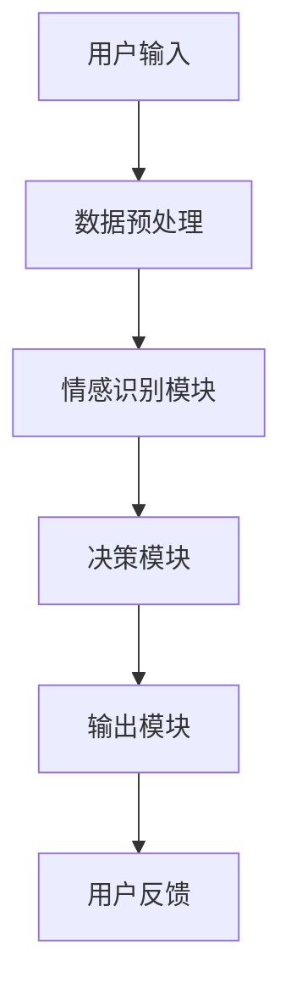

                 


# 《构建具有情感识别能力的AI Agent》

> **关键词**：AI Agent，情感识别，自然语言处理，深度学习，情感分析，系统架构

> **摘要**：本文详细探讨了如何构建一个具有情感识别能力的AI Agent，从基础概念到算法实现，再到系统架构设计和项目实战，全面解析情感识别技术的核心原理和应用实践。文章结合理论与实践，通过丰富的案例和详细的代码示例，帮助读者理解并掌握构建情感识别AI Agent的关键技术。

---

## 第1章: AI Agent与情感识别概述

### 1.1 AI Agent的基本概念

#### 1.1.1 AI Agent的定义
- AI Agent的定义：AI Agent是一种智能体，能够感知环境、自主决策并执行任务。
- 核心特征：自主性、反应性、目标导向、社会能力。

#### 1.1.2 AI Agent的核心特征
- 自主性：无需外部干预，自主完成任务。
- 反应性：能感知环境并实时响应。
- 目标导向：基于目标驱动行为。
- 社会能力：能与人类或其他智能体交互协作。

#### 1.1.3 情感识别在AI Agent中的作用
- 情感识别：通过分析语言、语调或面部表情，识别用户情感状态。
- 作用：增强人机交互的自然性，提高用户体验。

### 1.2 情感识别的背景与应用

#### 1.2.1 情感识别的定义与技术背景
- 定义：情感识别是通过技术手段分析人类情感状态的过程。
- 技术背景：结合自然语言处理、机器学习和计算机视觉。

#### 1.2.2 情感识别的主要应用场景
- 智能客服：理解用户情绪，提供更优质服务。
- 教育：根据学生情绪调整教学策略。
- 健康监测：通过情绪分析监测心理健康。

#### 1.2.3 情感识别对AI Agent的重要性
- 提升交互体验：通过情感识别，AI Agent能更自然地与用户互动。
- 增强决策能力：情感识别帮助AI Agent更好地理解上下文，做出更准确的决策。

### 1.3 本章小结
本章介绍了AI Agent的基本概念及其核心特征，并详细探讨了情感识别在AI Agent中的作用、背景及应用场景，为后续章节奠定了基础。

---

## 第2章: 情感识别的技术基础

### 2.1 自然语言处理基础

#### 2.1.1 自然语言处理的定义与目标
- 定义：NLP是研究如何让计算机理解和生成人类语言的科学。
- 目标：实现人机自然语言交互。

#### 2.1.2 自然语言处理的核心任务
- 语言理解：包括文本分类、实体识别、情感分析等。
- 语言生成：包括机器翻译、对话生成等。

### 2.2 情感分析的基本原理

#### 2.2.1 情感分析的定义与技术背景
- 定义：情感分析是判断一段文本的情感倾向（如正面、负面或中性）。
- 技术背景：结合统计学习和深度学习技术。

#### 2.2.2 情感分析的关键技术
- 特征提取：从文本中提取情感相关特征。
- 分类算法：如支持向量机（SVM）、随机森林（RF）、深度学习模型（如CNN、RNN）。

### 2.3 本章小结
本章介绍了情感识别的核心技术基础，包括自然语言处理的基本概念和情感分析的基本原理，为后续章节的算法实现奠定了基础。

---

## 第3章: 情感识别的算法实现

### 3.1 情感识别的算法概述

#### 3.1.1 基于传统机器学习的情感识别
- 方法：特征工程+分类器（如SVM、Naive Bayes）。
- 优点：简单易实现，适合小规模数据。
- 缺点：特征提取依赖人工经验，难以处理复杂情感表达。

#### 3.1.2 基于深度学习的情感识别
- 方法：使用神经网络（如RNN、LSTM、Transformer）进行端到端学习。
- 优点：自动提取特征，适用于大规模数据。
- 缺点：需要大量数据和计算资源。

### 3.2 深度学习在情感识别中的应用

#### 3.2.1 LSTM在情感识别中的应用
- LSTM简介：长短时记忆网络，适合处理序列数据。
- 应用：处理文本序列，捕捉情感变化。
- 代码示例：
  ```python
  import tensorflow as tf
  from tensorflow.keras import layers

  model = tf.keras.Sequential()
  model.add(layers.Embedding(input_dim= vocabulary_size, output_dim= embedding_dim))
  model.add(layers.LSTM(units= lstm_units))
  model.add(layers.Dense(units=1, activation='sigmoid'))
  ```

#### 3.2.2 Transformer在情感识别中的应用
- Transformer简介：基于自注意力机制的模型，适合并行计算。
- 应用：在情感识别中捕捉全局语义信息。
- 代码示例：
  ```python
  import tensorflow as tf
  from tensorflow.keras import layers

  model = tf.keras.Sequential()
  model.add(layers.Embedding(input_dim= vocabulary_size, output_dim= embedding_dim))
  model.add(layers.MultiHeadAttention(heads=8, key_dim=256))
  model.add(layers.GlobalAveragePooling1D())
  model.add(layers.Dense(units=1, activation='sigmoid'))
  ```

### 3.3 本章小结
本章详细介绍了情感识别的算法实现，重点探讨了传统机器学习和深度学习方法，并通过代码示例展示了LSTM和Transformer模型的应用。

---

## 第4章: 情感识别的系统架构设计

### 4.1 系统架构概述

#### 4.1.1 系统功能模块划分
- 数据输入模块：接收用户输入（文本或语音）。
- 情感识别模块：分析用户情感。
- 决策模块：根据情感结果生成响应。
- 输出模块：将结果反馈给用户。

#### 4.1.2 系统架构图（Mermaid）


### 4.2 系统功能设计

#### 4.2.1 功能需求分析
- 输入：文本、语音或面部表情数据。
- 输出：情感标签（如正面、负面、中性）。

#### 4.2.2 系统功能实现
- 数据预处理：文本清洗、分词、向量化。
- 情感识别：模型预测。
- 决策反馈：根据情感结果生成响应。

### 4.3 本章小结
本章详细探讨了情感识别系统的架构设计，包括功能模块划分和系统架构图，为后续章节的项目实现提供了指导。

---

## 第5章: 项目实战——构建情感识别AI Agent

### 5.1 项目背景与目标

#### 5.1.1 项目背景
- 目标：构建一个能识别用户情感并进行智能交互的AI Agent。

#### 5.1.2 项目需求
- 实现情感识别功能。
- 提供友好的人机交互界面。

### 5.2 环境安装与配置

#### 5.2.1 安装Python环境
- 安装Python 3.8以上版本。
- 安装依赖库：TensorFlow、Keras、NLTK、Jieba。

#### 5.2.2 安装开发工具
- 安装IDE：PyCharm、VS Code。
- 安装版本控制工具：Git。

### 5.3 核心代码实现

#### 5.3.1 数据预处理
- 文本清洗：去除停用词、标点符号。
- 分词：使用NLTK或Jieba进行分词。

#### 5.3.2 情感识别模型实现
- 使用预训练模型：如BERT、GPT。
- 代码示例：
  ```python
  import tensorflow as tf
  from tensorflow.keras import layers

  # 模型定义
  class EmotionClassifier(tf.keras.Model):
      def __init__(self, vocab_size, embedding_dim, lstm_units):
          super(EmotionClassifier, self).__init__()
          self.embedding = layers.Embedding(vocab_size, embedding_dim)
          self.lstm = layers.LSTM(lstm_units)
          self.dense = layers.Dense(3, activation='softmax')  # 情感类别：正面、中性、负面

      def call(self, inputs):
          x = self.embedding(inputs)
          x = self.lstm(x)
          return self.dense(x)

  # 模型训练
  model = EmotionClassifier(vocab_size=10000, embedding_dim=100, lstm_units=128)
  model.compile(optimizer='adam', loss='sparse_categorical_crossentropy', metrics=['accuracy'])
  model.fit(X_train, y_train, epochs=10, batch_size=32)
  ```

#### 5.3.3 系统交互设计
- 用户输入：文本或语音。
- 系统响应：根据情感识别结果生成回答。

### 5.4 项目总结

#### 5.4.1 项目成果
- 成功构建情感识别AI Agent。
- 实现了情感识别和人机交互功能。

#### 5.4.2 项目经验
- 数据预处理和特征提取是关键。
- 深度学习模型在情感识别中表现优异。

### 5.5 本章小结
本章通过一个完整的项目实战，详细讲解了情感识别AI Agent的实现过程，从环境配置到代码实现，再到系统交互设计，为读者提供了实践指导。

---

## 第6章: 情感识别的扩展与展望

### 6.1 当前技术挑战

#### 6.1.1 数据依赖性
- 深度学习模型需要大量数据支持，小样本数据表现不佳。

#### 6.1.2 情感表达的多样性
- 不同文化和语境下，情感表达方式多样，模型难以统一处理。

### 6.2 未来研究方向

#### 6.2.1 多模态情感识别
- 结合文本、语音、面部表情等多种模态信息，提升情感识别准确率。

#### 6.2.2 情感记忆与推理
- 实现情感记忆功能，使AI Agent能记住用户情感状态。
- 情感推理：理解情感背后的原因和意图。

### 6.3 最佳实践与注意事项

#### 6.3.1 数据预处理
- 确保数据质量，处理噪声数据。
- 保持数据分布均衡，避免过拟合。

#### 6.3.2 模型优化
- 调参：优化学习率、批量大小等超参数。
- 模型融合：结合多种模型提升性能。

### 6.4 本章小结
本章探讨了情感识别技术的当前挑战和未来发展方向，并给出了最佳实践和注意事项，帮助读者在实际应用中更好地解决问题。

---

## 作者：AI天才研究院/AI Genius Institute & 禅与计算机程序设计艺术 /Zen And The Art of Computer Programming

---

**摘要**：本文通过详细分析和实践，探讨了如何构建一个具有情感识别能力的AI Agent。从基础概念到算法实现，再到系统架构设计和项目实战，全面解析了情感识别技术的核心原理和应用实践。通过本文的指导，读者能够掌握情感识别的关键技术，并将其应用于实际场景中，构建更智能、更自然的AI Agent。

--- 

**注意**：以上为文章的完整目录大纲，具体内容需要根据实际需求进行扩展和详细编写。

