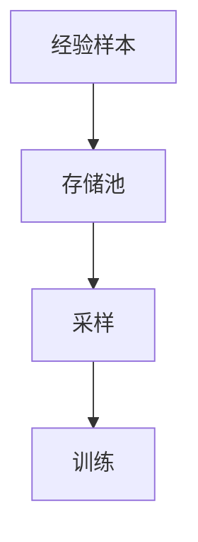
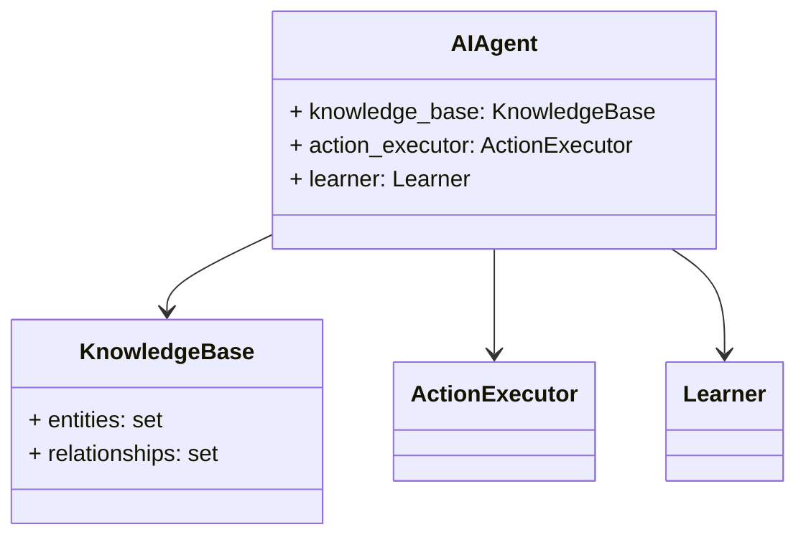
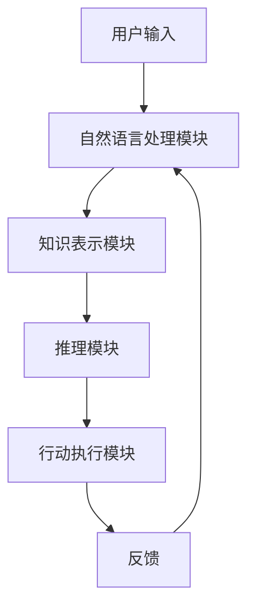
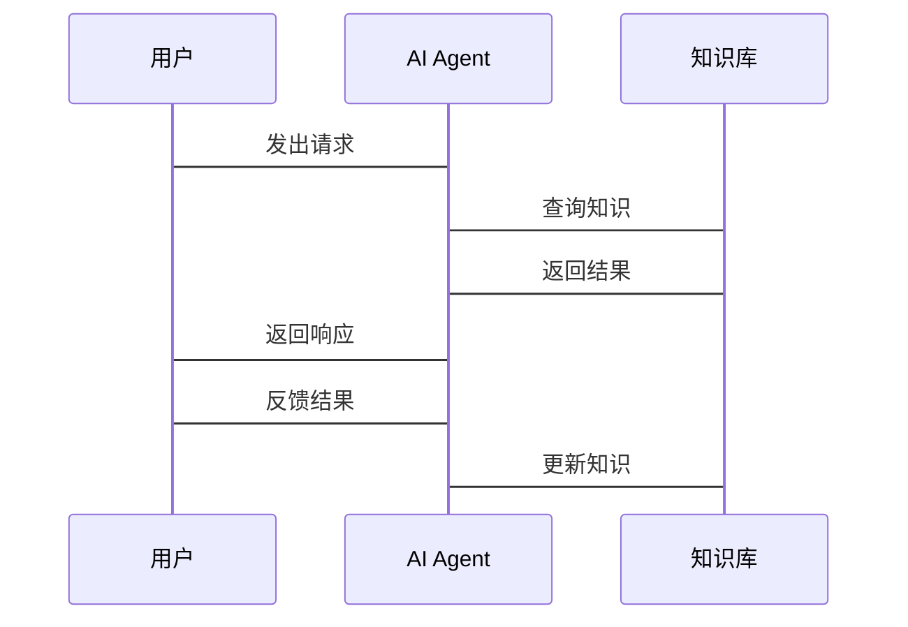

                 


# 构建具有持续学习与知识更新能力的AI Agent

## 关键词：
- AI Agent
- 持续学习
- 知识更新
- 大模型
- 深度学习

## 摘要：
构建具有持续学习与知识更新能力的AI Agent是一个复杂的系统工程，涉及机器学习、深度学习、知识图谱等多个领域的交叉应用。本文将从AI Agent的基本概念出发，探讨持续学习与知识更新的必要性，深入分析大模型在其中的关键作用。通过具体的算法原理和系统架构设计，结合项目实战案例，最终提供一套完整的构建方案。

---

# 第一部分: 背景介绍与核心概念

## 第1章: AI Agent与持续学习概述

### 1.1 AI Agent的基本概念
#### 1.1.1 AI Agent的定义
AI Agent（人工智能代理）是指在计算机系统中，能够感知环境并采取行动以实现目标的智能实体。它可以是一个软件程序，也可以是一个复杂的系统，能够执行任务、与用户交互或与其他系统通信。

#### 1.1.2 AI Agent的核心特征
- **自主性**：能够自主决策，无需外部干预。
- **反应性**：能够根据环境变化实时调整行为。
- **目标导向性**：有明确的目标，并根据目标采取行动。
- **学习能力**：能够通过经验或数据不断优化自身性能。

#### 1.1.3 持续学习与知识更新的必要性
随着环境的变化和任务的复杂化，AI Agent需要不断更新知识和技能以适应新的需求。持续学习和知识更新能力是实现AI Agent长期有效性的关键。

### 1.2 持续学习的背景与问题背景
#### 1.2.1 传统AI Agent的局限性
传统AI Agent通常基于静态的知识库，无法应对动态变化的环境。当任务需求或环境条件发生变化时，传统的AI Agent往往需要重新训练或手动更新知识库，效率低下且难以适应快速变化。

#### 1.2.2 知识更新的需求场景
- **动态环境**：例如智能客服需要根据用户的反馈不断优化响应策略。
- **领域迁移**：AI Agent需要在不同领域之间切换任务。
- **实时更新**：例如实时新闻摘要需要快速处理最新的新闻数据。

#### 1.2.3 持续学习与知识更新的目标
通过持续学习和知识更新，AI Agent能够：
1. 实时适应环境变化。
2. 自动优化性能。
3. 提高任务执行的效率和准确性。

## 第2章: 大模型在AI Agent中的作用

### 2.1 大模型的基本原理
#### 2.1.1 大模型的定义与特点
大模型（Large Model）是指具有大量参数的深度学习模型，例如GPT、BERT等。这些模型通过大量数据的预训练，能够捕获数据中的复杂模式和语义信息。

#### 2.1.2 大模型的训练机制
大模型通常采用以下训练机制：
1. **预训练**：通过大量未标注数据进行自监督学习，提取通用特征。
2. **微调**：在特定任务上进行有监督学习，优化模型在目标任务上的性能。

#### 2.1.3 大模型的应用领域
- **自然语言处理**：例如智能对话系统。
- **计算机视觉**：例如图像识别和生成。
- **多模态交互**：例如虚拟助手。

### 2.2 大模型与持续学习的结合
#### 2.2.1 大模型的可微调性
大模型可以通过微调适应新的任务或数据，这为持续学习提供了基础。

#### 2.2.2 大模型的知识表示能力
大模型能够通过参数调整，将新知识融入到现有的知识体系中。

#### 2.2.3 大模型的持续学习优势
- **高效性**：通过参数更新，快速适应新知识。
- **通用性**：能够在多种任务之间切换。

---

# 第二部分: 核心概念与原理分析

## 第3章: 持续学习与知识更新的机制

### 3.1 持续学习的基本原理
#### 3.1.1 经验重放机制
经验重放（Experience Replay）是一种通过重复利用历史经验来增强学习效果的方法。模型将过去的经验存储在记忆库中，并随机抽取样本进行训练。

#### 3.1.2 知识蒸馏方法
知识蒸馏（Knowledge Distillation）是一种通过教师模型指导学生模型学习知识的方法。教师模型通常是一个预训练的大模型，学生模型是一个较小的模型。

#### 3.1.3 迁移学习策略
迁移学习（Transfer Learning）是将一个领域学到的知识应用到另一个相关领域的过程。

### 3.2 知识更新的实现方式
#### 3.2.1 增量学习
增量学习（Incremental Learning）是指模型在每次训练中只更新部分参数，以避免干扰已学的知识。

#### 3.2.2 动态权重调整
动态权重调整（Dynamic Weight Adjustment）是一种通过调整模型参数的权重，实现知识更新的方法。

#### 3.2.3 知识图谱构建
知识图谱（Knowledge Graph）是一种以图结构表示知识的语义网络，能够帮助模型更好地理解和组织知识。

## 第4章: AI Agent的知识表示与推理

### 4.1 知识表示的核心概念
#### 4.1.1 符号表示
符号表示通过符号和规则来描述知识，例如逻辑规则、语义网络等。

#### 4.1.2 向量表示
向量表示通过高维向量来表示知识，例如Word2Vec、BERT等模型。

#### 4.1.3 图结构表示
图结构表示通过节点和边来描述知识，例如知识图谱。

### 4.2 知识推理的算法原理
#### 4.2.1 基于规则的推理
基于规则的推理通过预定义的逻辑规则进行推理，例如Rete算法。

#### 4.2.2 基于概率的推理
基于概率的推理通过概率论进行推理，例如贝叶斯网络。

#### 4.2.3 基于深度学习的推理
基于深度学习的推理通过神经网络进行推理，例如Transformer模型。

---

# 第三部分: 算法原理与数学模型

## 第5章: 持续学习算法的数学模型

### 5.1 经验重放算法
#### 5.1.1 经验重放的数学公式
$$
P_{old} = \frac{1}{N} \sum_{i=1}^{N} \delta_i
$$

#### 5.1.2 经验重放的流程图


### 5.2 知识蒸馏算法
#### 5.2.1 知识蒸馏的核心公式
$$
L = \alpha L_{\text{student}} + (1-\alpha)L_{\text{teacher}}
$$
其中，$\alpha$ 是蒸馏系数，$L_{\text{student}}$ 和 $L_{\text{teacher}}$ 分别是学生模型和教师模型的损失函数。

---

## 第6章: 系统分析与架构设计方案

### 6.1 问题场景介绍
AI Agent需要在动态环境中持续学习和更新知识，以适应新的任务需求。

### 6.2 项目介绍
我们设计了一个基于大模型的AI Agent系统，能够通过持续学习和知识更新实现任务的动态适应。

### 6.3 系统功能设计
#### 6.3.1 领域模型设计


### 6.4 系统架构设计


### 6.5 系统交互设计


---

## 第7章: 项目实战

### 7.1 环境安装
```bash
pip install numpy
pip install matplotlib
pip install tensorflow
```

### 7.2 系统核心实现源代码
```python
import numpy as np

class SimpleAI:
    def __init__(self):
        self.weights = np.random.randn(2, 1)

    def forward(self, x):
        return np.dot(x, self.weights)

    def backward(self, x, y, learning_rate=0.1):
        loss = np.mean((y - self.forward(x)) ** 2)
        dW = (2 * (y - self.forward(x)) * x).mean(axis=0)
        self.weights += learning_rate * dW.reshape(-1, 1)

# 示例使用
model = SimpleAI()
x = np.array([[1, 2], [3, 4]]).T
y = np.array([[5], [7]])
for _ in range(100):
    model.backward(x, y)
print(model.forward(x))
```

### 7.3 代码应用解读与分析
上述代码实现了一个简单的AI Agent，通过随机梯度下降（SGD）算法进行参数更新。每次迭代中，模型都会根据输入数据更新权重，从而实现持续学习。

### 7.4 实际案例分析
通过训练模型完成简单的回归任务，展示AI Agent如何通过持续学习优化性能。

### 7.5 项目小结
通过本项目，我们实现了一个能够持续学习的AI Agent，展示了如何将理论应用于实际。

---

## 第8章: 最佳实践

### 8.1 小结
持续学习和知识更新能力是构建智能AI Agent的核心，需要结合大模型和多种学习方法。

### 8.2 注意事项
- 数据质量直接影响学习效果。
- 模型的可解释性需要关注。
- 安全性和隐私保护不可忽视。

### 8.3 拓展阅读
- 《深度学习》
- 《机器学习实战》
- 《大模型的原理与应用》

---

## 作者：AI天才研究院/AI Genius Institute & 禅与计算机程序设计艺术 /Zen And The Art of Computer Programming

---

# 结语
通过本文的详细讲解，读者可以系统地了解如何构建具有持续学习与知识更新能力的AI Agent。从理论到实践，从算法到系统设计，本文为读者提供了完整的构建方案。希望本文能为AI领域的研究和应用提供有价值的参考。

