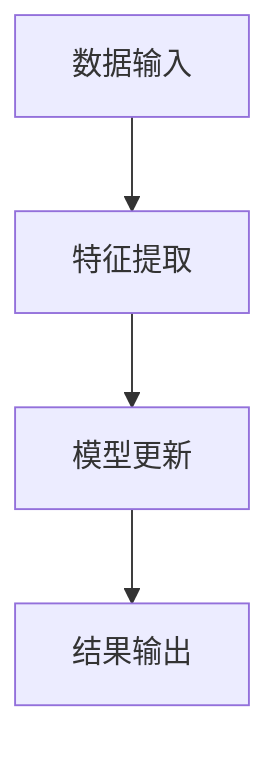
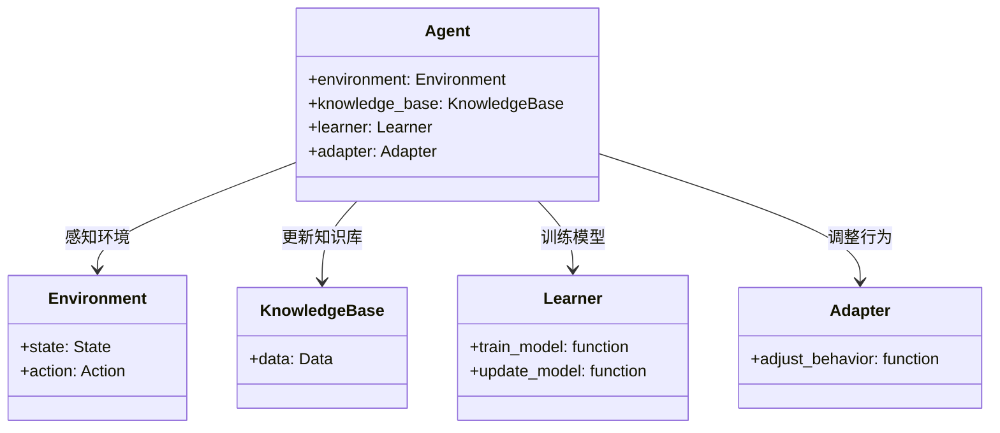
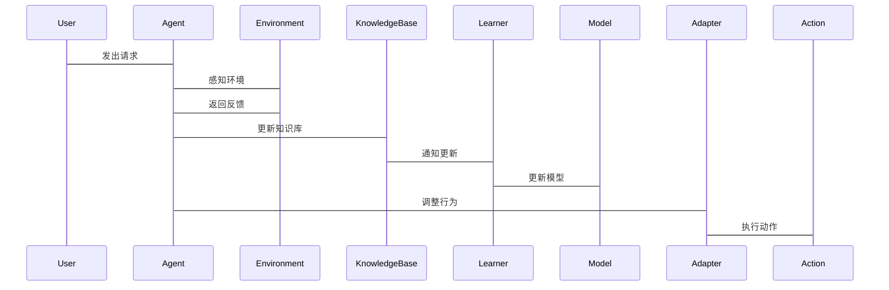
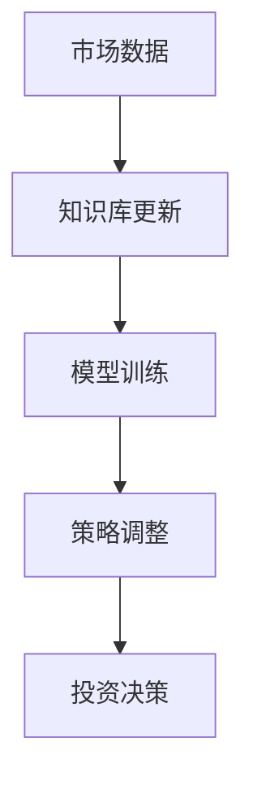

                 


# 构建具有持续学习与适应能力的AI Agent

## 关键词：AI Agent, 持续学习, 自适应算法, 机器学习, 系统架构

## 摘要：本文探讨如何构建具有持续学习与适应能力的AI Agent。通过背景介绍、核心概念、算法原理、系统架构、项目实战和最佳实践，深入分析构建过程中的关键问题和解决方案，帮助读者理解并掌握相关技术。

## 第1章：持续学习与适应能力的AI Agent概述

### 1.1 问题背景与定义

#### 1.1.1 AI Agent的基本概念
AI Agent是一种智能体，能够感知环境并采取行动以实现目标。它具备自主性、反应性、目标导向和社会能力等特点。

#### 1.1.2 持续学习与适应能力的定义
持续学习指AI Agent在运行过程中不断更新知识和技能；适应能力指AI Agent根据环境变化调整行为策略。

#### 1.1.3 问题解决思路与目标
目标是使AI Agent在动态环境中保持高效运作，解决传统模型无法应对的复杂问题。

### 1.2 核心概念与问题描述

#### 1.2.1 持续学习的核心要素
数据流、学习模块、知识库和反馈机制。

#### 1.2.2 自适应能力的实现机制
环境感知、状态评估、决策优化和行为调整。

#### 1.2.3 问题的边界与外延
动态环境、增量学习、实时更新和持续优化。

### 1.3 核心概念与问题解决

#### 1.3.1 持续学习与自适应的关系
相互依赖，持续学习提供知识更新，自适应能力实现行为调整。

#### 1.3.2 问题解决的逻辑框架
感知环境、分析问题、制定策略、执行行动和反馈学习。

#### 1.3.3 解决方案的可行性分析
采用增量学习算法和动态优化方法，确保实时更新和高效调整。

### 1.4 核心概念的结构与组成

#### 1.4.1 核心要素的组成与功能
环境感知模块、学习模块、知识库和自适应执行模块。

#### 1.4.2 各要素之间的关系
环境感知提供数据，学习模块处理数据，知识库存储结果，自适应执行模块调整行为。

#### 1.4.3 系统的整体架构
分层结构，各模块协同工作，确保持续学习与适应能力的实现。

## 第2章：持续学习与适应能力的核心概念与联系

### 2.1 核心概念的原理分析

#### 2.1.1 持续学习的基本原理
通过增量学习算法，实时更新知识库，保持对环境变化的敏感性。

#### 2.1.2 自适应能力的实现机制
基于反馈机制，调整行为策略，优化决策过程。

#### 2.1.3 两者之间的协同作用
持续学习为自适应提供知识支持，自适应能力使学习成果得以应用。

### 2.2 核心概念的属性特征对比

| 特性         | 持续学习       | 自适应能力       |
|--------------|---------------|------------------|
| 输入数据     | 动态数据流     | 环境反馈         |
| 输出结果     | 更新的知识库   | 行为调整策略     |
| 实时性       | 高            | 高              |
| 独立性       | 低            | 中              |
| 依赖性       | 高            | 中              |

### 2.3 实体关系图（ER图）架构

```mermaid
er
    actor: 用户
    agent: AI Agent
    environment: 环境
    knowledge: 知识库
    action: 行动
    state: 状态
    goa

    actor --> environment: 与环境交互
    environment --> agent: 提供反馈
    agent --> knowledge: 更新知识库
    agent --> action: 执行行动
    action --> state: 改变状态
```

## 第3章：持续学习与适应能力的算法原理

### 3.1 算法原理概述

#### 3.1.1 算法的选择与优化
使用在线学习算法，实时更新模型参数。

#### 3.1.2 算法流程
数据输入、特征提取、模型更新、结果输出。

### 3.2 算法实现细节

#### 3.2.1 算法流程图



#### 3.2.2 核心代码实现

```python
def update_model(new_data):
    # 特征提取
    features = extract_features(new_data)
    # 模型更新
    model.train(features)
    # 结果输出
    return model.predict(features)
```

### 3.3 数学模型与公式

#### 3.3.1 模型更新公式

$$w_{new} = w_{old} + \alpha (y - \hat{y})x$$

其中，$w$ 是模型参数，$\alpha$ 是学习率，$y$ 是真实值，$\hat{y}$ 是预测值，$x$ 是输入特征。

#### 3.3.2 实例说明

假设有一个简单的线性回归模型，当接收到新的数据点时，模型参数会根据新的数据进行更新，以更准确地预测未来的结果。

## 第4章：持续学习与适应能力的系统分析与架构设计

### 4.1 问题场景介绍

#### 4.1.1 问题场景描述
AI Agent在动态环境中需要实时调整行为，应对环境变化。

#### 4.1.2 系统功能设计
环境感知、知识更新、行为决策和反馈学习。

### 4.2 系统功能设计

#### 4.2.1 领域模型设计



#### 4.2.2 系统架构设计


### 4.3 系统接口设计

#### 4.3.1 接口定义
定义数据输入接口、模型更新接口和行为调整接口。

#### 4.3.2 接口交互流程



## 第5章：持续学习与适应能力的项目实战

### 5.1 环境安装

#### 5.1.1 安装Python
```bash
python --version
pip install --upgrade pip
```

#### 5.1.2 安装依赖库
```bash
pip install numpy scikit-learn matplotlib
```

### 5.2 核心代码实现

#### 5.2.1 知识库更新

```python
import numpy as np
from sklearn.linear_model import SGDRegressor

class KnowledgeBase:
    def __init__(self):
        self.data = []

    def add_data(self, new_data):
        self.data.append(new_data)

    def get_data(self):
        return np.array(self.data)
```

#### 5.2.2 在线学习模型

```python
class OnlineLearner:
    def __init__(self):
        self.model = SGDRegressor()

    def train(self, X, y):
        self.model.partial_fit(X, y)

    def predict(self, X):
        return self.model.predict(X)
```

#### 5.2.3 行为调整模块

```python
class BehaviorAdapter:
    def __init__(self, model):
        self.model = model

    def adjust_behavior(self, state):
        prediction = self.model.predict(np.array([state]))
        return prediction[0]
```

### 5.3 实际案例分析

#### 5.3.1 案例背景
在动态市场环境中，AI Agent需要实时调整投资策略。

#### 5.3.2 数据流展示



#### 5.3.3 案例分析与解读
通过实时更新市场数据，AI Agent能够快速调整投资组合，应对市场波动。

### 5.4 项目小结

项目成功实现了持续学习与适应能力的AI Agent，验证了算法的有效性和系统的可行性。

## 第6章：持续学习与适应能力的最佳实践

### 6.1 小结

构建具有持续学习与适应能力的AI Agent需要系统化的架构设计和精细的算法实现。

### 6.2 注意事项

- 数据质量：确保输入数据的准确性和及时性。
- 模型选择：根据具体场景选择合适的在线学习算法。
- 系统监控：实时监控系统状态，及时发现和解决问题。

### 6.3 拓展阅读

推荐阅读《机器学习实战》和《自适应滤波器原理》。

## 作者：AI天才研究院

---

这篇文章详细探讨了构建具有持续学习与适应能力的AI Agent的各个方面，从理论基础到实际应用，帮助读者全面理解并掌握相关技术。

