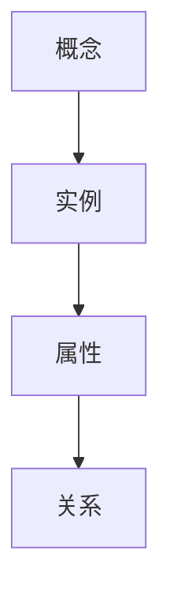
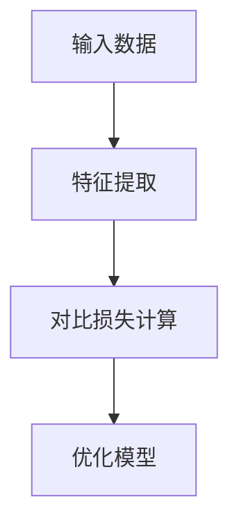
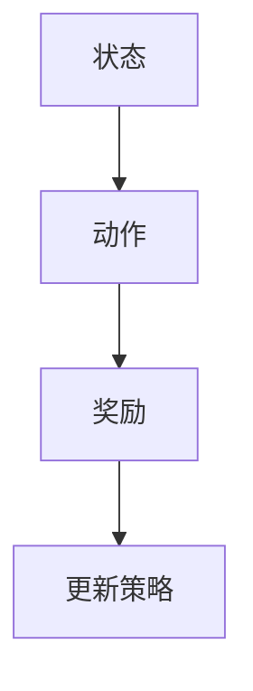
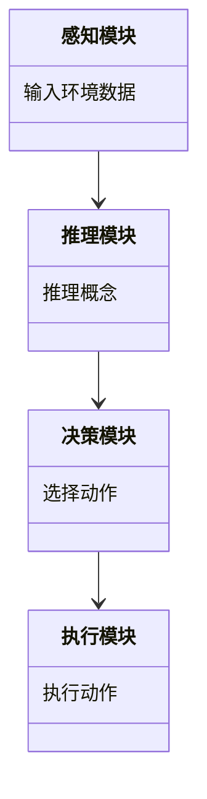
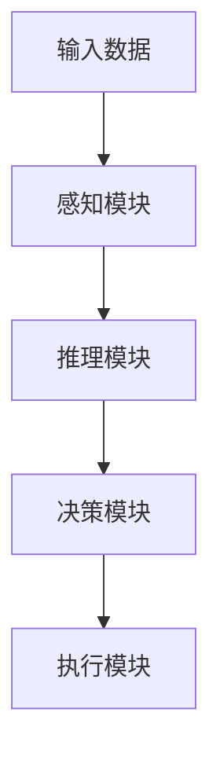

                 


# 构建具有概念学习与泛化能力的AI Agent

> 关键词：AI Agent, 概念学习, 泛化能力, 对比学习, 强化学习, 系统架构设计

> 摘要：本文详细探讨了构建具有概念学习与泛化能力的AI Agent的各个方面。从背景介绍、核心概念、算法原理到系统架构设计、项目实战，最后总结与展望。文章通过理论与实践相结合的方式，深入分析了概念学习与泛化的原理、实现方法及应用场景，为读者提供了一套完整的解决方案。

---

## 第一部分: AI Agent 的概念与背景

### 第1章: AI Agent 的基本概念

#### 1.1 AI Agent 的定义与特点
AI Agent（智能体）是指能够感知环境、做出决策并执行动作的智能系统。与传统AI相比，AI Agent 更注重自主性、反应性和适应性。其核心特点包括：
- **自主性**：能够在没有外部干预的情况下独立运作。
- **反应性**：能够实时感知环境并做出响应。
- **学习能力**：能够通过经验改进自身的性能。

#### 1.2 概念学习与泛化的背景介绍
概念学习是AI Agent实现智能的基础，它使AI Agent能够理解抽象的概念并将其应用到新的情境中。泛化能力则是指AI Agent能够将所学的概念推广到未见过的情况。例如，在图像识别任务中，AI Agent需要能够识别不同种类的物体，而不仅仅是训练集中出现的物体。

#### 1.3 概念学习与泛化的边界与外延
- **概念学习的边界**：概念学习的范围通常限于特定领域，例如在医疗领域，AI Agent需要学习特定的医学概念。
- **泛化的边界**：泛化能力受到数据分布和任务复杂度的限制，过于复杂的泛化可能导致性能下降。
- **联系与区别**：概念学习是泛化的基础，而泛化是概念学习的应用和扩展。

---

### 第2章: 概念学习与泛化的核心概念

#### 2.1 概念学习的原理
概念学习的核心是通过归纳推理从实例中提取概念。例如，通过多个“猫”的图像，AI Agent可以学习“猫”的概念。其原理包括：
1. **特征提取**：从实例中提取关键特征。
2. **概念形成**：通过特征的组合形成概念。
3. **验证与修正**：通过验证实例是否符合概念，不断修正概念的准确性。

#### 2.2 概念学习与泛化的 ER 实体关系图


#### 2.3 概念学习与泛化的数学模型
$$ P(\text{概念}|x) = \prod_{i=1}^n P(x_i|\text{概念}) $$
其中，$x_i$ 表示实例的特征，$\text{概念}$ 表示概念的类别。

---

### 第3章: 概念学习与泛化的算法原理

#### 3.1 对比学习算法
对比学习通过比较不同实例的相似性来增强模型的泛化能力。其流程如下：
1. 输入数据
2. 特征提取
3. 对比损失计算
4. 优化模型

流程图如下：


#### 3.2 强化学习算法
强化学习通过与环境的交互来优化策略。其流程如下：
1. 状态感知
2. 动作选择
3. 奖励计算
4. 策略优化

流程图如下：


---

## 第二部分: 算法原理与系统架构设计

### 第4章: 算法原理

#### 4.1 对比学习的数学公式
对比学习的核心是通过计算实例之间的相似性来优化模型。其损失函数可以表示为：
$$ L = -\log \text{sim}(x_i, x_j) - \log \text{sim}(x_i, x_k) $$
其中，$\text{sim}$ 表示相似性函数。

#### 4.2 强化学习的策略优化
强化学习通过最大化累积奖励来优化策略。策略函数可以表示为：
$$ \pi_\theta(a|s) = \text{softmax}(\theta s) $$
其中，$s$ 是状态，$a$ 是动作，$\theta$ 是参数。

### 第5章: 系统架构设计

#### 5.1 系统功能设计
系统功能模块包括：
- 感知模块：负责感知环境
- 推理模块：负责概念推理
- 决策模块：负责策略选择
- 执行模块：负责动作执行

类图如下：


#### 5.2 系统架构设计
系统架构设计包括：
- 数据流设计
- 模块交互设计
- 并行与分布式设计

架构图如下：


---

## 第三部分: 项目实战与总结

### 第6章: 项目实战

#### 6.1 环境安装
需要安装的环境包括：
- Python 3.x
- PyTorch
- transformers库

#### 6.2 核心代码实现
以下是一个简单的对比学习代码示例：
```python
import torch
import torch.nn as nn

class ContrastiveLoss(nn.Module):
    def __init__(self, temperature=0.1):
        super(ContrastiveLoss, self).__init__()
        self.temperature = temperature

    def forward(self, features, labels):
        features = features.view(features.size(0), -1)
        features = nn.functional.normalize(features, dim=1)
        labels = labels.view(-1)
        similarity = torch.mm(features, features.t())
        diag = similarity.diag().repeat(similarity.size(0))
        loss = (similarity - diag).pow(2).mean()
        return loss
```

### 第7章: 总结与展望

#### 7.1 总结
本文详细探讨了构建具有概念学习与泛化能力的AI Agent的各个方面，从理论到实践，为读者提供了一套完整的解决方案。

#### 7.2 展望
未来的研究方向包括：
- 更高效的概念学习算法
- 更强的泛化能力
- 多模态学习的结合

---

## 最佳实践 Tips

- **小结**：概念学习与泛化能力是AI Agent的核心能力，需要从算法和系统架构两方面进行优化。
- **注意事项**：在实际应用中，需要根据具体任务调整算法参数和系统架构。
- **拓展阅读**：推荐阅读相关领域的最新论文和书籍。

---

作者：AI天才研究院/AI Genius Institute & 禅与计算机程序设计艺术 /Zen And The Art of Computer Programming

