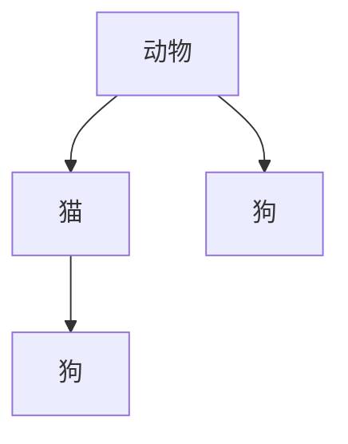
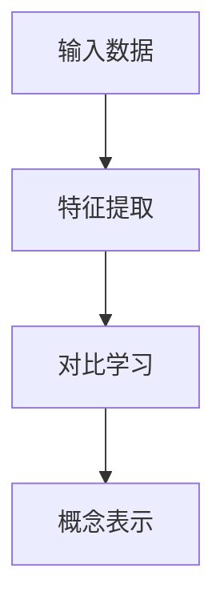
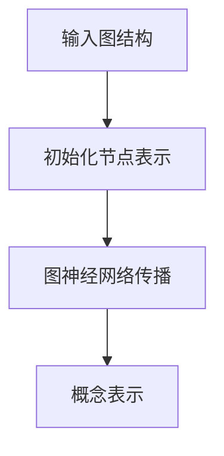
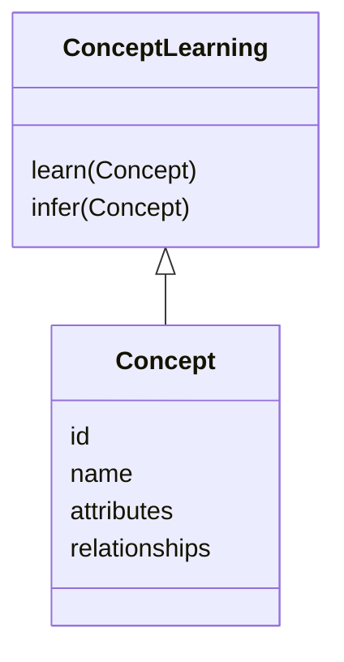
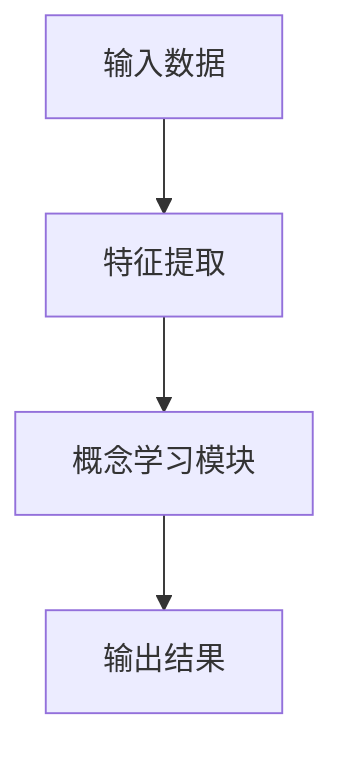

                 


# 构建具有概念学习能力的AI Agent

## 关键词：概念学习，AI Agent，机器学习，知识图谱，系统架构

## 摘要：本文将详细探讨构建具有概念学习能力的AI Agent的背景、核心概念、算法原理、系统架构及项目实战。通过分析概念学习的原理和应用，结合对比学习和图神经网络的算法，设计出高效的系统架构，并通过实际案例展示如何实现概念学习能力，为读者提供全面的指导和深入的见解。

---

## 第一章：概念学习能力的核心概念与问题背景

### 1.1 问题背景与概念结构

#### 1.1.1 概念学习能力的定义
概念学习能力是指AI Agent能够理解、识别和掌握特定领域中的概念及其关系，从而能够进行推理和决策的能力。例如，AI Agent可以识别“猫”的概念，并理解“猫”与“动物”的关系。

#### 1.1.2 概念学习在AI Agent中的重要性
- **提高决策能力**：概念学习使AI Agent能够理解任务中的关键概念，从而做出更准确的决策。
- **增强适应性**：通过概念学习，AI Agent可以适应不同领域和场景的需求。
- **提升交互能力**：概念学习使AI Agent能够更好地理解用户的意图和上下文，从而提供更自然的交互体验。

#### 1.1.3 概念学习的边界与外延
- **边界**：概念学习主要关注概念的识别和关联，不涉及具体的数据处理和任务执行。
- **外延**：概念学习可以应用于多种任务，如问答系统、推荐系统和自然语言理解等。

### 1.2 概念学习的核心要素

#### 1.2.1 概念的表示与建模
概念可以通过多种方式表示，包括符号表示、向量表示和图结构表示。符号表示清晰明确，但难以处理复杂关系；向量表示能够捕捉语义相似性，但缺乏符号的明确性；图结构表示能够有效捕捉概念间的复杂关系。

#### 1.2.2 概念间的关联与依赖
概念之间的关联可以通过多种方式建模，包括属性关系、层次关系和语义关系。例如，“猫”是“动物”的一个子类，具有“毛茸茸”和“四条腿”等属性。

#### 1.2.3 概念学习的驱动因素
概念学习的驱动因素包括数据质量、算法选择和计算能力。高质量的数据能够提高学习效果，选择合适的算法可以优化学习过程，强大的计算能力能够处理复杂任务。

---

## 第二章：概念学习能力的核心概念与联系

### 2.1 概念学习的原理

#### 2.1.1 概念学习的基本原理
概念学习的基本原理包括特征提取、关联分析和语义建模。特征提取从数据中提取关键特征，关联分析发现概念间的关联，语义建模捕捉概念的语义信息。

#### 2.1.2 概念学习的核心算法
- **对比学习**：通过对比不同概念的特征，学习其差异和相似性。
- **图神经网络**：通过图结构建模概念间的复杂关系，捕捉其语义信息。

#### 2.1.3 概念学习的数学模型
概念学习的数学模型可以表示为：
$$ C = f(x) $$
其中，$C$ 是概念，$x$ 是输入数据，$f$ 是学习模型。

### 2.2 概念属性特征对比表格

| 概念 | 属性1 | 属性2 | 属性3 |
|------|-------|-------|-------|
| 猫    | 毛茸茸 | 四条腿 | 小型动物 |
| 动物  | 有脊椎 | 有生命 | 多样性 |

### 2.3 ER实体关系图架构



---

## 第三章：概念学习能力的算法原理讲解

### 3.1 对比学习算法原理

#### 3.1.1 对比学习的基本概念
对比学习是一种通过对比不同数据点的相似性来学习特征的方法。例如，对比“猫”和“狗”可以学习它们的共同特征和差异。

#### 3.1.2 对比学习的数学模型
对比学习的目标函数可以表示为：
$$ L = \text{contrast}(x_i, x_j) $$
其中，$x_i$ 和 $x_j$ 是对比的两个样本。

#### 3.1.3 对比学习的算法流程


### 3.2 图神经网络算法原理

#### 3.2.1 图神经网络的基本概念
图神经网络是一种通过图结构建模数据关系的算法。例如，使用图神经网络可以建模“猫”、“动物”和“狗”之间的关系。

#### 3.2.2 图神经网络的数学模型
图神经网络的传播函数可以表示为：
$$ h_i^{(l+1)} = \sum_{j \in N(i)} W_{ij} h_j^{(l)} $$
其中，$h_i^{(l)}$ 是节点$i$在第$l$层的表示，$N(i)$ 是节点$i$的邻居。

#### 3.2.3 图神经网络的算法流程


### 3.3 概念学习的算法实现

#### 3.3.1 对比学习的Python源代码实现
```python
import tensorflow as tf

def contrastive_loss(x, y, temperature=0.5):
    similarity_matrix = tf.matmul(x, y, transpose_b=True)
    similarity_matrix = similarity_matrix / temperature
    loss = tf.nn.softmax_cross_entropy_with_logits(
        labels=tf.stop_gradient(tf.nn.softmax(similarity_matrix)),
        logits=similarity_matrix
    )
    return tf.reduce_mean(loss)

# 示例输入
x = tf.random.normal([100, 50])
y = tf.random.normal([50, 50])
loss = contrastive_loss(x, y)
print(loss)
```

#### 3.3.2 图神经网络的Python源代码实现
```python
import tensorflow as tf
from tensorflow.keras import layers

class GraphConvolution(layers.Layer):
    def __init__(self, input_dim, output_dim):
        super(GraphConvolution, self).__init__()
        self.W = tf.keras.layers.Dense(output_dim, input_dim)

    def call(self, inputs):
        A, x = inputs
        x = tf.matmul(A, x)
        x = tf.matmul(x, self.W.kernel)
        return x

# 示例输入
A = tf.random.uniform([5, 5])
x = tf.random.uniform([5, 2])
gcn = GraphConvolution(2, 3)
output = gcn([A, x])
print(output)
```

---

## 第四章：概念学习能力的系统分析与架构设计方案

### 4.1 问题场景介绍

#### 4.1.1 概念学习的典型应用场景
- **问答系统**：帮助用户快速找到所需信息。
- **推荐系统**：根据用户偏好推荐相关内容。
- **自然语言处理**：提高文本理解和生成的准确性。

#### 4.1.2 概念学习的系统目标
系统目标包括准确理解用户需求、高效处理概念关系和提供个性化服务。

### 4.2 系统功能设计

#### 4.2.1 领域模型设计


#### 4.2.2 系统架构设计


---

## 第五章：项目实战

### 5.1 环境安装

#### 5.1.1 安装必要的库
```bash
pip install numpy
pip install scikit-learn
pip install tensorflow
pip install keras
```

### 5.2 系统核心实现源代码

#### 5.2.1 对比学习的实现
```python
import numpy as np

def contrastive_loss(x, y, label, alpha=1.0):
    similarity = np.dot(x, y.T)
    loss = (1 - label) * np.log(similarity) + label * np.log(1 - similarity)
    return -alpha * np.mean(loss)

# 示例数据
x = np.random.rand(100, 50)
y = np.random.rand(50, 50)
label = np.random.randint(0, 2, 100)
loss = contrastive_loss(x, y, label)
print(loss)
```

#### 5.2.2 图神经网络的实现
```python
import tensorflow as tf
from tensorflow.keras import layers

class GraphSage(layers.Layer):
    def __init__(self, input_dim, output_dim):
        super(GraphSage, self).__init__()
        self.W = layers.Dense(output_dim, input_dim)

    def call(self, inputs):
        A, x = inputs
        x = tf.matmul(A, x)
        x = self.W(x)
        return x

# 示例输入
A = tf.random.uniform([5, 5])
x = tf.random.uniform([5, 2])
gcn = GraphSage(2, 3)
output = gcn([A, x])
print(output)
```

---

## 第六章：总结与展望

### 6.1 最佳实践 tips
- **数据质量**：确保数据的多样性和代表性。
- **算法选择**：根据任务需求选择合适的算法。
- **系统优化**：持续优化系统架构和性能。

### 6.2 小结
本文详细探讨了构建具有概念学习能力的AI Agent的背景、核心概念、算法原理、系统架构及项目实战。通过对比学习和图神经网络的算法，设计出高效的系统架构，并通过实际案例展示了如何实现概念学习能力。

### 6.3 注意事项
- **数据隐私**：确保数据处理符合隐私保护要求。
- **计算资源**：合理分配计算资源以保证系统性能。

### 6.4 拓展阅读
- 《Deep Learning》：学习深度学习的基本概念和算法。
- 《Graph Neural Networks》：深入了解图神经网络的原理和应用。

---

## 作者：AI天才研究院 & 禅与计算机程序设计艺术

通过本文，读者可以全面了解如何构建具有概念学习能力的AI Agent，掌握其核心算法和系统架构设计。希望本文能为读者在相关领域的研究和实践提供有价值的参考和指导。

