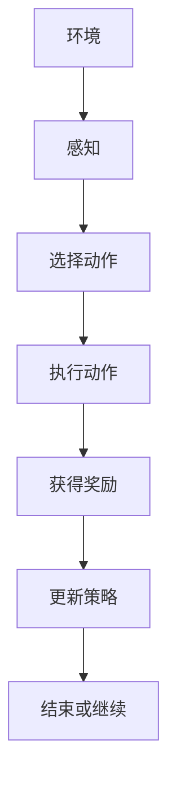
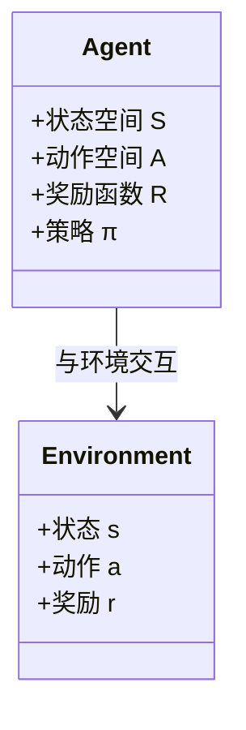
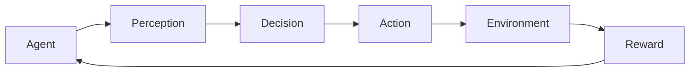
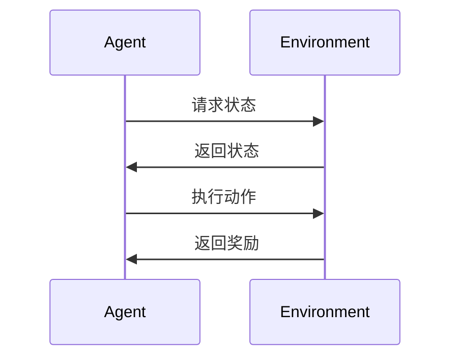

                 


# 构建具有自主探索与学习能力的AI Agent

> 关键词：AI Agent，自主探索，学习能力，强化学习，系统架构，项目实战

> 摘要：本文详细探讨了构建具有自主探索与学习能力的AI Agent的核心概念、算法原理、系统架构设计及项目实现。通过理论与实践结合，帮助读者理解如何设计和实现能够自主学习和适应的AI Agent，涵盖从基础概念到实际应用的全过程。

---

## 第1章: AI Agent的基本概念与自主性

### 1.1 AI Agent的定义与分类

#### 1.1.1 什么是AI Agent
AI Agent（人工智能代理）是指能够感知环境、做出决策并采取行动以实现目标的智能实体。AI Agent可以是软件程序、机器人或其他智能系统，其核心在于具备自主性和智能性。

#### 1.1.2 AI Agent的分类
AI Agent可以根据智能水平、应用场景和交互方式等多种维度进行分类：

- **按智能水平**：
  - **反应式Agent**：基于当前感知做出反应，无内部状态。
  - **认知式Agent**：具备复杂推理和规划能力，有内部状态和目标。
  
- **按应用场景**：
  - **服务型Agent**：提供特定服务，如推荐系统。
  - **自主型Agent**：具备自主决策和学习能力，适应复杂环境。
  
- **按交互方式**：
  - **离散动作Agent**：在离散动作空间中选择动作。
  - **连续动作Agent**：在连续动作空间中选择动作。

#### 1.1.3 自主性在AI Agent中的重要性
自主性是AI Agent的核心特征，体现在以下几个方面：
- **自主决策**：无需外部干预，自主做出决策。
- **自适应性**：能够根据环境变化调整行为。
- **学习能力**：通过经验改进性能，实现自我优化。

### 1.2 自主探索与学习的背景与意义

#### 1.2.1 传统AI Agent的局限性
传统AI Agent通常依赖于预定义规则和静态数据，难以应对动态变化的复杂环境。其局限性包括：
- **规则 rigid**：面对未见过的情况时表现不佳。
- **适应性差**：无法根据新信息进行调整。

#### 1.2.2 自主探索与学习的需求
随着应用场景的复杂化，AI Agent需要具备更强的适应性和学习能力。自主探索与学习能力使AI Agent能够：
- **主动探索未知领域**：发现新信息，扩展知识边界。
- **自适应优化**：根据反馈不断优化决策策略。

#### 1.2.3 自主AI Agent的应用场景
自主AI Agent在多个领域展现出独特优势：
- **游戏AI**：在复杂游戏环境中做出实时决策。
- **机器人控制**：实现自主导航和任务执行。
- **推荐系统**：根据用户行为动态调整推荐策略。
- **自动驾驶**：在动态交通环境中做出实时决策。

---

## 第2章: 自主探索与学习的核心概念

### 2.1 自主性与学习能力的关系

#### 2.1.1 自主性如何促进学习
自主性使AI Agent能够主动探索环境，收集数据，从而为学习提供丰富的经验。通过自主决策，AI Agent能够在不同情境中测试各种策略，加速学习过程。

#### 2.1.2 学习如何增强自主性
学习能力使AI Agent能够根据经验改进决策策略，增强其自主性。通过学习，AI Agent能够更好地理解环境，做出更合理的决策。

### 2.2 自主探索与学习的数学模型

#### 2.2.1 状态空间与动作空间
- **状态空间**：所有可能的状态的集合。
- **动作空间**：所有可能的动作的集合。

#### 2.2.2 奖励机制与目标函数
- **奖励机制**：通过奖励函数定义每个动作的回报，引导AI Agent学习最优策略。
- **目标函数**：定义AI Agent的目标，通常是最优化某个奖励函数。

#### 2.2.3 动作选择策略
- **随机探索**：随机选择动作以探索新状态。
- **贪心策略**：选择当前最优的动作以最大化立即回报。

### 2.3 自主探索与学习的算法原理

#### 2.3.1 强化学习的基本原理
强化学习是一种通过试错机制学习策略的方法。AI Agent通过与环境互动，学习如何选择动作以最大化累积奖励。

#### 2.3.2 探索与利用的平衡
- **探索**：尝试新动作以发现更好的策略。
- **利用**：根据当前知识选择最优动作以获得最大回报。

#### 2.3.3 状态转移
状态转移是指AI Agent在选择一个动作后，环境状态发生变化的过程。状态转移可以用马尔可夫链描述，状态转移概率矩阵表示从一个状态转移到另一个状态的概率。

---

## 第3章: 算法原理讲解

### 3.1 强化学习算法

#### 3.1.1 Q-Learning算法
Q-Learning是一种经典的强化学习算法，适用于离散状态和动作空间。其核心思想是通过更新Q表（状态-动作值函数）来学习最优策略。

#### 3.1.2 DQN算法
DQN（Deep Q-Network）将Q-Learning与深度神经网络结合，适用于连续动作空间。通过经验回放和目标网络，DQN能够更稳定地学习策略。

#### 3.1.3 算法流程图



### 3.2 探索与利用平衡策略

#### 3.2.1 贪婪策略
- **epsilon-greedy**：以概率epsilon选择随机动作，其余概率选择当前最优动作。
- **boltzmann探索**：根据动作的概率分布选择动作。

#### 3.2.2 动态策略调整
根据学习进度动态调整探索与利用的比例，逐步减少探索次数，增加利用次数。

---

## 第4章: 系统分析与架构设计

### 4.1 问题场景介绍
本章将从实际应用场景出发，分析构建自主探索与学习AI Agent的系统架构。

### 4.2 项目介绍
- **项目目标**：构建一个能够在复杂环境中自主探索与学习的AI Agent。
- **项目需求**：实现环境感知、动作选择、策略优化等功能。

### 4.3 系统功能设计

#### 4.3.1 领域模型


#### 4.3.2 系统架构设计



### 4.4 系统接口设计
- **输入接口**：接收环境状态和用户输入。
- **输出接口**：输出动作和反馈信息。

### 4.5 系统交互流程



---

## 第5章: 项目实战

### 5.1 环境安装
- 安装Python和相关库（如numpy、tensorflow、keras）。
- 安装强化学习框架（如OpenAI Gym）。

### 5.2 核心实现代码

```python
import numpy as np
import gym

class AI_Agent:
    def __init__(self, env):
        self.env = env
        self.epsilon = 0.1
        self.gamma = 0.99
        self.lr = 0.001
        self.Q = np.zeros(self.env.observation_space.shape)

    def perceive(self):
        s, info = self.env.reset()
        return s

    def choose_action(self, s):
        if np.random.random() < self.epsilon:
            return self.env.action_space.sample()
        q = self.Q[s]
        return np.argmax(q)

    def learn(self, s, a, r, s_):
        q = self.Q[s]
        q_next = self.Q[s_]
        q[a] = q[a] + self.lr * (r + self.gamma * np.max(q_next) - q[a])
        self.Q[s] = q

# 创建环境和AI Agent
env = gym.make('CartPole-v1')
agent = AI_Agent(env)

# 训练过程
for episode in range(100):
    s = agent.perceive()
    a = agent.choose_action(s)
    s_, r, done, info = env.step(a)
    agent.learn(s, a, r, s_)
    env.close()
```

### 5.3 代码解读
- **AI_Agent类**：实现AI Agent的核心功能，包括感知、选择动作和学习。
- **perceive方法**：与环境交互，获取当前状态。
- **choose_action方法**：根据epsilon-greedy策略选择动作。
- **learn方法**：更新Q表，实现强化学习。

### 5.4 实际案例分析
通过训练一个CartPole-v1环境中的AI Agent，展示如何实现自主探索与学习。在训练过程中，AI Agent会逐步学会平衡杆，最终实现稳定的控制。

### 5.5 项目小结
本项目通过强化学习算法实现了自主探索与学习的AI Agent，展示了从理论到实践的完整过程。

---

## 第6章: 总结与展望

### 6.1 最佳实践 tips
- **数据质量**：确保训练数据的多样性和代表性。
- **模型可解释性**：设计易于理解和调试的模型。
- **性能优化**：通过经验回放和目标网络提升训练效率。

### 6.2 小结
本文详细探讨了构建具有自主探索与学习能力的AI Agent的核心概念、算法原理和系统架构设计。通过项目实战，展示了如何将理论应用于实践。

### 6.3 注意事项
- **伦理问题**：确保AI Agent的行为符合伦理规范。
- **安全问题**：防止恶意攻击和滥用。

### 6.4 拓展阅读
- 推荐阅读相关书籍和论文，深入研究强化学习和AI Agent的最新进展。

---

## 作者

作者：AI天才研究院/AI Genius Institute & 禅与计算机程序设计艺术 /Zen And The Art of Computer Programming

---

通过本文，读者可以系统地理解构建具有自主探索与学习能力的AI Agent的全过程，并能够将其应用于实际项目中。

