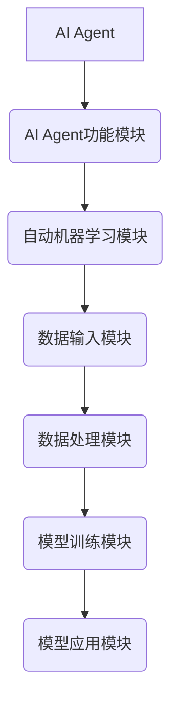
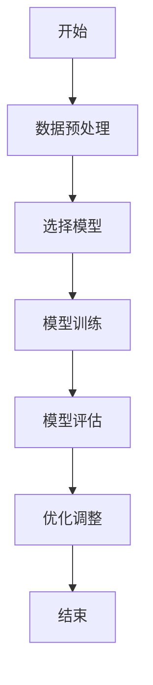
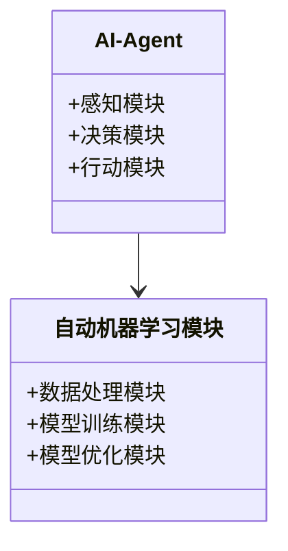
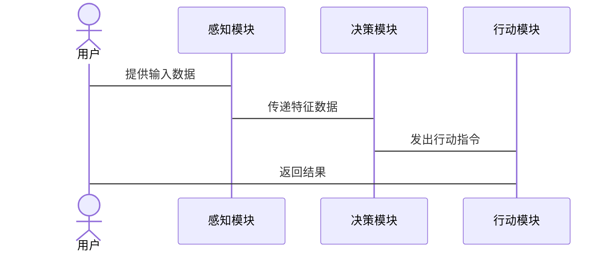

                 


# 构建具有自动机器学习能力的AI Agent

> 关键词：AI Agent, 自动机器学习, 人工智能, 系统架构, 算法原理, 项目实战

> 摘要：本文详细探讨了如何构建一个具有自动机器学习能力的AI Agent，从背景介绍到系统架构设计，再到项目实战，层层剖析，旨在为读者提供一个全面的技术指南。通过本文，读者将深入了解AI Agent的核心概念、算法原理、系统架构及实际应用。

---

# 第一部分: 背景介绍与核心概念

## 第1章: 构建AI Agent的背景与问题背景

### 1.1 AI Agent与自动机器学习的背景
AI Agent是一种智能体，能够在复杂环境中感知、推理、学习并采取行动以实现特定目标。随着人工智能技术的快速发展，AI Agent的应用场景越来越广泛，例如智能助手、自动驾驶、智能客服等。自动机器学习（AutoML）则是机器学习流程的自动化，包括数据预处理、模型选择、超参数调优和部署等环节。两者的结合能够显著提升AI Agent的智能化水平和适应性。

#### 1.1.1 AI Agent的定义与特点
- **定义**：AI Agent是一个能够感知环境、自主决策并执行任务的智能实体。
- **特点**：智能性、自主性、反应性、目标导向性。

#### 1.1.2 自动机器学习的定义与特点
- **定义**：自动机器学习是指通过自动化工具和算法，减少人工干预，提高机器学习模型开发效率的过程。
- **特点**：自动化、高效性、易用性。

#### 1.1.3 AI Agent与自动机器学习的结合背景
随着AI Agent在各个领域的广泛应用，其对实时学习和自适应能力的需求日益增加。自动机器学习能够帮助AI Agent快速构建和优化模型，使其在复杂环境中更具竞争力。

### 1.2 问题背景与问题描述
#### 1.2.1 当前AI Agent开发中的主要问题
- 数据预处理复杂，需要人工干预。
- 模型选择和调优耗时且依赖经验。
- 缺乏动态适应环境的能力。

#### 1.2.2 自动机器学习在AI Agent中的应用需求
- 提高AI Agent的模型构建效率。
- 实现模型的动态优化和自适应。
- 降低开发门槛，让更多领域能够快速应用AI技术。

### 1.3 问题解决与边界
#### 1.3.1 AI Agent自动机器学习的核心问题解决
- 数据自动化处理：通过AutoML工具实现数据清洗、特征工程的自动化。
- 模型自动化构建：自动选择和优化模型超参数，提高模型性能。
- 实时自适应：通过持续学习和模型更新，使AI Agent能够动态适应环境变化。

#### 1.3.2 问题解决的边界与外延
- 界定AI Agent的能力范围，避免过度扩展。
- 明确自动机器学习的适用场景，确保技术应用的有效性。

### 1.4 核心概念与组成要素
#### 1.4.1 AI Agent的组成要素
- 感知模块：负责环境数据的采集和处理。
- 决策模块：基于感知数据进行推理和决策。
- 行动模块：执行决策动作，与环境交互。

#### 1.4.2 自动机器学习的核心要素
- 数据处理：清洗、特征工程。
- 模型选择：算法选择、超参数调优。
- 模型部署：模型训练、评估、部署。

#### 1.4.3 两者的结合与相互作用
AI Agent通过自动机器学习实现动态优化，自动机器学习通过AI Agent的应用场景实现技术落地。

---

## 第2章: 核心概念与联系

### 2.1 核心概念原理
#### 2.1.1 AI Agent的工作原理
AI Agent通过感知环境数据，结合内部知识库和学习模型，做出决策并执行动作，以实现目标。

#### 2.1.2 自动机器学习的原理
自动机器学习通过自动化工具和算法，实现数据预处理、模型选择和优化的自动化，从而降低人工干预。

### 2.2 概念属性对比
| 属性 | AI Agent | 自动机器学习 |
|------|----------|--------------|
| 定义 | 智能体，能够感知、决策、行动 | 机器学习流程自动化 |
| 核心功能 | 感知、决策、行动 | 数据处理、模型优化 |
| 应用场景 | 智能助手、自动驾驶 | 数据科学、AI开发 |

### 2.3 ER实体关系架构


---

## 第3章: 算法原理与数学模型

### 3.1 算法流程图


### 3.2 数学模型与公式
#### 3.2.1 损失函数
$$ L(y, \hat{y}) = \frac{1}{2m} \sum_{i=1}^{m} (y_i - \hat{y_i})^2 $$

#### 3.2.2 优化算法
$$ \theta = \theta - \eta \cdot \frac{\partial L}{\partial \theta} $$

---

## 第4章: 系统架构与设计

### 4.1 系统架构设计


### 4.2 系统功能设计
- 感知模块：数据采集、特征提取。
- 决策模块：模型选择、策略优化。
- 行动模块：模型部署、结果反馈。

### 4.3 系统交互设计


---

## 第5章: 项目实战

### 5.1 项目介绍
我们以一个智能推荐系统为例，展示如何构建具有自动机器学习能力的AI Agent。

### 5.2 核心实现
#### 5.2.1 环境安装
```bash
pip install scikit-learn numpy pandas
```

#### 5.2.2 数据预处理
```python
import pandas as pd
data = pd.read_csv('data.csv')
```

#### 5.2.3 模型训练
```python
from sklearn.tree import DecisionTreeClassifier
model = DecisionTreeClassifier()
model.fit(X_train, y_train)
```

#### 5.2.4 模型优化
```python
from sklearn.model_selection import GridSearchCV
param_grid = {'max_depth': [2, 3, 4]}
grid_search = GridSearchCV(model, param_grid)
grid_search.fit(X_train, y_train)
best_model = grid_search.best_estimator_
```

### 5.3 项目小结
通过本项目，我们实现了AI Agent的自动机器学习功能，验证了技术的可行性和有效性。

---

## 第6章: 最佳实践与未来展望

### 6.1 最佳实践
- 数据质量是关键，确保数据清洗和特征工程的准确性。
- 模型优化需要结合业务需求，避免过度优化。
- 系统设计要考虑可扩展性和可维护性。

### 6.2 未来展望
- 结合边缘计算，提升AI Agent的实时性和响应速度。
- 增强模型的可解释性，提高用户信任度。
- 深化多模态学习，提升AI Agent的综合能力。

---

## 作者

作者：AI天才研究院/AI Genius Institute & 禅与计算机程序设计艺术 /Zen And The Art of Computer Programming

---

通过本文的详细讲解，读者可以系统地了解如何构建具有自动机器学习能力的AI Agent，从理论到实践，全面掌握相关技术的核心要点。

