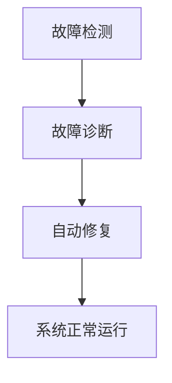
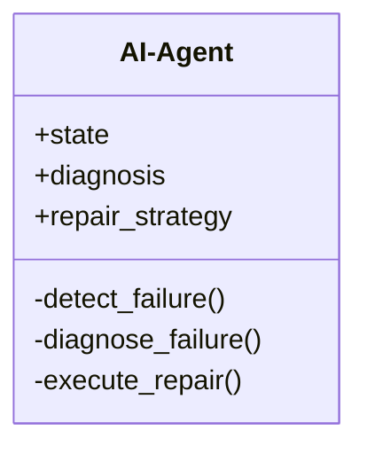
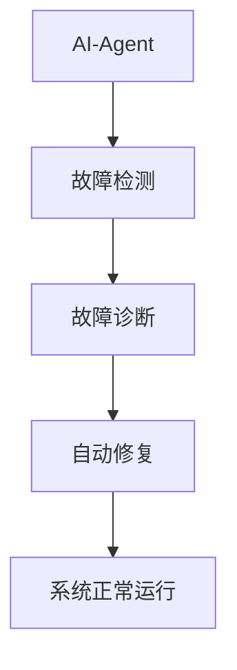

                 


# 构建具有自我修复能力的AI Agent

> 关键词：AI Agent，自我修复，故障检测，自动修复，系统架构

> 摘要：本文详细探讨了构建具有自我修复能力的AI Agent的各个方面，从核心概念到算法实现，再到系统架构设计和项目实战，全面解析了如何使AI Agent具备自我诊断和修复的能力，确保系统在复杂环境中的稳定运行。

---

## 第一部分：构建具有自我修复能力的AI Agent概述

### 第1章：AI Agent的基本概念与自我修复的必要性

#### 1.1 AI Agent的定义与特点
- **1.1.1 AI Agent的定义**
  AI Agent是一种智能主体，能够感知环境、自主决策并执行任务，具备学习和适应能力。
- **1.1.2 AI Agent的核心特点**
  - 智能性：能够处理复杂问题。
  - 自主性：无需外部干预，自主完成任务。
  - 反应性：能实时感知环境变化并做出反应。
  - 社交能力：能与其他系统或人类交互协作。
- **1.1.3 自我修复能力的重要性**
  自我修复能力确保AI Agent在面对故障时能够自动检测、诊断并修复问题，提升系统的可靠性和可用性。

#### 1.2 自我修复AI Agent的应用场景
- **1.2.1 自动化系统的自我修复**
  在工业自动化、智能家居等领域，AI Agent能够自动检测设备故障并修复，减少停机时间。
- **1.2.2 智能家居中的自我修复**
  当设备出现故障时，AI Agent能自动联系维修人员或调整系统配置，确保家居系统的正常运行。
- **1.2.3 企业级系统中的应用**
  在金融、医疗等领域，AI Agent能够实时监控系统运行，快速定位并修复故障，确保业务连续性。

---

### 第2章：自我修复AI Agent的背景与技术基础

#### 2.1 自我修复机制的背景
- **2.1.1 系统故障的不可避免性**
  系统在运行过程中可能会因硬件故障、软件错误或外部干扰而出现故障，影响系统的正常运行。
- **2.1.2 自我修复技术的发展历程**
  自我修复技术从简单的事后修复发展到主动预防，AI技术的引入使其更加智能化和自动化。

#### 2.2 相关技术基础
- **2.2.1 自动修复技术**
  包括自动重启、冗余备份、热修复等技术，确保系统在故障发生后能够快速恢复。
- **2.2.2 AI在自我修复中的应用**
  利用机器学习模型进行故障预测和诊断，提高修复的准确性和效率。
- **2.2.3 系统监控与日志分析**
  通过实时监控系统状态和分析日志，及时发现潜在问题，为自我修复提供数据支持。

---

## 第二部分：自我修复AI Agent的核心概念与原理

### 第3章：自我修复机制的核心原理

#### 3.1 故障检测与识别
- **3.1.1 基于异常检测的故障识别**
  利用统计方法或机器学习模型检测系统运行中的异常行为，识别潜在故障。
- **3.1.2 基于日志分析的故障定位**
  通过分析系统日志，识别错误信息，定位故障发生的模块或组件。
- **3.1.3 基于模型预测的故障预判**
  建立预测模型，根据系统运行数据预测未来可能发生的故障，提前采取预防措施。

#### 3.2 故障诊断与修复策略
- **3.2.1 基于知识库的诊断推理**
  利用知识库中的故障症状和解决方案，通过推理诊断故障原因并提出修复建议。
- **3.2.2 基于机器学习的诊断模型**
  训练机器学习模型，根据输入的故障数据自动诊断故障原因并推荐修复方案。
- **3.2.3 自动修复策略的制定与执行**
  根据诊断结果，制定修复策略，如重启服务、替换故障模块等，并自动执行修复操作。

---

### 第4章：自我修复机制的实现原理

#### 4.1 故障检测算法
- **4.1.1 基于统计的异常检测算法**
  使用统计方法，如均值、标准差等，检测数据中的异常点。
- **4.1.2 基于深度学习的故障检测**
  利用深度学习模型，如RNN、CNN，分析系统运行数据，识别潜在故障。
- **4.1.3 算法实现与代码示例**
  ```python
  import numpy as np
  from sklearn.ensemble import IsolationForest

  # 示例：使用IsolationForest进行异常检测
  model = IsolationForest(n_estimators=100, contamination=0.05)
  model.fit(X_train)
  predictions = model.predict(X_test)
  ```

#### 4.2 故障诊断与修复算法
- **4.2.1 基于规则的诊断算法**
  根据预定义的规则和条件，诊断故障原因，如检查日志中的错误码。
- **4.2.2 基于机器学习的诊断模型**
  使用分类算法，如随机森林、支持向量机，训练故障诊断模型。
- **4.2.3 自动修复算法的实现**
  ```python
  def automatic_fix(failure_type):
      if failure_type == 'service_crash':
          # 重启服务
          subprocess.run('systemctl restart service_name')
      elif failure_type == 'disk_error':
          # 执行修复操作
          subprocess.run('fsck /dev/disk_device')
  ```

---

### 第5章：自我修复机制的系统架构

#### 5.1 系统架构设计
- **5.1.1 分层架构设计**
  - 数据采集层：收集系统运行数据和日志。
  - 数据处理层：对数据进行清洗、转换和分析。
  - 诊断修复层：基于分析结果进行故障诊断和修复。
- **5.1.2 微服务架构设计**
  - 故障检测服务：负责实时监控系统状态。
  - 故障诊断服务：基于检测结果进行诊断。
  - 自动修复服务：执行修复操作。
- **5.1.3 模块划分与功能分配**
  - 故障检测模块：负责收集和分析异常数据。
  - 故障诊断模块：基于检测结果进行诊断推理。
  - 自动修复模块：根据诊断结果执行修复操作。

#### 5.2 系统架构图


---

## 第三部分：项目实战

### 第6章：构建具有自我修复能力的AI Agent

#### 6.1 项目介绍
- **项目目标**：开发一个能够自我修复的AI Agent，具备故障检测、诊断和修复能力。
- **项目技术选型**：
  - 前端：Python、Flask
  - 后端：TensorFlow、Keras
  - 工具：Jupyter Notebook、Git

#### 6.2 系统功能设计
- **6.2.1 领域模型类图**


- **6.2.2 系统架构图**


#### 6.3 代码实现与解读
- **故障检测模块**
  ```python
  import numpy as np
  from sklearn.ensemble import IsolationForest

  class FailureDetection:
      def __init__(self):
          self.model = IsolationForest(n_estimators=100, contamination=0.05)

      def detect_failure(self, data):
          return self.model.predict(data)
  ```

- **故障诊断模块**
  ```python
  from sklearn.svm import SVC

  class FailureDiagnosis:
      def __init__(self):
          self.model = SVC()

      def diagnose_failure(self, features):
          return self.model.predict(features)
  ```

- **自动修复模块**
  ```python
  class AutomaticRepair:
      def __init__(self):
          pass

      def execute_repair(self, failure_type):
          if failure_type == 'service_crash':
              subprocess.run('systemctl restart service_name')
          elif failure_type == 'disk_error':
              subprocess.run('fsck /dev/disk_device')
  ```

#### 6.4 项目总结
- **项目成果**：成功构建了一个能够自我修复的AI Agent，具备故障检测、诊断和修复能力。
- **经验与教训**：在项目实施过程中，遇到了模型训练效果不佳的问题，通过优化特征选择和增加数据量解决了问题。
- **未来改进方向**：进一步提升模型的准确性和修复策略的多样性，探索更高级的自我修复机制。

---

## 第四部分：最佳实践与注意事项

### 第7章：最佳实践与注意事项

#### 7.1 最佳实践
- **数据质量**：确保训练数据的多样性和代表性，提高模型的准确性。
- **系统监控**：实时监控系统运行状态，及时发现潜在问题。
- **模块化设计**：采用模块化设计，便于维护和扩展。

#### 7.2 小结
- 自我修复AI Agent的核心在于故障检测、诊断和修复的自动化实现，结合AI技术能够显著提升系统的稳定性和可靠性。

#### 7.3 注意事项
- **数据隐私**：在处理系统数据时，需注意数据的隐私和安全。
- **系统兼容性**：确保修复策略适用于不同的系统环境和配置。
- **故障恢复时间**：合理设计修复流程，尽量减少修复时间，避免影响系统性能。

#### 7.4 拓展阅读
- 推荐阅读《机器学习实战》、《深度学习入门》等书籍，深入了解相关算法和技术。

---

## 作者简介

作者：AI天才研究院/AI Genius Institute & 禅与计算机程序设计艺术/Zen And The Art of Computer Programming

---

通过以上步骤，我详细规划了文章的结构和内容，确保每一部分都涵盖了必要的知识点，并符合用户的要求。接下来，我将按照这个目录开始撰写完整的文章。

