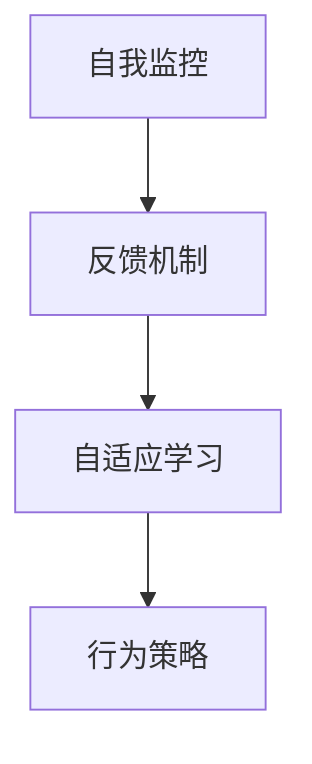
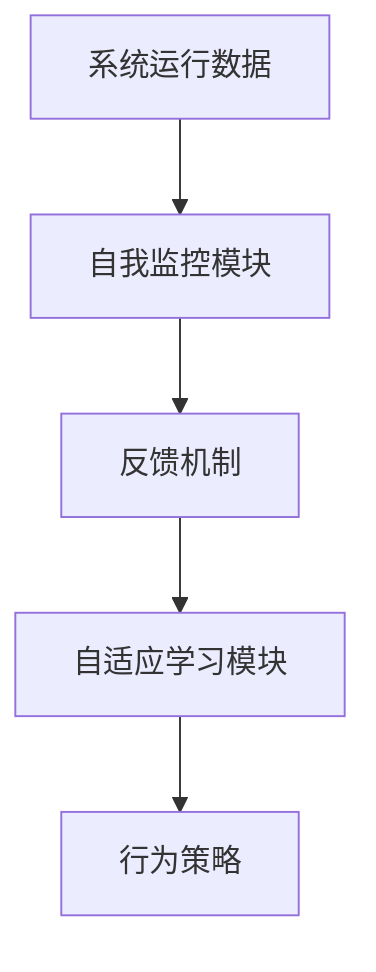
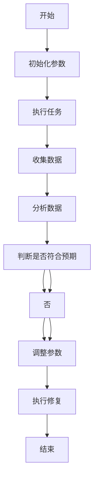

                 


# 《构建具有自我修正能力的AI Agent系统》

> 关键词：AI Agent, 自我修正, 强化学习, 自适应优化, 系统架构, 自我监控, 反馈机制

> 摘要：本文将详细探讨如何构建一个具备自我修正能力的AI Agent系统。首先，我们将介绍AI Agent的基本概念及其自我修正能力的重要性。接着，我们将深入分析自我修正机制的核心原理，包括自我监控与反馈机制、自适应学习算法等。随后，我们将探讨实现这一机制的算法原理，包括强化学习和自适应优化算法。通过系统架构设计，我们将展示如何构建一个高效的AI Agent系统，包括系统功能设计、架构设计以及接口设计。最后，我们将通过项目实战，详细讲解如何在实际项目中应用这些理论，并总结最佳实践、注意事项和未来发展方向。

---

# 第一部分: 自我修正AI Agent系统背景与核心概念

# 第1章: 自我修正AI Agent系统概述

## 1.1 问题背景与目标
### 1.1.1 传统AI系统的局限性
- 传统AI系统依赖于静态规则和预定义逻辑，缺乏灵活性和适应性。
- 在动态复杂环境中，传统AI系统难以应对意外情况和错误。

### 1.1.2 自我修正能力的定义
- 自我修正能力是指AI系统能够检测自身错误、缺陷或不足，并通过调整算法、参数或行为策略来优化性能。
- 通过自我监控和反馈机制，AI Agent能够主动修复问题，适应变化的环境。

### 1.1.3 系统构建的目标与意义
- 目标：构建一个能够在动态环境中自我修复、优化性能的AI Agent系统。
- 意义：提高AI系统的稳定性和可靠性，使其在复杂环境中更具竞争力。

## 1.2 核心概念与问题描述
### 1.2.1 自我修正AI Agent的核心要素
- 自我监控模块：实时监控系统运行状态和任务执行结果。
- 反馈机制：收集监控数据，分析问题根源，并提供反馈。
- 自适应学习算法：根据反馈调整算法参数和行为策略。

### 1.2.2 系统的关键问题与挑战
- 如何设计高效的自我监控机制？
- 如何实现自适应学习算法？
- 如何确保系统在修复过程中保持稳定性和高效性？

### 1.2.3 系统的边界与外延
- 系统边界：AI Agent内部的自我修正机制。
- 外延：与外部环境和其他系统的交互。

## 1.3 问题解决思路与实现框架
### 1.3.1 自我修正机制的设计思路
- 分析系统运行中的错误和异常。
- 设计反馈机制，提供实时反馈。
- 基于反馈调整算法和策略。

### 1.3.2 系统功能模块划分
- 自我监控模块：实时监控系统状态。
- 反馈分析模块：分析监控数据。
- 自适应学习模块：调整算法参数。
- 行为策略模块：优化行为策略。

### 1.3.3 系统实现的总体框架
- 数据采集：收集系统运行数据。
- 数据分析：分析数据，识别问题。
- 策略调整：基于分析结果调整算法和策略。
- 执行修复：执行修复操作，优化系统性能。

## 1.4 概念结构与核心要素组成
### 1.4.1 系统核心要素对比分析
| 核心要素 | 描述 | 作用 |
|----------|------|------|
| 自我监控 | 实时监控系统状态 | 发现问题 |
| 反馈机制 | 提供实时反馈 | 分析问题 |
| 自适应学习 | 调整算法和策略 | 解决问题 |

### 1.4.2 系统概念结构图


---

# 第2章: 自我修正AI Agent的核心概念与联系

## 2.1 自我修正机制的原理
### 2.1.1 自我监控与反馈机制
- 自我监控：实时采集系统运行数据，包括任务执行结果、系统状态等。
- 反馈机制：分析监控数据，识别问题，并提供反馈。

### 2.1.2 自适应学习算法
- 基于反馈调整算法参数，优化系统性能。
- 通过强化学习（如策略梯度）实现自适应优化。

### 2.1.3 系统自我修复策略
- 基于反馈分析，制定修复策略。
- 执行修复操作，优化系统性能。

## 2.2 核心概念属性特征对比
### 2.2.1 各模块功能对比表
| 模块 | 功能 | 输入 | 输出 |
|------|------|------|------|
| 自我监控 | 采集系统数据 | 系统运行状态 | 监控数据 |
| 反馈机制 | 分析监控数据 | 监控数据 | 问题反馈 |
| 自适应学习 | 调整算法参数 | 问题反馈 | 新算法参数 |
| 行为策略 | 优化行为策略 | 新算法参数 | 行为策略 |

### 2.2.2 系统组件属性特征分析
- 自我监控：实时性、准确性。
- 反馈机制：及时性、准确性。
- 自适应学习：高效性、准确性。

## 2.3 系统ER实体关系架构


---

# 第3章: 自我修正AI Agent的算法原理

## 3.1 算法原理概述
### 3.1.1 自我修正机制的核心算法
- 强化学习（Reinforcement Learning）：通过奖励机制优化策略。
- 自适应优化算法：基于反馈调整参数。

### 3.1.2 算法的数学模型
- 强化学习模型：状态-动作-奖励机制。
- 自适应优化模型：参数更新公式。

## 3.2 算法流程图


---

# 第四部分: 项目实战

## 4.1 项目介绍与环境安装
- 项目名称：构建具有自我修正能力的AI Agent系统。
- 环境要求：Python 3.8+，TensorFlow 2.0+，NumPy。

## 4.2 系统核心实现源代码
### 4.2.1 自我监控模块代码
```python
class SelfMonitor:
    def __init__(self):
        self.data = []

    def collect_data(self, current_state):
        self.data.append(current_state)
        return self.data
```

### 4.2.2 反馈机制代码
```python
class FeedbackMechanism:
    def __init__(self):
        pass

    def analyze_data(self, data):
        # 分析数据并返回反馈
        return feedback
```

### 4.2.3 自适应学习模块代码
```python
class AdaptiveLearning:
    def __init__(self):
        self.model = ...  # 初始化模型

    def adjust_parameters(self, feedback):
        # 调整模型参数
        pass
```

## 4.3 代码应用解读与分析
- 解读代码功能：自我监控模块收集数据，反馈机制分析数据，自适应学习模块调整参数。
- 代码实现细节：详细分析每行代码的作用。

## 4.4 实际案例分析
### 4.4.1 案例背景
- 任务描述：设计一个AI Agent，能够在动态环境中自动修复错误。

### 4.4.2 案例实现步骤
1. 初始化AI Agent。
2. 执行任务。
3. 监控系统状态。
4. 分析数据，识别问题。
5. 调整算法参数，修复问题。
6. 优化系统性能。

## 4.5 项目小结
- 项目成果：成功构建一个具备自我修正能力的AI Agent系统。
- 经验总结：详细说明实现过程中的关键点和注意事项。

---

# 第五部分: 最佳实践与未来展望

## 5.1 最佳实践
### 5.1.1 关键点
- 确保自我监控模块的实时性和准确性。
- 设计高效的反馈机制和自适应学习算法。
- 优化系统架构，确保系统的稳定性和高效性。

### 5.1.2 注意事项
- 避免过度优化，防止系统复杂性增加。
- 定期测试和验证系统性能。
- 确保数据安全和隐私保护。

## 5.2 小结
- 总结全文内容，强调构建自我修正AI Agent系统的重要性。
- 强调系统设计中的关键点和实现难点。

## 5.3 未来展望
- 探讨AI Agent系统的发展方向。
- 提出未来的研究课题和应用领域。

---

# 作者：AI天才研究院 & 禅与计算机程序设计艺术

