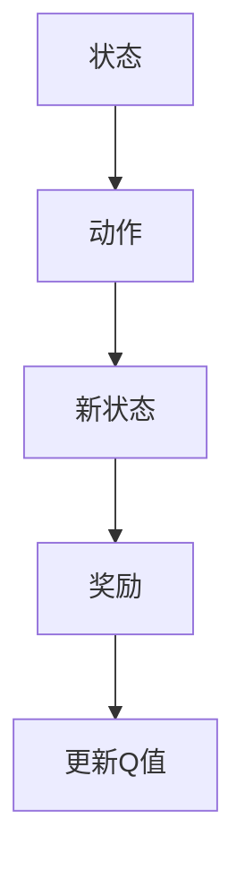
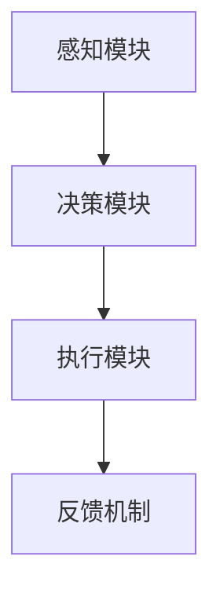

                 


# 构建具有自我演化能力的AI Agent

> 关键词：AI Agent, 自我演化, 强化学习, 自适应系统, 自我优化机制

> 摘要：本文详细探讨了构建具有自我演化能力的AI Agent的核心概念、算法原理、系统架构设计以及实际应用场景。通过分析强化学习、自适应系统和自我优化机制等关键理论，结合实际案例，阐述了如何实现一个能够自主学习和适应复杂环境的AI Agent。文章还提供了丰富的图表和代码示例，帮助读者深入理解相关技术原理和实现方法。

---

## 第一部分: AI Agent的基本概念与背景

### 第1章: AI Agent的基本概念与特点

#### 1.1 什么是AI Agent

AI Agent（人工智能代理）是一种智能实体，能够感知环境、自主决策并执行动作以实现特定目标。与传统程序不同，AI Agent具备以下特点：

- **自主性**：能够在没有外部干预的情况下独立运行。
- **反应性**：能够实时感知环境并做出响应。
- **目标导向**：所有行为都以实现特定目标为导向。
- **学习能力**：能够通过经验改进自身的性能。

#### 1.2 AI Agent的核心特点

- **动态适应性**：AI Agent能够根据环境的变化调整自身的行为。
- **问题解决能力**：能够在复杂环境中识别问题并找到解决方案。
- **自我修复能力**：在出现问题时，能够自我修复并恢复正常运行。

#### 1.3 AI Agent与传统程序的区别

| 特性             | AI Agent                | 传统程序            |
|------------------|-------------------------|---------------------|
| 自主性           | 高                     | 低                 |
| 学习能力         | 强                     | 无或弱             |
| 适应性           | 高                     | 低                 |
| 决策能力         | 强                     | 依赖人工干预       |

---

### 第2章: 自我演化AI Agent的背景与应用

#### 2.1 自我演化AI Agent的背景

随着人工智能技术的快速发展，AI Agent逐渐从简单的任务执行者转变为具备自我学习和适应能力的智能实体。自我演化能力的引入使得AI Agent能够更好地应对复杂多变的环境，从而在多个领域展现出广泛的应用前景。

#### 2.2 自我演化AI Agent的应用场景

- **智能助手**：例如Siri、Alexa等，能够通过与用户的交互不断优化自身的响应策略。
- **自动交易系统**：能够在金融市场中根据市场变化自动调整交易策略。
- **自动驾驶**：能够根据交通状况和道路环境实时调整驾驶行为。

---

## 第二部分: 自我演化AI Agent的核心概念与联系

### 第3章: 自我演化能力的核心概念

#### 3.1 强化学习

强化学习是一种通过试错机制来优化决策模型的算法。AI Agent通过与环境交互，不断尝试不同的动作，并根据获得的奖励来调整自身的策略。

##### 3.1.1 Q-learning算法

Q-learning是一种经典的强化学习算法，其核心思想是通过维护一个Q值表来记录状态-动作对的价值。

- 状态转移：$s' = f(s, a)$
- 奖励函数：$r = g(s, a, s')$
- Q值更新：$Q(s, a) = Q(s, a) + \alpha [r + \gamma \max Q(s', a') - Q(s, a)]$

##### 3.1.2 DQN算法

DQN（Deep Q-Network）是一种基于深度学习的强化学习算法，通过使用神经网络来近似Q值函数。

- 神经网络结构：输入层（状态）→ 隐藏层 → 输出层（动作）
- 损失函数：$\mathcal{L} = \mathbb{E}[(r + \gamma Q(s', a') - Q(s, a))^2]$

##### 3.1.3 强化学习流程图



#### 3.2 自我优化机制

自我优化机制是指AI Agent能够根据环境反馈不断优化自身的决策策略。

##### 3.2.1 自适应优化算法

自适应优化算法通过动态调整参数来实现优化目标。

- 参数更新：$\theta_{t+1} = \theta_t + \eta \nabla f(\theta_t)$

##### 3.2.2 自我修复算法

自我修复算法能够在出现问题时自动修复系统。

- 错误检测：$e = f(x) - y$
- 修复机制：$\theta_{t+1} = \theta_t - \eta e$

---

## 第三部分: 自我演化AI Agent的算法原理

### 第4章: 强化学习算法

#### 4.1 Q-learning算法实现

```python
import numpy as np

class QLearning:
    def __init__(self, state_space, action_space):
        self.state_space = state_space
        self.action_space = action_space
        self.q_table = np.zeros((state_space, action_space))

    def choose_action(self, state, epsilon=0.1):
        if np.random.random() < epsilon:
            return np.random.randint(self.action_space)
        else:
            return np.argmax(self.q_table[state])

    def update_q_table(self, state, action, reward, next_state, alpha=0.1, gamma=0.9):
        self.q_table[state][action] += alpha * (reward + gamma * np.max(self.q_table[next_state]) - self.q_table[state][action])
```

#### 4.2 DQN算法实现

```python
import torch
import torch.nn as nn

class DQN(nn.Module):
    def __init__(self, input_dim, output_dim):
        super(DQN, self).__init__()
        self.fc1 = nn.Linear(input_dim, 64)
        self.fc2 = nn.Linear(64, output_dim)

    def forward(self, x):
        x = torch.relu(self.fc1(x))
        x = self.fc2(x)
        return x
```

---

## 第四部分: 自我演化AI Agent的系统架构设计

### 第5章: 系统功能设计

#### 5.1 感知模块

感知模块负责收集环境中的信息，包括：

- **输入处理**：接收外部输入并进行预处理。
- **特征提取**：提取输入数据的特征。

#### 5.2 决策模块

决策模块基于感知到的信息做出决策，包括：

- **策略选择**：选择最优策略。
- **动作规划**：规划具体动作。

#### 5.3 执行模块

执行模块负责将决策结果转化为具体动作，包括：

- **动作执行**：执行决策模块规划的动作。
- **反馈收集**：收集环境对动作的反馈。

### 第6章: 系统架构设计

#### 6.1 系统架构图



---

## 第五部分: 项目实战与未来展望

### 第7章: 项目实战

#### 7.1 环境安装

```bash
pip install numpy torch
```

#### 7.2 核心实现代码

```python
import numpy as np
import torch

class AI-Agent:
    def __init__(self, state_space, action_space):
        self.state_space = state_space
        self.action_space = action_space
        self.model = DQN(state_space, action_space)
        self.optimizer = torch.optim.Adam(self.model.parameters())

    def act(self, state):
        # 策略选择
        pass

    def learn(self, state, action, reward, next_state):
        # 神经网络更新
        pass
```

---

## 结语

通过本文的详细讲解，我们深入探讨了构建具有自我演化能力的AI Agent的核心概念、算法原理和系统架构设计。希望本文能够为读者提供有价值的技术指导，帮助他们更好地理解和实现自我演化AI Agent。

---

作者：AI天才研究院 & 禅与计算机程序设计艺术

