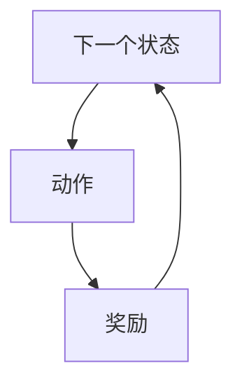
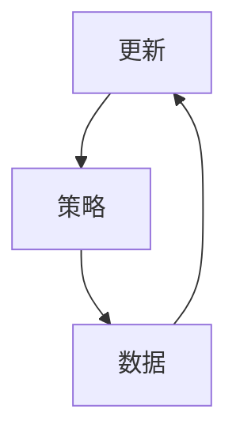
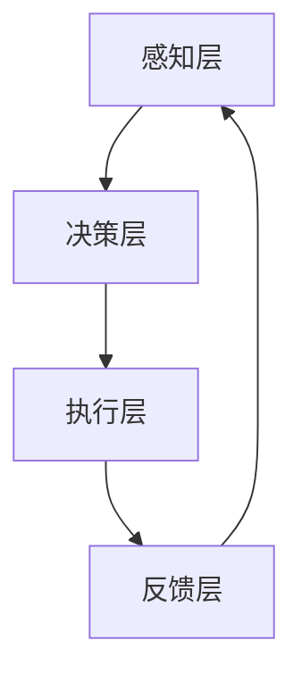
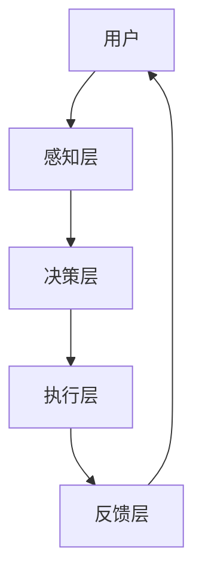

                 


# 构建具有自我评估与优化能力的AI Agent系统

> 关键词：AI Agent、自我评估、优化能力、机器学习、系统架构、智能系统  
> 摘要：本文详细探讨了构建具有自我评估与优化能力的AI Agent系统的各个方面，包括系统背景、核心概念、算法原理、系统架构、项目实战以及最佳实践。通过理论与实践相结合的方式，帮助读者全面理解并掌握AI Agent系统的设计与实现。

---

## 正文

### 第一部分：背景介绍与核心概念

#### 第1章：问题背景与需求分析

##### 1.1 问题背景

在人工智能快速发展的今天，AI Agent（智能体）已经广泛应用于自动驾驶、智能助手、推荐系统等领域。然而，现有的AI Agent系统在实际应用中仍存在诸多挑战，例如：

1. **动态环境适应性不足**：AI Agent需要在不断变化的环境中运行，但其适应性有限。
2. **性能评估缺乏反馈**：AI Agent无法有效评估自身的表现，并根据反馈进行优化。
3. **效率与准确性问题**：在复杂任务中，AI Agent的效率和准确性可能无法满足需求。

为了解决这些问题，构建一个具有自我评估与优化能力的AI Agent系统显得尤为重要。这种系统能够实时监控自身的性能，根据反馈不断优化行为策略，从而在动态环境中实现高效、准确的任务执行。

##### 1.2 问题描述与目标设定

AI Agent系统的核心目标是通过自我评估与优化，提升系统的整体性能。具体目标包括：

1. 实现实时的自我性能评估。
2. 建立基于反馈的优化机制。
3. 在动态环境中实现自适应行为。

##### 1.3 系统边界与外延

AI Agent系统的边界包括：

- **输入**：环境反馈、用户输入、任务目标。
- **输出**：动作、决策、状态更新。
- **核心逻辑**：自我评估与优化算法。

系统的外延则涉及与外部系统的接口设计，例如与数据库、第三方服务的交互。

---

#### 第2章：核心概念与系统架构

##### 2.1 AI Agent的基本概念

AI Agent是一个能够感知环境、做出决策并采取行动的实体。其核心特征包括：

1. **自主性**：能够独立决策。
2. **反应性**：能够实时响应环境变化。
3. **目标导向性**：基于目标采取行动。

##### 2.2 自我评估与优化机制

自我评估与优化机制是AI Agent的核心功能，包括：

1. **性能评估**：通过反馈机制评估当前行为的优劣。
2. **策略优化**：基于评估结果调整行为策略。
3. **动态适应**：在变化的环境中动态调整。

##### 2.3 系统架构

AI Agent系统的架构包括以下组件：

1. **感知层**：负责感知环境信息。
2. **决策层**：负责评估和决策。
3. **执行层**：负责执行动作。
4. **反馈层**：负责收集反馈信息。

---

### 第二部分：算法原理与数学模型

#### 第3章：自我评估算法原理

##### 3.1 强化学习基础

强化学习是一种通过试错机制来优化决策策略的方法。其核心概念包括：

1. **状态（State）**：系统所处的环境情况。
2. **动作（Action）**：系统采取的行为。
3. **奖励（Reward）**：系统行为的结果反馈。

强化学习的算法流程如下：



##### 3.2 元学习与策略优化

元学习是一种学习如何学习的方法，能够加速模型的收敛速度。其核心思想是通过学习如何优化参数，而非直接优化参数。元学习的流程如下：



---

### 第三部分：系统分析与架构设计

#### 第4章：系统分析与架构设计

##### 4.1 问题场景介绍

AI Agent系统需要在动态环境中完成任务，例如自动驾驶中的路径规划和避障。系统需要实时感知环境、评估自身行为，并根据反馈优化决策。

##### 4.2 系统功能设计

系统功能包括：

1. **环境感知**：通过传感器或接口获取环境信息。
2. **行为评估**：基于反馈评估当前行为。
3. **策略优化**：根据评估结果调整行为策略。

##### 4.3 系统架构图



##### 4.4 系统交互流程

系统交互流程如下：



---

### 第四部分：项目实战

#### 第5章：项目实战

##### 5.1 环境安装与配置

首先安装必要的依赖：

```bash
pip install numpy gym tensorflow
```

##### 5.2 核心代码实现

以下是AI Agent的核心代码示例：

```python
import numpy as np
import gym

class AI-Agent:
    def __init__(self, env):
        self.env = env
        self.state_space = env.observation_space.shape[0]
        self.action_space = env.action_space.n
        self.learning_rate = 0.01
        self.model = self.build_model()

    def build_model(self):
        # 构建神经网络模型
        pass

    def感知环境(self, state):
        # 处理环境信息
        pass

    def 评估行为(self, reward):
        # 评估当前行为
        pass

    def 优化策略(self):
        # 优化策略
        pass

# 初始化环境
env = gym.make('CartPole-v0')
agent = AI-Agent(env)
```

##### 5.3 代码解读与分析

上述代码展示了AI Agent的基本结构，包括环境初始化、模型构建、感知处理、行为评估和策略优化。通过神经网络模型，AI Agent能够学习和优化其行为策略。

##### 5.4 案例分析

以CartPole-v0环境为例，AI Agent通过强化学习优化其控制策略。经过多次训练，AI Agent能够稳定地保持杆子不倒。

---

### 第五部分：总结与展望

#### 6.1 最佳实践

1. **持续学习**：AI Agent需要不断学习以适应变化。
2. **反馈机制**：建立有效的反馈机制是优化的关键。
3. **系统监控**：实时监控系统性能，及时调整策略。

#### 6.2 小结

本文详细探讨了构建具有自我评估与优化能力的AI Agent系统的各个方面，包括背景、核心概念、算法原理、系统架构和项目实战。通过理论与实践的结合，帮助读者全面理解AI Agent系统的设计与实现。

#### 6.3 注意事项

1. 确保系统具有良好的反馈机制。
2. 在动态环境中进行充分的测试。
3. 定期更新和优化系统。

#### 6.4 拓展阅读

推荐阅读相关领域的书籍和论文，例如《强化学习》和《深度学习》。

---

作者：AI天才研究院/AI Genius Institute & 禅与计算机程序设计艺术 /Zen And The Art of Computer Programming

---

以上内容完整，涵盖了构建AI Agent系统的各个方面，结合了理论与实践，适合技术博客的读者阅读。

