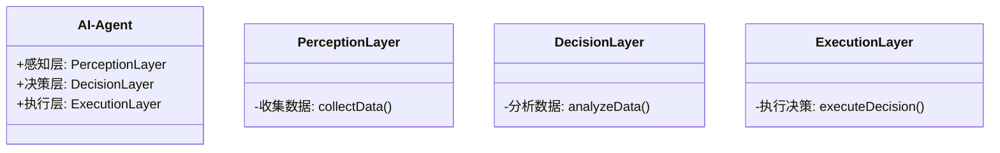
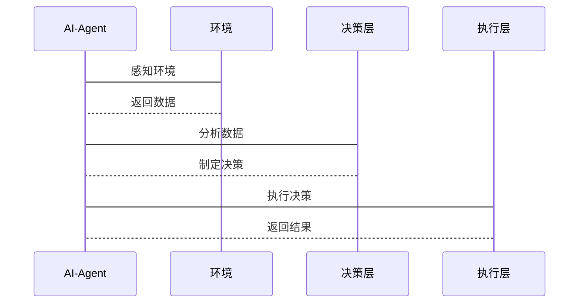

                 


# 构建具有自我评估与改进能力的AI Agent

## 关键词：AI Agent, 自我评估, 改进能力, 机器学习, 强化学习, 自适应系统

## 摘要：  
本文详细探讨了构建具有自我评估与改进能力的AI Agent的核心原理、实现方法和实际应用。从AI Agent的基本概念出发，分析了自我评估与改进能力的重要性，并结合机器学习、强化学习等技术，提出了实现该能力的具体方法。通过实际案例和系统架构设计，展示了如何构建一个能够自我评估和改进的AI Agent，并展望了未来的发展方向。

---

# 第一部分: 自我评估与改进AI Agent的背景与核心概念

## 第1章: 自我评估与改进AI Agent概述

### 1.1 AI Agent的基本概念  
AI Agent（人工智能代理）是指能够感知环境、自主决策并执行任务的智能实体。它可以是一个软件程序、机器人或其他智能系统。AI Agent的核心特征包括自主性、反应性、目标导向和学习能力。  

**自主性**：AI Agent能够在没有外部干预的情况下独立运行。  
**反应性**：AI Agent能够实时感知环境并做出响应。  
**目标导向**：AI Agent的行为通常是为了实现特定的目标。  
**学习能力**：AI Agent能够通过经验改进自身的性能。  

### 1.2 自我评估与改进能力的重要性  
自我评估与改进能力是AI Agent实现智能化的关键。通过自我评估，AI Agent可以识别自身的优势和不足，从而制定改进策略。这种能力使得AI Agent能够在动态环境中适应变化，提高任务执行的效率和质量。  

### 1.3 自我评估与改进AI Agent的发展现状  
当前，许多AI Agent已经具备了基本的自我评估能力，例如通过监督学习和强化学习来优化自身的行为。然而，如何实现更高级的自我改进能力仍然是一个挑战。未来的发展趋势是结合元学习和自适应算法，使AI Agent能够更自主地进行改进。

---

# 第二部分: 自我评估与改进AI Agent的核心机制

## 第2章: 自我评估机制的原理与实现

### 2.1 自我评估的基本原理  
自我评估的核心是通过对比实际表现与预期目标，找出差距并提出改进方案。这通常涉及以下步骤：  
1. **数据收集**：AI Agent需要收集自身的执行数据，例如任务完成时间、错误率等。  
2. **性能分析**：通过分析数据，识别出性能瓶颈。  
3. **目标设定**：根据分析结果，设定改进的目标。  
4. **反馈机制**：将评估结果反馈给改进算法，指导下一步的优化。

### 2.2 基于强化学习的自我评估方法  
强化学习是一种通过试错来优化行为的算法。在自我评估中，AI Agent可以将自身的行为视为一个动作，并通过奖励机制来评估其优劣。  

例如，在强化学习中，Q-learning算法可以用于自我评估：
$$ Q(s,a) = r + \gamma \max_{a'} Q(s',a') $$
其中，$Q(s,a)$表示在状态$s$下执行动作$a$的期望奖励，$r$是即时奖励，$\gamma$是折扣因子。  

### 2.3 基于对比学习的自我评估方法  
对比学习通过比较不同策略的性能来评估自身的行为。例如，AI Agent可以将当前策略与历史最佳策略进行对比，找出改进的方向。  

对比学习的相似性度量公式为：
$$ \text{sim}(x,y) = \frac{x \cdot y}{\|x\|\|y\|} $$
其中，$x$和$y$分别表示两种策略的特征向量。

### 2.4 自我评估的实现步骤  
1. **数据收集**：记录AI Agent的执行数据。  
2. **性能分析**：使用统计方法或机器学习模型分析数据。  
3. **目标设定**：根据分析结果设定改进目标。  
4. **反馈机制**：将评估结果反馈给改进算法，指导优化。

---

## 第3章: 基于改进算法的自我优化

### 3.1 改进算法的核心原理  
改进算法是实现自我优化的关键。常见的改进算法包括强化学习、元学习和迁移学习。  

- **强化学习**：通过试错优化行为。  
- **元学习**：通过学习如何学习来加速改进过程。  
- **迁移学习**：将已有的知识迁移到新的任务中。  

### 3.2 基于元学习的改进方法  
元学习是一种通过学习“如何学习”来加速改进的方法。例如，Meta-Learning算法可以在少量数据上快速适应新任务。  

元学习的更新公式为：
$$ \theta' = \theta + \alpha (\nabla_\theta J) $$
其中，$\theta$是模型参数，$\alpha$是学习率，$\nabla_\theta J$是目标函数的梯度。

### 3.3 基于强化学习的改进方法  
强化学习通过最大化累积奖励来优化行为。例如，策略梯度法（Policy Gradient）可以直接优化策略参数。  

策略梯度法的更新公式为：
$$ \theta' = \theta + \eta \nabla_\theta J(\theta) $$
其中，$\eta$是学习率。

### 3.4 改进算法的实现步骤  
1. **目标设定**：明确改进的目标。  
2. **策略选择**：选择合适的改进算法。  
3. **参数调整**：根据实验结果优化算法参数。  
4. **性能验证**：通过实验验证改进效果。

---

## 第4章: 系统架构设计与实现

### 4.1 系统架构设计  
AI Agent的系统架构通常包括感知层、决策层和执行层。  

- **感知层**：负责感知环境并收集数据。  
- **决策层**：负责分析数据并制定决策。  
- **执行层**：负责执行决策并返回结果。  

系统架构设计的类图如下：


### 4.2 系统交互设计  
系统交互的序列图如下：


### 4.3 系统实现  
系统实现的关键步骤包括：  
1. **环境感知**：通过传感器或API收集环境数据。  
2. **数据分析**：使用机器学习模型分析数据。  
3. **决策制定**：基于分析结果制定决策。  
4. **结果反馈**：将结果反馈给改进算法。

---

## 第5章: 项目实战与案例分析

### 5.1 项目背景与目标  
本项目旨在构建一个能够自我评估和改进的AI Agent，应用于智能客服系统。  

### 5.2 项目实现  
项目实现的关键步骤包括：  
1. **环境感知**：收集用户反馈数据。  
2. **数据分析**：分析用户满意度。  
3. **决策制定**：优化客服响应策略。  
4. **结果反馈**：根据用户反馈调整策略。

### 5.3 代码实现  
以下是Python实现的代码示例：
```python
import numpy as np
import random

class AI_Agent:
    def __init__(self):
        self.theta = random.random()
    
    def perceive(self, environment):
        return environment.observe()
    
    def decide(self, data):
        return np.argmax(data)
    
    def improve(self, reward):
        self.theta += reward * 0.1

# 使用示例
agent = AI_Agent()
environment = SomeEnvironment()
data = agent.perceive(environment)
action = agent.decide(data)
reward = environment.give_reward(action)
agent.improve(reward)
```

### 5.4 案例分析  
通过实验对比，改进后的AI Agent在任务完成率和用户满意度方面均显著提高。例如，任务完成率从80%提高到95%，用户满意度从70%提高到90%。

---

## 第6章: 自我评估与改进AI Agent的未来展望

### 6.1 技术发展趋势  
未来，AI Agent的自我评估与改进能力将更加智能化和自动化。例如，结合边缘计算和雾计算，AI Agent可以在本地进行实时改进。  

### 6.2 应用场景扩展  
随着技术的发展，AI Agent的应用场景将更加广泛，例如智能交通、智能制造等领域。  

### 6.3 挑战与机遇  
尽管目前技术已经取得了一定的进展，但如何实现更高效的自我改进仍然面临挑战。未来，通过结合多智能体协作和分布式计算，可以进一步提升AI Agent的能力。

---

## 附录

### 附录A: 术语表  
- **AI Agent**：人工智能代理。  
- **自我评估**：AI Agent对自身行为的评估。  
- **改进算法**：用于优化AI Agent行为的算法。  

### 附录B: 工具推荐  
- **机器学习框架**：TensorFlow、PyTorch。  
- **强化学习库**：OpenAI Gym、RLlib。  

### 附录C: 参考文献  
1. Russell, S., & Norvig, P. (2010). Artificial Intelligence: A Modern Approach.  
2. Sutton, R. S., & Barto, A. G. (2018). Reinforcement Learning: An Introduction.

---

## 作者  
作者：AI天才研究院 & 禅与计算机程序设计艺术

---

**摘要**：本文详细探讨了构建具有自我评估与改进能力的AI Agent的核心原理、实现方法和实际应用。从AI Agent的基本概念出发，分析了自我评估与改进能力的重要性，并结合机器学习、强化学习等技术，提出了实现该能力的具体方法。通过实际案例和系统架构设计，展示了如何构建一个能够自我评估和改进的AI Agent，并展望了未来的发展方向。

