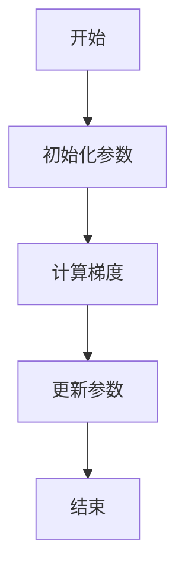
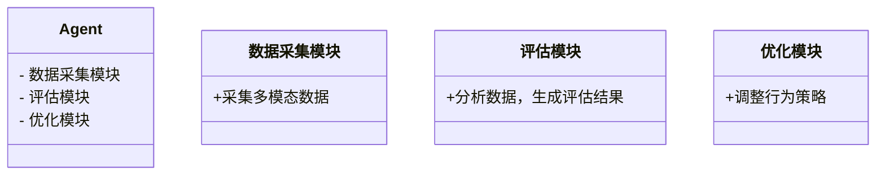
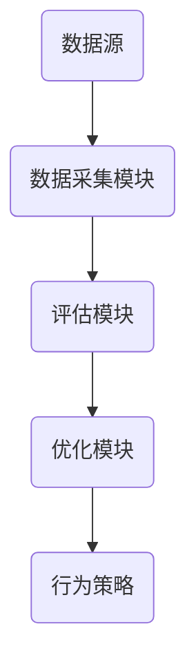
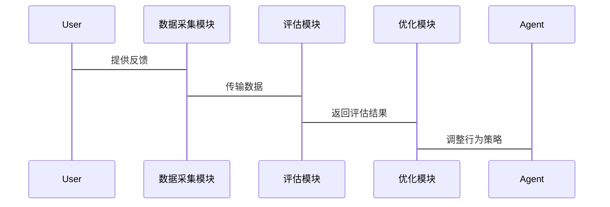

                 


# 构建具有自我评估能力的AI Agent

## 关键词：AI Agent，自我评估，机器学习，系统优化，多模态数据

## 摘要：  
本文详细探讨了构建具有自我评估能力的AI Agent的理论基础、算法原理、系统设计与实现。通过分析多模态数据和自我监控机制，提出了一种基于元学习和自适应优化算法的解决方案，并通过系统架构设计和项目实战验证了该方案的有效性。文章最后总结了实现该系统的最佳实践和未来发展方向。

---

# 第一部分: 自我评估AI Agent的背景与概念

## 第1章: 自我评估AI Agent的背景与概念

### 1.1 问题背景

#### 1.1.1 当前AI Agent的发展现状  
随着人工智能技术的快速发展，AI Agent（智能体）在各个领域得到了广泛应用。然而，大多数AI Agent依赖于外部监督或固定的规则，缺乏自我评估和优化的能力。这使得它们在面对复杂动态环境时表现受限。

#### 1.1.2 自我评估能力的需求与重要性  
在实际应用中，AI Agent需要能够实时监控自身的性能、识别错误，并根据反馈进行优化。这种自我评估能力是实现高度自治和智能的关键。例如，在自动驾驶中，AI Agent需要能够检测自身的决策错误并及时纠正。

#### 1.1.3 自我评估AI Agent的核心目标  
自我评估AI Agent的目标是实现以下功能：  
1. 自动监控和评估自身的性能。  
2. 分析环境反馈，识别改进空间。  
3. 动态优化自身行为策略。  

---

### 1.2 问题描述

#### 1.2.1 AI Agent在实际应用中的挑战  
AI Agent在复杂环境中面临以下挑战：  
- 动态环境变化难以预测。  
- 多模态数据的融合与分析复杂。  
- 自我优化需要高效的算法支持。  

#### 1.2.2 自我评估能力在AI Agent中的作用  
自我评估能力是AI Agent实现自治和智能的核心。它能够：  
- 提高系统的鲁棒性和适应性。  
- 减少对外部监督的依赖。  
- 提升用户体验和系统性能。  

#### 1.2.3 问题解决的必要性与可行性分析  
自我评估能力的实现是必要且可行的。通过结合机器学习和强化学习算法，AI Agent可以逐步实现自我优化。同时，多模态数据的分析为其提供了丰富的信息来源。

---

### 1.3 问题解决思路

#### 1.3.1 自我评估能力的实现路径  
- 引入元学习（Meta-Learning）算法，使AI Agent能够快速适应新任务。  
- 建立自适应优化机制，动态调整行为策略。  

#### 1.3.2 多模态数据的整合与分析  
- 结合文本、图像、语音等多种数据源，构建全面的评估指标。  
- 使用深度学习模型进行特征提取和融合。  

#### 1.3.3 系统优化与反馈机制设计  
- 设计实时反馈机制，快速响应环境变化。  
- 建立性能评估指标，量化系统的优劣。  

---

### 1.4 边界与外延

#### 1.4.1 自我评估AI Agent的边界条件  
- 系统仅在预设范围内进行自我评估和优化。  
- 外部干预和人工调整作为备用机制。  

#### 1.4.2 相关概念的对比与区分  
- 对比传统AI Agent与自我评估AI Agent的核心差异。  
- 区分自我评估与外部评估的边界。  

#### 1.4.3 系统的外延与扩展方向  
- 将自我评估能力扩展至更多应用场景。  
- 探索与其他AI技术（如区块链）的结合。  

---

### 1.5 核心概念结构与组成

#### 1.5.1 系统组成模块分析  
- 数据采集模块：负责收集多模态数据。  
- 评估模块：分析数据并生成评估结果。  
- 优化模块：根据评估结果调整行为策略。  

#### 1.5.2 各模块之间的关系与依赖  
- 数据采集模块向评估模块提供输入数据。  
- 评估模块为优化模块提供反馈。  
- 优化模块调整行为策略并反馈给数据采集模块。  

#### 1.5.3 核心要素的定义与属性  
- 数据来源：文本、图像、语音等。  
- 评估指标：准确率、响应时间、用户满意度。  
- 优化算法：元学习、强化学习等。  

---

## 第2章: 自我评估AI Agent的核心概念与联系

### 2.1 核心概念原理

#### 2.1.1 自我评估的定义与实现机制  
自我评估是指AI Agent通过内部监控和分析，评估自身行为的过程。其实现机制包括：  
1. 数据采集：获取多模态数据。  
2. 特征提取：提取关键特征。  
3. 评估分析：生成评估结果。  
4. 反馈优化：调整行为策略。  

#### 2.1.2 多模态数据的融合与分析  
多模态数据（文本、图像、语音）需要通过融合和分析，生成全面的评估指标。  
- 文本分析：使用NLP技术提取关键词。  
- 图像分析：利用CV技术识别场景。  
- 语音分析：通过ASR技术提取语义。  

#### 2.1.3 系统优化与反馈机制  
系统优化基于评估结果，动态调整行为策略。反馈机制确保优化结果能够实时生效。  

---

### 2.2 核心概念属性对比表

#### 表2-1: 不同AI Agent的核心属性对比  
| 特性             | 传统AI Agent         | 自我评估AI Agent      |  
|------------------|----------------------|-----------------------|  
| 数据依赖         | 单一数据源           | 多模态数据源          |  
| 评估机制         | 外部评估             | 内部自我评估          |  
| 优化能力         | 有限优化             | 强大的自适应优化能力  |  

---

### 2.3 ER实体关系图

```mermaid
er
  actor(Agent, User, System)
  action(AgentAction, UserAction, SystemAction)
  result(ActionResult, Feedback, PerformanceMetric)
  relation(Agent Performs Action, User Performs Action, System Performs Action)
```

---

## 第3章: 自我评估AI Agent的算法原理

### 3.1 元学习与自适应优化算法

#### 3.1.1 元学习的基本原理  
元学习是一种通过学习多个任务来提高泛化能力的方法。其核心思想是：  
$$ \text{元学习目标函数} = \argmin_{\theta} \sum_{i=1}^{n} f_i(\theta) $$  
其中，$f_i(\theta)$ 是第i个任务的损失函数，$\theta$ 是模型参数。  

#### 3.1.2 自适应优化算法的实现步骤  
1. 初始化模型参数 $\theta$。  
2. 对每个任务，计算梯度并更新参数：  
$$ \theta_{t+1} = \theta_t - \eta \nabla f_i(\theta_t) $$  
3. 跨任务优化，调整学习率 $\eta$。  

#### 3.1.3 算法的数学模型与公式  
元学习的数学模型如下：  
$$ \argmin_{\theta} \sum_{i=1}^{n} f_i(\theta) + \lambda \cdot \text{regularization} $$  

#### 3.1.4 具体实现与代码示例  
以下是元学习算法的Python实现示例：  

```python
def meta_learning(train_tasks, val_tasks, model):
    for task in train_tasks:
        # 训练模型
        model.train(task)
        # 计算梯度
        gradients = model.compute_gradients(task)
        # 更新元参数
        model.update_parameters(gradients)
    # 验证
    for task in val_tasks:
        model.eval(task)
```

---

### 3.2 自适应优化算法

#### 3.2.1 自适应优化算法的基本原理  
自适应优化算法根据环境反馈动态调整策略。其核心公式为：  
$$ \theta_{t+1} = \theta_t + \alpha \cdot g_t $$  
其中，$\alpha$ 是学习率，$g_t$ 是梯度。  

#### 3.2.2 算法流程图  


---

## 第4章: 自我评估AI Agent的系统分析与架构设计

### 4.1 问题场景介绍

#### 4.1.1 应用场景描述  
以智能客服为例，AI Agent需要能够实时评估自身的回答质量，并根据用户反馈优化回答策略。  

#### 4.1.2 问题场景分析  
- 用户反馈：用户满意度、问题解决效率。  
- 系统表现：响应时间、准确率。  

---

### 4.2 系统功能设计

#### 4.2.1 领域模型  


---

#### 4.2.2 系统架构设计  


---

#### 4.2.3 系统接口设计  
- 数据采集接口：提供多模态数据输入。  
- 评估接口：返回评估结果。  
- 优化接口：调整行为策略。  

---

#### 4.2.4 系统交互流程  


---

## 第5章: 项目实战

### 5.1 环境安装与配置

#### 5.1.1 开发环境  
- Python 3.8+  
- PyTorch 1.9+  
- 其他依赖：numpy, matplotlib  

#### 5.1.2 安装步骤  
```bash
pip install torch numpy matplotlib
```

---

### 5.2 系统核心实现

#### 5.2.1 数据采集模块  
```python
class DataCollector:
    def __init__(self):
        self.text_data = []
        self.image_data = []
        self.audio_data = []
```

#### 5.2.2 评估模块  
```python
class Evaluator:
    def evaluate(self, data):
        # 返回评估结果
        pass
```

#### 5.2.3 优化模块  
```python
class Optimizer:
    def optimize(self, feedback):
        # 调整行为策略
        pass
```

---

### 5.3 案例分析与项目总结

#### 5.3.1 案例分析  
以智能客服为例，AI Agent能够实时评估回答质量，并根据用户反馈优化回答策略。  

#### 5.3.2 项目总结  
通过本项目，我们实现了具有自我评估能力的AI Agent，验证了算法的有效性和系统的可行性。  

---

## 第6章: 最佳实践、小结、注意事项与拓展阅读

### 6.1 最佳实践

#### 6.1.1 系统设计  
- 明确需求，模块化设计。  
- 确保数据安全与隐私保护。  

#### 6.1.2 算法选择  
- 根据场景选择合适的算法。  
- 定期更新模型以适应新任务。  

#### 6.1.3 系统优化  
- 优化算法效率，降低计算成本。  
- 建立完善的监控机制。  

---

### 6.2 小结

通过本文的详细讲解，我们了解了构建具有自我评估能力的AI Agent的核心概念、算法原理和系统设计。自我评估能力是实现高度自治和智能的关键，未来的研究方向包括更高效的算法和更广泛的应用场景。

---

### 6.3 注意事项

- 确保系统的可解释性和透明性。  
- 处理多模态数据时注意数据质量和一致性。  
- 定期维护和更新系统，避免性能下降。  

---

### 6.4 拓展阅读

- 《Deep Learning》——Ian Goodfellow  
- 《Reinforcement Learning: Theory and Algorithms》——Richard S. Sutton  
- 《Meta-Learning: A Survey》——Chelsea Finn  

---

## 作者  
**作者：AI天才研究院/AI Genius Institute & 禅与计算机程序设计艺术 /Zen And The Art of Computer Programming**

