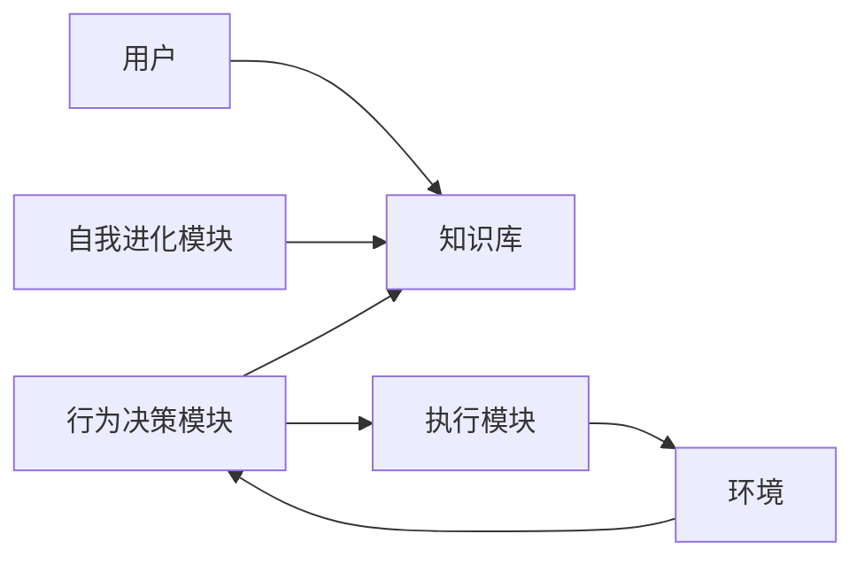
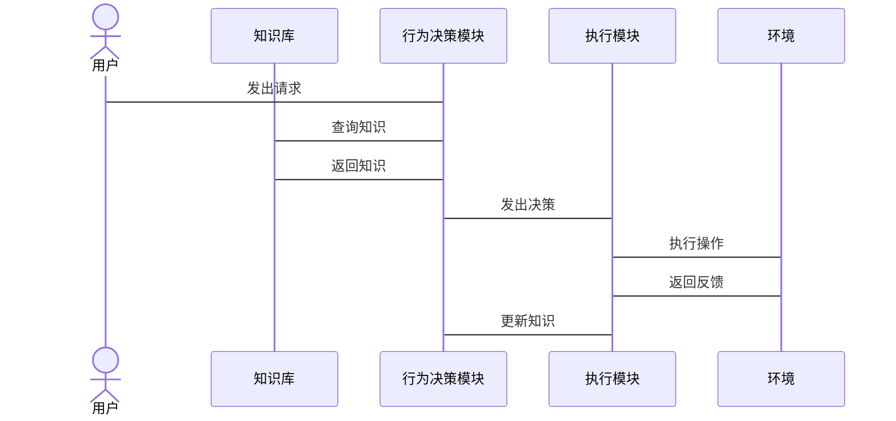

                 


# 构建具有自我进化能力的AI Agent系统

## 关键词：AI Agent，自我进化，强化学习，自适应算法，知识图谱

## 摘要：
构建一个能够自我进化的AI Agent系统，需要综合运用强化学习、自适应算法和知识图谱等技术。本文从背景介绍、核心概念、算法原理、系统架构到项目实战，全面解析如何实现一个能够自主学习和适应复杂环境的AI Agent系统。

---

## 第一部分：自我进化AI Agent系统背景与概念

### 第1章：问题背景与需求分析

#### 1.1 问题背景
- **当前AI Agent的发展现状**：传统AI Agent依赖于预定义规则，在复杂动态环境中表现受限。
- **自我进化能力的必要性**：环境复杂多变，AI Agent需要不断学习和适应。
- **传统AI Agent的局限性**：无法处理未见任务，缺乏自适应能力。

#### 1.2 问题描述
- **定义**：AI Agent通过与环境交互，逐步优化自身行为策略。
- **核心目标**：动态调整策略，增强适应性。
- **关键特征**：自主学习、自适应决策、知识更新。

#### 1.3 问题解决思路
- **实现路径**：强化学习、自适应算法、知识图谱。
- **基本原则**：目标导向、反馈驱动、持续优化。
- **关键要素**：环境感知、知识表示、决策优化。

### 第2章：核心概念与联系

#### 2.1 核心概念原理
- **知识表示**：符号逻辑或分布表示。
- **更新规则**：基于反馈的强化学习。
- **决策机制**：基于当前知识的最优选择。

#### 2.2 对比分析
| 特征         | 传统AI Agent       | 自我进化AI Agent       |
|--------------|--------------------|-------------------------|
| 知识更新     | 静态或周期性更新    | 动态实时更新             |
| 决策方式     | 基于规则           | 基于学习和优化           |
| 适应性       | 有限               | 强大                   |

#### 2.3 实体关系图


---

## 第二部分：算法原理与数学模型

### 第3章：算法原理

#### 3.1 强化学习算法
- **Q-learning**：通过状态-动作-奖励更新Q值。
  $$ Q(s,a) \leftarrow Q(s,a) + \alpha (r + \max Q(s',a') - Q(s,a)) $$
- **策略梯度方法**：通过梯度下降优化策略。
  $$ \theta \leftarrow \theta + \alpha \nabla_\theta J(\theta) $$

#### 3.2 算法流程图
```mermaid
graph TD
A[开始] --> B[环境感知]
C[知识更新] --> B
D[决策生成] --> C
E[执行操作] --> D
F[反馈收集] --> E
G[结束] <-- F
```

#### 3.3 代码示例
```python
import numpy as np

class Agent:
    def __init__(self, state_space, action_space):
        self.state_space = state_space
        self.action_space = action_space
        self.Q = np.zeros((state_space, action_space))

    def act(self, state):
        # ε-greedy策略
        epsilon = 0.1
        if np.random.random() < epsilon:
            return np.random.randint(self.action_space)
        else:
            return np.argmax(self.Q[state])

    def update(self, state, action, reward, next_state):
        # Q-learning更新
        alpha = 0.1
        gamma = 0.99
        target = reward + gamma * np.max(self.Q[next_state])
        self.Q[state][action] = self.Q[state][action] + alpha * (target - self.Q[state][action])
```

### 第4章：数学模型与公式

- **Q-learning公式**：
  $$ Q(s,a) = Q(s,a) + \alpha [r + \gamma \max Q(s',a') - Q(s,a)] $$
- **策略梯度公式**：
  $$ \nabla J(\theta) = \mathbb{E}[ \nabla \log \pi(a|s) Q(s,a) ] $$

---

## 第三部分：系统分析与架构设计

### 第5章：系统架构设计

#### 5.1 项目背景
- 开发一个AI Agent，能够在动态环境中自主学习和优化决策。

#### 5.2 系统功能设计
- **领域模型**：用户、知识库、行为决策模块、执行模块、环境。
- **架构图**：
  ```mermaid
  graph LR
  A[用户] --> B[知识库]
  C[行为决策模块] --> B
  D[自我进化模块] --> B
  C --> E[执行模块]
  E --> F[环境]
  F --> C
  ```

#### 5.3 系统交互


---

## 第四部分：项目实战

### 第6章：环境安装与代码实现

#### 6.1 环境安装
```bash
pip install numpy matplotlib
```

#### 6.2 核心代码实现
```python
import numpy as np
import matplotlib.pyplot as plt

class EvolutionaryAI:
    def __init__(self, states, actions):
        self.states = states
        self.actions = actions
        self.Q = np.zeros((states, actions))

    def epsilon_greedy_policy(self, state):
        epsilon = 0.1
        if np.random.random() < epsilon:
            return np.random.randint(self.actions)
        else:
            return np.argmax(self.Q[state])

    def update_Q(self, state, action, reward, next_state):
        alpha = 0.1
        gamma = 0.99
        self.Q[state][action] += alpha * (reward + gamma * np.max(self.Q[next_state]) - self.Q[state][action])

    def train(self, episodes):
        rewards = []
        for _ in range(episodes):
            state = np.random.randint(self.states)
            action = self.epsilon_greedy_policy(state)
            next_state = np.random.randint(self.states)
            reward = np.random.randint(0, 10)
            self.update_Q(state, action, reward, next_state)
            rewards.append(self.Q[state][action])
        plt.plot(rewards)
        plt.show()

agent = EvolutionaryAI(5, 3)
agent.train(1000)
```

---

## 第五部分：总结与展望

### 7.1 总结
本文详细介绍了构建具有自我进化能力的AI Agent系统的各个方面，从背景概念到算法实现，再到系统架构和项目实战，为读者提供了全面的指导。

### 7.2 未来展望
- 更复杂的环境适应
- 更高效的学习算法
- 更强大的知识表示方法

---

## 作者：
作者：AI天才研究院 & 禅与计算机程序设计艺术

