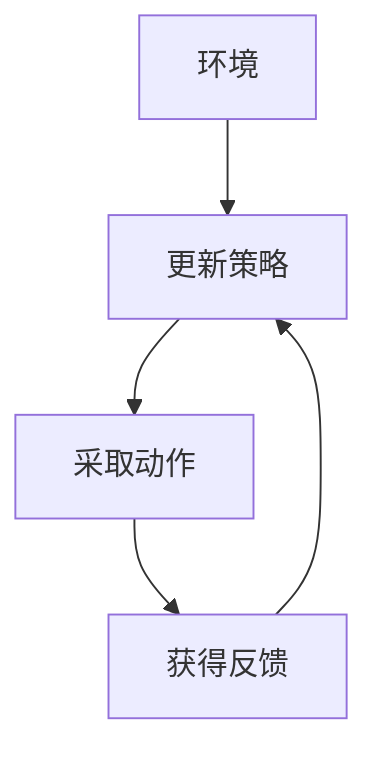
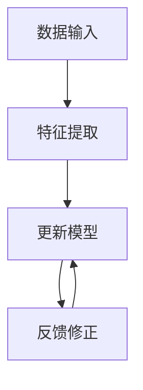
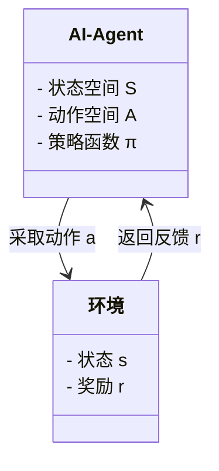
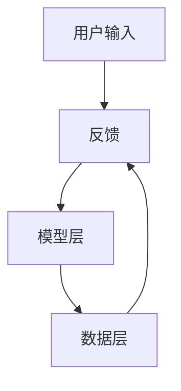

                 


# 构建具有自适应学习策略的AI Agent

## 关键词：AI Agent，自适应学习策略，强化学习，监督学习，系统架构设计

## 摘要：本文详细探讨了构建具有自适应学习策略的AI Agent的核心概念、算法原理、系统架构设计及项目实战。通过分析自适应学习策略的原理和应用场景，结合强化学习和监督学习的算法实现，为读者提供一个从理论到实践的完整指南。

---

# 第1章: 自适应学习策略的AI Agent概述

## 1.1 问题背景与描述

### 1.1.1 AI Agent的基本概念

AI Agent（人工智能代理）是指能够感知环境、做出决策并采取行动以实现目标的智能系统。AI Agent可以是软件程序、机器人或其他智能系统，其核心目标是通过与环境的交互，完成特定任务或优化特定目标函数。

### 1.1.2 自适应学习策略的核心问题

自适应学习策略是指AI Agent能够根据环境反馈动态调整其学习行为和决策策略的能力。核心问题包括：

1. 如何感知环境并提取有用信息？
2. 如何根据反馈调整学习策略？
3. 如何在动态环境中保持稳定性和高效性？

### 1.1.3 问题的边界与外延

自适应学习策略的AI Agent不仅需要处理静态环境，还需要应对动态变化的环境。其边界包括：

- **输入范围**：环境状态、用户反馈、任务目标。
- **输出范围**：决策动作、概率分布、优化建议。
- **外延**：从单一任务到多任务学习，从局部优化到全局优化。

## 1.2 核心概念与联系

### 1.2.1 自适应学习策略的原理

自适应学习策略的核心是通过强化学习（Reinforcement Learning）或监督学习（Supervised Learning）的方式，动态调整策略参数。其原理包括：

1. **感知环境**：通过传感器或数据接口获取环境信息。
2. **决策制定**：基于当前状态和历史经验，选择最优动作。
3. **反馈学习**：根据环境反馈（奖励或惩罚）调整策略。

### 1.2.2 AI Agent与自适应学习策略的关系

AI Agent是自适应学习策略的载体，而自适应学习策略是AI Agent的核心能力。两者的关系如下：

- **AI Agent**：负责执行动作、感知环境并采取行动。
- **自适应学习策略**：负责优化AI Agent的决策过程，使其在动态环境中表现更优。

### 1.2.3 核心概念对比表

```mermaid
| 概念       | 描述                                                         |
|------------|--------------------------------------------------------------|
| AI Agent   | 具有自主决策能力的智能体，能够感知环境并采取行动。         |
| 策略函数   | 定义AI Agent在给定状态下采取动作的概率分布或确定性动作。     |
| 状态空间   | 所有可能环境状态的集合。                                   |
| 动作空间   | 所有可能决策动作的集合。                                   |
| 奖励函数   | 定义在特定状态下采取某个动作后获得的奖励值。               |
```

---

# 第2章: 自适应学习策略的核心原理

## 2.1 算法原理讲解

### 2.1.1 基于强化学习的自适应策略

强化学习是一种通过试错方式优化策略的算法。其核心流程如下：



- **奖励机制**：通过奖励函数定义动作的好坏。
- **策略更新**：通过Q-learning或策略梯度方法优化策略函数。

### 2.1.2 基于监督学习的策略调整

监督学习通过标注数据训练模型，使其能够预测正确的动作。其流程如下：



- **监督信号**：通过标注数据提供正确动作的指导。
- **模型优化**：通过反向传播优化模型参数。

## 2.2 数学模型与公式

### 2.2.1 强化学习的基本公式

在强化学习中，价值函数（Value Function）定义为：

$$ V(s) = \max_a Q(s,a) $$

其中：
- \( s \) 表示状态。
- \( a \) 表示动作。
- \( Q(s,a) \) 表示状态-动作对的价值。

### 2.2.2 策略更新的数学表达

策略梯度方法通过以下公式更新策略参数：

$$ \theta_{t+1} = \theta_t + \alpha (r_t + V(s_{t+1}) - Q(s_t, a_t)) \cdot \nabla_\theta Q(s_t, a_t) $$

其中：
- \( \alpha \) 表示学习率。
- \( r_t \) 表示即时奖励。
- \( V(s_{t+1}) \) 表示下一状态的价值。

---

# 第3章: 系统分析与架构设计

## 3.1 问题场景介绍

### 3.1.1 自适应学习策略的应用场景

自适应学习策略广泛应用于以下场景：

1. **游戏AI**：通过强化学习优化游戏策略。
2. **推荐系统**：根据用户反馈动态调整推荐策略。
3. **机器人控制**：在动态环境中优化机器人动作。

### 3.1.2 系统需求分析

系统需求包括：

1. **实时性**：快速响应环境变化。
2. **稳定性**：在动态环境中保持稳定。
3. **可扩展性**：支持多种任务和环境。

## 3.2 系统功能设计

### 3.2.1 领域模型设计

领域模型描述了系统的核心组件及其交互关系：



## 3.3 系统架构设计

### 3.3.1 系统架构图

系统架构图展示了各组件之间的关系：



## 3.4 系统接口与交互

### 3.4.1 接口设计

系统接口包括：

1. **输入接口**：接收环境状态和用户反馈。
2. **输出接口**：输出决策动作和优化建议。

### 3.4.2 交互流程图

```mermaid
sequenceDiagram
用户 ->+> 策略层: 请求处理
策略层 ->+> 模型层: 获取反馈
模型层 ->+> 用户: 返回结果
```

---

# 第4章: 项目实战

## 4.1 环境安装与配置

### 4.1.1 安装Python与依赖库

安装Python和以下依赖库：

```bash
pip install numpy
pip install gym
pip install matplotlib
```

### 4.1.2 环境配置说明

确保安装了强化学习框架（如OpenAI Gym）和数据可视化库（如Matplotlib）。

## 4.2 核心代码实现

### 4.2.1 策略层实现

```python
class Agent:
    def __init__(self, state_space, action_space):
        self.state_space = state_space
        self.action_space = action_space
        self.Q = defaultdict(lambda: 0)
        self.learning_rate = 0.1

    def take_action(self, state):
        # 探索与利用策略
        if random.random() < 0.1:
            return random.choice(self.action_space)
        else:
            return argmax(self.Q[state])

    def update_Q(self, state, action, reward, next_state):
        # Q-learning算法
        target = reward + max(self.Q[next_state])
        self.Q[(state, action)] = (1 - self.learning_rate) * self.Q[(state, action)] + self.learning_rate * target
```

### 4.2.2 环境与训练循环

```python
import gym
from agent import Agent

env = gym.make('CartPole-v0')
agent = Agent(env.observation_space.shape[0], env.action_space.n)

for episode in range(1000):
    state = env.reset()
    total_reward = 0
    while True:
        action = agent.take_action(state)
        next_state, reward, done, _ = env.step(action)
        agent.update_Q(state, action, reward, next_state)
        total_reward += reward
        if done:
            break
    print(f"Episode {episode}, Total Reward: {total_reward}")
```

## 4.3 实际案例分析

### 4.3.1 游戏AI案例

以OpenAI Gym中的CartPole环境为例，训练AI Agent掌握平衡杆的动作。通过强化学习算法，AI Agent能够通过试错学习掌握平衡杆的技巧。

### 4.3.2 推荐系统案例

在推荐系统中，自适应学习策略可以根据用户反馈动态调整推荐策略，提升用户满意度。

## 4.4 项目小结

通过以上实现，我们可以看到自适应学习策略的强大能力。通过强化学习和监督学习的结合，AI Agent可以在动态环境中不断优化其决策策略。

---

# 第5章: 最佳实践与总结

## 5.1 最佳实践 Tips

1. **数据质量**：确保输入数据的准确性和完整性。
2. **模型可解释性**：避免过于复杂的模型，确保模型的可解释性。
3. **环境稳定性**：在动态环境中，保持模型的稳定性。

## 5.2 小结

自适应学习策略的AI Agent是一种强大的工具，能够帮助我们在动态环境中实现复杂的任务。通过强化学习和监督学习的结合，我们可以构建出高效、稳定且可扩展的自适应学习系统。

## 5.3 注意事项

1. **性能优化**：注意计算资源的消耗，避免过度优化。
2. **安全问题**：确保系统在安全的环境下运行。
3. **用户体验**：在实际应用中，注重用户体验的优化。

## 5.4 拓展阅读

1. 约翰·霍普金斯大学的《强化学习入门》。
2. 《自适应控制系统：理论与应用》。
3. OpenAI Gym官方文档。

---

# 作者：AI天才研究院/AI Genius Institute & 禅与计算机程序设计艺术 /Zen And The Art of Computer Programming

