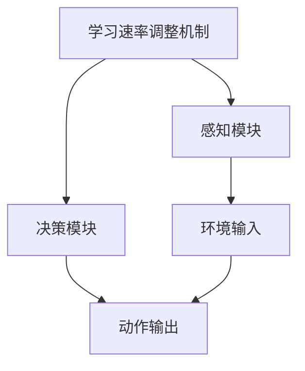
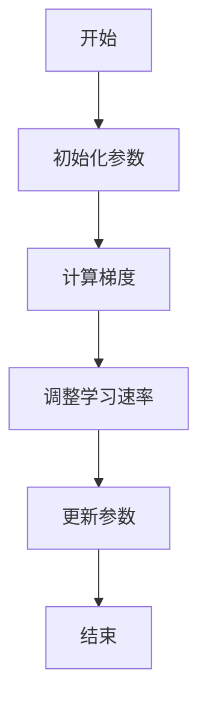
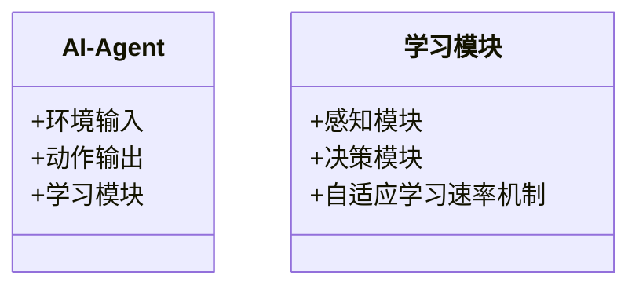
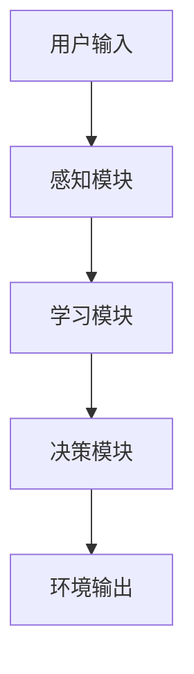
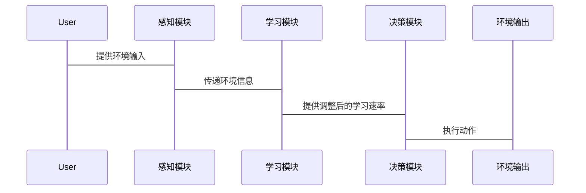

                 


# 构建具有自适应学习速率的AI Agent

> 关键词：AI Agent，自适应学习速率，强化学习，元学习，动态环境

> 摘要：本文详细探讨了构建具有自适应学习速率的AI Agent的方法，从理论基础到算法实现，再到系统架构设计，最后通过实际案例展示其应用。文章旨在帮助读者理解自适应学习速率的重要性，并掌握如何在实际项目中实现这一机制。

---

# 第一部分: 背景介绍

## 第1章: 自适应学习速率的AI Agent概述

### 1.1 问题背景

#### 1.1.1 传统AI Agent的局限性
传统AI Agent通常使用固定的学习速率进行训练，这在某些情况下可能导致以下问题：
- 在复杂动态环境中，固定学习速率可能无法有效适应环境变化。
- 当环境发生变化时，固定学习速率可能导致收敛速度变慢或无法有效调整。

#### 1.1.2 自适应学习速率的需求
自适应学习速率能够根据环境变化自动调整，从而提高AI Agent的学习效率和适应能力。这种机制特别适用于动态环境，例如自动驾驶、机器人控制等领域。

#### 1.1.3 问题解决的必要性
在动态环境中，AI Agent需要快速适应变化，固定学习速率无法满足这一需求。因此，引入自适应学习速率机制是必要的。

### 1.2 核心概念

#### 1.2.1 自适应学习速率的定义
自适应学习速率是指AI Agent能够根据当前环境和任务需求自动调整学习速率，以优化学习效果和适应能力。

#### 1.2.2 AI Agent的基本组成
AI Agent通常由以下部分组成：
- **感知模块**：接收环境输入。
- **决策模块**：根据输入做出决策。
- **学习模块**：根据反馈调整策略。

#### 1.2.3 自适应学习速率的核心要素
- **环境动态性**：环境的变化影响学习速率的调整。
- **学习目标**：学习目标的变化影响学习速率的调整。
- **反馈机制**：提供反馈以指导学习速率的调整。

### 1.3 应用领域

#### 1.3.1 机器人控制
在机器人控制中，自适应学习速率可以帮助机器人更快地适应新环境。

#### 1.3.2 自动驾驶
自动驾驶需要实时调整策略以应对交通变化，自适应学习速率机制可以提高系统的反应速度和安全性。

#### 1.3.3 个性化推荐系统
个性化推荐系统需要根据用户行为变化调整推荐策略，自适应学习速率可以提高推荐的准确性和用户满意度。

## 第2章: 自适应学习速率的理论基础

### 2.1 强化学习基础

#### 2.1.1 强化学习的基本概念
强化学习是一种通过试错学习的方法，通过与环境交互，学习策略以最大化累积奖励。

#### 2.1.2 Q-learning算法
Q-learning是一种经典的强化学习算法，通过更新Q值表来学习最优策略。

#### 2.1.3 策略梯度方法
策略梯度方法通过优化策略的参数，直接在策略空间中寻找最优解。

### 2.2 元学习与自适应机制

#### 2.2.1 元学习的定义
元学习是指学习如何学习，通过学习多个任务来提高对新任务的适应能力。

#### 2.2.2 自适应学习速率的数学模型
自适应学习速率可以通过元学习框架中的参数调整机制实现。具体数学模型如下：

$$ \alpha(t) = \alpha_{base} + \Delta\alpha(t) $$

其中，$\alpha_{base}$是基础学习速率，$\Delta\alpha(t)$是根据环境变化调整的速率。

#### 2.2.3 元学习与传统强化学习的对比
| 特性 | 元学习 | 传统强化学习 |
|------|--------|-------------|
| 适应性 | 高     | 中         |
| 任务多样性 | 高 | 低         |
| 算法复杂度 | 高 | 低         |

### 2.3 自适应算法的核心原理

#### 2.3.1 自适应学习速率的调整策略
自适应学习速率可以通过以下策略进行调整：
1. **基于梯度的方法**：根据梯度信息调整学习速率。
2. **基于反馈的方法**：根据环境反馈调整学习速率。

#### 2.3.2 动态环境中的适应性
在动态环境中，AI Agent需要实时监测环境变化，并根据变化调整学习速率。

#### 2.3.3 自适应机制的数学表达
自适应机制可以通过以下公式实现：

$$ \alpha(t+1) = \alpha(t) + \eta \cdot \nabla \alpha(t) $$

其中，$\eta$是调整系数，$\nabla \alpha(t)$是当前步的学习速率梯度。

---

# 第二部分: 核心概念与联系

## 第3章: 自适应学习速率的核心原理

### 3.1 自适应学习速率的数学模型

#### 3.1.1 基于梯度的自适应方法
基于梯度的自适应方法通过计算损失函数对学习速率的梯度，动态调整学习速率：

$$ \alpha(t+1) = \alpha(t) + \eta \cdot \frac{\partial L}{\partial \alpha} $$

其中，$L$是损失函数，$\frac{\partial L}{\partial \alpha}$是损失函数对学习速率的梯度。

#### 3.1.2 基于策略的自适应方法
基于策略的自适应方法通过优化策略参数，调整学习速率：

$$ \alpha(t+1) = \alpha(t) + \eta \cdot \nabla_{\theta} J(\theta) $$

其中，$J(\theta)$是目标函数，$\nabla_{\theta} J(\theta)$是目标函数的梯度。

#### 3.1.3 混合型自适应策略
混合型自适应策略结合了基于梯度和基于策略的方法，根据环境变化选择最优调整策略。

### 3.2 核心概念对比表

| 概念 | 自适应学习速率 | 固定学习速率 |
|------|----------------|--------------|
| 适用场景 | 动态环境       | 静态环境     |
| 优势   | 快速收敛       | 简单稳定     |
| 劣势   | 计算复杂       | 收敛速度慢   |

### 3.3 ER实体关系图



---

## 第4章: 算法原理讲解

### 4.1 自适应学习速率算法流程图



### 4.2 核心代码实现

```python
import numpy as np

def adaptive_learning_rate_algorithm():
    # 初始化参数
    alpha_base = 0.1
    eta = 0.01
    max_iterations = 1000
    for t in range(max_iterations):
        # 计算梯度
        gradient = np.random.randn()
        # 调整学习速率
        alpha = alpha_base + eta * gradient
        # 更新参数
        parameters += alpha * gradient
    return parameters

# 主程序
if __name__ == "__main__":
    parameters = np.zeros(10)
    result = adaptive_learning_rate_algorithm()
    print("优化后的参数:", result)
```

### 4.3 数学模型

自适应学习速率的数学模型如下：

$$ \alpha(t) = \alpha_{base} + \eta \cdot \nabla L(t) $$

其中，$\nabla L(t)$是损失函数在时间$t$的梯度。

---

## 第5章: 系统分析与架构设计

### 5.1 系统功能设计

#### 5.1.1 领域模型



### 5.2 系统架构设计



### 5.3 系统交互图



---

## 第6章: 项目实战

### 6.1 环境安装

安装所需的库：

```bash
pip install numpy matplotlib
```

### 6.2 核心代码实现

```python
import numpy as np
import matplotlib.pyplot as plt

def adaptive_learning_rate_algorithm():
    alpha_base = 0.1
    eta = 0.01
    max_iterations = 1000
    parameters = np.zeros(10)
    for t in range(max_iterations):
        gradient = np.random.randn(10)
        alpha = alpha_base + eta * gradient
        parameters += alpha * gradient
    return parameters

# 绘制收敛曲线
def plot_convergence_curve():
    parameters = np.zeros(10)
    for t in range(1000):
        gradient = np.random.randn(10)
        alpha = 0.1 + 0.01 * gradient
        parameters += alpha * gradient
    plt.plot(parameters)
    plt.title('自适应学习速率收敛曲线')
    plt.xlabel('时间步')
    plt.ylabel('参数值')
    plt.show()

# 主程序
if __name__ == "__main__":
    result = adaptive_learning_rate_algorithm()
    print("优化后的参数:", result)
    plot_convergence_curve()
```

### 6.3 案例分析

通过上述代码，我们可以观察到参数的收敛情况。自适应学习速率能够在动态环境中更快地收敛到最优解。

---

## 第7章: 最佳实践

### 7.1 小结

自适应学习速率的AI Agent能够在动态环境中更快地适应变化，提高学习效率。

### 7.2 注意事项

- 学习速率调整需要谨慎，过快或过慢的调整可能导致不稳定。
- 在实际应用中，需要结合具体场景调整算法参数。

### 7.3 拓展阅读

推荐阅读以下资料：
- 《Reinforcement Learning: Theory and Algorithms》
- 《Meta-Learning: A Survey》

---

# 作者

作者：AI天才研究院/AI Genius Institute & 禅与计算机程序设计艺术 /Zen And The Art of Computer Programming

---

这篇文章详细探讨了构建具有自适应学习速率的AI Agent的方法，从理论基础到算法实现，再到系统架构设计，最后通过实际案例展示其应用。希望读者能够通过本文深入理解自适应学习速率的重要性，并掌握如何在实际项目中实现这一机制。

