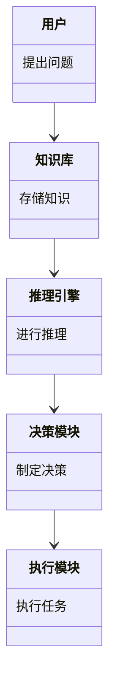
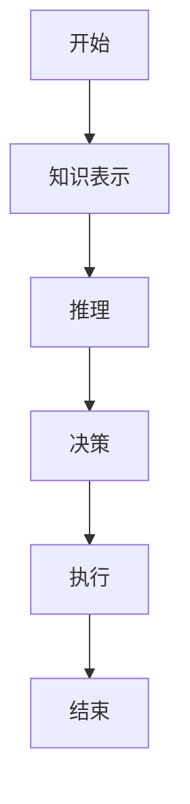

                 


# 构建具有认知计算能力的AI Agent

> 关键词：认知计算，AI Agent，知识表示，推理机制，系统架构

> 摘要：本文将详细探讨如何构建一个具有认知计算能力的AI Agent。通过分析认知计算的核心原理、AI Agent的设计与实现、系统架构、项目实战、优化与部署等方面，为读者提供从理论到实践的全面指导。文章内容丰富，结构清晰，适合技术开发者和研究人员阅读。

---

## 第一部分: 认知计算与AI Agent引言

### 第1章: 认知计算与AI Agent概述

#### 1.1 问题背景与重要性

##### 1.1.1 人工智能发展的现状与挑战
人工智能（AI）技术近年来取得了显著进展，但在复杂场景下的应用仍面临诸多挑战。传统的AI系统基于规则和数据驱动，难以处理动态变化的环境和复杂的人类认知任务。

##### 1.1.2 认知计算的概念与特点
认知计算是一种模拟人类认知过程的计算方式，强调知识表示、推理和学习能力。其核心在于通过模拟人类大脑的工作方式，实现更自然的交互和问题解决。

##### 1.1.3 AI Agent的核心目标与应用场景
AI Agent（智能代理）是一种能够感知环境、自主决策并执行任务的智能系统。其目标是通过认知计算能力，实现在复杂环境中的自主学习和问题解决。应用场景包括智能助手、自动驾驶、智能客服等。

#### 1.2 问题描述与解决思路

##### 1.2.1 传统AI的局限性
传统AI系统依赖于预定义规则和大量数据，难以处理不确定性、动态变化和复杂推理任务。

##### 1.2.2 认知计算的核心问题
认知计算的核心问题是如何实现知识表示、推理和学习的自动化，使AI系统能够像人类一样理解和解决问题。

##### 1.2.3 AI Agent的设计目标与实现路径
AI Agent的设计目标是实现自主决策和问题解决能力。实现路径包括知识表示、推理机制、多模态数据处理等。

#### 1.3 问题解决与边界外延

##### 1.3.1 认知计算的关键技术
认知计算的关键技术包括知识表示、推理、学习和多模态数据处理。

##### 1.3.2 AI Agent的功能边界与实现范围
AI Agent的功能边界包括感知环境、知识表示、推理和执行任务。实现范围涉及算法实现、系统架构设计和接口开发。

##### 1.3.3 相关概念的对比与联系
AI Agent与传统AI系统的对比：AI Agent具备自主决策能力，而传统AI系统依赖于规则和数据。

认知计算与机器学习的对比：认知计算强调知识表示和推理，机器学习强调数据驱动的模式识别。

#### 1.4 概念结构与核心要素

##### 1.4.1 认知计算的系统架构
认知计算的系统架构包括知识库、推理引擎和执行模块。

##### 1.4.2 AI Agent的核心要素组成
AI Agent的核心要素包括感知模块、知识表示模块、推理模块和执行模块。

##### 1.4.3 问题解决的逻辑框架
问题解决的逻辑框架包括问题理解、知识表示、推理与决策、执行与反馈。

#### 1.5 本章小结
本章介绍了认知计算和AI Agent的基本概念，分析了传统AI的局限性，提出了认知计算的核心问题和实现路径。

---

## 第二部分: 认知计算的核心原理

### 第2章: 认知计算的原理与方法

#### 2.1 核心概念与原理

##### 2.1.1 知识表示与推理机制
知识表示是认知计算的核心，常见的表示方法包括符号逻辑、语义网络和图表示。推理机制包括演绎推理、归纳推理和 abduction推理。

##### 2.1.2 认知模型的构建方法
认知模型的构建方法包括基于规则的模型、基于案例的推理和基于知识图谱的模型。

##### 2.1.3 多模态数据的处理方式
多模态数据的处理方式包括图像识别、自然语言处理和语音识别的结合，实现多模态信息的融合与推理。

#### 2.2 核心概念的属性特征对比

##### 2.2.1 不同认知模型的对比分析
符号逻辑与语义网络的对比：符号逻辑强调规则和逻辑推理，语义网络强调语义关系和网络结构。

##### 2.2.2 AI Agent功能模块的属性特征
功能模块的属性特征包括知识表示的准确性、推理的效率和执行的可靠性。

##### 2.2.3 认知计算与传统AI的对比
认知计算强调知识表示和推理，传统AI强调数据驱动和模式识别。

#### 2.3 实体关系与系统架构

##### 2.3.1 实体关系图（ER图）的构建
ER图展示了AI Agent中的实体及其关系。例如，用户与系统之间的交互关系。

```mermaid
er
    actor: 用户
    system: 认知计算系统
    agent: AI Agent
    actor --> system: 用户输入
    system --> agent: 系统处理
```

#### 2.4 本章小结
本章详细探讨了认知计算的核心原理，包括知识表示、推理机制和多模态数据处理。

---

## 第三部分: AI Agent的设计与实现

### 第3章: AI Agent的设计与实现

#### 3.1 系统分析与架构设计

##### 3.1.1 项目介绍
本项目旨在构建一个具备认知计算能力的AI Agent，能够实现自主决策和问题解决。

##### 3.1.2 系统功能设计
系统功能包括知识表示、推理、决策和执行。

##### 3.1.3 系统架构设计
系统架构包括知识库、推理引擎、决策模块和执行模块。



#### 3.2 算法实现与流程

##### 3.2.1 算法选择与实现
选择基于符号逻辑的推理算法，实现知识表示和推理。

##### 3.2.2 算法流程图


##### 3.2.3 数学模型与公式
知识表示可以使用图论中的图表示，推理可以基于逻辑规则。例如，逻辑推理中的合取范式：

$$ (A \land B) \lor C $$

#### 3.3 本章小结
本章详细讨论了AI Agent的设计与实现，包括系统架构设计和算法实现。

---

## 第四部分: 优化与部署

### 第4章: 优化与部署

#### 4.1 性能优化与测试

##### 4.1.1 性能优化策略
包括知识表示的优化和推理算法的优化。

##### 4.1.2 测试方案与结果
通过测试验证系统的性能和准确性。

#### 4.2 系统部署与维护

##### 4.2.1 部署环境选择
选择合适的云平台或本地服务器进行部署。

##### 4.2.2 接口设计与维护
设计RESTful API接口，方便与其他系统集成。

#### 4.3 运维与监控

##### 4.3.1 系统监控方案
使用监控工具实时监控系统运行状态。

##### 4.3.2 日志管理与分析
收集和分析系统日志，及时发现和解决问题。

#### 4.4 本章小结
本章讨论了系统的优化与部署，包括性能优化、测试、部署和运维。

---

## 第五部分: 总结与展望

### 第5章: 总结与展望

#### 5.1 项目总结

##### 5.1.1 核心成果
成功构建了一个具备认知计算能力的AI Agent。

##### 5.1.2 经验与教训
在知识表示和推理算法方面积累了经验，但也发现了性能优化的挑战。

#### 5.2 未来展望

##### 5.2.1 技术发展趋势
认知计算和AI Agent技术将更加智能化和人性化。

##### 5.2.2 应用场景扩展
未来将在更多领域，如医疗、教育和金融中应用。

#### 5.3 本章小结
本章总结了项目的成果和经验，并展望了未来的技术发展趋势。

---

## 作者信息

作者：AI天才研究院/AI Genius Institute & 禅与计算机程序设计艺术 /Zen And The Art of Computer Programming

---

本文通过详细探讨认知计算和AI Agent的核心原理、设计与实现、系统架构、项目实战、优化与部署等方面，为读者提供了一个全面的构建指南。希望本文能为技术开发者和研究人员提供有价值的参考和启发。

