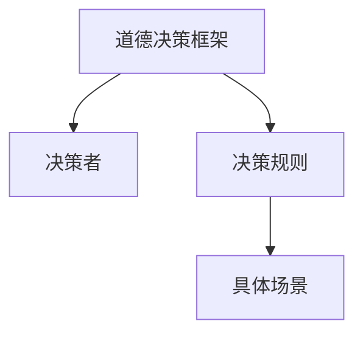
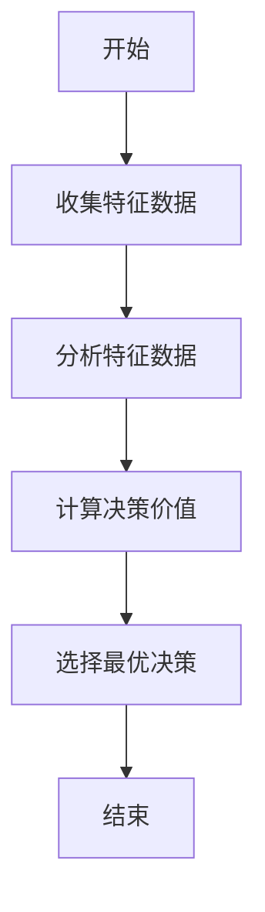
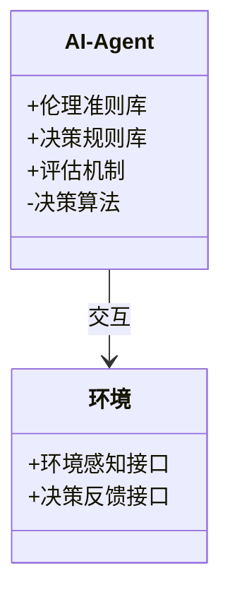
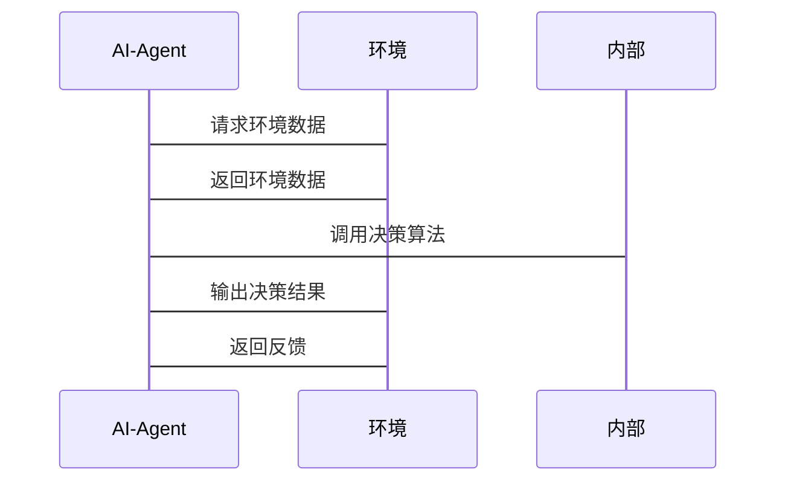

                 


# 构建具有道德决策框架的AI Agent

## 关键词：AI Agent，道德决策，伦理框架，人工智能，决策算法，系统架构，技术实现

## 摘要

在人工智能迅速发展的今天，AI Agent（智能体）的应用越来越广泛。然而，AI Agent的决策过程往往缺乏道德考量，这可能导致严重的伦理问题。本文旨在探讨如何构建一个具有道德决策框架的AI Agent，从伦理学基础、算法设计到系统架构，全面解析如何将道德决策融入AI Agent的决策过程中。通过具体案例分析和代码实现，本文为构建符合伦理的AI Agent提供了理论支持和实践指导。

---

# 第一部分：引言

## 第1章：构建具有道德决策框架的AI Agent概述

### 1.1 AI Agent的基本概念

#### 1.1.1 AI Agent的定义与分类

AI Agent（人工智能代理）是指能够感知环境并采取行动以实现目标的智能实体。AI Agent可以分为以下几类：

- **反应式AI Agent**：根据当前感知做出反应，不依赖历史信息。
- **认知式AI Agent**：具备复杂推理和决策能力，能够处理长期目标。
- **协作式AI Agent**：与其他AI Agent或人类协作完成任务。

#### 1.1.2 道德决策在AI Agent中的重要性

AI Agent的决策过程需要考虑伦理和道德因素，以避免潜在的负面影响。例如，在自动驾驶汽车中，AI Agent在紧急情况下需要做出道德决策，如优先保护车内乘客还是路人。

### 1.2 道德决策框架的背景与意义

#### 1.2.1 当前AI Agent面临的伦理挑战

随着AI Agent在医疗、交通、金融等领域的广泛应用，其决策可能对人类生命和财产造成重大影响。例如，AI医疗诊断系统需要确保其诊断结果的准确性和伦理性。

#### 1.2.2 道德决策框架的必要性

为了确保AI Agent的决策符合伦理规范，构建一个道德决策框架至关重要。该框架能够为AI Agent提供道德准则和决策规则，确保其行为符合社会价值观。

### 1.3 本书的目标与结构

#### 1.3.1 本书的主要目标

本文旨在探讨如何构建一个具有道德决策框架的AI Agent，涵盖伦理学基础、算法设计、系统架构等内容。

#### 1.3.2 目录结构概述

本文分为引言、背景、核心概念、算法原理、系统架构、项目实战和总结等部分，内容全面且逻辑清晰。

---

# 第二部分：道德决策框架的背景与基础

## 第2章：伦理学基础与AI Agent

### 2.1 伦理学基础

#### 2.1.1 伦理学的基本概念

伦理学是研究道德原则和行为准则的学科，主要包括义务论、功利主义和义务论等学派。

#### 2.1.2 道德决策的伦理框架

AI Agent的道德决策需要结合不同的伦理学流派，制定合理的决策规则。

### 2.2 道德决策的伦理模型

#### 2.2.1 不同伦理学流派的道德决策模型

- **义务论**：强调行为的义务性，例如康德的义务论。
- **功利主义**：强调行为的结果，以最大化整体幸福为准则。

#### 2.2.2 如何选择合适的伦理模型

根据具体应用场景选择合适的伦理模型，例如在自动驾驶中可能需要结合义务论和功利主义。

### 2.3 AI Agent中的伦理挑战

#### 2.3.1 道德困境的典型例子

- **电车难题**：AI Agent在紧急情况下需要在两个灾难性结果中选择一个。
- **隐私问题**：AI Agent在处理数据时需要保护用户隐私。

#### 2.3.2 AI Agent在不同场景中的伦理问题

医疗、交通、金融等领域的AI Agent需要根据具体场景制定相应的伦理决策规则。

---

# 第三部分：道德决策框架的核心概念与联系

## 第3章：道德决策框架的核心概念

### 3.1 道德决策框架的定义与组成部分

#### 3.1.1 道德决策框架的定义

道德决策框架是一个用于指导AI Agent在决策过程中考虑伦理因素的系统或模型。

#### 3.1.2 核心组成部分分析

- **伦理准则**：AI Agent必须遵循的道德原则。
- **决策规则**：基于伦理准则制定的具体决策规则。
- **评估机制**：用于评估决策的伦理性和合理性。

### 3.2 道德决策框架与AI Agent的关系

#### 3.2.1 道德决策框架在AI Agent中的作用

道德决策框架为AI Agent提供了决策的伦理指导，确保其行为符合社会规范。

#### 3.2.2 道德决策框架对AI Agent行为的影响

通过道德决策框架，AI Agent能够在复杂场景中做出符合伦理的决策。

### 3.3 道德决策框架的属性与特征

#### 3.3.1 属性对比表格

| 属性         | 描述                                         |
|--------------|----------------------------------------------|
| 灵活性       | 能否适应不同场景                             |
| 可解释性     | 是否易于理解和解释                           |
| 可调整性     | 是否可以修改或调整                           |

### 3.4 ER实体关系图



---

# 第四部分：道德决策框架的算法原理

## 第4章：道德决策算法的设计与实现

### 4.1 道德决策算法概述

#### 4.1.1 算法的基本思想

道德决策算法旨在通过伦理准则和决策规则，生成符合伦理的决策结果。

#### 4.1.2 算法的主要步骤

1. 收集决策相关的信息。
2. 分析信息，生成多个决策选项。
3. 根据伦理准则评估每个选项的伦理性和可行性。
4. 选择最优的决策方案。

### 4.2 道德决策框架的数学模型

#### 4.2.1 数学模型的定义

$$ V(s, a) = \sum_{i=1}^{n} w_i \cdot f_i(s, a) $$

其中，\( V(s, a) \) 是决策的价值，\( w_i \) 是特征 \( f_i \) 的权重。

#### 4.2.2 模型的实现步骤

1. 收集特征数据。
2. 确定权重。
3. 计算决策价值。
4. 选择最优决策。

### 4.3 算法实现的Mermaid流程图



---

# 第五部分：系统架构与设计

## 第5章：系统架构设计

### 5.1 系统功能设计

#### 5.1.1 领域模型Mermaid类图



### 5.2 系统架构设计

#### 5.2.1 系统架构Mermaid架构图

```mermaid
graph TD
    A[AI-Agent] --> B[伦理准则库]
    A --> C[决策规则库]
    A --> D[评估机制]
    A --> E[决策算法]
    B, C, D, E --> A
```

### 5.3 系统接口设计

- **输入接口**：接收环境感知数据。
- **输出接口**：输出决策结果。
- **反馈接口**：接收决策结果的反馈。

### 5.4 系统交互设计

#### 5.4.1 系统交互Mermaid序列图



---

# 第六部分：项目实战

## 第6章：项目实战

### 6.1 环境安装

- **Python环境**：安装Python 3.8及以上版本。
- **依赖库**：安装numpy、scikit-learn、mermaid等库。

### 6.2 核心实现源代码

#### 6.2.1 Python代码实现

```python
# 道德决策框架实现
class MoralDecisionFramework:
    def __init__(self, ethical_rules):
        self.ethical_rules = ethical_rules
        self.weights = self._initialize_weights()

    def _initialize_weights(self):
        # 初始化权重，假设伦理准则数量为n
        n = len(self.ethical_rules)
        return [1.0 for _ in range(n)]

    def evaluate_decision(self, decision, context):
        # 根据伦理准则和权重评估决策的价值
        value = 0.0
        for i in range(len(self.ethical_rules)):
            weight = self.weights[i]
            feature = self._get_feature(decision, context, i)
            value += weight * feature
        return value

    def _get_feature(self, decision, context, rule_index):
        # 根据决策和上下文获取特征值
        pass

    def choose_optimal_decision(self, decisions, context):
        # 选择最优决策
        max_value = -float('inf')
        best_decision = None
        for decision in decisions:
            value = self.evaluate_decision(decision, context)
            if value > max_value:
                max_value = value
                best_decision = decision
        return best_decision
```

### 6.3 代码应用解读与分析

- **类定义**：`MoralDecisionFramework`类包含伦理准则和权重初始化方法。
- **评估决策**：`evaluate_decision`方法根据伦理准则和权重评估决策的价值。
- **选择最优决策**：`choose_optimal_decision`方法遍历所有决策，选择价值最高的决策。

### 6.4 实际案例分析

#### 6.4.1 案例分析

假设有一个自动驾驶汽车AI Agent，需要在紧急情况下决定是否转向以避免事故。道德决策框架会根据伦理准则（如保护人类生命）和决策规则（如优先保护车内乘客）进行评估，最终选择最优的决策方案。

### 6.5 项目小结

通过具体案例分析，展示了如何将道德决策框架应用于实际场景，确保AI Agent的决策符合伦理规范。

---

# 第七部分：总结与展望

## 第7章：总结与展望

### 7.1 本书总结

本文详细探讨了如何构建具有道德决策框架的AI Agent，涵盖伦理学基础、算法设计、系统架构和项目实战等内容。

### 7.2 对未来的展望

随着人工智能技术的不断发展，道德决策框架需要不断优化和完善，以应对更复杂的伦理挑战。未来的研究方向包括动态伦理准则、多Agent协作决策等。

---

# 作者信息

作者：AI天才研究院/AI Genius Institute & 禅与计算机程序设计艺术 /Zen And The Art of Computer Programming

---

# 结语

通过本文的系统阐述，读者可以全面了解如何构建具有道德决策框架的AI Agent，并能够在实际应用中参考本文的方法和案例，确保AI Agent的决策过程符合伦理规范。

